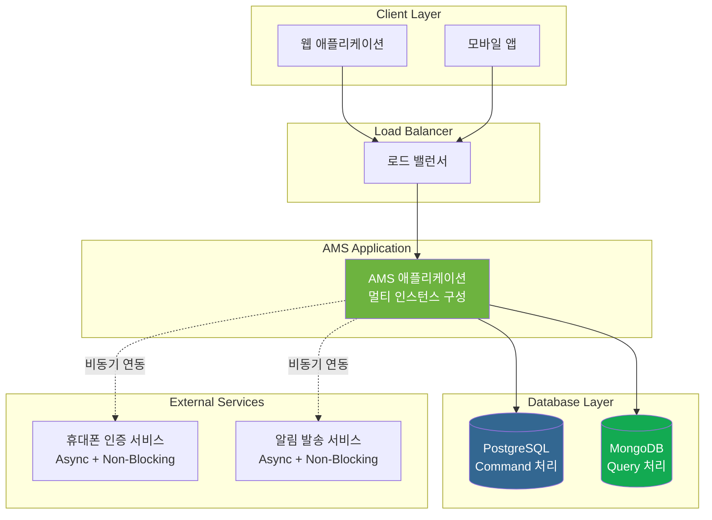
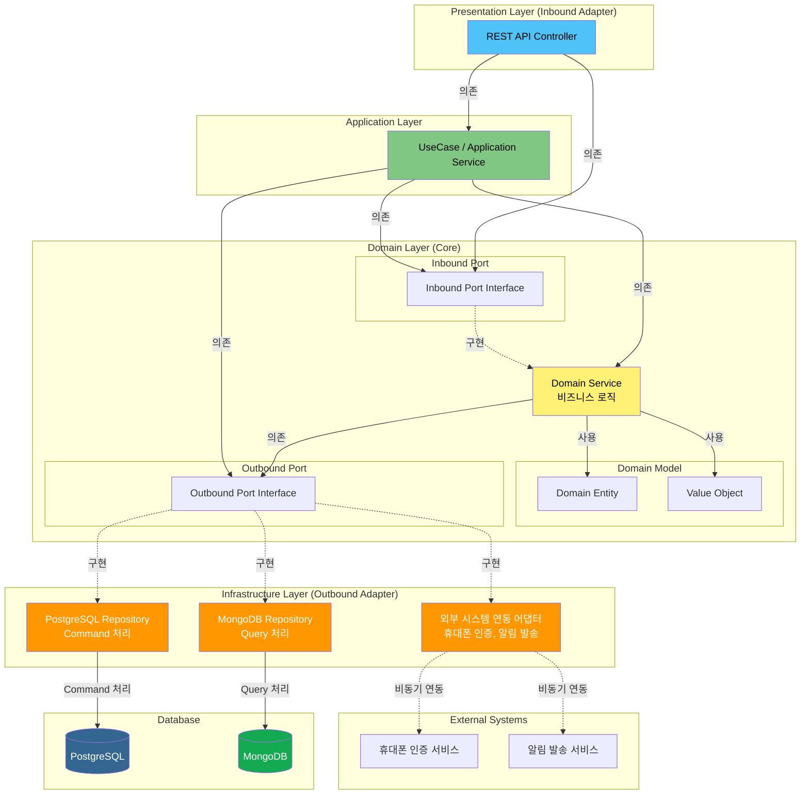
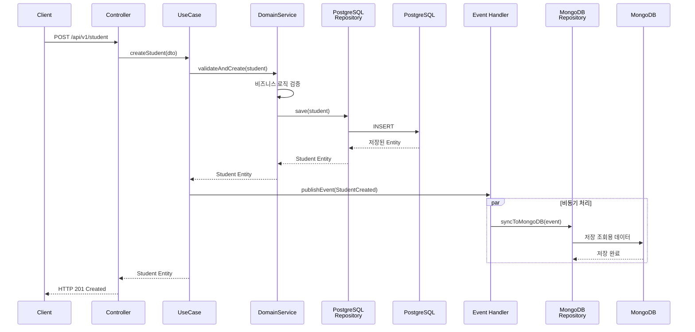
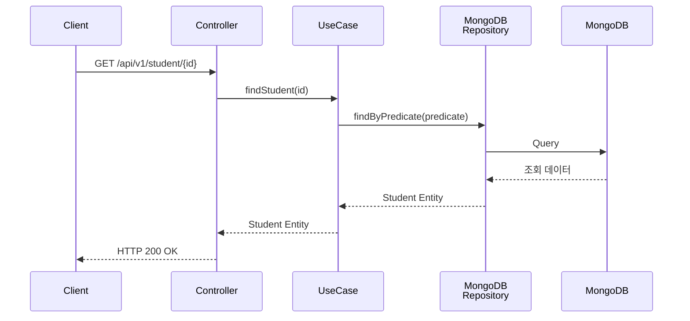
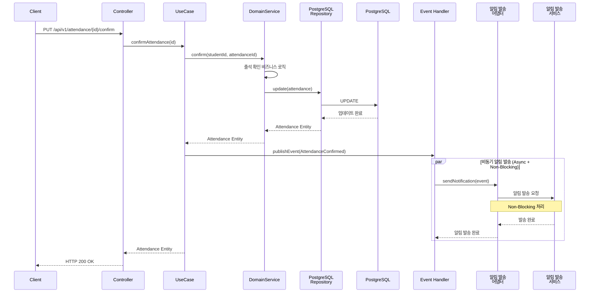

# 🏛️ AMS 시스템 아키텍처

---

## 1. 시스템 개요

### 1.1 시스템 목적 및 범위

**AMS(Academy Management Service)**는 학원 운영과 수강 관리를 효율적으로 지원하기 위한 RESTful 기반의 백엔드 서비스입니다.

#### 시스템 목적

AMS는 학원 운영에 필요한 핵심 기능들을 제공하여 학원의 업무 효율성을 향상시키고, 학원 구성원(학생, 학부모, 강사, 관리자)들이 학원의 수업 정보와 일정을 효과적으로 관리할 수 있도록 지원합니다.

#### 시스템 범위

AMS는 다음과 같은 범위를 제공합니다:

- **학원 정보 관리**: 학원의 기본 정보 등록, 조회, 수정
- **회원 관리**: 학원 서비스 이용자(학생, 학부모, 강사, 관리자)의 회원 정보 통합 관리
- **수업 관리**: 수업 정보, 일정, 출석, 평가 관리
- **운영 관리**: 수납, 영수증, 통계 등 운영 관련 기능 제공

#### 제공 범위

- RESTful API 기반의 백엔드 서비스
- 멀티 테넌트 지원 (여러 학원이 동일한 시스템을 사용)
- 역할 기반 접근 제어 (RBAC)
- 실시간 알림 발송 인터페이스 (향후 카카오 알림톡, SMS, PUSH 지원 예정)

---

### 1.2 주요 비즈니스 도메인

AMS는 다음과 같은 4개의 핵심 비즈니스 도메인으로 구성됩니다:

#### 1.2.1 학원 정보 관리 (Academy Management)

학원의 기본 정보를 등록하고 관리하는 도메인입니다.

- **학원 정보 항목**:
  - 학원 명칭
  - 학원 연락처
  - 학원 주소
  - 운영 시간
  - 대상 범위
  - 교육청 등록번호

#### 1.2.2 회원 관리 (Member Management)

학원 서비스 이용자들의 회원 정보를 통합적으로 관리하는 도메인입니다.

- **회원 유형**:
  - **학생(Student)**: 학원 수업을 수강하는 회원
  - **학부모(Parent)**: 학생의 수강 현황을 조회 및 관리하는 회원
  - **강사(Teacher)**: 학원 수업을 담당하는 회원
  - **운영 관리자(Manager)**: 학원의 전반적인 운영을 담당하는 회원
  - **슈퍼 관리자(Super Admin)**: 전체 학원 시스템을 총괄 관리하는 회원

- **주요 기능**:
  - 회원 가입 및 인증 (휴대폰 인증 기반)
  - 로그인 (로그인ID + 비밀번호, 휴대폰 인증 + 비밀번호)
  - 역할 기반 권한 관리
  - 회원 승인 프로세스 (강사 가입 시 운영 관리자 승인 필요)

#### 1.2.3 수업 관리 (Class Management)

수업 정보와 일정, 출석, 평가 등을 관리하는 도메인입니다.

- **수업 정보 관리**:
  - 수강 과목, 수강 대상, 수강 기간, 수강 목표
  - 교육 과정, 강사 소개, 수강료

- **수업 일정 관리**:
  - 수업 명칭, 수업 과목, 수업 강사
  - 수업 요일, 수업 기간, 수업 정원
  - 강의실 정보 (강의실 명칭, 위치)

- **출석 관리**:
  - 학생 출석 확인 요청
  - 강사 출석 확인 처리
  - 학부모 알림 발송

- **수업 평가 관리**:
  - 학생/학부모의 수업 및 강사 평가 게시글 작성
  - 평가 게시글 관리

#### 1.2.4 운영 관리 (Operation Management)

학원의 수납, 영수증, 통계 등 운영과 관련된 기능을 제공하는 도메인입니다.

- **주요 기능**:
  - 수납 관리
  - 영수증 발급
  - 통계 제공 (기간별, 수업별, 강사별 통계)

---

### 1.3 시스템 경계 및 외부 시스템과의 관계

#### 1.3.1 현재 연동 외부 시스템

AMS는 다음과 같은 외부 시스템과 연동합니다:

1. **휴대폰 인증 서비스**
   - 회원 가입 시 6자리 인증 코드 발급 및 검증
   - 로그인 시 휴대폰 인증 기능 제공
   - 비동기(Async) + Non-Blocking 방식으로 연동

2. **알림 발송 서비스** (인터페이스만 구현)
   - 출석 확인 시 학부모에게 알림 발송
   - 출석 미확인 시 자동 알림 발송
   - 향후 지원 예정: 카카오 알림톡, SMS, PUSH
   - 비동기(Async) + Non-Blocking 방식으로 연동

#### 1.3.2 향후 연동 예정 시스템

AMS는 향후 다음과 같은 외부 시스템과의 연동을 계획하고 있습니다:

1. **OAuth 2.0 소셜 로그인**
   - 소셜 미디어 계정을 통한 로그인 기능

2. **온라인 결제 시스템**
   - 비대면 수강료 결제 시스템

3. **위치 기반 서비스**
   - 학생의 위치가 학원 좌표 반경 50m 이내일 경우 자동 출석 처리

#### 1.3.3 시스템 경계

AMS의 시스템 경계는 다음과 같이 정의됩니다:

- **AMS 내부 영역**: 
  - 비즈니스 로직 처리
  - 데이터 저장 및 관리 (PostgreSQL, MongoDB)
  - 내부 API 제공

- **AMS 외부 영역**:
  - 클라이언트 애플리케이션 (웹, 모바일 앱)
  - 외부 인증 서비스 (휴대폰 인증)
  - 외부 알림 서비스 (SMS, 카카오 알림톡, PUSH)
  - 향후 연동 예정 시스템 (결제, 위치 기반 서비스)

AMS는 RESTful API를 통해 클라이언트와 통신하며, 비동기 방식으로 외부 시스템과 연동하여 높은 성능과 확장성을 보장합니다.

---

## 2. 아키텍처 다이어그램

### 2.1 고수준 아키텍처 다이어그램 (시스템 전체 구성도)

AMS 시스템의 전체 구성은 다음과 같습니다:

#### 주요 구성 요소

- **클라이언트 레이어**: 웹 애플리케이션 및 모바일 앱
- **로드 밸런서**: 다중 인스턴스 간 트래픽 분산
- **AMS 애플리케이션**: 멀티 서버 및 멀티 인스턴스로 구성되어 수평 확장을 지원합니다. 로드 밸런서를 통해 트래픽이 분산되며, 각 인스턴스는 독립적으로 운영됩니다.
- **데이터베이스 레이어**:
  - **PostgreSQL**: Command 처리용 (데이터 쓰기 작업)
  - **MongoDB**: Query 처리용 (데이터 조회 작업)
  - 모든 AMS 인스턴스는 동일한 데이터베이스에 접근합니다.
- **외부 서비스**: 비동기(Async) + Non-Blocking 방식으로 연동
  - 휴대폰 인증 서비스
  - 알림 발송 서비스
  - 각 AMS 인스턴스는 독립적으로 외부 서비스와 비동기 연동합니다.

---

### 2.2 레이어 아키텍처 다이어그램 (Hexagonal Architecture 기반)

AMS는 Hexagonal Architecture(포트/어댑터 패턴)를 기반으로 구성되며, CQRS 패턴을 적용합니다:

#### 레이어 구조 설명

1. **Presentation Layer (Inbound Adapter)**
   - REST API Controller
   - HTTP 요청/응답 처리
   - DTO 변환

2. **Application Layer**
   - UseCase / Application Service
   - 트랜잭션 경계 관리
   - 도메인 서비스 조율

3. **Domain Layer (Core - 비즈니스 로직의 핵심)**
   - **Domain Model**: Entity, Value Object
   - **Inbound Port**: 도메인이 제공하는 인터페이스
   - **Outbound Port**: 도메인이 필요로 하는 인터페이스
   - **Domain Service**: 핵심 비즈니스 로직

4. **Infrastructure Layer (Outbound Adapter)**
   - **PostgreSQL Repository**: Command 처리 (데이터 쓰기)
   - **MongoDB Repository**: Query 처리 (데이터 조회)
   - **외부 시스템 연동 어댑터**: 휴대폰 인증, 알림 발송 등

#### CQRS 패턴 적용

- **Command 처리 경로**: Controller → UseCase → Domain Service → PostgreSQL Repository → PostgreSQL
- **Query 처리 경로**: Controller → UseCase → MongoDB Repository → MongoDB
- **데이터 동기화**: Command 처리 완료 후 이벤트를 통해 MongoDB에 조회용 데이터 저장

#### 의존성 규칙

- 모든 의존성은 **Domain Layer(핵심)** 를 향합니다
- 외부 레이어는 내부 레이어를 의존하지 않습니다
- 포트(Interface)를 통해 어댑터와 도메인이 분리됩니다

---

### 2.3 컴포넌트 간 상호작용 다이어그램

#### 2.3.1 Command 처리 흐름 (데이터 생성 예시: 학생 생성)

#### 2.3.2 Query 처리 흐름 (데이터 조회 예시: 학생 조회)

#### 2.3.3 Event-Driven 처리 흐름 (출석 확인 및 알림 발송)

#### 상호작용 패턴 요약

1. **Command 처리**:
   - 동기적으로 PostgreSQL에 데이터 저장
   - 이벤트 발행을 통해 비동기로 MongoDB 동기화

2. **Query 처리**:
   - MongoDB에서 조회용 데이터를 직접 조회
   - 빠른 응답 시간 보장

3. **Event-Driven 처리**:
   - 도메인 이벤트를 통한 느슨한 결합
   - 비동기(Async) + Non-Blocking 방식으로 외부 시스템 연동
   - 시스템 확장성 및 성능 향상

---

## 3. 기술 스택 상세

### 3.1 기술 스택 개요

AMS는 현대적이고 확장 가능한 백엔드 서비스를 구축하기 위해 다음 기술 스택을 선택했습니다:

- **언어**: Kotlin
- **프레임워크**: Spring Boot
- **ORM**: Kotlin Exposed
- **빌드 도구**: Gradle
- **테스트 프레임워크**: Kotest
- **데이터베이스**: PostgreSQL (RDBMS), MongoDB (NoSQL)
- **비동기 처리**: Kotlin Coroutine, Async + Non-Blocking

#### 기술 스택 선택 기준

1. **생산성**: 개발 효율성과 코드 품질 향상
2. **성능**: 높은 처리량과 낮은 지연 시간
3. **확장성**: 수평 확장 지원 및 멀티 인스턴스 운영
4. **안정성**: 엔터프라이즈급 안정성과 안전성
5. **유지보수성**: 코드 가독성 및 유지보수 용이성

---

### 3.2 언어 및 런타임

#### Kotlin 2.1.10

**선택 이유:**
- JVM 기반 언어로 Java와의 상호 운용성이 뛰어남
- Null 안전성을 통한 안정적인 코드 작성
- 간결한 문법으로 개발 생산성 향상
- 타입 추론을 통한 코드 간결성
- Coroutine을 통한 효율적인 비동기 처리

**역할:**
- AMS 애플리케이션의 주요 개발 언어
- 비즈니스 로직 및 도메인 모델 구현

**주요 특징:**
- **Null 안전성**: 컴파일 타임에 null 참조 오류 방지
- **Coroutine 지원**: 경량 스레드 기반의 Non-Blocking 비동기 처리
- **함수형 프로그래밍**: 불변성 및 고차 함수 지원
- **Java 상호 운용성**: 기존 Java 라이브러리 및 프레임워크와 완벽한 통합
- **확장 함수**: 기존 클래스에 기능을 추가할 수 있는 확장성

---

### 3.3 프레임워크 및 라이브러리

#### Spring Boot 3.4.3

**선택 이유:**
- 엔터프라이즈급 애플리케이션 개발을 위한 풍부한 기능 제공
- 자동 설정(Auto Configuration)을 통한 빠른 개발
- 활발한 커뮤니티와 광범위한 생태계
- 프로덕션 레벨의 보안 및 모니터링 지원

**역할:**
- AMS 애플리케이션의 핵심 프레임워크
- 의존성 주입(DI), AOP, 트랜잭션 관리 제공

**주요 기능:**
- **의존성 주입(Dependency Injection)**: 느슨한 결합을 통한 유연한 구조
- **AOP(Aspect-Oriented Programming)**: 횡단 관심사 처리 (로깅, 트랜잭션 등)
- **트랜잭션 관리**: 선언적 트랜잭션 관리 지원
- **웹 MVC**: RESTful API 구현을 위한 웹 프레임워크
- **자동 설정**: 프로젝트 설정 최소화

#### Kotlin Exposed 0.60.0

**선택 이유:**
- Kotlin 네이티브 ORM으로 타입 안전성 제공
- DSL을 통한 직관적인 쿼리 작성
- 컴파일 타임에 쿼리 오류 검출 가능
- 가벼운 프레임워크로 학습 곡선이 낮음

**역할:**
- PostgreSQL 데이터베이스 접근 프레임워크
- 타입 안전한 쿼리 작성 및 데이터 매핑

**주요 기능:**
- **타입 안전한 쿼리**: 컴파일 타임에 쿼리 검증
- **DSL 지원**: 직관적인 쿼리 작성 문법
- **마이그레이션 지원**: 데이터베이스 스키마 버전 관리
- **트랜잭션 관리**: Spring Boot와 통합된 트랜잭션 처리
- **Coroutine 지원**: 비동기 데이터베이스 접근

#### MongoDB Kotlin Driver (공식)

**선택 이유:**
- MongoDB 공식 Kotlin 드라이버로 장기적인 지원 및 유지보수 보장
- Kotlin 네이티브 드라이버로 Exposed와 일관된 Kotlin 네이티브 기술 스택 유지
- Coroutine 기반 비동기 프로그래밍 완벽 지원
- 최신 MongoDB 기능을 신속하게 반영
- `kotlinx.serialization`과의 통합 지원

**역할:**
- MongoDB 데이터베이스 접근 드라이버
- Query 처리용 데이터베이스 접근 (CQRS 패턴)
- 비동기 데이터 조회 및 저장

**주요 기능:**
- **Coroutine 지원**: `suspend` 함수를 통한 Non-Blocking 비동기 처리
- **Kotlin 네이티브**: Kotlin 언어에 최적화된 API 제공
- **kotlinx.serialization 통합**: Kotlin 데이터 클래스와의 직렬화/역직렬화 지원
- **타입 안전성**: Kotlin의 타입 시스템을 활용한 안전한 코드 작성
- **공식 지원**: MongoDB 공식 문서 및 지속적인 업데이트 제공
- **Spring Boot 통합**: `MongoClient`를 Bean으로 등록하여 Spring 환경에서 사용 가능

**참고 문서:**
- [MongoDB Kotlin Driver 공식 문서](https://www.mongodb.com/ko-kr/docs/drivers/kotlin/coroutine/current/)

---

### 3.4 빌드 도구

#### Gradle 8.13

**선택 이유:**
- 유연한 빌드 시스템으로 다양한 프로젝트 구조 지원
- 증분 빌드를 통한 빠른 빌드 속도
- Kotlin DSL 지원으로 타입 안전한 빌드 스크립트 작성
- 강력한 의존성 관리 및 캐싱 기능

**역할:**
- 프로젝트 빌드 및 의존성 관리
- 테스트 실행 및 패키징

**주요 특징:**
- **증분 빌드**: 변경된 부분만 재빌드하여 빌드 시간 단축
- **Kotlin DSL**: 타입 안전한 빌드 스크립트 작성
- **의존성 관리**: 효율적인 의존성 해결 및 캐싱
- **멀티 프로젝트 지원**: 모듈화된 프로젝트 구조 지원

---

### 3.5 테스트 프레임워크

#### Kotest

**선택 이유:**
- Kotlin 네이티브 테스트 프레임워크로 Kotlin 특성을 최대한 활용
- 다양한 테스트 스타일 지원 (Behavior-Driven, Property-Based 등)
- 직관적인 어설션 문법
- MockK와의 통합을 통한 Mocking 지원

**역할:**
- 단위 테스트 및 통합 테스트 작성
- 테스트 커버리지 측정 및 리포팅

**주요 특징:**
- **다양한 테스트 스타일**: BDD, Property-Based 등 다양한 스타일 지원
- **직관적인 어설션**: 읽기 쉬운 테스트 코드 작성
- **Coroutine 테스트**: 비동기 코드 테스트 지원
- **통합 테스트**: Spring Boot 테스트 통합 지원

---

### 3.6 데이터베이스

#### PostgreSQL

**선택 이유:**
- ACID 트랜잭션을 완벽히 지원하는 강력한 관계형 데이터베이스
- 오픈소스이면서 엔터프라이즈급 성능 및 안정성
- 다양한 데이터 타입 및 고급 기능 지원
- CQRS 패턴의 Command 처리에 최적화

**역할:**
- Command 처리용 데이터베이스 (CQRS 패턴)
- 트랜잭션이 중요한 데이터 쓰기 작업 처리

**사용 목적:**
- 데이터 생성(CREATE), 수정(UPDATE), 삭제(DELETE) 작업
- 트랜잭션 무결성이 중요한 비즈니스 로직 처리
- 복잡한 관계형 데이터 모델링

**주요 특징:**
- **ACID 트랜잭션**: 데이터 무결성 보장
- **관계형 데이터 모델**: 정규화된 데이터 구조
- **뛰어난 성능**: 대용량 데이터 처리 최적화
- **확장성**: 수평 확장 및 복제 지원

#### MongoDB

**선택 이유:**
- 문서 기반 NoSQL 데이터베이스로 유연한 스키마 지원
- 높은 조회 성능으로 빠른 응답 시간 제공
- 수평 확장이 용이한 구조
- CQRS 패턴의 Query 처리에 최적화

**역할:**
- Query 처리용 데이터베이스 (CQRS 패턴)
- 조회 전용 데이터 저장 및 빠른 조회 성능 제공

**사용 목적:**
- 데이터 조회(READ) 작업
- 빠른 응답 시간이 필요한 조회 쿼리
- 조회 최적화된 데이터 구조 저장

**주요 특징:**
- **문서 기반 저장**: 유연한 스키마 구조
- **높은 조회 성능**: 읽기 성능 최적화
- **수평 확장**: 샤딩을 통한 확장 용이성
- **집계 쿼리**: 복잡한 조회 및 집계 쿼리 지원

---

### 3.7 비동기 처리 기술

#### Kotlin Coroutine

**선택 이유:**
- 경량 스레드 기반의 효율적인 동시성 처리
- Non-Blocking I/O를 통한 높은 처리량
- Thread 오버헤드 감소로 리소스 효율성 향상
- 직관적인 비동기 코드 작성

**역할:**
- Application 내부 Thread 처리 (Non-Blocking 방식)
- 비즈니스 로직 및 데이터베이스 접근의 비동기 처리

**사용 영역:**
- 비즈니스 로직 처리
- 데이터베이스 접근 (PostgreSQL, MongoDB)
- 내부 컴포넌트 간 통신

**주요 특징:**
- **경량 스레드**: 기존 스레드보다 훨씬 가벼운 동시성 처리
- **Non-Blocking I/O**: I/O 대기 중에도 다른 작업 처리 가능
- **Suspend 함수**: 비동기 코드를 동기 코드처럼 작성
- **Structured Concurrency**: 안전한 동시성 처리 보장

#### Async + Non-Blocking

**선택 이유:**
- 외부 시스템 연동 시 높은 성능과 확장성 제공
- Non-Blocking I/O를 통한 동시 처리 능력 향상
- 시스템 리소스 효율적 활용

**역할:**
- Application 외부 연동 처리
- 외부 서비스와의 비동기 통신

**사용 영역:**
- 휴대폰 인증 서비스 연동
- 알림 발송 서비스 연동
- 향후 추가될 외부 시스템 연동

**주요 특징:**
- **비동기 통신**: 응답을 기다리지 않고 다른 작업 처리 가능
- **Non-Blocking**: I/O 대기 중에도 스레드가 차단되지 않음
- **높은 동시성**: 많은 외부 요청을 동시에 처리 가능
- **확장성**: 시스템 부하 증가에 유연하게 대응

---

### 3.8 기술 간 통합 방식

#### Spring Boot와 Kotlin 통합

- Spring Boot의 자동 설정은 Kotlin 코드와 완벽하게 통합됩니다.
- Kotlin의 null 안전성이 Spring의 의존성 주입과 조합되어 안전한 코드 작성이 가능합니다.
- Spring의 어노테이션(@Service, @Repository 등)을 Kotlin 클래스에 적용 가능합니다.

#### Spring Boot와 Kotlin Exposed 통합

- Spring Boot의 트랜잭션 관리(@Transactional)와 Exposed의 트랜잭션을 통합합니다.
- Exposed의 트랜잭션을 Spring의 트랜잭션 프록시와 연동하여 일관된 트랜잭션 처리가 가능합니다.
- Coroutine 기반 트랜잭션 처리를 위한 커스텀 설정을 적용합니다.

#### Spring Boot와 MongoDB Kotlin Driver 통합

- MongoDB Kotlin Driver의 `MongoClient`를 Spring Bean으로 등록하여 사용합니다.
- Infrastructure Layer의 Repository 구현체에서 MongoDB Kotlin Driver를 직접 사용합니다.
- Coroutine의 `suspend` 함수를 활용하여 Non-Blocking 비동기 데이터 접근을 구현합니다.
- Hexagonal Architecture의 Outbound Adapter 패턴에 맞게 MongoDB 접근을 추상화합니다.

#### Coroutine과 Spring Boot 통합

- Spring WebFlux 또는 Spring MVC와 Coroutine을 통합하여 Non-Blocking 웹 요청 처리를 구현합니다.
- suspend 함수를 사용한 컨트롤러 메서드로 비동기 요청 처리를 구현합니다.
- 데이터베이스 접근 시 Coroutine을 활용하여 Non-Blocking I/O를 구현합니다.

#### CQRS 패턴 구현을 위한 PostgreSQL과 MongoDB 통합

- **Command 처리 경로**:
  - PostgreSQL을 통한 데이터 쓰기 작업
  - Kotlin Exposed를 통한 타입 안전한 쿼리 작성
  - Spring 트랜잭션 관리를 통한 ACID 보장

- **Query 처리 경로**:
  - MongoDB를 통한 데이터 조회 작업
  - MongoDB Kotlin Driver를 통한 Coroutine 기반 비동기 쿼리 처리
  - `suspend` 함수를 활용한 Non-Blocking 데이터 접근
  - 조회 최적화된 데이터 구조 활용

- **데이터 동기화**:
  - Command 처리 완료 후 도메인 이벤트 발행
  - 이벤트 핸들러를 통한 MongoDB 동기화
  - 비동기 이벤트 처리로 Command 응답 시간에 영향 없음

#### 비동기 처리 패턴 (Coroutine + Async + Non-Blocking)

- **Application 내부 처리**: Coroutine을 통한 Non-Blocking 처리
  - 비즈니스 로직 실행
  - 데이터베이스 접근 (PostgreSQL, MongoDB)
  - 내부 컴포넌트 간 통신

- **Application 외부 연동**: Async + Non-Blocking 처리
  - HTTP 클라이언트를 통한 외부 API 호출
  - 메시지 큐를 통한 비동기 통신
  - 외부 서비스와의 이벤트 기반 통신

- **통합 아키텍처**:
  - Coroutine과 Spring의 비동기 기능을 조합하여 전체적인 Non-Blocking 아키텍처 구현
  - 외부 연동 시 Async 패턴을 적용하여 높은 처리량 확보

---

### 3.9 기술 스택 버전 관리

#### 기술 스택 버전 요약

| 기술 | 버전 | 용도 |
|------|------|------|
| **Kotlin** | 2.1.10 | 개발 언어 |
| **Spring Boot** | 3.4.3 | 애플리케이션 프레임워크 |
| **Kotlin Exposed** | 0.60.0 | ORM 프레임워크 (PostgreSQL) |
| **MongoDB Kotlin Driver** | 최신 버전 | MongoDB 드라이버 (Query 처리) |
| **Gradle** | 8.13 | 빌드 도구 |
| **Kotest** | 최신 버전 | 테스트 프레임워크 |
| **PostgreSQL** | 최신 LTS 버전 | RDBMS (Command 처리) |
| **MongoDB** | 최신 버전 | NoSQL (Query 처리) |

#### 버전 선택 기준

1. **안정성 우선**: 프로덕션 환경에서 검증된 안정적인 버전 선택
2. **보안**: 보안 취약점이 해결된 최신 버전 우선
3. **호환성**: 기술 스택 간 호환성 확인 후 버전 선택
4. **장기 지원(LTS)**: 장기 지원 버전이 있는 경우 우선 선택
5. **커뮤니티**: 활발한 커뮤니티 지원 및 문서화가 잘 된 버전 선택

---
