# 🏛️ AMS 시스템 아키텍처

---

## 1. 시스템 개요

### 1.1 시스템 목적 및 범위

**AMS(Academy Management Service)**는 학원 운영과 수강 관리를 효율적으로 지원하기 위한 RESTful 기반의 백엔드 서비스입니다.

#### 시스템 목적

AMS는 학원 운영에 필요한 핵심 기능들을 제공하여 학원의 업무 효율성을 향상시키고, 학원 구성원(학생, 학부모, 강사, 관리자)들이 학원의 수업 정보와 일정을 효과적으로 관리할 수 있도록 지원합니다.

#### 시스템 범위

AMS는 다음과 같은 범위를 제공합니다:

- **학원 정보 관리**: 학원의 기본 정보 등록, 조회, 수정
- **회원 관리**: 학원 서비스 이용자(학생, 학부모, 강사, 관리자)의 회원 정보 통합 관리
- **수업 관리**: 수업 정보, 일정, 출석, 평가 관리
- **운영 관리**: 수납, 영수증, 통계 등 운영 관련 기능 제공

#### 제공 범위

- RESTful API 기반의 백엔드 서비스
- 멀티 테넌트 지원 (여러 학원이 동일한 시스템을 사용)
- 역할 기반 접근 제어 (RBAC)
- 실시간 알림 발송 인터페이스 (향후 카카오 알림톡, SMS, PUSH 지원 예정)

---

### 1.2 주요 비즈니스 도메인

AMS는 다음과 같은 4개의 핵심 비즈니스 도메인으로 구성됩니다:

#### 1.2.1 학원 정보 관리 (Academy Management)

학원의 기본 정보를 등록하고 관리하는 도메인입니다.

- **학원 정보 항목**:
  - 학원 명칭
  - 학원 연락처
  - 학원 주소
  - 운영 시간
  - 대상 범위
  - 교육청 등록번호

#### 1.2.2 회원 관리 (Member Management)

학원 서비스 이용자들의 회원 정보를 통합적으로 관리하는 도메인입니다.

- **회원 유형**:
  - **학생(Student)**: 학원 수업을 수강하는 회원
  - **학부모(Parent)**: 학생의 수강 현황을 조회 및 관리하는 회원
  - **강사(Teacher)**: 학원 수업을 담당하는 회원
  - **운영 관리자(Manager)**: 학원의 전반적인 운영을 담당하는 회원
  - **슈퍼 관리자(Super Admin)**: 전체 학원 시스템을 총괄 관리하는 회원

- **주요 기능**:
  - 회원 가입 및 인증 (휴대폰 인증 기반)
  - 로그인 (로그인ID + 비밀번호, 휴대폰 인증 + 비밀번호)
  - 역할 기반 권한 관리
  - 회원 승인 프로세스 (강사 가입 시 운영 관리자 승인 필요)

#### 1.2.3 수업 관리 (Class Management)

수업 정보와 일정, 출석, 평가 등을 관리하는 도메인입니다.

- **수업 정보 관리**:
  - 수강 과목, 수강 대상, 수강 기간, 수강 목표
  - 교육 과정, 강사 소개, 수강료

- **수업 일정 관리**:
  - 수업 명칭, 수업 과목, 수업 강사
  - 수업 요일, 수업 기간, 수업 정원
  - 강의실 정보 (강의실 명칭, 위치)

- **출석 관리**:
  - 학생 출석 확인 요청
  - 강사 출석 확인 처리
  - 학부모 알림 발송

- **수업 평가 관리**:
  - 학생/학부모의 수업 및 강사 평가 게시글 작성
  - 평가 게시글 관리

#### 1.2.4 운영 관리 (Operation Management)

학원의 수납, 영수증, 통계 등 운영과 관련된 기능을 제공하는 도메인입니다.

- **주요 기능**:
  - 수납 관리
  - 영수증 발급
  - 통계 제공 (기간별, 수업별, 강사별 통계)

---

### 1.3 시스템 경계 및 외부 시스템과의 관계

#### 1.3.1 현재 연동 외부 시스템

AMS는 다음과 같은 외부 시스템과 연동합니다:

1. **휴대폰 인증 서비스**
   - 회원 가입 시 6자리 인증 코드 발급 및 검증
   - 로그인 시 휴대폰 인증 기능 제공
   - 비동기(Async) + Non-Blocking 방식으로 연동

2. **알림 발송 서비스** (인터페이스만 구현)
   - 출석 확인 시 학부모에게 알림 발송
   - 출석 미확인 시 자동 알림 발송
   - 향후 지원 예정: 카카오 알림톡, SMS, PUSH
   - 비동기(Async) + Non-Blocking 방식으로 연동

#### 1.3.2 향후 연동 예정 시스템

AMS는 향후 다음과 같은 외부 시스템과의 연동을 계획하고 있습니다:

1. **OAuth 2.0 소셜 로그인**
   - 소셜 미디어 계정을 통한 로그인 기능

2. **온라인 결제 시스템**
   - 비대면 수강료 결제 시스템

3. **위치 기반 서비스**
   - 학생의 위치가 학원 좌표 반경 50m 이내일 경우 자동 출석 처리

#### 1.3.3 시스템 경계

AMS의 시스템 경계는 다음과 같이 정의됩니다:

- **AMS 내부 영역**: 
  - 비즈니스 로직 처리
  - 데이터 저장 및 관리 (PostgreSQL, MongoDB)
  - 내부 API 제공

- **AMS 외부 영역**:
  - 클라이언트 애플리케이션 (웹, 모바일 앱)
  - 외부 인증 서비스 (휴대폰 인증)
  - 외부 알림 서비스 (SMS, 카카오 알림톡, PUSH)
  - 향후 연동 예정 시스템 (결제, 위치 기반 서비스)

AMS는 RESTful API를 통해 클라이언트와 통신하며, 비동기 방식으로 외부 시스템과 연동하여 높은 성능과 확장성을 보장합니다.

---

## 2. 아키텍처 다이어그램

### 2.1 고수준 아키텍처 다이어그램 (시스템 전체 구성도)

AMS 시스템의 전체 구성은 다음과 같습니다:

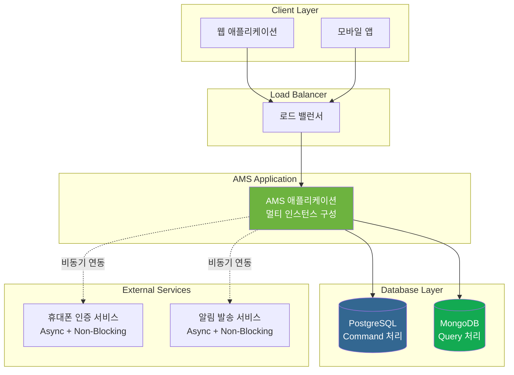
```mermaid
graph TB
    subgraph "Client Layer"
        Web[웹 애플리케이션]
        Mobile[모바일 앱]
    end

    subgraph "Load Balancer"
        LB[로드 밸런서]
    end

    subgraph "AMS Application"
        App[AMS 애플리케이션<br/>멀티 인스턴스 구성]
    end

    subgraph "Database Layer"
        PG[(PostgreSQL<br/>Command 처리)]
        MongoDB[(MongoDB<br/>Query 처리)]
    end

    subgraph "External Services"
        AuthService[휴대폰 인증 서비스<br/>Async + Non-Blocking]
        NotificationService[알림 발송 서비스<br/>Async + Non-Blocking]
    end

    Web --> LB
    Mobile --> LB
    LB --> App
    
    App --> PG
    App --> MongoDB
    
    App -.->|비동기 연동| AuthService
    App -.->|비동기 연동| NotificationService

    style PG fill:#336791,color:#fff
    style MongoDB fill:#13aa52,color:#fff
    style App fill:#6db33f,color:#fff
```

#### 주요 구성 요소

- **클라이언트 레이어**: 웹 애플리케이션 및 모바일 앱
- **로드 밸런서**: 다중 인스턴스 간 트래픽 분산
- **AMS 애플리케이션**: 멀티 서버 및 멀티 인스턴스로 구성되어 수평 확장을 지원합니다. 로드 밸런서를 통해 트래픽이 분산되며, 각 인스턴스는 독립적으로 운영됩니다.
- **데이터베이스 레이어**:
  - **PostgreSQL**: Command 처리용 (데이터 쓰기 작업)
  - **MongoDB**: Query 처리용 (데이터 조회 작업)
  - 모든 AMS 인스턴스는 동일한 데이터베이스에 접근합니다.
- **외부 서비스**: 비동기(Async) + Non-Blocking 방식으로 연동
  - 휴대폰 인증 서비스
  - 알림 발송 서비스
  - 각 AMS 인스턴스는 독립적으로 외부 서비스와 비동기 연동합니다.

---

### 2.2 레이어 아키텍처 다이어그램 (Hexagonal Architecture 기반)

AMS는 Hexagonal Architecture(포트/어댑터 패턴)를 기반으로 구성되며, CQRS 패턴을 적용합니다:

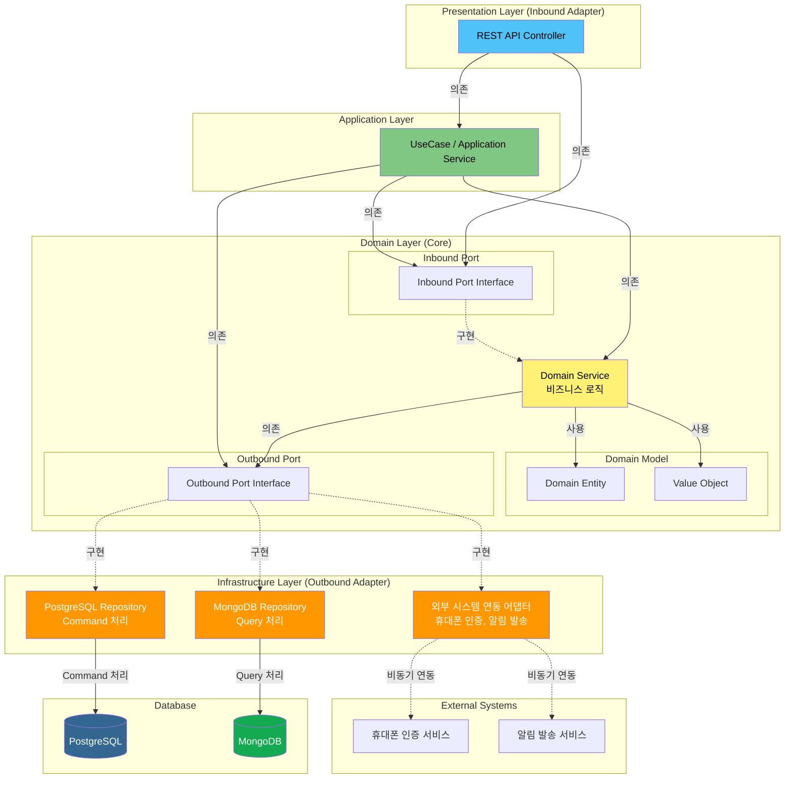
```mermaid
graph TB
    subgraph "Presentation Layer (Inbound Adapter)"
        Controller[REST API Controller]
    end

    subgraph "Application Layer"
        UseCase[UseCase / Application Service]
    end

    subgraph "Domain Layer (Core)"
        subgraph "Domain Model"
            Entity[Domain Entity]
            VO[Value Object]
        end
        subgraph "Inbound Port"
            InboundPort[Inbound Port Interface]
        end
        subgraph "Outbound Port"
            OutboundPort[Outbound Port Interface]
        end
        DomainService[Domain Service<br/>비즈니스 로직]
    end

    subgraph "Infrastructure Layer (Outbound Adapter)"
        PGAdapter[PostgreSQL Repository<br/>Command 처리]
        MongoAdapter[MongoDB Repository<br/>Query 처리]
        ExternalAdapter[외부 시스템 연동 어댑터<br/>휴대폰 인증, 알림 발송]
    end

    subgraph "Database"
        PG[(PostgreSQL)]
        MongoDB[(MongoDB)]
    end

    subgraph "External Systems"
        Auth[휴대폰 인증 서비스]
        Noti[알림 발송 서비스]
    end

    Controller -->|의존| InboundPort
    Controller -->|의존| UseCase
    UseCase -->|의존| InboundPort
    UseCase -->|의존| DomainService
    DomainService -->|의존| OutboundPort
    UseCase -->|의존| OutboundPort
    
    InboundPort -.->|구현| DomainService
    OutboundPort -.->|구현| PGAdapter
    OutboundPort -.->|구현| MongoAdapter
    OutboundPort -.->|구현| ExternalAdapter
    
    PGAdapter -->|Command 처리| PG
    MongoAdapter -->|Query 처리| MongoDB
    ExternalAdapter -.->|비동기 연동| Auth
    ExternalAdapter -.->|비동기 연동| Noti
    
    DomainService -->|사용| Entity
    DomainService -->|사용| VO

    style Controller fill:#4fc3f7,color:#000
    style UseCase fill:#81c784,color:#000
    style DomainService fill:#fff176,color:#000
    style PGAdapter fill:#ff9800,color:#fff
    style MongoAdapter fill:#ff9800,color:#fff
    style ExternalAdapter fill:#ff9800,color:#fff
    style PG fill:#336791,color:#fff
    style MongoDB fill:#13aa52,color:#fff
```

#### 레이어 구조 설명

1. **Presentation Layer (Inbound Adapter)**
   - REST API Controller
   - HTTP 요청/응답 처리
   - DTO 변환

2. **Application Layer**
   - UseCase / Application Service
   - 트랜잭션 경계 관리
   - 도메인 서비스 조율

3. **Domain Layer (Core - 비즈니스 로직의 핵심)**
   - **Domain Model**: Entity, Value Object
   - **Inbound Port**: 도메인이 제공하는 인터페이스
   - **Outbound Port**: 도메인이 필요로 하는 인터페이스
   - **Domain Service**: 핵심 비즈니스 로직

4. **Infrastructure Layer (Outbound Adapter)**
   - **PostgreSQL Repository**: Command 처리 (데이터 쓰기)
   - **MongoDB Repository**: Query 처리 (데이터 조회)
   - **외부 시스템 연동 어댑터**: 휴대폰 인증, 알림 발송 등

#### CQRS 패턴 적용

- **Command 처리 경로**: Controller → UseCase → Domain Service → PostgreSQL Repository → PostgreSQL
- **Query 처리 경로**: Controller → UseCase → MongoDB Repository → MongoDB
- **데이터 동기화**: Command 처리 완료 후 이벤트를 통해 MongoDB에 조회용 데이터 저장

#### 의존성 규칙

- 모든 의존성은 **Domain Layer(핵심)** 를 향합니다
- 외부 레이어는 내부 레이어를 의존하지 않습니다
- 포트(Interface)를 통해 어댑터와 도메인이 분리됩니다

---

### 2.3 컴포넌트 간 상호작용 다이어그램

#### 2.3.1 Command 처리 흐름 (데이터 생성 예시: 회원 생성)

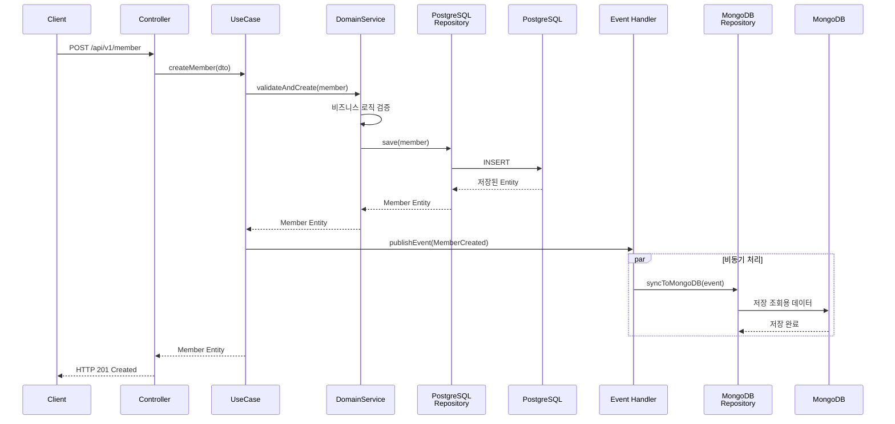
```mermaid
sequenceDiagram
    participant Client
    participant Controller
    participant UseCase
    participant DomainService
    participant PGRepo as PostgreSQL<br/>Repository
    participant PostgreSQL
    participant EventHandler as Event Handler
    participant MongoRepo as MongoDB<br/>Repository
    participant MongoDB

    Client->>Controller: POST /api/v1/member
    Controller->>UseCase: createMember(dto)
    UseCase->>DomainService: validateAndCreate(member)
    DomainService->>DomainService: 비즈니스 로직 검증
    
    DomainService->>PGRepo: save(member)
    PGRepo->>PostgreSQL: INSERT
    PostgreSQL-->>PGRepo: 저장된 Entity
    PGRepo-->>DomainService: Member Entity
    
    DomainService-->>UseCase: Member Entity
    UseCase->>EventHandler: publishEvent(MemberCreated)
    
    par 비동기 처리
        EventHandler->>MongoRepo: syncToMongoDB(event)
        MongoRepo->>MongoDB: 저장 조회용 데이터
        MongoDB-->>MongoRepo: 저장 완료
    end
    
    UseCase-->>Controller: Member Entity
    Controller-->>Client: HTTP 201 Created
```

#### 2.3.2 Query 처리 흐름 (데이터 조회 예시: 회원 조회)

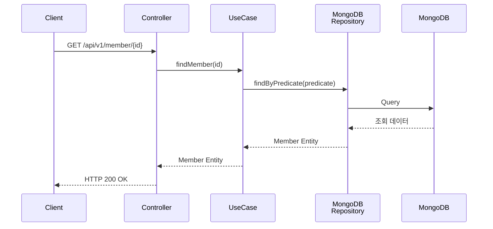
```mermaid
sequenceDiagram
    participant Client
    participant Controller
    participant UseCase
    participant MongoRepo as MongoDB<br/>Repository
    participant MongoDB

    Client->>Controller: GET /api/v1/member/{id}
    Controller->>UseCase: findMember(id)
    UseCase->>MongoRepo: findByPredicate(predicate)
    MongoRepo->>MongoDB: Query
    MongoDB-->>MongoRepo: 조회 데이터
    MongoRepo-->>UseCase: Member Entity
    UseCase-->>Controller: Member Entity
    Controller-->>Client: HTTP 200 OK
```

#### 2.3.3 Event-Driven 처리 흐름 (출석 확인 및 알림 발송)

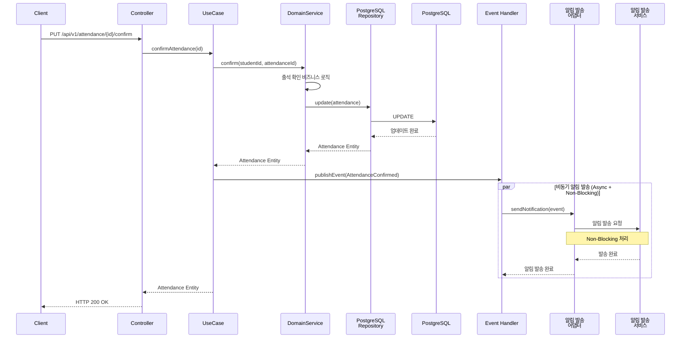
```mermaid
sequenceDiagram
    participant Client
    participant Controller
    participant UseCase
    participant DomainService
    participant PGRepo as PostgreSQL<br/>Repository
    participant PostgreSQL
    participant EventHandler as Event Handler
    participant NotificationAdapter as 알림 발송<br/>어댑터
    participant NotificationService as 알림 발송<br/>서비스

    Client->>Controller: PUT /api/v1/attendance/{id}/confirm
    Controller->>UseCase: confirmAttendance(id)
    UseCase->>DomainService: confirm(studentId, attendanceId)
    DomainService->>DomainService: 출석 확인 비즈니스 로직
    
    DomainService->>PGRepo: update(attendance)
    PGRepo->>PostgreSQL: UPDATE
    PostgreSQL-->>PGRepo: 업데이트 완료
    PGRepo-->>DomainService: Attendance Entity
    
    DomainService-->>UseCase: Attendance Entity
    UseCase->>EventHandler: publishEvent(AttendanceConfirmed)
    
    par 비동기 알림 발송 (Async + Non-Blocking)
        EventHandler->>NotificationAdapter: sendNotification(event)
        NotificationAdapter->>NotificationService: 알림 발송 요청
        Note over NotificationAdapter,NotificationService: Non-Blocking 처리
        NotificationService-->>NotificationAdapter: 발송 완료
        NotificationAdapter-->>EventHandler: 알림 발송 완료
    end
    
    UseCase-->>Controller: Attendance Entity
    Controller-->>Client: HTTP 200 OK
```

#### 상호작용 패턴 요약

1. **Command 처리**:
   - 동기적으로 PostgreSQL에 데이터 저장
   - 이벤트 발행을 통해 비동기로 MongoDB 동기화

2. **Query 처리**:
   - MongoDB에서 조회용 데이터를 직접 조회
   - 빠른 응답 시간 보장

3. **Event-Driven 처리**:
   - 도메인 이벤트를 통한 느슨한 결합
   - 비동기(Async) + Non-Blocking 방식으로 외부 시스템 연동
   - 시스템 확장성 및 성능 향상

---

## 3. 기술 스택 상세

### 3.1 기술 스택 개요

AMS는 현대적이고 확장 가능한 백엔드 서비스를 구축하기 위해 다음 기술 스택을 선택했습니다:

- **언어**: Kotlin
- **프레임워크**: Spring Boot
- **ORM**: Kotlin Exposed
- **빌드 도구**: Gradle
- **테스트 프레임워크**: Kotest
- **데이터베이스**: PostgreSQL (RDBMS), MongoDB (NoSQL)
- **비동기 처리**: Kotlin Coroutine, Async + Non-Blocking

#### 기술 스택 선택 기준

1. **생산성**: 개발 효율성과 코드 품질 향상
2. **성능**: 높은 처리량과 낮은 지연 시간
3. **확장성**: 수평 확장 지원 및 멀티 인스턴스 운영
4. **안정성**: 엔터프라이즈급 안정성과 안전성
5. **유지보수성**: 코드 가독성 및 유지보수 용이성

---

### 3.2 언어 및 런타임

#### Kotlin 2.1.10

**선택 이유:**
- JVM 기반 언어로 Java와의 상호 운용성이 뛰어남
- Null 안전성을 통한 안정적인 코드 작성
- 간결한 문법으로 개발 생산성 향상
- 타입 추론을 통한 코드 간결성
- Coroutine을 통한 효율적인 비동기 처리

**역할:**
- AMS 애플리케이션의 주요 개발 언어
- 비즈니스 로직 및 도메인 모델 구현

**주요 특징:**
- **Null 안전성**: 컴파일 타임에 null 참조 오류 방지
- **Coroutine 지원**: 경량 스레드 기반의 Non-Blocking 비동기 처리
- **함수형 프로그래밍**: 불변성 및 고차 함수 지원
- **Java 상호 운용성**: 기존 Java 라이브러리 및 프레임워크와 완벽한 통합
- **확장 함수**: 기존 클래스에 기능을 추가할 수 있는 확장성

---

### 3.3 프레임워크 및 라이브러리

#### Spring Boot 3.4.3

**선택 이유:**
- 엔터프라이즈급 애플리케이션 개발을 위한 풍부한 기능 제공
- 자동 설정(Auto Configuration)을 통한 빠른 개발
- 활발한 커뮤니티와 광범위한 생태계
- 프로덕션 레벨의 보안 및 모니터링 지원

**역할:**
- AMS 애플리케이션의 핵심 프레임워크
- 의존성 주입(DI), AOP, 트랜잭션 관리 제공

**주요 기능:**
- **의존성 주입(Dependency Injection)**: 느슨한 결합을 통한 유연한 구조
- **AOP(Aspect-Oriented Programming)**: 횡단 관심사 처리 (로깅, 트랜잭션 등)
- **트랜잭션 관리**: 선언적 트랜잭션 관리 지원
- **웹 MVC**: RESTful API 구현을 위한 웹 프레임워크
- **자동 설정**: 프로젝트 설정 최소화

#### Kotlin Exposed 0.60.0

**선택 이유:**
- Kotlin 네이티브 ORM으로 타입 안전성 제공
- DSL을 통한 직관적인 쿼리 작성
- 컴파일 타임에 쿼리 오류 검출 가능
- 가벼운 프레임워크로 학습 곡선이 낮음

**역할:**
- PostgreSQL 데이터베이스 접근 프레임워크
- 타입 안전한 쿼리 작성 및 데이터 매핑

**주요 기능:**
- **타입 안전한 쿼리**: 컴파일 타임에 쿼리 검증
- **DSL 지원**: 직관적인 쿼리 작성 문법
- **마이그레이션 지원**: 데이터베이스 스키마 버전 관리
- **트랜잭션 관리**: Exposed의 `transaction` 블록 또는 `newSuspendedTransaction`을 통한 트랜잭션 처리
- **Coroutine 지원**: 비동기 데이터베이스 접근

#### MongoDB Kotlin Driver (공식)

**선택 이유:**
- MongoDB 공식 Kotlin 드라이버로 장기적인 지원 및 유지보수 보장
- Kotlin 네이티브 드라이버로 Exposed와 일관된 Kotlin 네이티브 기술 스택 유지
- Coroutine 기반 비동기 프로그래밍 완벽 지원
- 최신 MongoDB 기능을 신속하게 반영
- `kotlinx.serialization`과의 통합 지원

**역할:**
- MongoDB 데이터베이스 접근 드라이버
- Query 처리용 데이터베이스 접근 (CQRS 패턴)
- 비동기 데이터 조회 및 저장

**주요 기능:**
- **Coroutine 지원**: `suspend` 함수를 통한 Non-Blocking 비동기 처리
- **Kotlin 네이티브**: Kotlin 언어에 최적화된 API 제공
- **kotlinx.serialization 통합**: Kotlin 데이터 클래스와의 직렬화/역직렬화 지원
- **타입 안전성**: Kotlin의 타입 시스템을 활용한 안전한 코드 작성
- **공식 지원**: MongoDB 공식 문서 및 지속적인 업데이트 제공
- **Spring Boot 통합**: `MongoClient`를 Bean으로 등록하여 Spring 환경에서 사용 가능

**참고 문서:**
- [MongoDB Kotlin Driver 공식 문서](https://www.mongodb.com/ko-kr/docs/drivers/kotlin/coroutine/current/)

---

### 3.4 빌드 도구

#### Gradle 8.13

**선택 이유:**
- 유연한 빌드 시스템으로 다양한 프로젝트 구조 지원
- 증분 빌드를 통한 빠른 빌드 속도
- Kotlin DSL 지원으로 타입 안전한 빌드 스크립트 작성
- 강력한 의존성 관리 및 캐싱 기능

**역할:**
- 프로젝트 빌드 및 의존성 관리
- 테스트 실행 및 패키징

**주요 특징:**
- **증분 빌드**: 변경된 부분만 재빌드하여 빌드 시간 단축
- **Kotlin DSL**: 타입 안전한 빌드 스크립트 작성
- **의존성 관리**: 효율적인 의존성 해결 및 캐싱
- **멀티 프로젝트 지원**: 모듈화된 프로젝트 구조 지원

---

### 3.5 테스트 프레임워크

#### Kotest

**선택 이유:**
- Kotlin 네이티브 테스트 프레임워크로 Kotlin 특성을 최대한 활용
- 다양한 테스트 스타일 지원 (Behavior-Driven, Property-Based 등)
- 직관적인 어설션 문법
- MockK와의 통합을 통한 Mocking 지원

**역할:**
- 단위 테스트 및 통합 테스트 작성
- 테스트 커버리지 측정 및 리포팅

**주요 특징:**
- **다양한 테스트 스타일**: BDD, Property-Based 등 다양한 스타일 지원
- **직관적인 어설션**: 읽기 쉬운 테스트 코드 작성
- **Coroutine 테스트**: 비동기 코드 테스트 지원
- **통합 테스트**: Spring Boot 테스트 통합 지원

---

### 3.6 데이터베이스

#### PostgreSQL

**선택 이유:**
- ACID 트랜잭션을 완벽히 지원하는 강력한 관계형 데이터베이스
- 오픈소스이면서 엔터프라이즈급 성능 및 안정성
- 다양한 데이터 타입 및 고급 기능 지원
- CQRS 패턴의 Command 처리에 최적화

**역할:**
- Command 처리용 데이터베이스 (CQRS 패턴)
- 트랜잭션이 중요한 데이터 쓰기 작업 처리

**사용 목적:**
- 데이터 생성(CREATE), 수정(UPDATE), 삭제(DELETE) 작업
- 트랜잭션 무결성이 중요한 비즈니스 로직 처리
- 복잡한 관계형 데이터 모델링

**주요 특징:**
- **ACID 트랜잭션**: 데이터 무결성 보장
- **관계형 데이터 모델**: 정규화된 데이터 구조
- **뛰어난 성능**: 대용량 데이터 처리 최적화
- **확장성**: 수평 확장 및 복제 지원

#### MongoDB

**선택 이유:**
- 문서 기반 NoSQL 데이터베이스로 유연한 스키마 지원
- 높은 조회 성능으로 빠른 응답 시간 제공
- 수평 확장이 용이한 구조
- CQRS 패턴의 Query 처리에 최적화

**역할:**
- Query 처리용 데이터베이스 (CQRS 패턴)
- 조회 전용 데이터 저장 및 빠른 조회 성능 제공

**사용 목적:**
- 데이터 조회(READ) 작업
- 빠른 응답 시간이 필요한 조회 쿼리
- 조회 최적화된 데이터 구조 저장

**주요 특징:**
- **문서 기반 저장**: 유연한 스키마 구조
- **높은 조회 성능**: 읽기 성능 최적화
- **수평 확장**: 샤딩을 통한 확장 용이성
- **집계 쿼리**: 복잡한 조회 및 집계 쿼리 지원

---

### 3.7 비동기 처리 기술

#### Kotlin Coroutine

**선택 이유:**
- 경량 스레드 기반의 효율적인 동시성 처리
- Non-Blocking I/O를 통한 높은 처리량
- Thread 오버헤드 감소로 리소스 효율성 향상
- 직관적인 비동기 코드 작성

**역할:**
- Application 내부 Thread 처리 (Non-Blocking 방식)
- 비즈니스 로직 및 데이터베이스 접근의 비동기 처리

**사용 영역:**
- 비즈니스 로직 처리
- 데이터베이스 접근 (PostgreSQL, MongoDB)
- 내부 컴포넌트 간 통신

**주요 특징:**
- **경량 스레드**: 기존 스레드보다 훨씬 가벼운 동시성 처리
- **Non-Blocking I/O**: I/O 대기 중에도 다른 작업 처리 가능
- **Suspend 함수**: 비동기 코드를 동기 코드처럼 작성
- **Structured Concurrency**: 안전한 동시성 처리 보장

#### Async + Non-Blocking

**선택 이유:**
- 외부 시스템 연동 시 높은 성능과 확장성 제공
- Non-Blocking I/O를 통한 동시 처리 능력 향상
- 시스템 리소스 효율적 활용

**역할:**
- Application 외부 연동 처리
- 외부 서비스와의 비동기 통신

**사용 영역:**
- 휴대폰 인증 서비스 연동
- 알림 발송 서비스 연동
- 향후 추가될 외부 시스템 연동

**주요 특징:**
- **비동기 통신**: 응답을 기다리지 않고 다른 작업 처리 가능
- **Non-Blocking**: I/O 대기 중에도 스레드가 차단되지 않음
- **높은 동시성**: 많은 외부 요청을 동시에 처리 가능
- **확장성**: 시스템 부하 증가에 유연하게 대응

---

### 3.8 기술 간 통합 방식

#### Spring Boot와 Kotlin 통합

- Spring Boot의 자동 설정은 Kotlin 코드와 완벽하게 통합됩니다.
- Kotlin의 null 안전성이 Spring의 의존성 주입과 조합되어 안전한 코드 작성이 가능합니다.
- Spring의 어노테이션(@Service, @Repository 등)을 Kotlin 클래스에 적용 가능합니다.

#### Spring Boot와 Kotlin Exposed 통합

- Exposed의 `transaction` 블록을 직접 사용하여 트랜잭션을 관리합니다.
- Coroutine 기반 비동기 처리를 위해 `newSuspendedTransaction` 또는 커스텀 `tx` 함수를 사용합니다.
- Spring Data JPA를 사용하지 않고 Exposed의 네이티브 트랜잭션 관리 기능을 활용합니다.
- 트랜잭션 격리 수준 및 타임아웃 설정을 Exposed 트랜잭션 블록에서 직접 설정할 수 있습니다.

#### Spring Boot와 MongoDB Kotlin Driver 통합

- MongoDB Kotlin Driver의 `MongoClient`를 Spring Bean으로 등록하여 사용합니다.
- Infrastructure Layer의 Repository 구현체에서 MongoDB Kotlin Driver를 직접 사용합니다.
- Coroutine의 `suspend` 함수를 활용하여 Non-Blocking 비동기 데이터 접근을 구현합니다.
- Hexagonal Architecture의 Outbound Adapter 패턴에 맞게 MongoDB 접근을 추상화합니다.

#### Coroutine과 Spring Boot 통합

- Spring WebFlux 또는 Spring MVC와 Coroutine을 통합하여 Non-Blocking 웹 요청 처리를 구현합니다.
- suspend 함수를 사용한 컨트롤러 메서드로 비동기 요청 처리를 구현합니다.
- 데이터베이스 접근 시 Coroutine을 활용하여 Non-Blocking I/O를 구현합니다.

#### CQRS 패턴 구현을 위한 PostgreSQL과 MongoDB 통합

- **Command 처리 경로**:
  - PostgreSQL을 통한 데이터 쓰기 작업
  - Kotlin Exposed를 통한 타입 안전한 쿼리 작성
  - Exposed 트랜잭션 관리를 통한 ACID 보장

- **Query 처리 경로**:
  - MongoDB를 통한 데이터 조회 작업
  - MongoDB Kotlin Driver를 통한 Coroutine 기반 비동기 쿼리 처리
  - `suspend` 함수를 활용한 Non-Blocking 데이터 접근
  - 조회 최적화된 데이터 구조 활용

- **데이터 동기화**:
  - Command 처리 완료 후 도메인 이벤트 발행
  - 이벤트 핸들러를 통한 MongoDB 동기화
  - 비동기 이벤트 처리로 Command 응답 시간에 영향 없음

#### 비동기 처리 패턴 (Coroutine + Async + Non-Blocking)

- **Application 내부 처리**: Coroutine을 통한 Non-Blocking 처리
  - 비즈니스 로직 실행
  - 데이터베이스 접근 (PostgreSQL, MongoDB)
  - 내부 컴포넌트 간 통신

- **Application 외부 연동**: Async + Non-Blocking 처리
  - HTTP 클라이언트를 통한 외부 API 호출
  - 메시지 큐를 통한 비동기 통신
  - 외부 서비스와의 이벤트 기반 통신

- **통합 아키텍처**:
  - Coroutine과 Spring의 비동기 기능을 조합하여 전체적인 Non-Blocking 아키텍처 구현
  - 외부 연동 시 Async 패턴을 적용하여 높은 처리량 확보

---

### 3.9 기술 스택 버전 관리

#### 기술 스택 버전 요약

| 기술 | 버전 | 용도 |
|------|------|------|
| **Kotlin** | 2.1.10 | 개발 언어 |
| **Spring Boot** | 3.4.3 | 애플리케이션 프레임워크 |
| **Kotlin Exposed** | 0.60.0 | ORM 프레임워크 (PostgreSQL) |
| **MongoDB Kotlin Driver** | 최신 버전 | MongoDB 드라이버 (Query 처리) |
| **Gradle** | 8.13 | 빌드 도구 |
| **Kotest** | 최신 버전 | 테스트 프레임워크 |
| **PostgreSQL** | 최신 LTS 버전 | RDBMS (Command 처리) |
| **MongoDB** | 최신 버전 | NoSQL (Query 처리) |

#### 버전 선택 기준

1. **안정성 우선**: 프로덕션 환경에서 검증된 안정적인 버전 선택
2. **보안**: 보안 취약점이 해결된 최신 버전 우선
3. **호환성**: 기술 스택 간 호환성 확인 후 버전 선택
4. **장기 지원(LTS)**: 장기 지원 버전이 있는 경우 우선 선택
5. **커뮤니티**: 활발한 커뮤니티 지원 및 문서화가 잘 된 버전 선택

---

## 4. 아키텍처 패턴 및 원칙

### 4.1 아키텍처 패턴 개요

AMS는 유지보수성, 확장성, 테스트 용이성을 위해 다음과 같은 핵심 아키텍처 패턴을 적용합니다:

- **Hexagonal Architecture (포트/어댑터 패턴)**: 도메인과 외부 세계의 분리를 통한 독립성 확보
- **CQRS (Command Query Responsibility Segregation)**: 명령과 조회의 분리를 통한 성능 및 확장성 향상
- **EDD (Event-Driven Design)**: 이벤트 기반 설계를 통한 느슨한 결합 및 확장성 확보

#### 패턴 선택 이유

1. **유지보수성**: 도메인 로직과 인프라스트럭처의 분리를 통한 코드 품질 향상
2. **확장성**: 각 패턴이 독립적으로 확장 가능한 구조 제공
3. **테스트 용이성**: 포트/어댑터 패턴을 통한 Mock 객체 활용 가능
4. **성능**: CQRS 패턴을 통한 읽기/쓰기 성능 최적화
5. **유연성**: 이벤트 기반 설계를 통한 시스템 구성 요소 간 느슨한 결합

---

### 4.2 Hexagonal Architecture (포트/어댑터 패턴)

#### Hexagonal Architecture 개념

Hexagonal Architecture는 **포트/어댑터 패턴**을 기반으로 한 아키텍처 스타일로, 도메인 로직을 중심에 배치하고 외부 시스템과의 통신을 어댑터를 통해 처리합니다.

**핵심 원칙:**
- 도메인 로직은 외부 시스템에 의존하지 않습니다
- 외부 시스템은 포트(인터페이스)를 통해 도메인과 통신합니다
- 모든 의존성은 도메인을 향합니다 (의존성 역전 원칙)

#### 포트/어댑터 패턴 구성 요소

##### Inbound Port (인바운드 포트)
- **정의**: 도메인이 제공하는 인터페이스
- **역할**: 외부 시스템이 도메인 기능을 사용하기 위한 진입점
- **예시**: `MemberSaveService`, `MemberFindService` 등

##### Outbound Port (아웃바운드 포트)
- **정의**: 도메인이 필요로 하는 인터페이스
- **역할**: 도메인이 외부 시스템과 상호작용하기 위한 인터페이스
- **예시**: `MemberRepository`, `NotificationService` 등

##### Inbound Adapter (인바운드 어댑터)
- **정의**: 외부 요청을 도메인으로 변환하는 어댑터
- **역할**: HTTP 요청, 메시지 큐 등 외부 요청을 처리하여 도메인 포트로 전달
- **예시**: REST API Controller

##### Outbound Adapter (아웃바운드 어댑터)
- **정의**: 도메인 요청을 외부 시스템으로 변환하는 어댑터
- **역할**: 데이터베이스 접근, 외부 API 호출 등 도메인 요청을 외부 시스템 형식으로 변환
- **예시**: PostgreSQL Repository, MongoDB Repository, 외부 서비스 연동 어댑터

#### AMS에서의 적용 방안

##### 레이어 구성

```
┌─────────────────────────────────────────────────────────┐
│  Presentation Layer (Inbound Adapter)                   │
│  - REST API Controller                                  │
│  - HTTP 요청/응답 처리                                      │
└─────────────────────────────────────────────────────────┘
                        ↓
┌─────────────────────────────────────────────────────────┐
│  Application Layer                                      │
│  - UseCase / Application Service                        │
│  - 트랜잭션 경계 관리                                        │
└─────────────────────────────────────────────────────────┘
                        ↓
┌─────────────────────────────────────────────────────────┐
│  Domain Layer (Core)                                    │
│  - Inbound Port (Interface)                             │
│  - Outbound Port (Interface)                            │
│  - Domain Service (비즈니스 로직)                           │
│  - Entity, Value Object                                 │
└─────────────────────────────────────────────────────────┘
                        ↑
┌─────────────────────────────────────────────────────────┐
│  Infrastructure Layer (Outbound Adapter)                │
│  - PostgreSQL Repository                                │
│  - MongoDB Repository                                   │
│  - 외부 시스템 연동 어댑터                                    │
└─────────────────────────────────────────────────────────┘
```

##### 의존성 방향 규칙

1. **모든 의존성은 Domain Layer를 향합니다**
   - Presentation Layer → Domain Layer
   - Application Layer → Domain Layer
   - Infrastructure Layer → Domain Layer

2. **외부 레이어는 내부 레이어를 의존하지 않습니다**
   - Infrastructure Layer는 Presentation Layer를 알지 못합니다
   - Application Layer는 Infrastructure Layer의 구현 세부사항을 알지 못합니다

3. **포트(Interface)를 통해 어댑터와 도메인이 분리됩니다**
   - Inbound Port: 도메인이 제공하는 기능을 정의
   - Outbound Port: 도메인이 필요로 하는 기능을 정의

##### 도메인과 외부 세계의 분리

- **도메인 독립성**: 도메인 로직은 데이터베이스, 웹 프레임워크 등 외부 기술에 의존하지 않습니다
- **테스트 용이성**: 포트를 통해 Mock 객체를 주입하여 도메인 로직을 독립적으로 테스트할 수 있습니다
- **유연성**: 데이터베이스나 외부 시스템을 교체하더라도 도메인 로직은 변경되지 않습니다

---

### 4.3 CQRS (Command Query Responsibility Segregation)

#### CQRS 패턴 개념

CQRS는 **Command(명령)**와 **Query(조회)**의 책임을 분리하는 패턴입니다. 데이터 쓰기와 읽기 작업을 분리하여 각각 최적화된 구조로 구현합니다.

**핵심 원칙:**
- Command: 데이터 상태를 변경하는 작업 (CREATE, UPDATE, DELETE)
- Query: 데이터를 조회하는 작업 (READ)
- Command와 Query를 별도의 모델과 저장소로 분리

#### Command/Query 분리 전략

##### Command 처리 (데이터 쓰기)

- **데이터 소스**: PostgreSQL (RDBMS)
- **처리 작업**: 
  - CREATE: 데이터 생성
  - UPDATE: 데이터 수정
  - DELETE: 데이터 삭제
- **특징**:
  - ACID 트랜잭션 보장
  - 데이터 무결성 유지
  - 복잡한 관계형 데이터 모델링

##### Query 처리 (데이터 조회)

- **데이터 소스**: MongoDB (NoSQL)
- **처리 작업**: 
  - READ: 데이터 조회
  - 검색 및 집계 쿼리
- **특징**:
  - 빠른 조회 성능
  - 조회 최적화된 데이터 구조
  - 수평 확장 용이

##### 데이터 소스 분리 이유

| 항목 | PostgreSQL (Command) | MongoDB (Query) |
|------|---------------------|-----------------|
| **용도** | 데이터 쓰기 작업 | 데이터 조회 작업 |
| **최적화** | ACID 트랜잭션, 데이터 무결성 | 빠른 조회 성능, 수평 확장 |
| **스키마** | 정규화된 관계형 스키마 | 조회 최적화된 문서 스키마 |
| **장점** | 데이터 일관성 보장 | 높은 조회 성능 |

#### CQRS 구현 방식

##### Command 처리 경로

```
Client → Controller → UseCase → Domain Service → PostgreSQL Repository → PostgreSQL
```

**처리 단계:**
1. **Controller**: HTTP 요청을 받아 DTO로 변환
2. **UseCase**: 트랜잭션 경계 관리 및 도메인 서비스 조율
3. **Domain Service**: 비즈니스 로직 검증 및 처리
4. **PostgreSQL Repository**: Kotlin Exposed를 통한 타입 안전한 쿼리 작성
5. **PostgreSQL**: 트랜잭션 보장된 데이터 저장

##### Query 처리 경로

```
Client → Controller → UseCase → MongoDB Repository → MongoDB
```

**처리 단계:**
1. **Controller**: HTTP 요청을 받아 DTO로 변환
2. **UseCase**: 조회 요청 처리 로직
3. **MongoDB Repository**: MongoDB Kotlin Driver를 통한 Coroutine 기반 비동기 쿼리
4. **MongoDB**: 조회 최적화된 데이터 구조에서 빠른 조회

##### 데이터 동기화 전략

Command 처리 완료 후 이벤트를 발행하여 MongoDB에 조회용 데이터를 비동기로 동기화합니다:

```
PostgreSQL 저장 완료 
  → 도메인 이벤트 발행 (MemberCreated, MemberUpdated 등)
  → 이벤트 핸들러가 비동기로 MongoDB에 조회용 데이터 저장
```

**동기화 특징:**
- **비동기 처리**: Command 응답 시간에 영향 없음
- **이벤트 기반**: 느슨한 결합 유지
- **최종 일관성**: Eventual Consistency 모델

#### Event Sourcing 적용 여부

**Event Sourcing 미적용**

AMS는 **단순 CQRS 패턴**만 적용하며, Event Sourcing은 사용하지 않습니다.

**이유:**
1. **복잡도 관리**: Event Sourcing은 시스템 복잡도를 높일 수 있습니다
2. **요구사항**: 현재 비즈니스 요구사항에 Event Sourcing이 필수적이지 않습니다
3. **충분한 이점**: CQRS 패턴만으로도 읽기/쓰기 성능 최적화가 가능합니다

**대안:**
- **도메인 이벤트**: Command 처리 완료 후 도메인 이벤트를 발행하여 데이터 동기화
- **이벤트 기반 동기화**: Event-Driven Design을 통해 비동기 데이터 동기화

**결론:**
- Event Sourcing은 적용하지 않음
- 도메인 이벤트를 통한 데이터 동기화만 사용
- 필요 시 향후 Event Sourcing 도입 가능한 구조로 설계

---

### 4.4 EDD (Event-Driven Design)

#### EDD 개념 및 목적

EDD(Event-Driven Design)는 도메인 이벤트를 중심으로 시스템을 설계하는 아키텍처 스타일입니다.

**핵심 원칙:**
- 도메인 이벤트를 통한 시스템 구성 요소 간 통신
- 이벤트 발행자와 수신자의 느슨한 결합
- 비동기 이벤트 처리로 시스템 확장성 향상

**적용 목적:**
- 시스템 구성 요소 간 느슨한 결합 확보
- 비동기 처리를 통한 성능 향상
- 이벤트 기반 확장 가능한 구조 제공

#### 도메인 이벤트 설계

##### 이벤트 종류

AMS에서 발행하는 주요 도메인 이벤트:

| 이벤트 이름 | 설명 | 발행 시점 |
|-----------|------|----------|
| `MemberCreated` | 회원 정보 생성 완료 | 회원 생성 Command 처리 완료 후 |
| `MemberUpdated` | 회원 정보 수정 완료 | 회원 수정 Command 처리 완료 후 |
| `AttendanceConfirmed` | 출석 확인 완료 | 출석 확인 Command 처리 완료 후 |
| `ClassCreated` | 수업 생성 완료 | 수업 생성 Command 처리 완료 후 |
| `ClassUpdated` | 수업 정보 수정 완료 | 수업 수정 Command 처리 완료 후 |

##### 이벤트 발행 시점

AMS는 **트랜잭션 커밋 완료 후 비동기로 이벤트를 발행**합니다.

**발행 전략:**
- **트랜잭션 커밋 후 발행**: PostgreSQL 트랜잭션이 성공적으로 커밋된 후에 이벤트 발행
- **비동기 처리**: 이벤트 발행과 처리를 비동기로 수행하여 Command 응답 시간에 영향 없음

이 방식은 트랜잭션이 롤백된 경우 이벤트가 발행되지 않아 데이터 일관성을 보장합니다.

##### 이벤트 핸들러

이벤트 핸들러는 발행된 이벤트를 수신하여 후속 작업을 처리합니다:

| 이벤트 핸들러 | 처리 작업 | 목적 |
|------------|---------|------|
| `MongoDBSyncHandler` | MongoDB에 조회용 데이터 저장 | CQRS 데이터 동기화 |
| `NotificationHandler` | 학부모에게 알림 발송 | 출석 확인 알림 등 |
| `StatisticsHandler` | 통계 데이터 업데이트 | 운영 통계 계산 |

#### 이벤트 처리 방식

##### 비동기 이벤트 처리 (Non-Blocking)

- **이벤트 발행**: Command 처리 완료 후 이벤트를 발행하고 즉시 응답 반환
- **비동기 처리**: 이벤트 핸들러가 별도의 스레드에서 비동기로 처리
- **Non-Blocking**: 이벤트 처리가 Command 응답 시간에 영향을 주지 않음

##### 이벤트 기반 느슨한 결합

- **이벤트 발행자와 수신자 분리**: 이벤트 발행자는 수신자의 존재를 알 필요 없음
- **독립적인 확장**: 이벤트 핸들러는 독립적으로 추가/제거 가능
- **유연한 통신**: 이벤트를 통해 시스템 구성 요소 간 통신

##### 시스템 확장성 향상

- **수평 확장**: 이벤트 핸들러를 여러 인스턴스로 확장 가능
- **부하 분산**: 이벤트 기반 메시지 큐를 통한 부하 분산
- **결합도 감소**: 직접적인 의존성 없이 이벤트를 통한 통신

---

### 4.5 도메인 모델 설계

#### 도메인 중심 설계 (Domain-Driven Design) 원칙

AMS는 Domain-Driven Design(DDD) 원칙을 따라 도메인 모델을 설계합니다.

**핵심 원칙:**
1. **도메인 모델 중심**: 비즈니스 로직을 도메인 모델에 집중
2. **유비쿼터스 언어**: 비즈니스 도메인의 용어를 코드에서도 사용
3. **경계 컨텍스트**: 도메인별로 명확한 경계 설정
4. **도메인 서비스**: 여러 엔티티에 걸친 비즈니스 로직 처리

#### 도메인 모델 구성

##### Entity (엔티티)

- **정의**: 식별자를 가진 도메인 객체
- **특징**: 
  - 고유한 식별자(ID)를 가짐
  - 생명주기를 가짐
  - 상태 변경 가능
- **예시**: `Student`, `Academy`, `Class`, `Teacher` 등

##### Value Object (값 객체)

- **정의**: 값으로 정의되는 불변 객체
- **특징**:
  - 식별자 없음
  - 값이 같으면 동일한 객체
  - 불변성(Immutable)
- **예시**: `Address`, `Money`, `Email` 등

##### Domain Service (도메인 서비스)

- **정의**: 여러 엔티티에 걸친 비즈니스 로직을 처리하는 서비스
- **특징**:
  - 엔티티나 값 객체에 속하지 않는 로직 처리
  - 상태 없이 순수한 비즈니스 로직만 포함
- **예시**: `MemberSaveService`, `MemberFindService` 등

##### Repository Interface (리포지토리 인터페이스)

- **정의**: 도메인이 필요로 하는 데이터 접근 인터페이스
- **특징**:
  - 도메인 레이어에 정의 (Outbound Port)
  - 구현은 Infrastructure Layer에서 담당
- **예시**: `MemberRepository`, `AcademyRepository` 등

#### 도메인 모델 예시

##### Student (학생 엔티티)

```kotlin
// 도메인 모델 예시 (의사 코드)
class Student(
    val id: StudentId,              // 식별자
    val name: String,                // 이름
    val mobileNumber: PhoneNumber,   // Value Object
    val dateOfBirth: DateOfBirth,    // Value Object
    val address: Address,            // Value Object
    val school: School,              // Value Object
    val grade: Grade,               // Value Object
    val status: ActivationStatus     // 상태
) {
    // 도메인 로직
    fun isActive(): Boolean {
        return status == ActivationStatus.ACTIVE
    }
}
```

##### 주요 도메인 모델

AMS의 주요 도메인 모델:

- **학원 정보 관리 도메인**: `Academy`, `AcademyInfo`
- **회원 관리 도메인**: `Student`, `Parent`, `Teacher`, `Manager`
- **수업 관리 도메인**: `Class`, `ClassSchedule`, `Attendance`, `Evaluation`
- **운영 관리 도메인**: `Payment`, `Receipt`, `Statistics`

---

### 4.6 아키텍처 패턴 통합

#### Hexagonal Architecture + CQRS + EDD 통합

AMS는 세 가지 아키텍처 패턴을 통합하여 강력하고 확장 가능한 시스템을 구축합니다:

```
┌─────────────────────────────────────────────────────────────┐
│ Hexagonal Architecture                                      │
│  - 도메인 중심 설계                                             │
│  - 포트/어댑터 패턴                                             │
│  - 의존성 역전 원칙                                             │
└─────────────────────────────────────────────────────────────┘
                        ↓
┌─────────────────────────────────────────────────────────────┐
│ CQRS                                                        │
│  - Command: PostgreSQL (쓰기)                                │
│  - Query: MongoDB (조회)                                     │
│  - 데이터 소스 분리                                             │
└─────────────────────────────────────────────────────────────┘
                        ↓
┌─────────────────────────────────────────────────────────────┐
│ EDD                                                         │
│  - 도메인 이벤트 발행                                            │
│  - 비동기 이벤트 처리                                            │
│  - 데이터 동기화                                                │
└─────────────────────────────────────────────────────────────┘
```

#### 각 패턴 간 상호작용

1. **Hexagonal Architecture + CQRS**
   - Hexagonal Architecture의 Outbound Adapter가 CQRS의 데이터 소스를 분리
   - PostgreSQL Repository와 MongoDB Repository를 별도의 어댑터로 구현
   - 도메인은 포트(인터페이스)를 통해 각 Repository에 접근

2. **CQRS + EDD**
   - Command 처리 완료 후 도메인 이벤트 발행
   - 이벤트 핸들러가 MongoDB에 조회용 데이터 동기화
   - 비동기 이벤트 처리를 통한 데이터 동기화

3. **Hexagonal Architecture + EDD**
   - 이벤트 발행 및 처리를 Outbound Adapter에서 담당
   - 도메인은 이벤트 인터페이스(포트)만 정의
   - Infrastructure Layer에서 실제 이벤트 처리 구현

#### 전체 아키텍처 구조 요약

AMS의 아키텍처는 다음과 같이 구성됩니다:

1. **레이어 구조**: Hexagonal Architecture 기반의 4계층 구조
   - Presentation Layer (Inbound Adapter)
   - Application Layer
   - Domain Layer (Core)
   - Infrastructure Layer (Outbound Adapter)

2. **데이터 분리**: CQRS 패턴을 통한 Command/Query 분리
   - Command: PostgreSQL (트랜잭션 보장)
   - Query: MongoDB (조회 성능 최적화)

3. **이벤트 처리**: EDD를 통한 비동기 이벤트 처리
   - 도메인 이벤트 발행
   - 비동기 데이터 동기화
   - 느슨한 결합 구조

4. **통합 효과**:
   - **유지보수성**: 명확한 레이어 분리로 코드 품질 향상
   - **확장성**: 독립적으로 확장 가능한 구조
   - **성능**: 읽기/쓰기 성능 최적화
   - **유연성**: 각 구성 요소 간 느슨한 결합

---

## 5. 데이터 아키텍처

### 5.1 데이터 아키텍처 개요

AMS는 **CQRS(Command Query Responsibility Segregation)** 패턴을 기반으로 데이터 아키텍처를 설계합니다.

**핵심 원칙:**
- **Command 처리**: PostgreSQL을 통한 데이터 쓰기 작업 (CREATE, UPDATE, DELETE)
- **Query 처리**: MongoDB를 통한 데이터 조회 작업 (READ)
- **데이터 소스 분리**: 읽기와 쓰기를 별도의 데이터베이스로 분리하여 각각 최적화

**데이터 아키텍처 목표:**
1. **성능 최적화**: 읽기와 쓰기 작업을 독립적으로 최적화
2. **확장성**: 각 데이터베이스를 독립적으로 확장 가능
3. **일관성**: 트랜잭션 보장 및 최종 일관성 모델 적용
4. **유연성**: 각 데이터베이스의 특성에 맞는 데이터 구조 활용

---

### 5.2 PostgreSQL과 MongoDB의 역할 및 책임 구분

#### PostgreSQL 역할 및 책임

PostgreSQL은 **Command 처리**를 담당하는 **Source of Truth**입니다.

**주요 역할:**
- **데이터 쓰기 작업**: CREATE, UPDATE, DELETE 작업 처리
- **트랜잭션 보장**: ACID 트랜잭션을 통한 데이터 무결성 보장
- **데이터 일관성**: 즉시 일관성(Immediate Consistency) 보장
- **관계형 데이터 모델링**: 정규화된 관계형 스키마 관리
- **데이터 무결성**: 외래키, 제약조건 등을 통한 데이터 무결성 유지

**책임 범위:**
- 회원 정보 생성/수정/삭제
- 수업 정보 생성/수정/삭제
- 출석 정보 생성/수정
- 모든 비즈니스 데이터의 원본 저장

**특징:**
- **ACID 트랜잭션**: Atomicity, Consistency, Isolation, Durability 보장
- **관계형 데이터 모델**: 정규화된 스키마로 데이터 중복 최소화
- **데이터 무결성**: 외래키 제약조건을 통한 참조 무결성 보장
- **트랜잭션 격리 수준**: 필요에 따라 다양한 격리 수준 설정 가능

#### MongoDB 역할 및 책임

MongoDB는 **Query 처리**를 담당하는 **Read Model**입니다.

**주요 역할:**
- **데이터 조회 작업**: READ 작업 처리
- **조회 성능 최적화**: 빠른 조회 응답 시간 제공
- **조회 최적화된 데이터 구조**: 비정규화된 문서 구조 저장
- **수평 확장**: 샤딩을 통한 대용량 데이터 처리
- **집계 쿼리**: 복잡한 조회 및 집계 쿼리 처리

**책임 범위:**
- 회원 정보 조회
- 수업 정보 조회
- 출석 정보 조회
- 통계 데이터 조회
- 검색 및 필터링 쿼리

**특징:**
- **문서 기반 저장**: 유연한 스키마 구조로 조회 최적화
- **높은 조회 성능**: 읽기 성능 최적화
- **수평 확장**: 샤딩을 통한 확장 용이성
- **집계 파이프라인**: 복잡한 집계 쿼리 지원

#### 역할 구분 이유 및 장점

**역할 구분 이유:**

| 구분 | 이유 |
|------|------|
| **성능 최적화** | 각 데이터베이스의 특성에 맞게 최적화 가능 |
| **확장성** | 읽기와 쓰기를 독립적으로 확장 가능 |
| **유연성** | 각 데이터베이스에 최적화된 데이터 구조 활용 |
| **부하 분산** | 읽기/쓰기 부하를 분리하여 처리 |

**역할 구분의 장점:**

1. **성능 향상**
   - PostgreSQL: 트랜잭션 보장에 최적화된 쓰기 성능
   - MongoDB: 조회 최적화된 읽기 성능

2. **확장성 향상**
   - PostgreSQL: 수직 확장 또는 복제를 통한 확장
   - MongoDB: 샤딩을 통한 수평 확장

3. **유연성 향상**
   - PostgreSQL: 정규화된 관계형 스키마로 데이터 무결성 보장
   - MongoDB: 비정규화된 문서 스키마로 조회 성능 최적화

4. **독립적 운영**
   - 각 데이터베이스를 독립적으로 유지보수 및 업그레이드 가능
   - 데이터베이스별 특성에 맞는 최적화 수행

---

### 5.3 CQRS 데이터 흐름 상세 설명

#### 5.3.1 Command 처리 (PostgreSQL)

##### 처리 경로

```
Client 
  → Controller (HTTP 요청 수신)
  → UseCase (트랜잭션 경계 관리)
  → Domain Service (비즈니스 로직 검증)
  → PostgreSQL Repository (데이터 저장)
  → PostgreSQL (트랜잭션 커밋)
  → Event Handler (이벤트 발행)
```

##### 처리 단계 상세

1. **Controller (HTTP 요청 수신)**
   - REST API 엔드포인트를 통해 HTTP 요청 수신
   - Request DTO를 Domain Entity로 변환
   - UseCase 호출

2. **UseCase (트랜잭션 경계 관리)**
   - Exposed의 `transaction` 블록 또는 `newSuspendedTransaction`을 통한 트랜잭션 경계 설정
   - Coroutine 기반의 경우 커스텀 `tx` 함수를 통해 트랜잭션 관리
   - 트랜잭션 시작
   - Domain Service 호출하여 비즈니스 로직 실행
   - 트랜잭션 커밋 또는 롤백 처리

3. **Domain Service (비즈니스 로직 검증)**
   - 비즈니스 규칙 검증
   - 데이터 무결성 검증
   - 도메인 로직 실행

4. **PostgreSQL Repository (데이터 저장)**
   - Kotlin Exposed를 통한 타입 안전한 쿼리 작성
   - INSERT, UPDATE, DELETE 쿼리 실행
   - PostgreSQL 트랜잭션 내에서 실행

5. **PostgreSQL (트랜잭션 커밋)**
   - ACID 트랜잭션 보장
   - 데이터 영구 저장
   - 트랜잭션 커밋 완료

6. **Event Handler (이벤트 발행)**
   - 트랜잭션 커밋 완료 후 이벤트 발행
   - 도메인 이벤트 발행 (예: MemberCreated, MemberUpdated)
   - 비동기로 이벤트 핸들러에게 전달

##### 트랜잭션 처리 방식

- **Exposed 트랜잭션 관리**: Exposed의 `transaction` 블록을 통한 트랜잭션 관리
- **Coroutine 트랜잭션**: Coroutine 기반 비동기 처리를 위한 `newSuspendedTransaction` 사용
- **커스텀 tx 함수**: `newSuspendedTransaction`을 래핑한 커스텀 `tx` 함수 활용
- **ACID 보장**: PostgreSQL의 ACID 트랜잭션 특성을 활용
- **트랜잭션 격리 수준**: 필요에 따라 격리 수준 설정 (기본: READ_COMMITTED)

##### 이벤트 발행 시점

AMS는 **트랜잭션 커밋 완료 후 비동기로 이벤트를 발행**합니다.

**발행 전략:**
- **트랜잭션 커밋 후 발행**: PostgreSQL 트랜잭션이 성공적으로 커밋된 후에 이벤트 발행
- **비동기 처리**: 이벤트 발행과 처리를 비동기로 수행하여 Command 응답 시간에 영향 없음

이 방식은 트랜잭션이 롤백된 경우 이벤트가 발행되지 않아 데이터 일관성을 보장합니다.

#### 5.3.2 Query 처리 (MongoDB)

##### 처리 경로

```
Client 
  → Controller (HTTP 요청 수신)
  → UseCase (조회 로직 처리)
  → MongoDB Repository (데이터 조회)
  → MongoDB (쿼리 실행)
  → Controller (응답 반환)
```

##### 처리 단계 상세

1. **Controller (HTTP 요청 수신)**
   - REST API 엔드포인트를 통해 HTTP 요청 수신
   - Query Parameter 또는 Request Body 파싱
   - UseCase 호출

2. **UseCase (조회 로직 처리)**
   - 조회 요청 처리 로직
   - Predicate 생성 (조회 조건)
   - MongoDB Repository 호출

3. **MongoDB Repository (데이터 조회)**
   - MongoDB Kotlin Driver를 통한 Coroutine 기반 비동기 쿼리
   - `suspend` 함수를 활용한 Non-Blocking 데이터 접근
   - 조회 최적화된 쿼리 작성

4. **MongoDB (쿼리 실행)**
   - 조회 최적화된 문서 스키마에서 데이터 조회
   - 인덱스를 활용한 빠른 조회 성능
   - 집계 파이프라인을 통한 복잡한 조회 처리

5. **Controller (응답 반환)**
   - 조회된 데이터를 Response DTO로 변환
   - HTTP 응답 반환

##### 비동기 쿼리 처리

- **Coroutine 기반**: `suspend` 함수를 통한 Non-Blocking 비동기 처리
- **Non-Blocking I/O**: I/O 대기 중에도 다른 요청 처리 가능
- **높은 동시성**: 많은 조회 요청을 동시에 처리 가능

##### 조회 최적화 전략

- **비정규화된 데이터 구조**: 조회 시 JOIN 없이 빠른 조회
- **인덱스 활용**: 자주 사용되는 조회 조건에 인덱스 생성
- **캐싱 전략**: 자주 조회되는 데이터는 캐시 활용 (향후 Redis 도입 고려)
- **조회 전용 데이터 구조**: PostgreSQL 스키마와 다른 구조로 저장하여 조회 성능 최적화

#### 5.3.3 CQRS 데이터 흐름 다이어그램

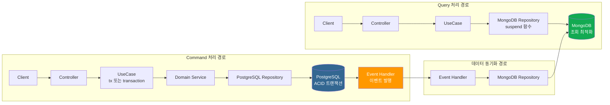
```mermaid
graph LR
    subgraph "Command 처리 경로"
        C1[Client] --> C2[Controller]
        C2 --> C3[UseCase<br/>tx 또는 transaction]
        C3 --> C4[Domain Service]
        C4 --> C5[PostgreSQL Repository]
        C5 --> C6[(PostgreSQL<br/>ACID 트랜잭션)]
        C6 --> C7[Event Handler<br/>이벤트 발행]
    end

    subgraph "Query 처리 경로"
        Q1[Client] --> Q2[Controller]
        Q2 --> Q3[UseCase]
        Q3 --> Q4[MongoDB Repository<br/>suspend 함수]
        Q4 --> Q5[(MongoDB<br/>조회 최적화)]
    end

    subgraph "데이터 동기화 경로"
        C7 --> E1[Event Handler]
        E1 --> E2[MongoDB Repository]
        E2 --> Q5
    end

    style C6 fill:#336791,color:#fff
    style Q5 fill:#13aa52,color:#fff
    style C7 fill:#ff9800,color:#fff
```

---

### 5.4 데이터 동기화 전략

#### 5.4.1 이벤트 기반 동기화 방식

AMS는 **도메인 이벤트를 통한 비동기 데이터 동기화**를 사용합니다.

**동기화 원칙:**
- **이벤트 발행**: Command 처리 완료 후 도메인 이벤트 발행
- **비동기 처리**: 이벤트 처리가 Command 응답 시간에 영향을 주지 않음
- **최종 일관성**: PostgreSQL과 MongoDB 간 최종 일관성(Eventual Consistency) 모델

##### 도메인 이벤트 발행 시점

AMS는 **트랜잭션 커밋 완료 후 비동기로 이벤트를 발행**합니다.

**발행 전략:**
- **트랜잭션 커밋 후 발행**: PostgreSQL 트랜잭션이 성공적으로 커밋된 후에 이벤트 발행
- **비동기 처리**: 이벤트 발행과 처리를 비동기로 수행하여 Command 응답 시간에 영향 없음

이 방식은 트랜잭션이 롤백된 경우 이벤트가 발행되지 않아 데이터 일관성을 보장합니다.

##### 이벤트 핸들러 역할

이벤트 핸들러는 발행된 도메인 이벤트를 수신하여 다음과 같은 작업을 수행합니다:

1. **MongoDB 동기화 핸들러**
   - PostgreSQL에 저장된 데이터를 MongoDB에 조회용 데이터로 저장
   - 조회 최적화된 데이터 구조로 변환
   - 비동기로 MongoDB에 데이터 저장

2. **알림 발송 핸들러**
   - 출석 확인 등의 이벤트 발생 시 알림 발송
   - 비동기로 외부 알림 서비스 호출

3. **통계 업데이트 핸들러**
   - 데이터 변경 시 통계 데이터 업데이트
   - 비동기로 통계 데이터 계산 및 저장

##### 비동기 처리 방식

- **이벤트 발행**: Command 처리 완료 후 내부 Application Event Publisher를 통해 이벤트 발행
- **내부 처리**: 내부 이벤트 퍼블리셔를 사용하여 이벤트 발행 및 핸들러 호출
- **비동기 처리**: 이벤트 핸들러는 별도의 스레드에서 비동기로 처리
- **Non-Blocking**: 이벤트 처리가 Command 응답에 영향을 주지 않음

##### 서드파티 메시지 큐 도입 예정

AMS는 현재 내부 Application Event Publisher를 사용하고 있으며, 향후 확장성을 위해 서드파티 메시지 큐 도입을 예정하고 있습니다.

**도입 예정 이유:**
- **분산 처리**: 여러 인스턴스 간 이벤트 공유 및 처리 분산
- **메시지 영속성**: 메시지 손실 방지 및 재처리 지원
- **확장성**: 이벤트 처리 부하 분산 및 수평 확장 용이
- **모니터링**: 메시지 큐 레벨에서 이벤트 처리 현황 모니터링 가능

**검토 중인 기술:**
- **Kafka**: 대용량 이벤트 스트림 처리 및 고성능 이벤트 브로커
- **RabbitMQ**: 유연한 메시징 패턴 지원 및 관리 도구 제공

#### 5.4.2 동기화 프로세스

##### 데이터 동기화 단계

```
1. PostgreSQL 저장 완료
   ↓
2. 도메인 이벤트 발행 (MemberCreated, MemberUpdated 등)
   ↓
3. 이벤트 핸들러가 이벤트 수신
   ↓
4. PostgreSQL 데이터 조회 (필요 시)
   ↓
5. 조회 최적화된 데이터 구조로 변환
   ↓
6. MongoDB에 비동기로 저장
   ↓
7. 동기화 완료
```

##### 동기화 프로세스 상세

1. **PostgreSQL 저장 완료**
   - Command 처리가 완료되어 PostgreSQL에 데이터가 저장됨
   - 트랜잭션이 커밋되어 데이터가 영구 저장됨

2. **도메인 이벤트 발행**
   - 이벤트 발행 (예: `MemberCreated`, `MemberUpdated`)
   - 이벤트에는 변경된 데이터 정보 포함

3. **이벤트 핸들러가 이벤트 수신**
   - `MongoDBSyncHandler`가 이벤트 수신
   - 이벤트 타입에 따라 적절한 동기화 로직 실행

4. **조회 최적화된 데이터 구조로 변환**
   - PostgreSQL의 정규화된 스키마를 MongoDB의 비정규화된 스키마로 변환
   - 조회 시 JOIN 없이 빠르게 조회할 수 있도록 데이터 구조 최적화
   - 관련 데이터를 포함하여 단일 문서로 저장

5. **MongoDB에 비동기로 저장**
   - MongoDB Kotlin Driver를 통한 비동기 데이터 저장
   - Coroutine의 `suspend` 함수를 활용한 Non-Blocking 저장

6. **동기화 완료**
   - MongoDB에 조회용 데이터가 저장되어 이후 조회 요청에 사용 가능

##### 조회용 데이터 구조 변환 예시

**PostgreSQL 구조 (정규화):**
```
STUDENTS 테이블
- id, name, mobile_number, school, grade, status

SCHOOLS 테이블  
- id, name, address

관계: STUDENTS.school_id → SCHOOLS.id
```

**MongoDB 구조 (비정규화):**
```json
{
  "_id": "student_1",
  "name": "홍길동",
  "mobileNumber": "010-1234-5678",
  "school": {
    "id": 1,
    "name": "서울초등학교",
    "address": "서울시..."
  },
  "grade": "3",
  "status": "ACTIVE"
}
```

**변환 이유:**
- 조회 시 JOIN 없이 빠른 조회
- 관련 데이터를 함께 조회하여 네트워크 왕복 최소화
- 조회 성능 최적화

#### 5.4.3 동기화 특징

##### 비동기 처리 (Non-Blocking)

- **Command 응답 시간에 영향 없음**: 이벤트 처리가 비동기로 진행되어 Command 응답이 지연되지 않음
- **높은 처리량**: 여러 이벤트를 동시에 처리 가능
- **리소스 효율성**: 이벤트 처리가 메인 스레드를 블로킹하지 않음

##### 최종 일관성 (Eventual Consistency)

- **일시적 불일치 허용**: PostgreSQL과 MongoDB 간 짧은 시간 동안 데이터 불일치가 발생할 수 있음
- **최종적으로 일관됨**: 이벤트 처리가 완료되면 최종적으로 데이터가 일치함
- **비즈니스 요구사항 반영**: 조회 작업에서 약간의 지연이 허용되는 경우 최종 일관성 모델 채택

**일관성 보장 시점:**
- **PostgreSQL**: 즉시 일관성 (트랜잭션 커밋 즉시)
- **PostgreSQL → MongoDB**: 최종 일관성 (이벤트 처리 완료 후, 보통 수백 밀리초 이내)

##### 오류 처리 및 재시도 전략

AMS는 이벤트 처리 실패 시 재시도 가능한 구조를 통해 데이터 동기화를 보장합니다.

**실패 이벤트 저장:**
- **Failed Event Store**: 동기화 실패한 이벤트를 별도 저장소에 저장
- **이벤트 정보 저장**: 이벤트 타입, 페이로드, 실패 시간, 실패 사유, 재시도 횟수 등 저장
- **재시도 가능 상태 관리**: 재시도 가능/불가능 상태를 관리

**재시도 메커니즘:**
- **자동 재시도**: 일시적 오류(네트워크 오류, 일시적 DB 접근 불가 등)의 경우 자동 재시도
- **지수 백오프(Exponential Backoff)**: 재시도 간격을 점진적으로 증가시켜 부하 분산
- **최대 재시도 횟수**: 재시도 횟수 제한으로 무한 재시도 방지
- **재시도 스케줄러**: 주기적으로 실패한 이벤트를 재시도

**최종 실패 처리:**
- **수동 처리**: 최대 재시도 횟수를 초과한 경우 수동 처리 프로세스로 전환
- **알림 발송**: 최종 실패 시 운영자에게 알림 발송
- **수동 재시도**: 운영자가 실패 이벤트를 검토하고 수동으로 재시도 가능

#### 5.4.4 데이터 동기화 다이어그램

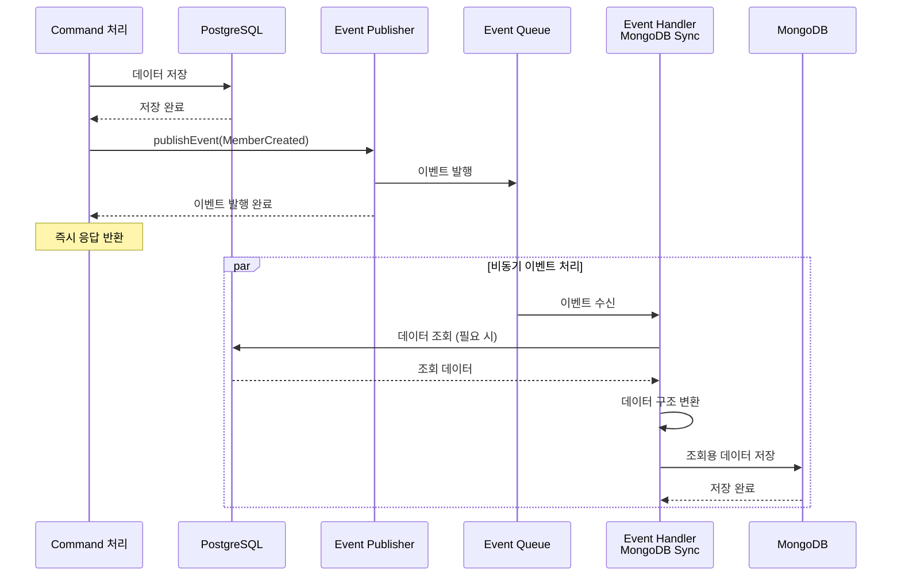
```mermaid
sequenceDiagram
    participant Command as Command 처리
    participant PostgreSQL as PostgreSQL
    participant EventPublisher as Event Publisher
    participant EventQueue as Event Queue
    participant EventHandler as Event Handler<br/>MongoDB Sync
    participant MongoDB as MongoDB

    Command->>PostgreSQL: 데이터 저장
    PostgreSQL-->>Command: 저장 완료
    Command->>EventPublisher: publishEvent(MemberCreated)
    EventPublisher->>EventQueue: 이벤트 발행
    EventPublisher-->>Command: 이벤트 발행 완료
    
    Note over Command: 즉시 응답 반환
    
    par 비동기 이벤트 처리
        EventQueue->>EventHandler: 이벤트 수신
        EventHandler->>PostgreSQL: 데이터 조회 (필요 시)
        PostgreSQL-->>EventHandler: 조회 데이터
        EventHandler->>EventHandler: 데이터 구조 변환
        EventHandler->>MongoDB: 조회용 데이터 저장
        MongoDB-->>EventHandler: 저장 완료
    end
```

---

### 5.5 트랜잭션 관리 방식

#### 5.5.1 PostgreSQL 트랜잭션 관리

##### Exposed 트랜잭션 관리

AMS는 **Kotlin Exposed의 트랜잭션 관리**를 사용합니다.

**트랜잭션 설정:**
- **트랜잭션 경계**: Exposed의 `transaction` 블록을 통한 트랜잭션 관리
- **Coroutine 트랜잭션**: `newSuspendedTransaction`을 통한 Coroutine 기반 비동기 트랜잭션 처리
- **커스텀 tx 함수**: `newSuspendedTransaction`을 래핑한 커스텀 `tx` 함수 활용
- **격리 수준**: 필요에 따라 격리 수준 설정 가능
- **롤백 정책**: 예외 발생 시 자동 롤백

**트랜잭션 적용 범위:**
- **UseCase 레이어**: UseCase 메서드 내에서 `tx` 함수 또는 `transaction` 블록 사용
- **트랜잭션 경계**: 트랜잭션 블록 시작부터 완료까지 하나의 트랜잭션으로 관리
- **도메인 서비스**: 트랜잭션 블록 내에서 실행

##### ACID 트랜잭션 보장

PostgreSQL은 ACID 트랜잭션을 완벽히 지원합니다:

- **Atomicity (원자성)**: 트랜잭션 내 모든 작업이 성공하거나 모두 롤백됨
- **Consistency (일관성)**: 트랜잭션 전후 데이터베이스가 항상 일관된 상태 유지
- **Isolation (격리성)**: 동시 실행되는 트랜잭션 간 간섭 방지
- **Durability (지속성)**: 커밋된 트랜잭션은 영구 저장됨

##### 트랜잭션 경계 관리

**트랜잭션 경계:**
- **시작**: UseCase 메서드 진입 시 트랜잭션 시작
- **종료**: UseCase 메서드 종료 시 트랜잭션 커밋 또는 롤백
- **예외 처리**: 런타임 예외 발생 시 자동 롤백

**트랜잭션 경계 관리 예시:**

```kotlin
// Exposed transaction 블록 사용 (동기)
fun createMember(dto: MemberDTO): Member {
    return transaction {
        // 트랜잭션 시작
        val member = domainService.validateAndCreate(dto)
        repository.save(member)
        // 트랜잭션 커밋 (정상 종료 시)
        // 또는 트랜잭션 롤백 (예외 발생 시)
        member
    }
}

// Exposed newSuspendedTransaction 사용 (비동기 - Coroutine)
suspend fun createMember(dto: MemberDTO): Member {
    return newSuspendedTransaction(Dispatchers.IO) {
        // 트랜잭션 시작
        val member = domainService.validateAndCreate(dto)
        repository.save(member)
        // 트랜잭션 커밋 (정상 종료 시)
        // 또는 트랜잭션 롤백 (예외 발생 시)
        member
    }
}

// 커스텀 tx 함수 사용 (비동기 - Coroutine)
suspend fun createMember(dto: MemberDTO): Member {
    return tx {
        // 트랜잭션 시작
        val member = domainService.validateAndCreate(dto)
        repository.save(member)
        // 트랜잭션 커밋 (정상 종료 시)
        // 또는 트랜잭션 롤백 (예외 발생 시)
        member
    }
}
```

##### Coroutine 기반 트랜잭션 처리

- **newSuspendedTransaction**: Exposed의 `newSuspendedTransaction`을 통한 Coroutine 기반 비동기 트랜잭션 처리
- **커스텀 tx 함수**: `newSuspendedTransaction`을 래핑한 `tx` 함수를 통한 간편한 트랜잭션 관리
- **Suspend 함수**: `suspend` 함수를 통한 Non-Blocking 비동기 트랜잭션 처리
- **Non-Blocking**: 트랜잭션 처리가 Non-Blocking 방식으로 동작
- **Dispatcher 설정**: `Dispatchers.IO`를 사용하여 I/O 작업에 최적화된 스레드 풀 활용

#### 5.5.2 분산 트랜잭션 처리 전략

##### 분산 트랜잭션 미사용 (단순 CQRS)

AMS는 **전통적인 분산 트랜잭션(2PC, 3PC)** 을 사용하지 않습니다.

**이유:**
1. **성능 저하**: 분산 트랜잭션은 성능 저하 및 지연 시간 증가를 야기할 수 있습니다
2. **복잡도 증가**: 분산 트랜잭션 구현은 시스템 복잡도를 크게 증가시킵니다
3. **가용성 문제**: 분산 트랜잭션은 시스템 가용성에 부정적 영향을 줄 수 있습니다
4. **CQRS 패턴**: CQRS 패턴 자체가 최종 일관성 모델을 전제로 합니다

##### 최종 일관성 모델 채택

AMS는 **최종 일관성(Eventual Consistency)** 모델을 채택합니다.

**최종 일관성 모델:**
- **PostgreSQL**: 즉시 일관성 (Immediate Consistency) - ACID 트랜잭션 보장
- **PostgreSQL → MongoDB**: 최종 일관성 (Eventual Consistency) - 이벤트 기반 비동기 동기화

**일관성 보장 시점:**
- **Command 처리**: PostgreSQL 저장 즉시 일관성 보장
- **Query 처리**: MongoDB 동기화 완료 후 일관성 보장 (보통 수백 밀리초 이내)

##### 이벤트 기반 보상 트랜잭션 (Saga 패턴 - 오케스트레이션)

AMS는 **Saga 패턴의 오케스트레이션(Orchestration) 패턴**을 적용합니다.

**Saga 패턴 - 오케스트레이션:**
- **정의**: 분산 트랜잭션을 여러 로컬 트랜잭션으로 나누어 처리하는 패턴
- **오케스트레이션 패턴**: 중앙 집중식 오케스트레이터가 트랜잭션 단계를 순차적으로 관리
- **보상 트랜잭션**: 각 단계별로 보상 트랜잭션을 정의하여 오류 시 이전 상태로 복구
- **이벤트 기반**: 도메인 이벤트를 통한 Saga 오케스트레이션

**Saga 오케스트레이터 역할:**
- **트랜잭션 단계 관리**: 분산 트랜잭션의 각 단계를 순차적으로 실행
- **상태 관리**: Saga 실행 상태(진행 중, 완료, 실패)를 추적 및 관리
- **보상 트랜잭션 실행**: 실패 발생 시 이미 실행된 단계의 보상 트랜잭션을 역순으로 실행
- **이벤트 발행**: 각 단계 완료 및 Saga 완료/실패 이벤트 발행

**보상 트랜잭션 처리:**
- **역순 보상**: 실패 발생 시 완료된 단계를 역순으로 보상 트랜잭션 실행
- **멱등성 보장**: 보상 트랜잭션은 멱등성을 보장하여 중복 실행 시 안전하게 처리
- **최종 실패 처리**: 보상 트랜잭션도 실패하는 경우 수동 처리 프로세스로 전환

#### 5.5.3 트랜잭션 일관성 보장

##### PostgreSQL: 즉시 일관성 (ACID)

- **트랜잭션 커밋**: 트랜잭션 커밋 즉시 데이터 일관성 보장
- **ACID 보장**: Atomicity, Consistency, Isolation, Durability 모두 보장
- **동시성 제어**: 트랜잭션 격리 수준을 통한 동시성 제어

##### PostgreSQL → MongoDB: 최종 일관성 (Eventual Consistency)

- **비동기 동기화**: 이벤트 기반 비동기 동기화로 인한 일시적 불일치 허용
- **동기화 완료 시점**: 이벤트 처리 완료 후 최종 일관성 보장
- **일관성 지연**: 보통 수백 밀리초 이내에 일관성 보장

##### 동기화 지연 처리 방안

**동기화 지연 대응 전략:**

1. **최신 데이터 조회 요청 시**
   - 필요 시 PostgreSQL에서 직접 조회
   - 읽기 부하 분산을 위해 최소한의 경우만 적용

2. **이벤트 처리 모니터링**
   - 이벤트 처리 지연 모니터링
   - 지연 발생 시 알림 및 대응

3. **재시도 메커니즘**
   - 이벤트 처리 실패 시 자동 재시도
   - 재시도 후에도 실패 시 수동 처리 프로세스 실행

#### 5.5.4 트랜잭션 처리 다이어그램

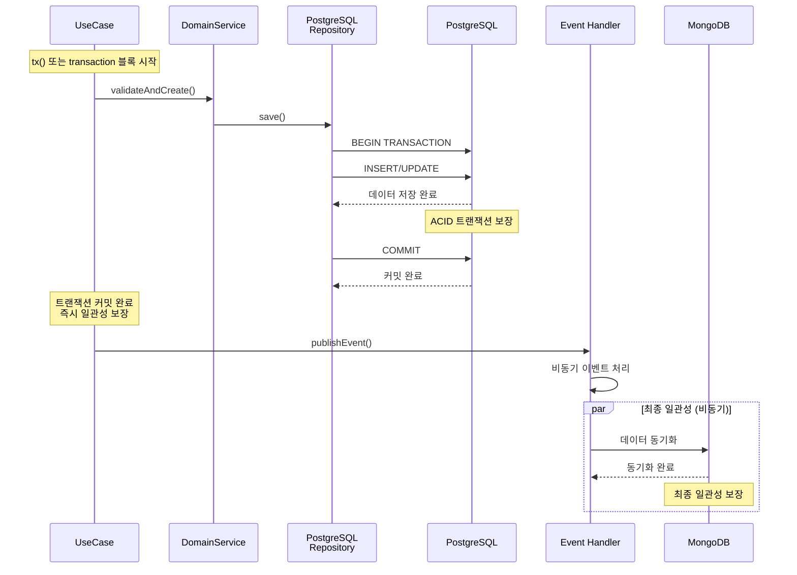
```mermaid
sequenceDiagram
    participant UseCase
    participant DomainService
    participant PGRepo as PostgreSQL<br/>Repository
    participant PostgreSQL
    participant EventHandler as Event Handler
    participant MongoDB as MongoDB

    Note over UseCase: tx() 또는 transaction 블록 시작
    UseCase->>DomainService: validateAndCreate()
    DomainService->>PGRepo: save()
    PGRepo->>PostgreSQL: BEGIN TRANSACTION
    PGRepo->>PostgreSQL: INSERT/UPDATE
    PostgreSQL-->>PGRepo: 데이터 저장 완료
    
    Note over PostgreSQL: ACID 트랜잭션 보장
    PGRepo->>PostgreSQL: COMMIT
    PostgreSQL-->>PGRepo: 커밋 완료
    
    Note over UseCase: 트랜잭션 커밋 완료<br/>즉시 일관성 보장
    UseCase->>EventHandler: publishEvent()
    EventHandler->>EventHandler: 비동기 이벤트 처리
    
    par 최종 일관성 (비동기)
        EventHandler->>MongoDB: 데이터 동기화
        MongoDB-->>EventHandler: 동기화 완료
        Note over MongoDB: 최종 일관성 보장
    end
```

---

### 5.6 데이터 모델 설계

#### 5.6.1 PostgreSQL 데이터 모델

##### 정규화된 관계형 스키마

PostgreSQL은 **정규화된 관계형 스키마**를 사용합니다.

**스키마 특징:**
- **정규화**: 데이터 중복 최소화를 위한 정규화 적용
- **관계형 구조**: 테이블 간 외래키를 통한 관계 정의
- **제약조건**: 데이터 무결성을 위한 제약조건 설정

**주요 테이블 구조:**
- **MEMBERS**: 회원 정보 테이블 (모든 회원 유형의 공통 정보 통합)
- **MEMBER_ROLES**: 회원 역할 정보 테이블 (학생, 학부모, 강사, 운영 관리자, 슈퍼 관리자)
- **STUDENT_INFO**: 학생 특화 정보 테이블 (학교, 학년 등)
- **TEACHER_INFO**: 강사 특화 정보 테이블 (전문 분야, 경력, 승인 상태 등)
- **MANAGER_INFO**: 관리자 특화 정보 테이블 (권한 레벨, 담당 학원, 권한 범위 등)
- **CLASSES**: 수업 정보 테이블
- **CLASS_SCHEDULES**: 수업 일정 테이블
- **ATTENDANCE**: 출석 정보 테이블

**관계 구조:**
```
MEMBERS (1) ←→ (N) MEMBER_ROLES
MEMBERS (1) ←→ (0..1) STUDENT_INFO (학생 역할인 경우)
MEMBERS (1) ←→ (0..1) TEACHER_INFO (강사 역할인 경우)
MEMBERS (1) ←→ (0..1) MANAGER_INFO (관리자 역할인 경우)
MEMBERS (1) ←→ (N) CLASSES (강사 역할인 경우)
MEMBERS (1) ←→ (N) ATTENDANCE (학생 역할인 경우)
CLASSES (1) ←→ (N) CLASS_SCHEDULES
CLASSES (1) ←→ (N) ATTENDANCE
```

**회원 도메인 중심 설계의 장점:**
- **데이터 중복 최소화**: 공통 회원 정보를 MEMBERS 테이블에 통합하여 데이터 중복 최소화
- **일관성 보장**: 모든 회원 유형에 대해 동일한 관리 기준 적용
- **확장성**: 새로운 회원 유형 추가 시 유연한 구조 제공
- **역할 기반 접근 제어**: MEMBER_ROLES와 연계하여 RBAC 지원
- **역할별 특화 정보 분리**: 각 역할의 특화 정보를 별도 테이블로 관리하여 구조 명확화

##### 트랜잭션 보장을 위한 구조

- **ACID 트랜잭션**: 복잡한 비즈니스 로직을 트랜잭션으로 묶어 처리
- **데이터 무결성**: 외래키 제약조건을 통한 참조 무결성 보장
- **일관성**: 트랜잭션을 통한 즉시 일관성 보장

##### 데이터 무결성 제약 조건

- **기본키(Primary Key)**: 각 테이블의 고유 식별자
- **외래키(Foreign Key)**: 테이블 간 관계 및 참조 무결성 보장
- **UNIQUE 제약조건**: 중복 방지를 위한 제약조건
- **CHECK 제약조건**: 데이터 값 유효성 검증
- **NOT NULL 제약조건**: 필수 데이터 보장

#### 5.6.2 MongoDB 데이터 모델

##### 조회 최적화된 문서 스키마

MongoDB는 **조회 최적화된 문서 스키마**를 사용합니다.

**스키마 특징:**
- **비정규화**: 조회 시 JOIN 없이 빠른 조회를 위한 비정규화 구조
- **문서 기반**: 관련 데이터를 하나의 문서에 포함
- **유연한 스키마**: 조회 요구사항에 맞게 유연하게 스키마 변경 가능

**주요 컬렉션 구조:**
- **members**: 회원 정보 (Student, Teacher 등 포함)
- **classes**: 수업 정보 (강사 정보 포함)
- **attendances**: 출석 정보 (학생, 수업 정보 포함)
- **statistics**: 통계 데이터 (집계된 데이터)

**비정규화 구조 예시:**
```json
{
  "_id": "class_1",
  "name": "독서 토론 수업",
  "teacher": {
    "id": 1,
    "name": "김선생",
    "mobileNumber": "010-1111-2222"
  },
  "schedules": [
    {"dayOfWeek": "MON", "time": "14:00"},
    {"dayOfWeek": "TUE", "time": "15:00"}
  ],
  "students": [
    {"id": 1, "name": "홍길동"},
    {"id": 2, "name": "김철수"}
  ]
}
```

##### 비정규화된 구조

- **관련 데이터 포함**: 조회 시 자주 함께 조회되는 데이터를 하나의 문서에 포함
- **JOIN 최소화**: JOIN 없이 단일 쿼리로 필요한 데이터 조회
- **조회 성능 향상**: 네트워크 왕복 최소화 및 빠른 조회 성능

##### 읽기 성능 최적화

- **인덱스 활용**: 자주 사용되는 조회 조건에 인덱스 생성
- **집계 파이프라인**: 복잡한 집계 쿼리를 파이프라인으로 최적화
- **조회 최적화된 구조**: 조회 패턴에 맞게 데이터 구조 설계

#### 5.6.3 데이터 모델 차이점 및 변환

##### PostgreSQL 스키마 → MongoDB 스키마 변환

**변환 원칙:**
- **정규화 → 비정규화**: 정규화된 관계형 스키마를 비정규화된 문서 스키마로 변환
- **관계 포함**: 외래키 관계를 중첩 문서로 변환
- **조회 최적화**: 조회 패턴에 맞게 데이터 구조 최적화

**변환 예시:**

**PostgreSQL 구조 (정규화):**
```sql
STUDENTS 테이블
- id, name, mobile_number, school_id, grade, status

SCHOOLS 테이블
- id, name, address
```

**MongoDB 구조 (비정규화):**
```json
{
  "_id": "student_1",
  "name": "홍길동",
  "mobileNumber": "010-1234-5678",
  "school": {
    "id": 1,
    "name": "서울초등학교",
    "address": "서울시 강남구..."
  },
  "grade": "3",
  "status": "ACTIVE"
}
```

##### 조회 최적화를 위한 데이터 구조 변경

**최적화 전략:**
- **자주 함께 조회되는 데이터 결합**: 하나의 문서에 포함하여 JOIN 없이 조회
- **집계 데이터 사전 계산**: 통계 등 집계 데이터를 사전에 계산하여 저장
- **조회 패턴 반영**: 실제 조회 패턴에 맞게 데이터 구조 설계

##### 동기화 시 데이터 변환 로직

**변환 프로세스:**

```
PostgreSQL 데이터 조회
  ↓
도메인 모델로 변환
  ↓
조회 최적화된 구조로 변환
  ↓
MongoDB 문서 구조로 변환
  ↓
MongoDB 저장
```

**변환 로직 위치:**
- **이벤트 핸들러**: `MongoDBSyncHandler`에서 데이터 변환 로직 실행
- **Mapper 클래스**: 데이터 변환을 위한 Mapper 클래스 활용
- **도메인 모델 활용**: 도메인 모델을 통한 안전한 변환

---

### 5.7 데이터 아키텍처 다이어그램

#### 전체 데이터 흐름 다이어그램

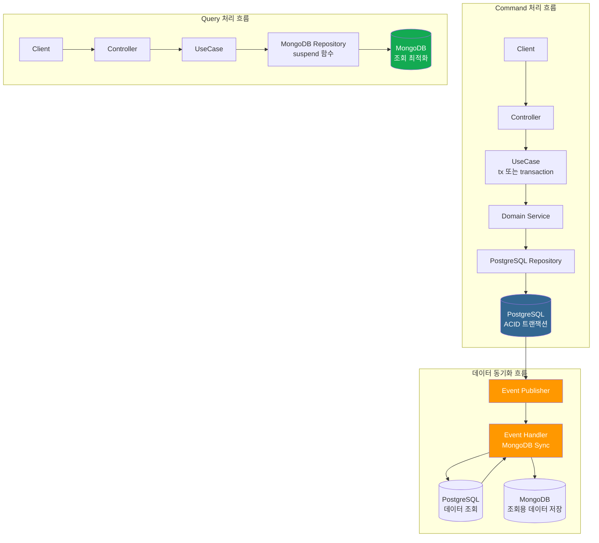
```mermaid
graph TB
    subgraph "Command 처리 흐름"
        C1[Client]
        C2[Controller]
        C3[UseCase<br/>tx 또는 transaction]
        C4[Domain Service]
        C5[PostgreSQL Repository]
        C6[(PostgreSQL<br/>ACID 트랜잭션)]
        
        C1 --> C2
        C2 --> C3
        C3 --> C4
        C4 --> C5
        C5 --> C6
    end

    subgraph "Query 처리 흐름"
        Q1[Client]
        Q2[Controller]
        Q3[UseCase]
        Q4[MongoDB Repository<br/>suspend 함수]
        Q5[(MongoDB<br/>조회 최적화)]
        
        Q1 --> Q2
        Q2 --> Q3
        Q3 --> Q4
        Q4 --> Q5
    end

    subgraph "데이터 동기화 흐름"
        E1[Event Publisher]
        E2[Event Handler<br/>MongoDB Sync]
        E3[(PostgreSQL<br/>데이터 조회)]
        E4[(MongoDB<br/>조회용 데이터 저장)]
        
        C6 --> E1
        E1 --> E2
        E2 --> E3
        E3 --> E2
        E2 --> E4
    end

    style C6 fill:#336791,color:#fff
    style Q5 fill:#13aa52,color:#fff
    style E1 fill:#ff9800,color:#fff
    style E2 fill:#ff9800,color:#fff
```

#### 데이터 아키텍처 요약

AMS의 데이터 아키텍처는 다음과 같이 구성됩니다:

1. **Command 처리**: PostgreSQL을 통한 트랜잭션 보장된 데이터 쓰기
2. **Query 처리**: MongoDB를 통한 빠른 조회 성능 제공
3. **데이터 동기화**: 이벤트 기반 비동기 동기화로 최종 일관성 보장
4. **트랜잭션 관리**: Exposed 트랜잭션 관리를 통한 ACID 보장
5. **데이터 모델**: 각 데이터베이스 특성에 맞는 최적화된 스키마 설계

---

## 6. 비동기 처리 전략

### 6.1 Coroutine 사용 영역 및 사용 이유

#### Coroutine 선택 이유

AMS는 **Kotlin Coroutine**을 비동기 처리의 핵심 기술로 사용합니다.

**주요 선택 이유:**
- **경량 스레드**: 기존 스레드보다 훨씬 가벼운 동시성 처리로 리소스 효율성 향상
- **Non-Blocking I/O**: I/O 대기 중에도 다른 작업을 처리하여 높은 처리량 확보
- **Structured Concurrency**: 안전한 동시성 처리 보장 및 리소스 누수 방지
- **직관적인 코드**: `suspend` 함수를 통한 동기 코드처럼 보이는 비동기 코드 작성

#### Coroutine 사용 영역

**1. 비즈니스 로직 처리**
- **UseCase 레이어**: `suspend` 함수를 통한 비동기 비즈니스 로직 처리
- **Domain Service**: 도메인 로직의 비동기 실행
- **트랜잭션 관리**: Exposed의 `newSuspendedTransaction`을 통한 비동기 트랜잭션 처리

**2. 데이터베이스 접근**
- **PostgreSQL**: Exposed의 `newSuspendedTransaction` 및 커스텀 `tx` 함수를 통한 Non-Blocking 트랜잭션 처리
- **MongoDB**: MongoDB Kotlin Driver의 `suspend` 함수를 통한 Non-Blocking 쿼리 처리
- **동시성**: 여러 데이터베이스 작업을 동시에 처리 가능

**3. 이벤트 핸들러 처리**
- **이벤트 핸들러**: 도메인 이벤트를 비동기로 처리
- **MongoDB 동기화**: PostgreSQL 데이터를 MongoDB로 비동기 동기화
- **알림 발송**: 외부 알림 서비스 호출을 비동기로 처리

#### Coroutine 주요 특징

**경량 스레드**
- 기존 스레드와 달리 수천 개의 코루틴을 생성해도 오버헤드가 적음
- 스레드 풀을 효율적으로 활용하여 높은 동시성 처리 가능

**Non-Blocking I/O**
- I/O 작업 대기 중에도 다른 코루틴이 실행되어 스레드 블로킹 방지
- 단일 스레드에서도 여러 작업을 동시에 처리 가능

**Suspend 함수**
- 비동기 코드를 동기 코드처럼 작성하여 가독성 향상
- 예외 처리와 제어 흐름이 직관적

**Structured Concurrency**
- 코루틴 스코프를 통해 안전한 동시성 처리 보장
- 부모 코루틴이 취소되면 자식 코루틴도 자동 취소되어 리소스 누수 방지

### 6.2 Application 내부 Thread 처리 방식

#### Coroutine 기반 Non-Blocking 처리

AMS는 **Coroutine 기반 Non-Blocking 처리**를 통해 Application 내부의 모든 작업을 처리합니다.

**처리 방식:**
- 모든 비즈니스 로직과 데이터베이스 접근을 `suspend` 함수로 구현
- 스레드 블로킹 없이 I/O 작업 처리
- 높은 동시성과 처리량 확보

#### Dispatcher 활용

**Dispatchers.IO**
- **사용 목적**: I/O 작업(데이터베이스 접근, 파일 입출력) 처리
- **사용 영역**: 
  - Exposed 트랜잭션 처리 (`tx` 함수)
  - MongoDB 쿼리 처리
  - 외부 서비스 호출 (HTTP 클라이언트)

**Dispatchers.Default**
- **사용 목적**: CPU 집약적인 작업 처리
- **사용 영역**:
  - 복잡한 계산 작업
  - 데이터 변환 작업
  - 정렬 및 집계 처리

**커스텀 Dispatcher**
- 필요에 따라 커스텀 Dispatcher를 생성하여 특정 작업에 최적화된 스레드 풀 활용

#### Exposed 트랜잭션 처리

**newSuspendedTransaction 사용**
- Exposed의 `newSuspendedTransaction`을 직접 사용하여 Coroutine 기반 비동기 트랜잭션 처리
- `Dispatchers.IO`를 명시적으로 지정하여 I/O 작업에 최적화

**커스텀 tx 함수 활용**
```kotlin
// 커스텀 tx 함수 정의
suspend inline fun <T> tx(crossinline block: suspend () -> T): T =
    newSuspendedTransaction(Dispatchers.IO) { block() }

// UseCase에서 사용 예시
suspend fun createMember(dto: MemberDTO): MemberDTO {
    val saved = tx { 
        studentSaveService.save(student = prepared) 
    }
    return studentMapper.domainToDTO(domain = saved)
}
```

**장점:**
- 간편한 트랜잭션 관리
- Dispatcher 설정을 중앙에서 관리
- 코드 재사용성 향상

#### 처리 흐름

**비동기 처리 흐름:**
```
HTTP Request
  ↓
Controller (suspend 함수)
  ↓
UseCase (suspend 함수)
  ↓
tx { ... } (Dispatchers.IO)
  ↓
Domain Service (suspend 함수)
  ↓
Repository (suspend 함수)
  ↓
PostgreSQL/MongoDB (Non-Blocking I/O)
  ↓
응답 반환 (Non-Blocking)
```

**Non-Blocking 처리 특징:**
- 스레드가 블로킹되지 않아 다른 요청 동시 처리 가능
- 높은 동시성과 처리량 확보
- 시스템 리소스 효율적 활용

### 6.3 Application 외부 연동 방식

#### Async + Non-Blocking 패턴

AMS는 **Async + Non-Blocking 패턴**을 통해 외부 시스템과 연동합니다.

**처리 원칙:**
- 외부 API 호출은 비동기로 처리
- 응답 대기 중에도 다른 작업 처리 가능
- Non-Blocking I/O를 통한 높은 동시성 확보

#### 외부 연동 사례

**1. 휴대폰 인증 서비스 연동**
- **목적**: 회원 가입 및 로그인 시 휴대폰 인증 코드 발급 및 검증
- **처리 방식**: HTTP 클라이언트를 통한 비동기 API 호출
- **특징**: 
  - Non-Blocking I/O로 여러 인증 요청 동시 처리
  - 타임아웃 및 재시도 전략 적용

**2. 알림 발송 서비스 연동**
- **목적**: 출석 확인, 이벤트 발생 시 알림 발송
- **처리 방식**: HTTP 클라이언트를 통한 비동기 API 호출
- **특징**:
  - 이벤트 핸들러에서 비동기로 처리
  - Command 응답 시간에 영향 없음
  - 실패 시 재시도 메커니즘 적용

#### HTTP 클라이언트 사용

**Spring WebClient 또는 Ktor Client**
- **Spring WebClient**: Spring 생태계와의 통합 용이
- **Ktor Client**: Kotlin Coroutine 네이티브 지원
- **선택 기준**: 프로젝트 요구사항 및 팀 선호도

**Non-Blocking HTTP 호출**
```kotlin
// 예시: 알림 발송 서비스 호출
suspend fun sendNotification(event: NotificationEvent) {
    webClient.post()
        .uri("/api/notifications")
        .bodyValue(event)
        .awaitExchange()
        .awaitBody<String>()
}
```

**장점:**
- 스레드 블로킹 없이 외부 API 호출
- 높은 동시성 확보
- 리소스 효율적 활용

#### 타임아웃 및 재시도 전략

**타임아웃 설정**
- **연결 타임아웃**: 연결 설정 시간 제한
- **읽기 타임아웃**: 응답 대기 시간 제한
- **쓰기 타임아웃**: 요청 전송 시간 제한

**재시도 전략**
- **지수 백오프(Exponential Backoff)**: 재시도 간격을 점진적으로 증가
- **최대 재시도 횟수**: 무한 재시도 방지
- **재시도 조건**: 네트워크 오류, 타임아웃 등 일시적 오류에만 재시도

**처리 흐름:**
```
외부 서비스 호출 요청
  ↓
타임아웃 설정 확인
  ↓
비동기 HTTP 호출 (Non-Blocking)
  ↓
성공 → 결과 반환
실패 → 재시도 조건 확인
  ↓
재시도 가능 → 지수 백오프 적용 후 재시도
재시도 불가능 → 오류 처리
```

### 6.4 이벤트 처리 방식

#### 이벤트 기반 비동기 처리

AMS는 **이벤트 기반 비동기 처리**를 통해 시스템 구성 요소 간 느슨한 결합을 달성합니다.

**처리 원칙:**
- 도메인 이벤트를 통한 비동기 통신
- 이벤트 발행자와 수신자의 느슨한 결합
- Command 응답 시간에 영향 없는 이벤트 처리

#### 내부 Application Event Publisher 사용

**현재 구현:**
- Spring의 `ApplicationEventPublisher` 또는 커스텀 내부 이벤트 퍼블리셔 사용
- 동일 JVM 내에서 이벤트 발행 및 처리
- 단일 인스턴스 환경에서 효율적 동작

**이벤트 발행:**
- Command 처리 완료 후 트랜잭션 커밋 완료 시점에 이벤트 발행
- 트랜잭션 롤백 시 이벤트 미발행으로 데이터 일관성 보장

**이벤트 수신 및 처리:**
- 이벤트 핸들러가 비동기로 이벤트 수신
- 별도의 스레드에서 이벤트 처리
- Non-Blocking 처리로 다른 작업에 영향 없음

#### 이벤트 핸들러의 비동기 처리

**이벤트 핸들러 유형:**

**1. MongoDB 동기화 핸들러**
- **역할**: PostgreSQL 데이터를 MongoDB로 동기화
- **처리 방식**: Coroutine을 통한 비동기 처리
- **특징**: 조회 최적화된 데이터 구조로 변환 후 저장

**2. 알림 발송 핸들러**
- **역할**: 이벤트 발생 시 외부 알림 서비스 호출
- **처리 방식**: 비동기 HTTP 클라이언트를 통한 외부 서비스 호출
- **특징**: Command 응답 시간에 영향 없음

**3. 통계 업데이트 핸들러**
- **역할**: 데이터 변경 시 통계 데이터 업데이트
- **처리 방식**: 비동기로 통계 데이터 계산 및 저장
- **특징**: 배치 처리로 성능 최적화

**처리 흐름:**
```
Command 처리 완료
  ↓
트랜잭션 커밋 완료
  ↓
도메인 이벤트 발행 (MemberCreated 등)
  ↓
이벤트 퍼블리셔가 이벤트 전달
  ↓
이벤트 핸들러 비동기 수신 (Coroutine)
  ↓
이벤트 처리 (MongoDB 동기화, 알림 발송 등)
  ↓
처리 완료
```

#### 향후 서드파티 메시지 큐 도입 예정

**도입 예정 이유:**
- **분산 처리**: 여러 인스턴스 간 이벤트 공유 및 처리 분산
- **메시지 영속성**: 메시지 손실 방지 및 재처리 지원
- **확장성**: 이벤트 처리 부하 분산 및 수평 확장 용이
- **모니터링**: 메시지 큐 레벨에서 이벤트 처리 현황 모니터링 가능

**검토 중인 기술:**
- **Kafka**: 대용량 이벤트 스트림 처리 및 고성능 이벤트 브로커
- **RabbitMQ**: 유연한 메시징 패턴 지원 및 관리 도구 제공

### 6.5 알림 발송 인터페이스 설계

#### 알림 발송 인터페이스 설계 원칙

AMS는 **Hexagonal Architecture의 Outbound Port 패턴**을 따라 알림 발송 인터페이스를 설계합니다.

**설계 원칙:**
- **추상화**: 알림 발송 로직을 인터페이스로 추상화
- **느슨한 결합**: 외부 알림 서비스와의 느슨한 결합 유지
- **확장성**: 다양한 알림 채널 추가 용이
- **테스트 용이성**: Mock 객체를 통한 쉬운 테스트

#### 추상화된 인터페이스 구조

**Outbound Port (도메인 레이어)**
```kotlin
interface NotificationPort {
    suspend fun sendNotification(notification: Notification): Result<Unit>
}

// 도메인 모델
data class Notification(
    val recipient: String,
    val message: String,
    val channel: NotificationChannel
)

enum class NotificationChannel {
    KAKAO_TALK, SMS, PUSH
}
```

**Outbound Adapter (인프라스트럭처 레이어)**
```kotlin
@Component
class KakaoTalkNotificationAdapter(
    private val webClient: WebClient
) : NotificationPort {
    override suspend fun sendNotification(notification: Notification): Result<Unit> {
        // 카카오 알림톡 API 호출
    }
}
```

**장점:**
- 도메인 레이어가 외부 구현 세부사항에 의존하지 않음
- 알림 채널 추가 시 도메인 로직 변경 불필요
- 테스트 시 Mock 구현체로 대체 가능

#### 향후 지원 예정 채널

**1. 카카오 알림톡 (Kakao Talk)**
- **용도**: 비즈니스 메시지 발송
- **특징**: 템플릿 메시지 지원, 높은 도착률

**2. SMS**
- **용도**: 일반 문자 메시지 발송
- **특징**: 넓은 호환성, 실시간 발송

**3. PUSH 알림**
- **용도**: 모바일 앱 알림 발송
- **특징**: 실시간 푸시 알림, 사용자 참여율 향상

**확장 전략:**
- 각 채널별 Adapter 구현체를 별도로 개발
- Factory 패턴을 통한 적절한 Adapter 선택
- 설정 기반으로 채널 활성화/비활성화 관리

#### 비동기 처리 및 재시도 전략

**비동기 처리**
- 알림 발송은 이벤트 핸들러에서 비동기로 처리
- Command 응답 시간에 영향 없음
- Coroutine을 통한 Non-Blocking 처리

**재시도 전략**
- **지수 백오프**: 재시도 간격을 점진적으로 증가
- **최대 재시도 횟수**: 무한 재시도 방지
- **재시도 조건**: 네트워크 오류, 타임아웃 등 일시적 오류에만 재시도

**오류 처리**
- 최대 재시도 횟수 초과 시 Failed Event Store에 저장
- 운영자가 수동으로 재처리 가능
- 알림 실패에 대한 모니터링 및 알림

**처리 흐름:**
```
이벤트 발생 (출석 확인 등)
  ↓
알림 발송 핸들러 수신
  ↓
NotificationPort 구현체 선택
  ↓
비동기 알림 발송 (Coroutine)
  ↓
성공 → 처리 완료
실패 → 재시도 메커니즘 적용
  ↓
최대 재시도 횟수 초과 → Failed Event Store 저장
```

---

## 7. 보안 아키텍처

### 7.1 보안 아키텍처 개요

#### 보안 아키텍처 목표 및 원칙

AMS는 **다층 보안 아키텍처**를 통해 시스템과 사용자 데이터를 보호합니다.

**보안 아키텍처 목표:**
- **인증(Authentication)**: 사용자 신원 확인
- **인가(Authorization)**: 사용자 권한 기반 접근 제어
- **데이터 보호**: 민감 정보 암호화 및 안전한 전송
- **API 보안**: RESTful API에 대한 보안 정책 적용
- **공격 방어**: 일반적인 보안 위협에 대한 대응 방안

**보안 아키텍처 원칙:**
- **최소 권한 원칙**: 사용자는 필요한 최소한의 권한만 부여
- **방어적 프로그래밍**: 입력 검증 및 출력 필터링
- **보안 기본값**: 안전한 기본 설정 적용
- **심층 방어**: 여러 계층에서 보안 적용
- **명확한 책임 분리**: 인증과 인가의 명확한 분리

#### 보안 계층 구조

AMS의 보안은 다음과 같은 계층 구조로 구성됩니다:

**1. 네트워크 계층**
- HTTPS 통신을 통한 데이터 암호화
- CORS 정책을 통한 Origin 제한

**2. API Gateway 계층**
- Rate Limiting을 통한 DDoS 공격 방어
- 요청 검증 및 필터링

**3. 인증/인가 계층**
- 사용자 인증 (휴대폰 인증, 로그인)
- 토큰 기반 인증 (JWT)
- 역할 기반 접근 제어 (RBAC)

**4. 애플리케이션 계층**
- 입력 데이터 검증 및 Sanitization
- 비즈니스 로직 레벨 권한 검증
- 에러 응답 표준화

**5. 데이터 계층**
- 비밀번호 해싱 및 암호화
- 데이터베이스 접근 제어
- 민감 정보 마스킹

#### 보안 위협 및 대응 방안 개요

**주요 보안 위협:**

1. **인증 우회**
   - 위협: 잘못된 인증 정보로 시스템 접근 시도
   - 대응: 강력한 비밀번호 정책, 휴대폰 인증, JWT 토큰 검증

2. **권한 상승**
   - 위협: 낮은 권한 사용자가 높은 권한 기능 접근 시도
   - 대응: RBAC 기반 엄격한 권한 검증, 역할별 접근 제어

3. **SQL Injection**
   - 위협: 악의적인 SQL 쿼리 삽입
   - 대응: Exposed ORM 사용, 파라미터화된 쿼리, 입력 검증

4. **XSS (Cross-Site Scripting)**
   - 위협: 악의적인 스크립트 삽입
   - 대응: 입력 데이터 검증 및 Sanitization, 출력 인코딩

5. **CSRF (Cross-Site Request Forgery)**
   - 위협: 인증된 사용자 권한으로 악의적인 요청 실행
   - 대응: CORS 정책, CSRF 토큰 검증

6. **DDoS 공격**
   - 위협: 과도한 요청으로 서비스 중단
   - 대응: Rate Limiting, IP 기반 제한

7. **민감 정보 노출**
   - 위협: 비밀번호, 개인정보 등 민감 정보 유출
   - 대응: 비밀번호 해싱, 응답에서 민감 정보 제거, HTTPS 통신

---

### 7.2 인증/인가 전략

#### 7.2.1 인증 방식

##### 휴대폰 인증 (6자리 코드 발급 및 검증)

AMS는 회원 가입 및 로그인 시 **휴대폰 인증**을 통해 사용자 신원을 확인합니다.

**회원 가입 시 휴대폰 인증 프로세스:**

1. **인증 코드 발급 요청**
   - 사용자가 휴대폰 번호 입력
   - 외부 휴대폰 인증 서비스에 인증 코드 발급 요청
   - 6자리 랜덤 인증 코드 생성 및 SMS 발송

2. **인증 코드 검증**
   - 사용자가 받은 인증 코드 입력
   - 발급된 인증 코드와 입력된 코드 비교
   - 인증 성공 시 회원 가입 진행 가능 상태로 변경

**인증 코드 유효성 관리:**

- **만료 시간**: 인증 코드 발급 후 5분 이내 입력 필요
- **재시도 제한**: 동일 휴대폰 번호에 대해 1분당 최대 3회 발급 제한
- **일회성**: 인증 코드는 1회만 사용 가능
- **보안**: 인증 코드는 단방향 해싱하여 저장 (검증 시 비교)

**외부 휴대폰 인증 서비스 연동 방식:**

- **비동기 연동**: HTTP 클라이언트를 통한 비동기 API 호출
- **Non-Blocking 처리**: Coroutine 기반 Non-Blocking I/O
- **타임아웃 및 재시도**: 네트워크 오류 시 재시도 메커니즘 적용
- **에러 처리**: 인증 서비스 오류 시 사용자에게 명확한 에러 메시지 제공

**휴대폰 인증 프로세스 다이어그램:**

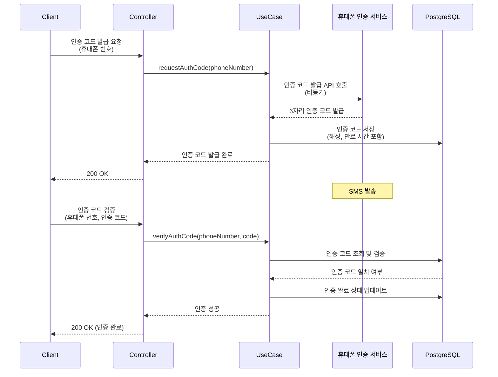
```mermaid
sequenceDiagram
    participant Client
    participant Controller
    participant UseCase
    participant AuthService as 휴대폰 인증 서비스
    participant DB as PostgreSQL

    Client->>Controller: 인증 코드 발급 요청<br/>(휴대폰 번호)
    Controller->>UseCase: requestAuthCode(phoneNumber)
    UseCase->>AuthService: 인증 코드 발급 API 호출<br/>(비동기)
    AuthService-->>UseCase: 6자리 인증 코드 발급
    UseCase->>DB: 인증 코드 저장<br/>(해싱, 만료 시간 포함)
    UseCase-->>Controller: 인증 코드 발급 완료
    Controller-->>Client: 200 OK
    
    Note over AuthService: SMS 발송
    
    Client->>Controller: 인증 코드 검증<br/>(휴대폰 번호, 인증 코드)
    Controller->>UseCase: verifyAuthCode(phoneNumber, code)
    UseCase->>DB: 인증 코드 조회 및 검증
    DB-->>UseCase: 인증 코드 일치 여부
    UseCase->>DB: 인증 완료 상태 업데이트
    UseCase-->>Controller: 인증 성공
    Controller-->>Client: 200 OK (인증 완료)
```

##### 로그인 방식

AMS는 두 가지 로그인 방식을 지원합니다:

**1. 로그인ID + 비밀번호 방식**

- 사용자가 가입 시 설정한 로그인ID와 비밀번호로 로그인
- 일반적인 로그인 방식으로 가장 널리 사용

**2. 휴대폰 인증 + 비밀번호 방식**

- 휴대폰 인증 코드 검증 후 비밀번호 입력
- 로그인ID를 기억하지 못한 사용자를 위한 대안
- 휴대폰 인증 완료 후 비밀번호 검증 진행

**비밀번호 저장 및 검증 전략:**

- **해싱 알고리즘**: BCrypt 또는 Argon2 사용
- **솔트(Salt)**: 각 비밀번호마다 고유한 솔트 생성
- **비밀번호 정책**: 
  - 최소 8자 이상
  - 영문, 숫자, 특수문자 조합 권장
  - 이전 비밀번호 재사용 제한
- **검증 방식**: 평문 비밀번호를 해싱하여 저장된 해시와 비교

**로그인 프로세스 다이어그램:**

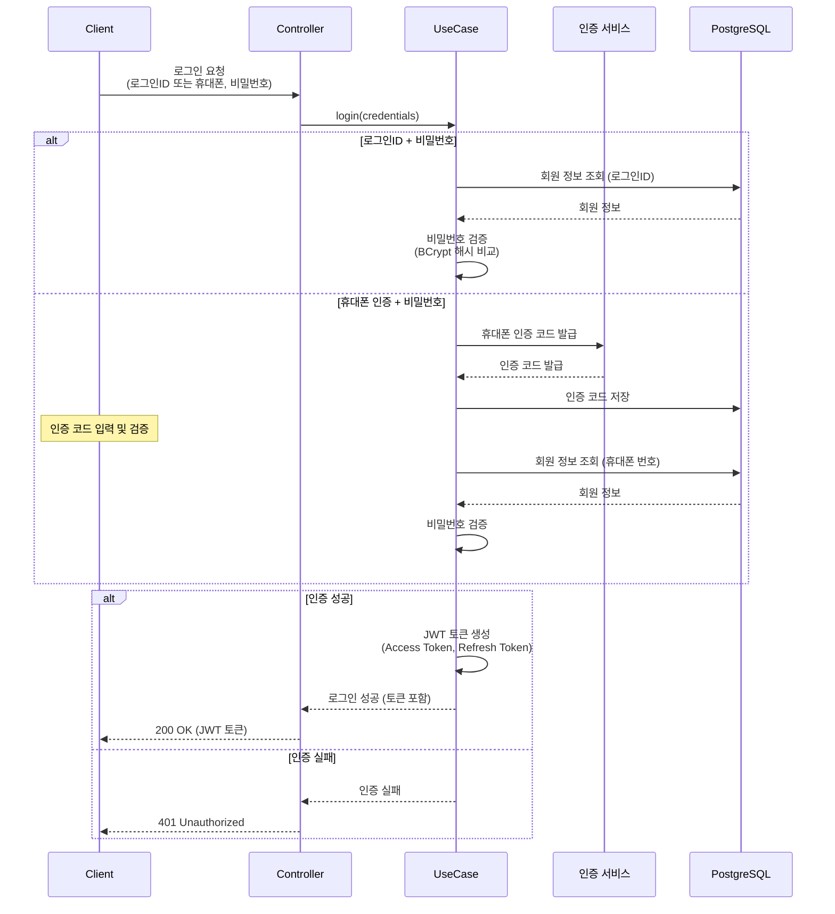
```mermaid
sequenceDiagram
    participant Client
    participant Controller
    participant UseCase
    participant AuthService as 인증 서비스
    participant DB as PostgreSQL

    Client->>Controller: 로그인 요청<br/>(로그인ID 또는 휴대폰, 비밀번호)
    Controller->>UseCase: login(credentials)
    
    alt 로그인ID + 비밀번호
        UseCase->>DB: 회원 정보 조회 (로그인ID)
        DB-->>UseCase: 회원 정보
        UseCase->>UseCase: 비밀번호 검증<br/>(BCrypt 해시 비교)
    else 휴대폰 인증 + 비밀번호
        UseCase->>AuthService: 휴대폰 인증 코드 발급
        AuthService-->>UseCase: 인증 코드 발급
        UseCase->>DB: 인증 코드 저장
        Note over Client: 인증 코드 입력 및 검증
        UseCase->>DB: 회원 정보 조회 (휴대폰 번호)
        DB-->>UseCase: 회원 정보
        UseCase->>UseCase: 비밀번호 검증
    end
    
    alt 인증 성공
        UseCase->>UseCase: JWT 토큰 생성<br/>(Access Token, Refresh Token)
        UseCase-->>Controller: 로그인 성공 (토큰 포함)
        Controller-->>Client: 200 OK (JWT 토큰)
    else 인증 실패
        UseCase-->>Controller: 인증 실패
        Controller-->>Client: 401 Unauthorized
    end
```

#### 7.2.2 인증 토큰 관리

##### JWT (JSON Web Token) 기반 인증 (권장)

AMS는 **JWT 기반 인증**을 권장합니다.

**JWT 선택 이유:**

- **Stateless**: 서버에 세션 저장 불필요, 확장성 우수
- **확장성**: 로드 밸런서 없이도 여러 서버 인스턴스에서 동일한 토큰 검증 가능
- **표준화**: RFC 7519 표준을 따르는 널리 사용되는 인증 방식
- **정보 포함**: 토큰 자체에 사용자 정보 및 역할 포함 가능
- **모바일 친화적**: 모바일 앱에서도 쉽게 사용 가능

**JWT 구조:**

JWT는 다음과 같은 구조로 구성됩니다:

- **Header**: 토큰 타입(JWT) 및 서명 알고리즘(HS256, RS256 등)
- **Payload**: 사용자 정보, 역할, 만료 시간 등 클레임(Claims)
- **Signature**: Header와 Payload를 기반으로 생성한 서명

**JWT Payload 설계:**

```kotlin
// JWT Payload 예시 구조
{
    "sub": "member_id",           // Subject (사용자 ID)
    "loginId": "user123",         // 로그인ID
    "roles": ["STUDENT"],         // 역할 목록
    "academyId": 123,             // 학원 ID (멀티 테넌트)
    "iat": 1234567890,            // Issued At (발급 시간)
    "exp": 1234571490,            // Expiration Time (만료 시간)
    "type": "ACCESS"              // 토큰 타입 (ACCESS 또는 REFRESH)
}
```

**Access Token 및 Refresh Token 전략:**

- **Access Token**: 
  - 짧은 만료 시간 (예: 15분 ~ 1시간)
  - API 요청 시 사용
  - HTTP Header에 포함하여 전송
  
- **Refresh Token**:
  - 긴 만료 시간 (예: 7일 ~ 30일)
  - Access Token 갱신 시 사용
  - 안전한 저장소에 저장 (예: HttpOnly Cookie)

**토큰 만료 및 갱신 처리:**

- **Access Token 만료**: 
  - API 요청 시 401 Unauthorized 응답
  - 클라이언트가 Refresh Token으로 새 Access Token 발급 요청

- **Refresh Token 만료**:
  - 재로그인 필요
  - Refresh Token 무효화 처리

- **토큰 갱신 프로세스**:
  - Refresh Token 검증
  - 새 Access Token 및 Refresh Token 발급
  - 기존 Refresh Token 무효화 (선택적)

**토큰 저장 및 전송 방식:**

- **Access Token**: 
  - HTTP Authorization Header에 포함: `Authorization: Bearer {token}`
  - 클라이언트 메모리 또는 안전한 저장소에 저장

- **Refresh Token**:
  - HttpOnly Cookie에 저장 (XSS 공격 방지)
  - 또는 안전한 클라이언트 저장소에 저장

##### 대안: 세션 기반 인증

**세션 기반 인증의 장단점:**

**장점:**
- **서버 제어**: 서버에서 세션을 즉시 무효화 가능
- **안전성**: 토큰 탈취 시에도 서버에서 즉시 차단 가능
- **단순성**: 구현이 상대적으로 단순

**단점:**
- **확장성 제한**: 서버 간 세션 공유 필요 (Redis 등 필요)
- **상태 유지**: 서버에 세션 상태 저장 필요
- **로드 밸런싱**: Sticky Session 또는 세션 공유 필요

**JWT vs 세션 기반 인증 비교:**

| 항목 | JWT | 세션 기반 |
|------|-----|----------|
| 상태 관리 | Stateless | Stateful |
| 확장성 | 높음 | 제한적 |
| 서버 리소스 | 낮음 | 높음 |
| 토큰 무효화 | 어려움 | 쉬움 |
| 모바일 지원 | 우수 | 양호 |

AMS는 **멀티 서버 & 멀티 인스턴스** 환경을 고려하여 **JWT 기반 인증**을 권장합니다.

#### 7.2.3 인가 전략

**인가(Authorization) 개념 및 역할:**

- **인증(Authentication)**: 사용자가 누구인지 확인 (로그인)
- **인가(Authorization)**: 사용자가 특정 기능에 접근할 권한이 있는지 확인

**인증과 인가의 분리:**

- **인증 레이어**: 사용자 신원 확인 (로그인, JWT 토큰 검증)
- **인가 레이어**: 사용자 권한 확인 (역할 기반 접근 제어)
- **명확한 분리**: 인증과 인가는 별도의 레이어에서 처리

**역할 기반 접근 제어(RBAC) 개요:**

- **역할(Role)**: 사용자의 권한을 그룹화한 개념
- **권한(Permission)**: 특정 기능에 대한 접근 권한
- **역할-권한 매핑**: 역할에 권한을 할당하여 관리
- **사용자-역할 매핑**: 사용자에게 역할을 할당

AMS는 **5가지 회원 역할**을 기반으로 RBAC를 구현합니다.

---

### 7.3 역할 기반 접근 제어 (RBAC)

#### 7.3.1 역할 정의

AMS는 다음과 같은 **5가지 회원 역할**을 정의합니다:

**1. 학생(Student)**
- 학원 수업을 수강하는 회원
- 기본적인 수업 정보 조회 및 출석 확인 요청 가능

**2. 학부모(Parent)**
- 학생의 수강 현황을 조회 및 관리하는 회원
- 학생과 1:N 관계로 연결
- 자녀의 수업 정보 및 출석 현황 조회 가능

**3. 강사(Teacher)**
- 학원 수업을 담당하는 회원
- 수업 정보 조회, 출석 확인 처리, 수업 평가 조회 가능
- 가입 시 운영 관리자 승인 필요

**4. 운영 관리자(Manager)**
- 학원의 전반적인 운영을 담당하는 회원
- 학생, 학부모, 강사 회원 생성 및 정보 수정/삭제 가능
- 강사 승인, 수업 생성 및 삭제 가능

**5. 슈퍼 관리자(Super Admin)**
- 전체 학원 시스템을 총괄 관리하는 회원
- 모든 기능 이용 가능
- 운영 관리자 회원 생성 가능

#### 7.3.2 역할별 권한 정의

##### 권한 매트릭스 테이블

| 기능 영역 | 기능 | 학생 | 학부모 | 강사 | 운영 관리자 | 슈퍼 관리자 |
|----------|------|:----:|:------:|:----:|:-----------:|:-----------:|
| **회원 관리** | | | | | | |
| | 회원 정보 조회 (본인) | ✓ | ✓ | ✓ | ✓ | ✓ |
| | 회원 정보 수정 (본인) | ✓ | ✓ | ✓ | ✓ | ✓ |
| | 회원 정보 삭제 (본인) | ✓ | ✓ | ✓ | ✓ | ✓ |
| | 학생 회원 생성 | | | | ✓ | ✓ |
| | 학부모 회원 생성 | | | | ✓ | ✓ |
| | 강사 회원 생성 | | | | ✓ | ✓ |
| | 운영 관리자 회원 생성 | | | | | ✓ |
| | 학생 정보 수정/삭제 | | | | ✓ | ✓ |
| | 학부모 정보 수정/삭제 | | | | ✓ | ✓ |
| | 강사 정보 수정/삭제 | | | | ✓ | ✓ |
| | 강사 승인 | | | | ✓ | ✓ |
| **수업 관리** | | | | | | |
| | 수업 정보 조회 | ✓ | ✓ | ✓ | ✓ | ✓ |
| | 수업 생성 | | | | ✓ | ✓ |
| | 수업 수정 | | | | ✓ | ✓ |
| | 수업 삭제 | | | | ✓ | ✓ |
| | 수업 일정 조회 | ✓ | ✓ | ✓ | ✓ | ✓ |
| | 수업 일정 생성 | | | | ✓ | ✓ |
| | 수업 일정 수정 | | | | ✓ | ✓ |
| | 수업 일정 삭제 | | | | ✓ | ✓ |
| **출석 관리** | | | | | | |
| | 출석 확인 요청 | ✓ | | | | |
| | 출석 확인 처리 | | | ✓ | ✓ | ✓ |
| | 출석 현황 조회 (본인) | ✓ | ✓ | ✓ | ✓ | ✓ |
| | 출석 현황 조회 (전체) | | | | ✓ | ✓ |
| **수업 평가** | | | | | | |
| | 평가 게시글 작성 | ✓ | ✓ | | | |
| | 평가 게시글 조회 | ✓ | ✓ | ✓ | ✓ | ✓ |
| | 평가 게시글 수정/삭제 | ✓ | ✓ | | ✓ | ✓ |
| **운영 관리** | | | | | | |
| | 수납 관리 | | | | ✓ | ✓ |
| | 영수증 발급 | | | | ✓ | ✓ |
| | 통계 조회 | | | | ✓ | ✓ |
| **시스템 관리** | | | | | | |
| | 학원 정보 관리 | | | | ✓ | ✓ |
| | 시스템 설정 관리 | | | | | ✓ |

**권한 표기:**
- ✓: 권한 있음
- (빈칸): 권한 없음

##### 세부 권한 설명

**학생(Student) 권한:**
- 수업 정보 조회: 자신이 수강하는 수업 정보 조회 가능
- 출석 확인 요청: 수업 출석 시 출석 확인 요청 가능
- 수업 평가 작성: 수강한 수업 및 강사에 대한 평가 게시글 작성 가능
- 본인 정보 관리: 자신의 회원 정보 조회, 수정, 삭제 가능
- 제한 사항: 수업 정보 관리 기능 제한

**학부모(Parent) 권한:**
- 자녀 수강 현황 조회: 연결된 학생의 수강 현황 및 출석 현황 조회 가능
- 수업 평가 작성: 자녀가 수강한 수업 및 강사에 대한 평가 게시글 작성 가능
- 본인 정보 관리: 자신의 회원 정보 조회, 수정, 삭제 가능
- 제한 사항: 수업 정보 관리 기능 제한

**강사(Teacher) 권한:**
- 수업 정보 조회: 자신이 담당하는 수업 정보 조회 가능
- 출석 확인 처리: 학생의 출석 확인 요청을 처리 가능
- 수업 평가 조회: 자신이 담당하는 수업에 대한 평가 게시글 조회 가능
- 본인 정보 관리: 자신의 회원 정보 조회, 수정, 삭제 가능
- 제한 사항: 수업 생성 및 삭제 기능 제한
- 특이 사항: 가입 시 운영 관리자 승인 필요

**운영 관리자(Manager) 권한:**
- 회원 관리: 학생, 학부모, 강사 회원 생성, 수정, 삭제 가능
- 강사 승인: 강사 가입 요청 승인 가능
- 수업 관리: 수업 생성, 수정, 삭제 가능
- 출석 관리: 출석 현황 전체 조회 가능
- 운영 관리: 수납 관리, 영수증 발급, 통계 조회 가능
- 학원 정보 관리: 학원 정보 조회, 수정 가능

**슈퍼 관리자(Super Admin) 권한:**
- 모든 기능 이용 가능: 모든 역할의 권한을 포함
- 운영 관리자 생성: 운영 관리자 회원 생성 가능
- 시스템 설정 관리: 시스템 전반의 설정 관리 가능

#### 7.3.3 권한 체크 구현 방식

##### 인터셉터/필터 기반 권한 체크

**HTTP 요청 인터셉터를 통한 권한 검증:**

- **인증 검증**: JWT 토큰 유효성 검증
- **역할 추출**: JWT Payload에서 사용자 역할 추출
- **엔드포인트 매핑**: 요청 엔드포인트와 필요한 권한 매핑
- **권한 검증**: 사용자 역할이 요청한 기능에 대한 권한이 있는지 확인

**JWT 토큰에서 역할 추출:**

```kotlin
// JWT Payload에서 역할 추출 예시
val payload = jwtTokenDecoder.decode(token)
val roles: List<String> = payload.claims["roles"] as List<String>
val memberId = payload.subject
```

**엔드포인트별 권한 매핑:**

```kotlin
// 엔드포인트 권한 매핑 예시
val endpointPermissions = mapOf(
    "POST /api/v1/member/student" to setOf("MANAGER", "SUPER_ADMIN"),
    "PUT /api/v1/member/student/{id}" to setOf("MANAGER", "SUPER_ADMIN"),
    "DELETE /api/v1/member/student/{id}" to setOf("MANAGER", "SUPER_ADMIN"),
    "POST /api/v1/class" to setOf("MANAGER", "SUPER_ADMIN"),
    "POST /api/v1/attendance/request" to setOf("STUDENT"),
    "PUT /api/v1/attendance/confirm/{id}" to setOf("TEACHER", "MANAGER", "SUPER_ADMIN")
)
```

##### 메서드 레벨 권한 체크

**어노테이션 기반 권한 체크:**

Spring Security의 `@PreAuthorize` 어노테이션을 활용한 메서드 레벨 권한 체크:

```kotlin
// UseCase 레이어에서의 권한 검증 예시
@Service
class StudentManagementUseCase(
    private val studentSaveService: StudentSaveService,
    private val currentUserService: CurrentUserService
) {
    @PreAuthorize("hasRole('MANAGER') or hasRole('SUPER_ADMIN')")
    suspend fun createStudent(dto: StudentDTO): StudentDTO {
        // 운영 관리자 또는 슈퍼 관리자만 접근 가능
    }
    
    @PreAuthorize("hasRole('STUDENT')")
    suspend fun requestAttendance(classId: Long): AttendanceRequestDTO {
        // 학생만 접근 가능
    }
}
```

**UseCase 레이어에서의 권한 검증:**

- **현재 사용자 정보**: JWT 토큰에서 추출한 사용자 정보 활용
- **역할 기반 검증**: 사용자 역할에 따른 접근 제어
- **리소스 소유권 검증**: 요청한 리소스가 사용자 소유인지 확인

##### 권한 체크 흐름 다이어그램

**권한 체크 프로세스:**

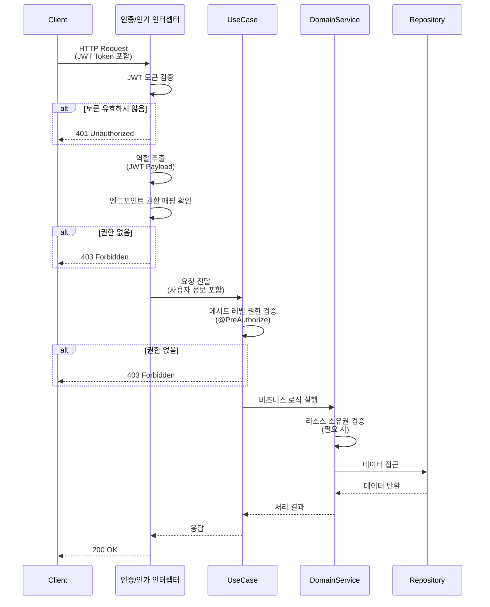
```mermaid
sequenceDiagram
    participant Client
    participant Interceptor as 인증/인가 인터셉터
    participant UseCase
    participant DomainService
    participant Repository

    Client->>Interceptor: HTTP Request<br/>(JWT Token 포함)
    
    Interceptor->>Interceptor: JWT 토큰 검증
    alt 토큰 유효하지 않음
        Interceptor-->>Client: 401 Unauthorized
    end
    
    Interceptor->>Interceptor: 역할 추출<br/>(JWT Payload)
    Interceptor->>Interceptor: 엔드포인트 권한 매핑 확인
    
    alt 권한 없음
        Interceptor-->>Client: 403 Forbidden
    end
    
    Interceptor->>UseCase: 요청 전달<br/>(사용자 정보 포함)
    
    UseCase->>UseCase: 메서드 레벨 권한 검증<br/>(@PreAuthorize)
    
    alt 권한 없음
        UseCase-->>Client: 403 Forbidden
    end
    
    UseCase->>DomainService: 비즈니스 로직 실행
    DomainService->>DomainService: 리소스 소유권 검증<br/>(필요 시)
    DomainService->>Repository: 데이터 접근
    Repository-->>DomainService: 데이터 반환
    DomainService-->>UseCase: 처리 결과
    UseCase-->>Interceptor: 응답
    Interceptor-->>Client: 200 OK
```

---

### 7.4 API 보안 정책

#### 7.4.1 API 엔드포인트 보안

##### 인증 필수 API vs 공개 API

**인증 필수 API:**
- 대부분의 비즈니스 로직 API는 인증 필수
- JWT 토큰이 HTTP Authorization Header에 포함되어야 함
- 예: 회원 정보 조회/수정, 수업 관리, 출석 관리, 운영 관리 등

**공개 API (인증 불필요):**
- 휴대폰 인증 코드 발급: `/api/v1/auth/phone/send-code`
- 휴대폰 인증 코드 검증: `/api/v1/auth/phone/verify-code`
- 회원 가입: `/api/v1/auth/signup`
- 로그인: `/api/v1/auth/login`
- 로그인ID 찾기: `/api/v1/auth/find-login-id`
- 비밀번호 재설정 요청: `/api/v1/auth/reset-password/request`

##### API 엔드포인트 보안 분류

**1. Public API (인증 불필요)**
- 인증 및 회원 가입 관련 API
- 공개 정보 조회 API (학원 정보 등)

**2. Authenticated API (인증 필수)**
- 인증된 사용자만 접근 가능
- JWT 토큰 검증 필요
- 예: 본인 정보 조회, 수업 정보 조회

**3. Authorized API (인증 + 특정 역할 필수)**
- 인증 및 특정 역할 권한 필요
- JWT 토큰 검증 + 역할 기반 권한 검증
- 예: 학생 회원 생성 (운영 관리자 또는 슈퍼 관리자만), 수업 생성 (운영 관리자 또는 슈퍼 관리자만)

#### 7.4.2 API 요청 보안

##### HTTPS 사용

- **모든 API 통신은 HTTPS로 암호화**
- HTTP는 보안상의 이유로 사용 금지
- 인증 토큰 전송 시 암호화 보장

**HTTPS 적용:**
- TLS 1.2 이상 사용
- 인증서 유효성 검증
- 강력한 암호화 알고리즘 사용

##### Rate Limiting

**API 호출 빈도 제한:**

- **DDoS 공격 방지**: 과도한 요청으로 인한 서비스 중단 방지
- **리소스 보호**: 서버 리소스 과다 사용 방지
- **공정한 사용**: 모든 사용자가 공정하게 서비스 이용 가능

**Rate Limiting 전략:**

- **IP 기반 제한**: 동일 IP에서 일정 시간 동안 최대 요청 수 제한
- **사용자 기반 제한**: 동일 사용자(로그인ID)에서 일정 시간 동안 최대 요청 수 제한
- **엔드포인트별 제한**: 중요도가 높은 엔드포인트에 더 엄격한 제한 적용

**Rate Limiting 예시:**

- 일반 API: 분당 100회
- 인증 API: 분당 5회 (브루트 포스 공격 방지)
- 휴대폰 인증 코드 발급: 분당 3회

**Rate Limiting 초과 시:**

- HTTP 429 Too Many Requests 응답
- Retry-After 헤더에 재시도 가능 시간 포함

##### Request Validation

**입력 데이터 검증 및 Sanitization:**

- **입력 검증**: 모든 입력 데이터의 유효성 검증
- **타입 검증**: 데이터 타입 검증 (문자열, 숫자, 이메일 등)
- **범위 검증**: 데이터 범위 검증 (길이, 최소/최대값 등)
- **형식 검증**: 정규 표현식을 통한 형식 검증

**공격 방지:**

- **SQL Injection 방지**: 
  - Exposed ORM 사용으로 파라미터화된 쿼리 자동 적용
  - 직접 SQL 쿼리 작성을 지양
  
- **XSS (Cross-Site Scripting) 방지**:
  - 입력 데이터의 HTML 태그 이스케이프 처리
  - 출력 시 인코딩 적용
  
- **Command Injection 방지**:
  - 시스템 명령어 실행 금지
  - 파일 경로 검증

**Request Validation 예시:**

```kotlin
// 입력 검증 예시
data class CreateStudentDTO(
    @field:NotBlank(message = "이름은 필수입니다")
    @field:Size(min = 2, max = 20, message = "이름은 2자 이상 20자 이하입니다")
    val name: String,
    
    @field:Pattern(regexp = "^01[0-9]-[0-9]{4}-[0-9]{4}$", message = "휴대폰 번호 형식이 올바르지 않습니다")
    val phoneNumber: String,
    
    @field:Email(message = "이메일 형식이 올바르지 않습니다")
    val email: String?
)
```

#### 7.4.3 API 응답 보안

##### 민감 정보 제거

**응답에서 민감 정보 제외:**

- **비밀번호**: 응답에 비밀번호 포함 금지
- **개인정보**: 필요한 경우에만 최소한의 정보 제공
- **시스템 정보**: 서버 내부 정보 노출 방지

**민감 정보 마스킹:**

- 휴대폰 번호: 일부 숫자 마스킹 (예: 010-****-1234)
- 이메일: 일부 문자 마스킹 (예: u***@example.com)
- 주소: 상세 주소 일부 마스킹

##### 에러 응답 표준화

**보안 관련 에러는 일반적인 에러 메시지로 응답:**

- **인증 실패**: "인증 정보가 올바르지 않습니다" (상세 사유는 노출하지 않음)
- **권한 없음**: "해당 기능에 대한 권한이 없습니다"
- **계정 잠금**: "계정이 일시적으로 잠겼습니다. 잠시 후 다시 시도해주세요"

**상세 에러는 서버 로그에만 기록:**

- 에러 원인, 스택 트레이스 등 상세 정보는 서버 로그에만 기록
- 클라이언트에는 일반적인 에러 메시지만 제공

**에러 응답 형식:**

```kotlin
// 에러 응답 형식 예시
{
    "error": {
        "code": "UNAUTHORIZED",
        "message": "인증 정보가 올바르지 않습니다",
        "timestamp": "2025-01-02T10:00:00Z"
    }
}
```

#### 7.4.4 CORS 정책

**CORS (Cross-Origin Resource Sharing) 설정:**

- **허용된 Origin만 API 접근 가능**: 설정된 Origin에서만 API 요청 허용
- **자격 증명 포함 요청 처리**: `Access-Control-Allow-Credentials: true` 설정

**CORS 설정 예시:**

```kotlin
// CORS 설정 예시
@Configuration
class CorsConfig {
    @Bean
    fun corsConfigurationSource(): CorsConfigurationSource {
        val configuration = CorsConfiguration()
        configuration.allowedOrigins = listOf(
            "https://ams-web.example.com",
            "https://ams-admin.example.com"
        )
        configuration.allowedMethods = listOf("GET", "POST", "PUT", "DELETE", "OPTIONS")
        configuration.allowedHeaders = listOf("*")
        configuration.allowCredentials = true
        configuration.maxAge = 3600L
        
        val source = UrlBasedCorsConfigurationSource()
        source.registerCorsConfiguration("/api/**", configuration)
        return source
    }
}
```

**CORS 정책 적용:**

- **개발 환경**: 모든 Origin 허용 가능 (개발 편의성)
- **프로덕션 환경**: 허용된 Origin만 엄격하게 제한
- **자격 증명 포함 요청**: JWT 토큰 등 자격 증명이 포함된 요청 처리

---

### 7.5 보안 아키텍처 다이어그램

#### 7.5.1 인증 프로세스 다이어그램

**휴대폰 인증 플로우:**

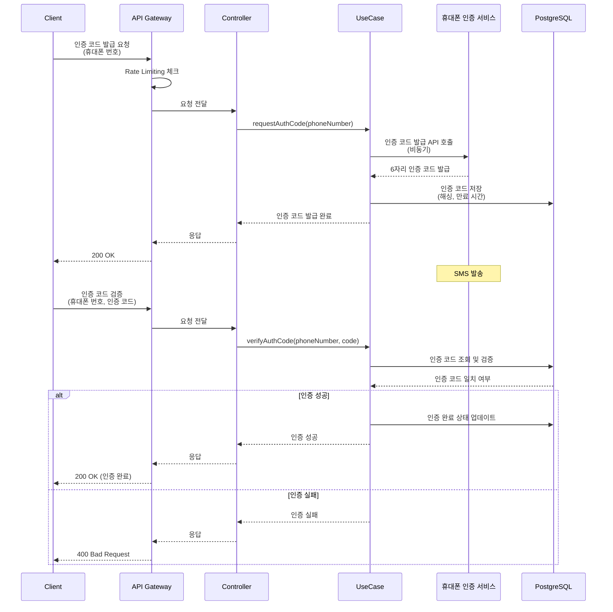
```mermaid
sequenceDiagram
    participant Client
    participant API as API Gateway
    participant Controller
    participant UseCase
    participant AuthService as 휴대폰 인증 서비스
    participant DB as PostgreSQL

    Client->>API: 인증 코드 발급 요청<br/>(휴대폰 번호)
    API->>API: Rate Limiting 체크
    API->>Controller: 요청 전달
    Controller->>UseCase: requestAuthCode(phoneNumber)
    UseCase->>AuthService: 인증 코드 발급 API 호출<br/>(비동기)
    AuthService-->>UseCase: 6자리 인증 코드 발급
    UseCase->>DB: 인증 코드 저장<br/>(해싱, 만료 시간)
    UseCase-->>Controller: 인증 코드 발급 완료
    Controller-->>API: 응답
    API-->>Client: 200 OK
    
    Note over AuthService: SMS 발송
    
    Client->>API: 인증 코드 검증<br/>(휴대폰 번호, 인증 코드)
    API->>Controller: 요청 전달
    Controller->>UseCase: verifyAuthCode(phoneNumber, code)
    UseCase->>DB: 인증 코드 조회 및 검증
    DB-->>UseCase: 인증 코드 일치 여부
    alt 인증 성공
        UseCase->>DB: 인증 완료 상태 업데이트
        UseCase-->>Controller: 인증 성공
        Controller-->>API: 응답
        API-->>Client: 200 OK (인증 완료)
    else 인증 실패
        UseCase-->>Controller: 인증 실패
        Controller-->>API: 응답
        API-->>Client: 400 Bad Request
    end
```

**로그인 프로세스 플로우:**

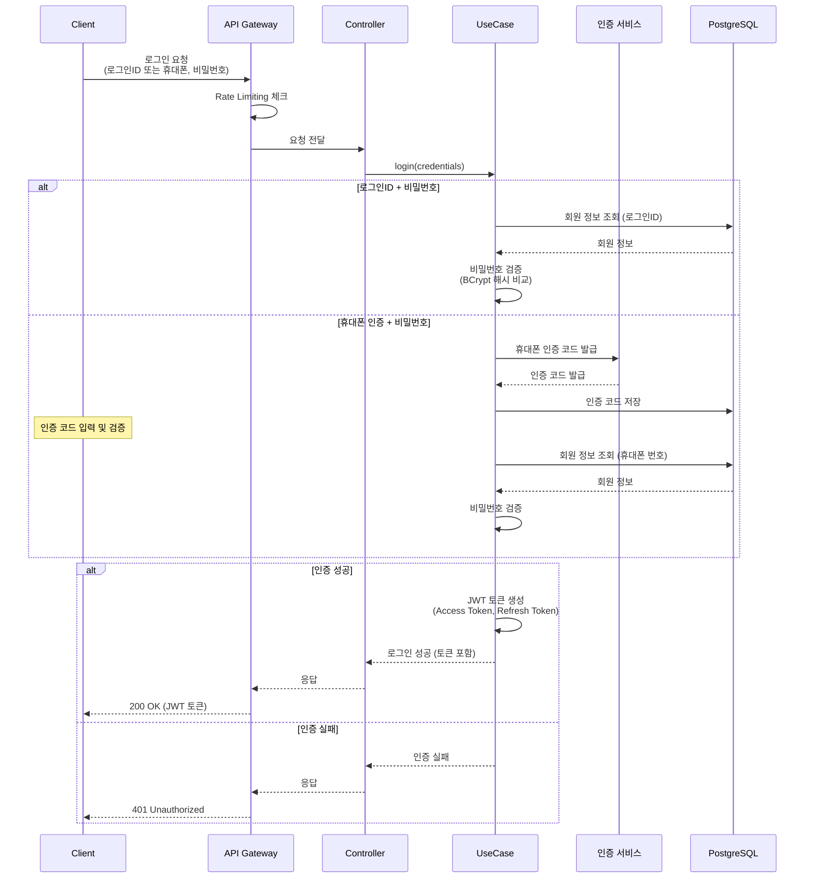
```mermaid
sequenceDiagram
    participant Client
    participant API as API Gateway
    participant Controller
    participant UseCase
    participant AuthService as 인증 서비스
    participant DB as PostgreSQL

    Client->>API: 로그인 요청<br/>(로그인ID 또는 휴대폰, 비밀번호)
    API->>API: Rate Limiting 체크
    API->>Controller: 요청 전달
    Controller->>UseCase: login(credentials)
    
    alt 로그인ID + 비밀번호
        UseCase->>DB: 회원 정보 조회 (로그인ID)
        DB-->>UseCase: 회원 정보
        UseCase->>UseCase: 비밀번호 검증<br/>(BCrypt 해시 비교)
    else 휴대폰 인증 + 비밀번호
        UseCase->>AuthService: 휴대폰 인증 코드 발급
        AuthService-->>UseCase: 인증 코드 발급
        UseCase->>DB: 인증 코드 저장
        Note over Client: 인증 코드 입력 및 검증
        UseCase->>DB: 회원 정보 조회 (휴대폰 번호)
        DB-->>UseCase: 회원 정보
        UseCase->>UseCase: 비밀번호 검증
    end
    
    alt 인증 성공
        UseCase->>UseCase: JWT 토큰 생성<br/>(Access Token, Refresh Token)
        UseCase-->>Controller: 로그인 성공 (토큰 포함)
        Controller-->>API: 응답
        API-->>Client: 200 OK (JWT 토큰)
    else 인증 실패
        UseCase-->>Controller: 인증 실패
        Controller-->>API: 응답
        API-->>Client: 401 Unauthorized
    end
```

**JWT 토큰 발급 및 검증 프로세스:**

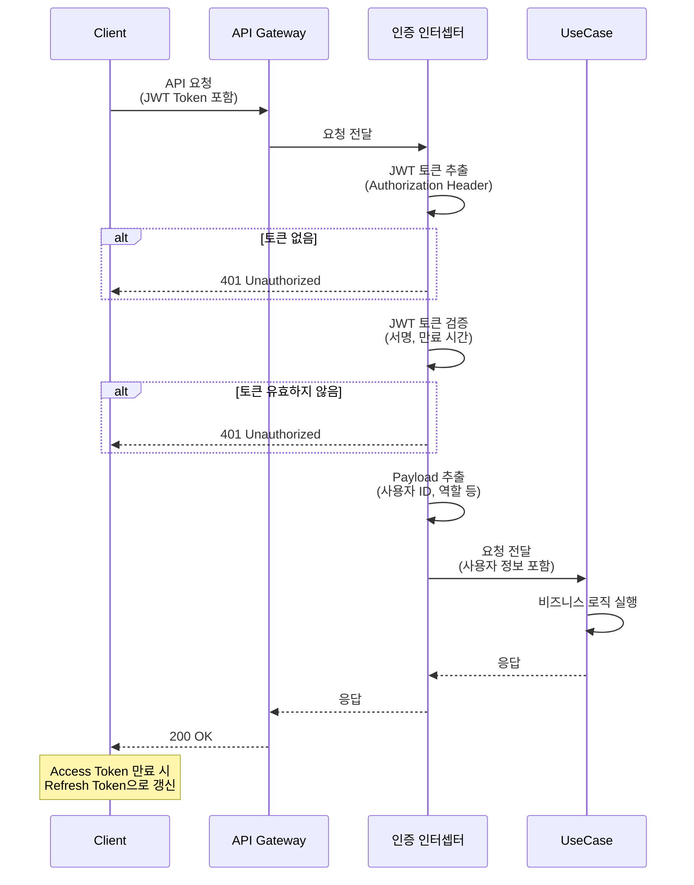
```mermaid
sequenceDiagram
    participant Client
    participant API as API Gateway
    participant Interceptor as 인증 인터셉터
    participant UseCase

    Client->>API: API 요청<br/>(JWT Token 포함)
    API->>Interceptor: 요청 전달
    
    Interceptor->>Interceptor: JWT 토큰 추출<br/>(Authorization Header)
    
    alt 토큰 없음
        Interceptor-->>Client: 401 Unauthorized
    end
    
    Interceptor->>Interceptor: JWT 토큰 검증<br/>(서명, 만료 시간)
    
    alt 토큰 유효하지 않음
        Interceptor-->>Client: 401 Unauthorized
    end
    
    Interceptor->>Interceptor: Payload 추출<br/>(사용자 ID, 역할 등)
    Interceptor->>UseCase: 요청 전달<br/>(사용자 정보 포함)
    
    UseCase->>UseCase: 비즈니스 로직 실행
    UseCase-->>Interceptor: 응답
    Interceptor-->>API: 응답
    API-->>Client: 200 OK
    
    Note over Client: Access Token 만료 시<br/>Refresh Token으로 갱신
```

#### 7.5.2 권한 체크 프로세스 다이어그램

**권한 체크 프로세스:**

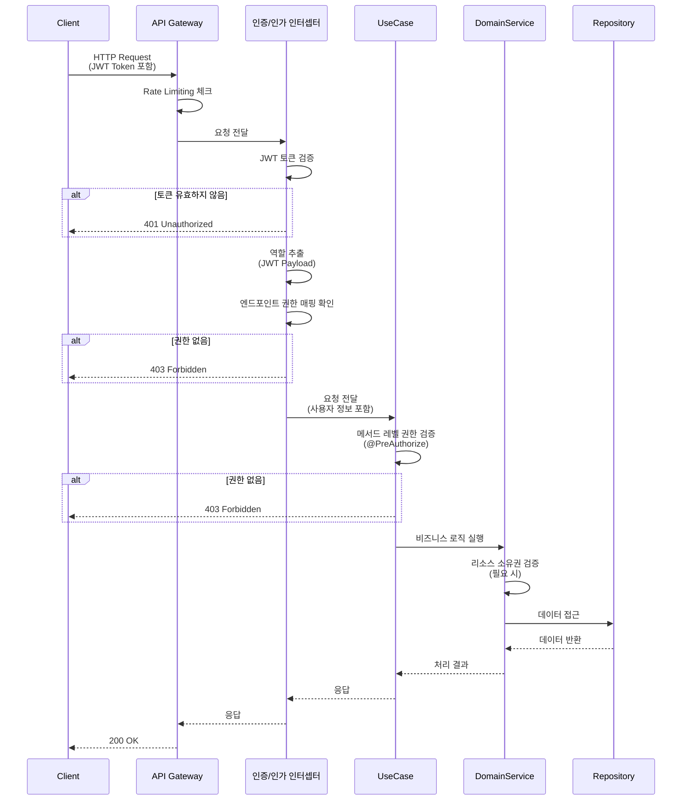
```mermaid
sequenceDiagram
    participant Client
    participant API as API Gateway
    participant Interceptor as 인증/인가 인터셉터
    participant UseCase
    participant DomainService
    participant Repository

    Client->>API: HTTP Request<br/>(JWT Token 포함)
    API->>API: Rate Limiting 체크
    API->>Interceptor: 요청 전달
    
    Interceptor->>Interceptor: JWT 토큰 검증
    alt 토큰 유효하지 않음
        Interceptor-->>Client: 401 Unauthorized
    end
    
    Interceptor->>Interceptor: 역할 추출<br/>(JWT Payload)
    Interceptor->>Interceptor: 엔드포인트 권한 매핑 확인
    
    alt 권한 없음
        Interceptor-->>Client: 403 Forbidden
    end
    
    Interceptor->>UseCase: 요청 전달<br/>(사용자 정보 포함)
    
    UseCase->>UseCase: 메서드 레벨 권한 검증<br/>(@PreAuthorize)
    
    alt 권한 없음
        UseCase-->>Client: 403 Forbidden
    end
    
    UseCase->>DomainService: 비즈니스 로직 실행
    DomainService->>DomainService: 리소스 소유권 검증<br/>(필요 시)
    DomainService->>Repository: 데이터 접근
    Repository-->>DomainService: 데이터 반환
    DomainService-->>UseCase: 처리 결과
    UseCase-->>Interceptor: 응답
    Interceptor-->>API: 응답
    API-->>Client: 200 OK
```

#### 7.5.3 보안 계층 구조 다이어그램

**보안 계층 구조:**

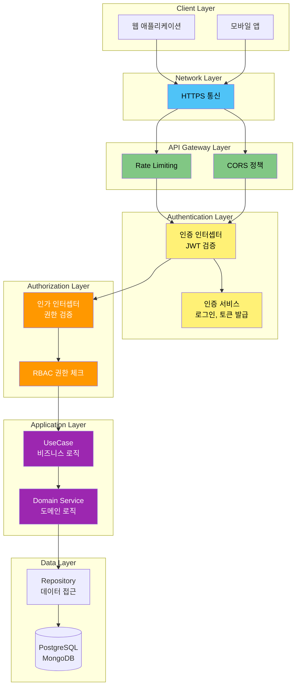
```mermaid
graph TB
    subgraph "Client Layer"
        Web[웹 애플리케이션]
        Mobile[모바일 앱]
    end
    
    subgraph "Network Layer"
        HTTPS[HTTPS 통신]
    end
    
    subgraph "API Gateway Layer"
        RateLimit[Rate Limiting]
        CORS[CORS 정책]
    end
    
    subgraph "Authentication Layer"
        AuthInterceptor[인증 인터셉터<br/>JWT 검증]
        AuthService[인증 서비스<br/>로그인, 토큰 발급]
    end
    
    subgraph "Authorization Layer"
        AuthzInterceptor[인가 인터셉터<br/>권한 검증]
        RBAC[RBAC 권한 체크]
    end
    
    subgraph "Application Layer"
        UseCase[UseCase<br/>비즈니스 로직]
        DomainService[Domain Service<br/>도메인 로직]
    end
    
    subgraph "Data Layer"
        Repository[Repository<br/>데이터 접근]
        DB[(PostgreSQL<br/>MongoDB)]
    end
    
    Web --> HTTPS
    Mobile --> HTTPS
    HTTPS --> RateLimit
    HTTPS --> CORS
    RateLimit --> AuthInterceptor
    CORS --> AuthInterceptor
    AuthInterceptor --> AuthService
    AuthInterceptor --> AuthzInterceptor
    AuthzInterceptor --> RBAC
    RBAC --> UseCase
    UseCase --> DomainService
    DomainService --> Repository
    Repository --> DB
    
    style HTTPS fill:#4fc3f7,color:#000
    style RateLimit fill:#81c784,color:#000
    style CORS fill:#81c784,color:#000
    style AuthInterceptor fill:#fff176,color:#000
    style AuthService fill:#fff176,color:#000
    style AuthzInterceptor fill:#ff9800,color:#fff
    style RBAC fill:#ff9800,color:#fff
    style UseCase fill:#9c27b0,color:#fff
    style DomainService fill:#9c27b0,color:#fff
```

---

### 7.6 보안 아키텍처 요약

#### 보안 아키텍처 핵심 요약

AMS의 보안 아키텍처는 다음과 같은 핵심 요소로 구성됩니다:

**1. 인증 (Authentication)**
- 휴대폰 인증 (6자리 코드 발급 및 검증)
- 로그인 방식 (로그인ID + 비밀번호, 휴대폰 인증 + 비밀번호)
- JWT 기반 토큰 인증 (Access Token, Refresh Token)
- 비밀번호 해싱 (BCrypt 또는 Argon2)

**2. 인가 (Authorization)**
- 역할 기반 접근 제어 (RBAC)
- 5가지 회원 역할 (학생, 학부모, 강사, 운영 관리자, 슈퍼 관리자)
- 인터셉터/필터 기반 권한 체크
- 메서드 레벨 권한 체크 (@PreAuthorize)

**3. API 보안**
- HTTPS 통신 암호화
- Rate Limiting (DDoS 공격 방지)
- Request Validation (SQL Injection, XSS 방지)
- 민감 정보 제거 및 에러 응답 표준화
- CORS 정책 적용

**4. 보안 계층 구조**
- 네트워크 계층: HTTPS 통신
- API Gateway 계층: Rate Limiting, CORS
- 인증/인가 계층: JWT 검증, RBAC 권한 체크
- 애플리케이션 계층: 입력 검증, 비즈니스 로직 레벨 권한 검증
- 데이터 계층: 비밀번호 해싱, 데이터베이스 접근 제어

#### 보안 계층별 역할 및 책임

**네트워크 계층:**
- HTTPS 통신을 통한 데이터 암호화
- TLS 1.2 이상 사용

**API Gateway 계층:**
- Rate Limiting을 통한 DDoS 공격 방어
- CORS 정책을 통한 Origin 제한

**인증 계층:**
- 사용자 인증 (휴대폰 인증, 로그인)
- JWT 토큰 발급 및 검증
- 토큰 만료 및 갱신 처리

**인가 계층:**
- 역할 기반 접근 제어 (RBAC)
- 엔드포인트별 권한 매핑
- 메서드 레벨 권한 검증

**애플리케이션 계층:**
- 입력 데이터 검증 및 Sanitization
- 비즈니스 로직 레벨 권한 검증
- 리소스 소유권 검증

**데이터 계층:**
- 비밀번호 해싱 및 암호화
- 데이터베이스 접근 제어
- 민감 정보 마스킹

---

## 8. 통신 및 연동

### 8.1 RESTful API 설계 원칙

- **리소스 지향 URL**: 모든 엔드포인트는 복수형 명사 기반으로 `/api/v1/members/{memberId}/classes` 형태를 사용합니다. 중첩 리소스는 부모-자식 관계를 명시하고, 컬렉션 조회 엔드포인트에는 필터와 정렬을 위한 쿼리 파라미터(`?page=0&size=20&sort=createdAt,desc`)를 제공합니다.
- **HTTP 메서드 의미 부여**: `GET`은 멱등 조회, `POST`는 리소스 생성, `PUT`은 전체 갱신, `PATCH`는 부분 갱신, `DELETE`는 소프트/하드 삭제에 사용합니다. 도메인 이벤트 발행 시 멱등성을 확보하기 위해 멱등 요청에는 `Idempotency-Key` 헤더 적용을 검토합니다.
- **표준화된 응답 구조**: 성공 응답은 `data`와 `meta` 블록으로 구성된 JSON 포맷을 유지하며, 실패 응답은 `7.4 API 보안 정책`에서 정의한 에러 응답 규격을 재사용합니다. 날짜/시간 값은 UTC 기준 ISO 8601 문자열(`2025-11-10T09:00:00Z`)을 사용합니다.
- **쿼리·페이징 규칙**: 검색 조건은 명시적 키(`status`, `role`, `dateFrom/dateTo`)로 노출하고, 대량 조회 시 `page/size` 기반 페이지네이션을 기본으로 제공합니다. 대량 처리용 스트리밍 API는 추후 `/api/v1/exports` 하위로 분리하여 별도 문서화합니다.
- **HTTP 상태코드 매핑**: 공통 상태코드와 의미는 아래 표를 기준으로 통합 관리합니다.

| 상태코드 | 사용 시점 | 비고 |
|---------|-----------|------|
| `200 OK` | 조회 성공 | 단건/목록 조회 |
| `201 Created` | 리소스 생성 | `Location` 헤더에 신규 URL 포함 |
| `202 Accepted` | 비동기 처리 접수 | 이벤트 발행 후 배치 처리 |
| `204 No Content` | 삭제/갱신 완료 | 본문 없이 성공 |
| `400 Bad Request` | 입력 검증 실패 | Validation 메시지 포함 |
| `401 Unauthorized` | 인증 실패 | JWT 만료 포함 |
| `403 Forbidden` | 인가 실패 | RBAC 위반 |
| `404 Not Found` | 리소스 없음 | 경로/ID 불일치 |
| `409 Conflict` | 중복/상태 충돌 | Idempotency 위반 등 |
| `429 Too Many Requests` | Rate Limit 초과 | Gateway/Interceptor에서 제어 |
| `500 Internal Server Error` | 서버 오류 | 내부 장애, 추적 ID 포함 |

### 8.2 외부 시스템 연동 방식 (Async + Non-Blocking)

- **연동 대상 요약**: 현재는 휴대폰 인증 서비스와 알림 발송 서비스를 비동기 HTTP API로 연동하며, `1.3 시스템 경계`에 정의된 OAuth 2.0, 결제, 위치 기반 서비스는 후속 단계에 추가됩니다.
- **아키텍처 패턴**: Hexagonal Architecture의 Outbound Port를 통해 외부 연동을 추상화하고, `6. 비동기 처리 전략`에서 정의한 Coroutine + Non-Blocking I/O로 구현합니다. 모든 어댑터는 `suspend` 기반 WebClient 또는 Ktor Client를 사용하며, Circuit Breaker와 재시도 로직은 공통 DSL로 캡슐화합니다.
- **통신 흐름**: UseCase가 Outbound Port를 호출하면 비동기 HTTP 요청을 전송하고, 응답 결과를 도메인 이벤트(`MemberCreated`, `AttendanceConfirmed`) 처리 흐름에 반영합니다. 실패 시 재시도와 백오프 정책을 적용하며, 연동별 모니터링 메트릭(성공률, 지연시간, 오류 코드)을 `10. 모니터링 및 로깅`에서 수집합니다.
- **재시도 및 타임아웃 정책**:

| 구분 | 기본 타임아웃 | 재시도 횟수 | 백오프 전략 | 비고 |
|------|---------------|-------------|-------------|------|
| 휴대폰 인증 API | 3초 | 2회 | 200ms, 800ms | 인증 실패 시 사용자 메시지 제공 |
| 알림 발송 API | 5초 | 3회 | 500ms, 1.5s, 3s | 실패 시 보류 큐에 적재 |
| 향후 결제 API | 10초 | 1회 | 1s | 결제는 멱등 키 필수 |

- **관측성 및 폴백**: 모든 외부 호출에는 요청/응답 로그와 Trace ID가 포함되며, 연속 실패 시 운영 알림을 트리거합니다. 알림 발송 실패는 메시지 큐(재시도 대기열)에 저장하여 수동 재처리 경로를 제공합니다. 장기적으로는 `12. 에러 처리` 섹션의 글로벌 재시도 정책과 연계합니다.

### 8.3 API Gateway 사용 전략

- **현재 운영 상태**: `2.1 고수준 아키텍처 다이어그램`과 같이 로드 밸런서를 통해 AMS 애플리케이션으로 직접 트래픽이 유입됩니다. 초기 버전(v1.0)에서는 애플리케이션 내 인터셉터로 인증/인가, Rate Limiting을 처리합니다.
- **도입 기대 효과**: API Gateway를 적용할 경우 공통 보안 정책(인증 토큰 선제 검증, `7.4.1` Rate Limiting), 멀티 테넌트 헤더 주입, 요청/응답 변환, Canary 배포 라우팅(`11. 배포 및 운영`과 연계) 등을 게이트웨이 계층에서 위임할 수 있습니다.
- **기술 후보 평가**:
  - Spring Cloud Gateway: JVM 내 배포, 기존 Spring 생태계와의 통합이 용이하며, 서비스 메시나 Config Server와 연계 가능.
  - Kong / NGINX / Kong Gateway: 플러그인 생태계가 풍부하고, 관측성 도구와 통합이 쉬움.
  - AWS API Gateway (매니지드): 서버리스 운영이 가능하며, Lambda Authorizer와 연계하여 인증 로직을 외부화할 수 있음.
- **도입 로드맵**:
  1. **v1.0 (현재)**: 로드 밸런서 + 애플리케이션 내부 필터.
  2. **v1.1**: 파일럿 인스턴스에 Spring Cloud Gateway 배포, 인증/Rate Limit/로깅 기능을 이전.
  3. **v1.2 이후**: 모든 트래픽을 게이트웨이로 전환, 플러그인 기반 A/B 테스트와 Canary 릴리스 지원.
  4. **장기**: 매니지드 게이트웨이 또는 서비스 메시(Istio 등) 도입 여부를 인프라 팀과 검토.

### 8.4 API 버전 관리 전략

- **버전 부여 원칙**: URL 경로 기반 버전(`/api/v1`)을 기본으로 하며, 계약을 깨뜨리는 변경(스키마 필드 삭제, 의미 변경)이 발생하면 메이저 버전을 증가시킵니다. 호환 가능한 변경(필드 추가, 선택적 파라미터)은 마이너/패치 릴리스 노트로 안내합니다.
- **수명주기 관리**: 각 메이저 버전은 Beta → GA(6개월) → Deprecated(6개월) → Sunset 순서로 운영합니다. Deprecation 단계에서는 `Deprecation`, `Sunset` HTTP 헤더와 공지 메일/슬랙 알림을 통해 전환 일정을 안내합니다.
- **지원 정책**: 최소 두 개의 메이저 버전을 동시에 지원하며, 멀티 테넌트 고객의 마이그레이션 일정에 따라 유예 기간을 조정할 수 있습니다. 인증 토큰에는 `X-AMS-Api-Version` 응답 헤더를 포함하여 클라이언트가 사용 중인 버전을 확인할 수 있도록 합니다.
- **문서화 및 자동화**: OpenAPI 스펙은 버전별로 분리하여 저장하고, CI/CD 파이프라인(`11. 배포 및 운영`)에서 스키마 변경 diff를 자동 검증합니다. Breaking change가 감지되면 PR 리뷰 체크리스트에 추가하고, 변경 로그를 `docs/change-log.md`에 기록합니다.
- **클라이언트 전환 가이드**: SDK/프런트엔드 클라이언트는 최신 버전과 하위 호환 어댑터를 제공하며, 종료 예정 버전에 대한 샘플 요청/응답, 마이그레이션 체크리스트를 함께 배포합니다. 신규 기능은 항상 최신 버전에서만 제공하여 자연스러운 전환을 유도합니다.

---

## 9. 확장성 및 성능

AMS는 초기 단일 인스턴스 운영에서 출발하되, 멀티 테넌트 서비스 특성을 고려하여 수평·수직 확장과 캐싱, 성능 모니터링 체계를 단계적으로 강화합니다. 본 절에서는 `2.1 고수준 아키텍처`, `6. 비동기 처리`, `10. 모니터링 및 로깅`, `11. 배포 및 운영`과 연계되는 확장/성능 전략을 기술합니다.

### 9.1 수평 확장 전략 (멀티 서버 & 멀티 인스턴스)

- **애플리케이션 계층**: 모든 인스턴스는 Stateless로 설계하고(세션은 Redis/DB에 저장), 로드 밸런서를 통해 트래픽을 균등 분배합니다. 오토스케일 조건은 CPU 60% 이상 5분 지속, 또는 초당 요청 수(QPS) 80% 초과 시 신규 인스턴스 추가를 기본값으로 설정합니다.
- **CQRS 데이터 계층**:
  - **PostgreSQL**: 읽기 부하 분산을 위해 Read Replica를 운영하고, 데이터 증가 속도를 모니터링하여 파티셔닝 혹은 샤딩 도입 여부를 검토합니다.
  - **MongoDB**: 조회 부하 증가 시 컬렉션별 샤딩을 적용하고, 샤드 키는 조회 패턴에 기반한 필드를 선택합니다.
- **비동기 컴포넌트**: 이벤트 핸들러, 알림 어댑터 등의 아웃바운드 작업은 메시지 큐 기반 병렬 소비를 고려합니다. 초기에는 애플리케이션 내부 큐(Coroutine Channel)를 사용하되, 트래픽 급증 시 Kafka/RabbitMQ 도입을 통해 소비자 인스턴스를 독립 확장합니다.
- **다중 AZ/리전 전략**: 운영 단계에서 고가용성이 요구될 경우, 다중 가용 영역에 인스턴스를 배치하고 데이터베이스 레플리케이션을 동기/비동기 모드로 조정합니다. 장애 조치 절차는 `11. 배포 및 운영`에 정의된 재해 복구(드릴) 시나리오와 통합합니다.

| 계층 | 확장 방법 | 모니터링 지표 | 후속 검토 포인트 |
|------|-----------|---------------|------------------|
| 애플리케이션 | Kubernetes HPA / AWS ASG 오토스케일 | CPU, QPS, 평균 응답시간 | Warm-up 시간, 인스턴스 수 한도 |
| PostgreSQL | Read Replica, 향후 파티셔닝 | TPS, 복제 지연, 커넥션 수 | 파티션 키 설계, Vacuum 부하 |
| MongoDB | 샤딩, 컬렉션별 인덱스 조정 | 서브샘플 응답시간, 커넥션 | 샤드 키 선정, Balancer 스케줄 |
| 이벤트/알림 | 소비자 인스턴스 증가, MQ 도입 | 큐 적체량, 실패율 | 메시지 중복 처리, DLQ 정책 |

### 9.2 수직 확장 전략

- **애플리케이션 자원 상향**: 초기 단계에서는 vCPU/메모리 스펙을 조정하여 급격한 트래픽 증가에 대응합니다. JVM 힙 크기, Coroutine Dispatcher 스레드 수를 조정하고, JDK 21 이상 환경에서는 G1GC 또는 ZGC 기반으로 GC 파라미터를 튜닝하여 적정한 처리량을 확보합니다.
- **데이터베이스 업사이징**: PostgreSQL은 IOPS/메모리 기반 인스턴스 클래스로 상향, MongoDB는 WiredTiger 캐시 비율 조정 및 노드 스펙 업그레이드를 고려합니다. 업그레이드 전후에는 워크로드 재측정과 쿼리 플랜 분석을 수행합니다.
- **네트워크/스토리지 최적화**: 네트워크 대역폭 확대, EBS/스토리지 Throughput 향상 옵션을 검토합니다. 성능 병목 지점은 `10. 모니터링 및 로깅`에서 수집하는 APM 지표를 통해 주기적으로 확인합니다.
- **전환 기준**: 수직 확장의 한계(예: CPU 80% 이상 지속, Replica 동기화 지연) 도달 시 9.1에서 정의한 수평 확장 또는 마이크로서비스 분리를 검토합니다.

### 9.3 로드 밸런싱 전략

- **L4/L7 분리 운용**: L4 로드 밸런서에서 기본 트래픽 분산을 담당하고, L7 계층(추후 API Gateway 포함)에서 인증 헤더 검증, 멀티 테넌트 라우팅, 요청 사이즈 제한을 수행합니다.
- **분산 알고리즘**: 기본은 라운드 로빈을 적용하되, 인스턴스 성능이 이질적일 경우 가중 라운드 로빈으로 전환합니다. 세션 스티키니스는 사용하지 않으며, 세션 데이터는 외부 저장소(9.4 캐싱 전략)로 이관합니다.
- **헬스체크 및 장애 처치**: `/actuator/health` 기반 헬스체크를 10초 주기로 수행하고, 3회 연속 실패 시 인스턴스를 분리합니다. Circuit Breaker(12장)와 연계하여 비정상 구간의 요청 차단 및 재시도를 관리합니다.
- **배포 전략과 연계**: 블루-그린 및 카나리 배포(11장) 시 로드 밸런서 가중치를 조정하여 신규 릴리스로 트래픽을 점진 전환합니다. 트래픽 스플릿 결과는 모니터링 대시보드에서 실시간으로 관찰합니다.

### 9.4 캐싱 전략 (Redis 등)

- **1단계: 애플리케이션 캐시**: 자주 사용되는 설정/레퍼런스 데이터는 애플리케이션 내부 캐시(예: Caffeine)로 보관하되 TTL을 5분 이내로 제한하여 데이터 최신성을 확보합니다.
- **2단계: Redis 기반 공용 캐시**:
  - **구조**: Redis Cluster를 도입하여 세션, 토큰, 조회 결과 캐시를 저장합니다. 멱등 키 저장소와 비동기 이벤트 de-duplication도 Redis를 활용합니다.
  - **정책**: TTL은 데이터 특성에 따라 분류(`short-lived` 30초, `medium` 5분, `long` 1시간). 캐시 무효화는 이벤트 기반(도메인 이벤트 → 캐시 무효화 메시지)으로 처리합니다.
- **CQRS 연계**: MongoDB 조회 모델은 읽기 성능이 충분한 경우 캐시 없이 운영하되, 대량 조회/통계 API는 Redis read-through 캐시를 적용해 응답 시간을 단축합니다.
- **모니터링 및 장애 대응**: 캐시 적중률, 메모리 사용률, 복제 지연을 모니터링하고, Redis 장애 시 폴백(직접 DB 조회) 로직을 구현합니다. 폴백 시 발생할 부하를 대비해 DB 읽기 한도와 Circuit Breaker를 조정합니다.

### 9.5 성능 최적화 방안

- **성능 목표**:
  - SLA: 월 가용성 99.5% 이상.
  - SLO: 주요 API p95 응답시간 300ms 이하, 오류율 0.5% 이하.
  - 이를 달성하기 위해 APM(New Relic, Datadog 등)과 로그/메트릭 수집(10장)을 결합합니다.
- **코드/아키텍처 최적화**:
  - Coroutine 기반 Non-Blocking I/O를 적극 활용하여 Thread Blocking을 최소화합니다(6장 참조).
  - CQRS로 읽기/쓰기 부하를 분리하고, Command 처리 후 이벤트 기반으로 비즈니스 연산을 분산합니다.
  - 배치/집계 작업은 별도 워커 또는 스케줄러로 분리하여 온라인 트래픽과 분리합니다.
- **테스트 및 검증**:
  - 부하 테스트: JMeter/K6 등을 활용하여 피크 트래픽(평균 대비 3배) 시나리오를 재현하고, 오토스케일 반응 시간을 측정합니다.
  - 회귀 검증: CI/CD 파이프라인에서 성능 테스트 Smoke Suite를 실행하고, 기준치 초과 시 배포를 차단합니다.
  - 프로파일링: CPU/메모리 분석(Async Profiler, Java Flight Recorder) 결과를 주기적으로 검토하여 Hot Spot을 제거합니다.
- **운영 프로세스**: 용량 계획 회의(월 1회)에서 성장률, 비용, 장애 사례를 공유하고, SLO 위반 시 사후 분석(Postmortem)을 작성하여 개선 과제를 추적합니다.

---

## 10. 모니터링 및 로깅

AMS는 다중 테넌트 환경에서 발생하는 애플리케이션·인프라 이벤트를 실시간으로 가시화하고, 장애를 조기에 감지하여 서비스 품질을 유지합니다. 본 절의 전략은 `2.1 고수준 아키텍처`의 공통 인프라 계층, `6. 비동기 처리`의 이벤트 흐름, `9. 확장성 및 성능`의 SLO 지표와 긴밀히 연계되어 운영 자동화와 비용 효율성을 동시에 추구합니다.

### 10.1 로깅 전략

- **구조화 로그(JSON) 채택**: Spring Boot 기본 로거를 Logback + Logstash 인코더로 확장하여 JSON 포맷을 출력합니다. 모든 로그에는 공통 필드가 포함됩니다.

  | 필드 | 설명 |
  |------|------|
  | `timestamp` | ISO-8601 UTC 기준 발생 시각 |
  | `level` | TRACE/DEBUG/INFO/WARN/ERROR |
  | `traceId` / `spanId` | OpenTelemetry 연계 분산 추적 식별자 |
  | `tenantId` | 멀티 테넌트 식별자 (요청 헤더 `X-AMS-Tenant`) |
  | `actor` | 최종 사용자 또는 시스템 계정 ID |
  | `useCase` | 실행 중인 UseCase/핸들러 명칭 |
  | `elapsedMs` | 처리 시간(ms) |
  | `message` / `detail` | 로그 메시지 및 추가 데이터(Map) |

- **로그 레벨 및 포인트**:
  - `INFO`: 주요 비즈니스 단계(UseCase 입·출력, 외부 연동 성공) 기록.
  - `WARN`: 재시도/폴백 발생, 임계치 근접 상황(캐시 미스 폭증 등).
  - `ERROR`: 예외 발생 시 에러 코드, Trace ID, 사용자 영향 범위를 포함. `12. 에러 처리`의 글로벌 예외 처리기에서 중앙 집중 기록.
  - `DEBUG/TRACE`: 로컬 및 Staging에서만 활성화하며, 운영 환경에서는 환경 변수로 토글.

- **민감 정보 보호 및 규제 준수**: 개인정보(전화번호, 주소, 인증 토큰)는 마스킹/해시 처리하며, 요청·응답 본문은 샘플링 비율(기본 5%)에 따라 부분 저장합니다. 운영 로그는 30일(Hot storage), 180일(Cold storage) 보관 후 파기하며, 접근 권한은 RBAC 기반으로 제한합니다.

- **로그 수집 파이프라인**: Fluent Bit → Kafka(Log Topic) → OpenSearch/Elastic Stack 경로로 전송합니다. 장애 대비를 위해 S3에 원본 로그를 적재하고, Athena/Trino로 Ad-hoc 분석이 가능하도록 구성합니다.

### 10.2 모니터링 도구 및 메트릭 수집

- **관측성 스택 구성**: OpenTelemetry SDK로 애플리케이션을 계측하고, OTLP Exporter를 통해 Datadog/New Relic APM과 Prometheus 게이트웨이로 동시에 전송합니다. 시계열 데이터는 Prometheus, 시각화는 Grafana 대시보드를 사용합니다.

- **애플리케이션 메트릭**:
  - 요청 처리량, 지연 시간(p50/p95/p99), 오류율을 엔드포인트/테넌트 기준으로 집계.
  - Coroutine 디스패처 큐 길이, JVM Heap/GC 지표(G1GC/ZGC), Redis 연결 수 등 런타임 메트릭을 수집.
  - Outbound 연동 성공률, 타임아웃 횟수는 `8.2 외부 시스템 연동 방식`과 연계하여 지표화합니다.

- **데이터베이스 및 스토리지 메트릭**: PostgreSQL(쿼리 TPS, Lock, Replication Lag), MongoDB(컬렉션별 Ops, WiredTiger 캐시 Hit Ratio), Redis(적중률, 메모리 사용률), MQ(큐 적체량). 이상 징후 발생 시 자동으로 `WARN` 로그를 발생시켜 로그/메트릭 상호 참조를 지원합니다.

- **인프라 및 배포 지표**: Kubernetes HPA 지표(CPU, 메모리, 네트워크 I/O), 노드 헬스, 배포 이벤트(롱러닝 파드, 실패한 롤아웃)를 모니터링합니다. `11. 배포 및 운영`의 배포 전략과 연결하여 Blue-Green/Canary 전환율을 대시보드에서 추적합니다.

- **SLO 연계 및 경보 기준**: 9.5절에서 정의한 SLO(월 가용성 99.5%, p95 300ms, 오류율 0.5%)를 기준으로 경보 룰을 설정합니다. SLO 위반 예측(예: 예측 모델로 1시간 내 위반 가능성 60% 이상) 시 사전 알림을 발송하고, 위반 발생 시 자동 Postmortem 템플릿을 생성합니다.

### 10.3 에러 추적 및 알림 시스템

- **에러 트래킹 도구 연동**: Sentry(또는 Rollbar)를 도입하여 예외 스택, 사용자 컨텍스트, Breadcrumb을 수집합니다. 백엔드 Trace ID와 Sentry 이벤트 ID를 상호 링크하여 로그-메트릭-트레이스 간 Drill-down을 지원합니다.

- **알림 체계**:
  - Slack Incident 채널(Severity별), 이메일, 온콜(Opsgenie/PagerDuty) 연동.
  - 심각도 기준: Sev-1(전 서비스 중단) 5분 내 온콜, Sev-2(주요 기능 장애) 15분 내 대응, Sev-3(부분 기능 장애) 영업시간 내 대응.
  - 알림 메시지는 영향 범위, 고객 영향도, 대응 담당자, 롤백/재시작 옵션을 포함합니다.

- **장애 대응 프로세스**: 에러 발생 시 Runbook 링크와 함께 대응 절차를 자동 공유하고, 재시도 큐(메시지 DLQ)와 `8.2`에서 정의한 폴백 로직을 확인합니다. 장애 해결 후 `Postmortem` 문서를 48시간 내 작성하여 재발 방지 액션 아이템을 추적합니다.

- **품질 개선 사이클**: 에러 빈도/재발률을 월간 품질 회의에서 검토하고, 반복되는 예외는 `12. 에러 처리` 개선 과제 및 코드 리팩터링 백로그로 이관합니다. 알림의 민감도를 정기적으로 조정하여 경보 피로(Alert Fatigue)를 예방합니다.

---