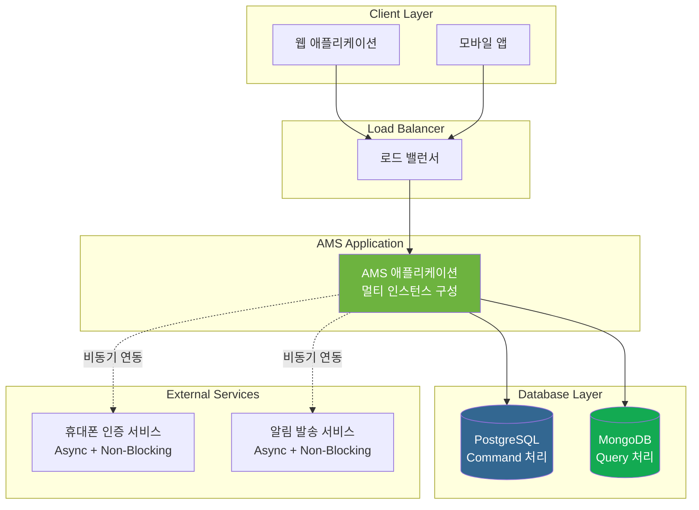
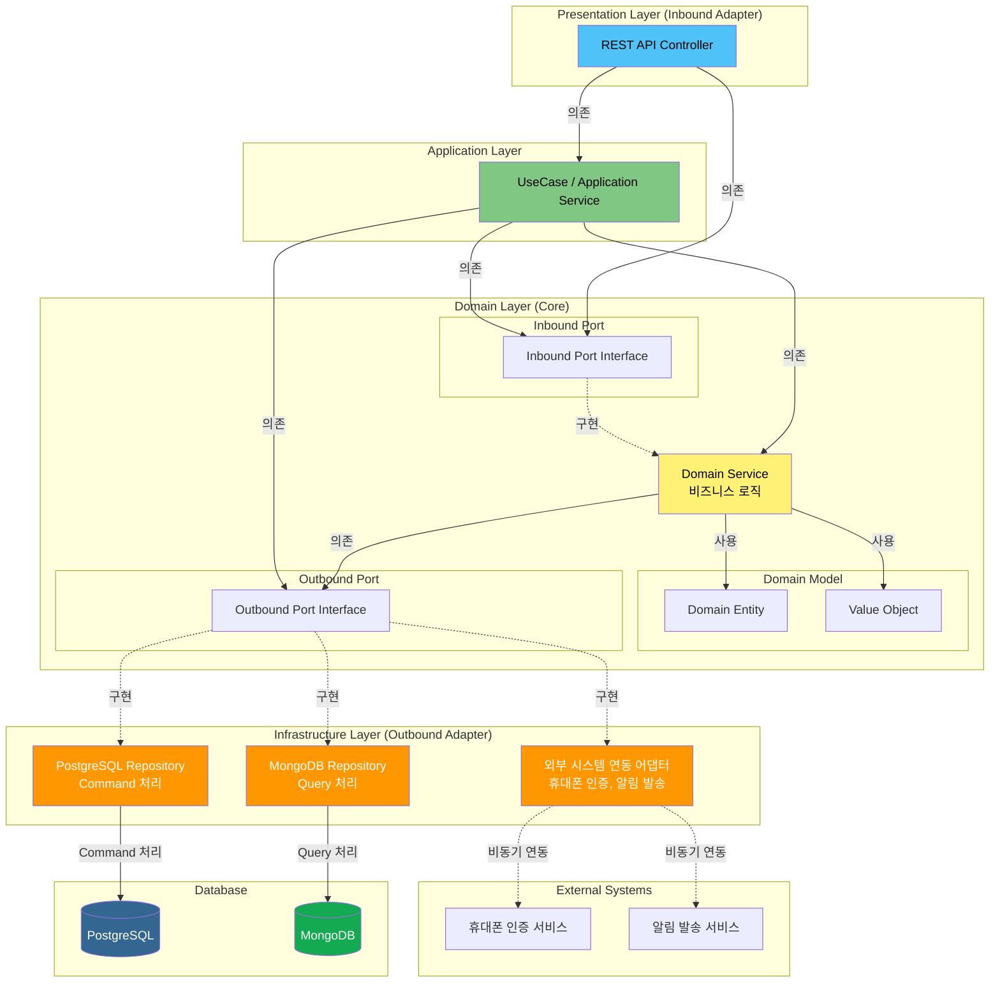
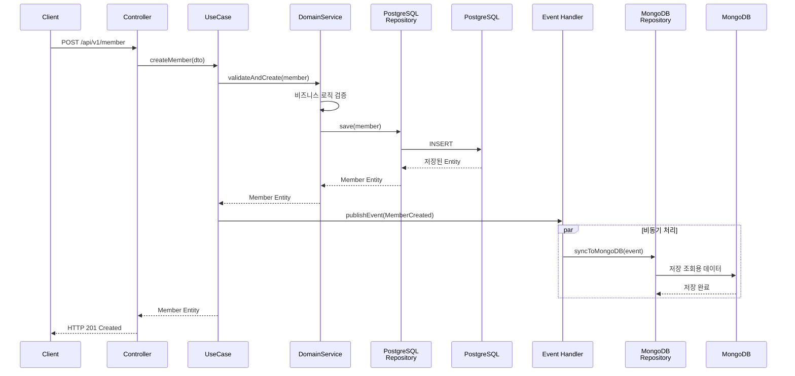
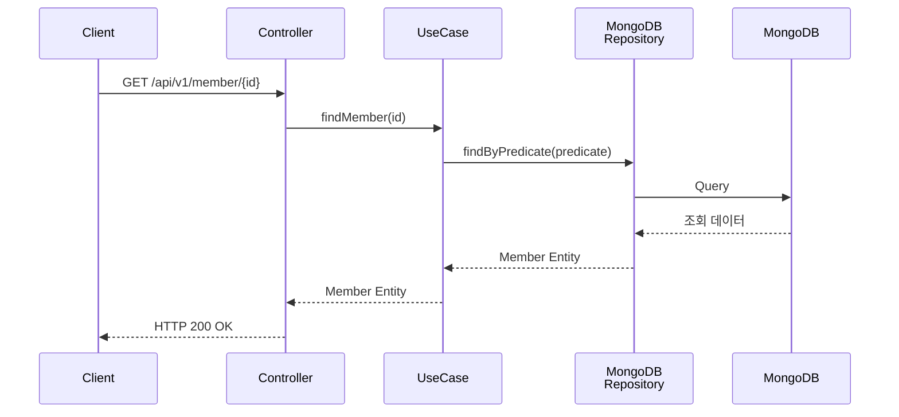
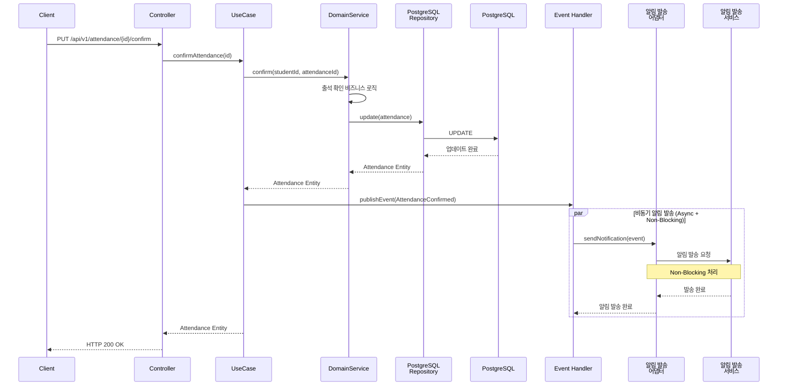
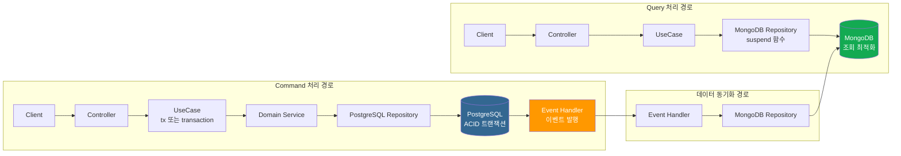
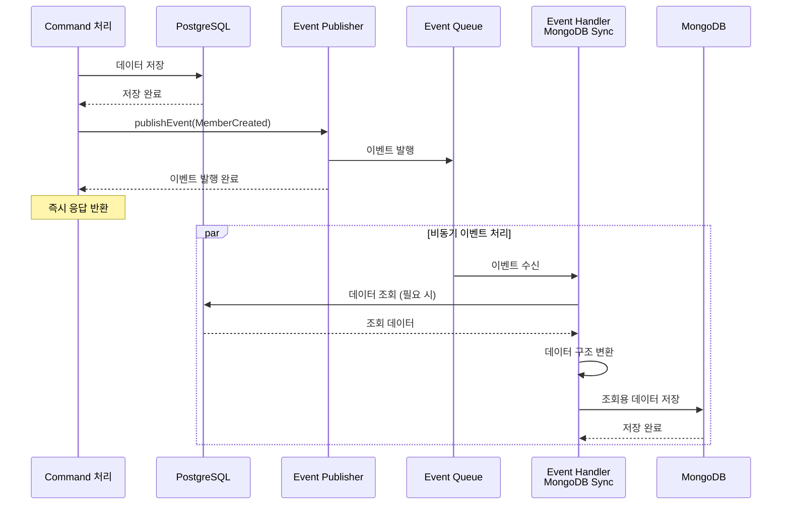
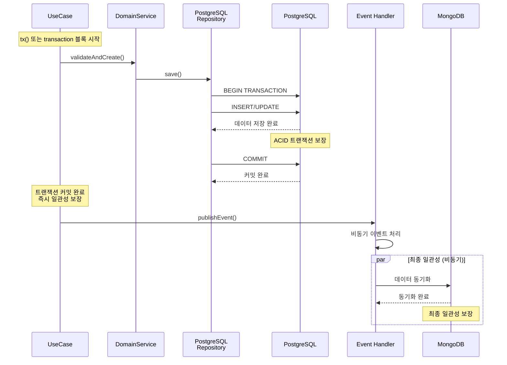
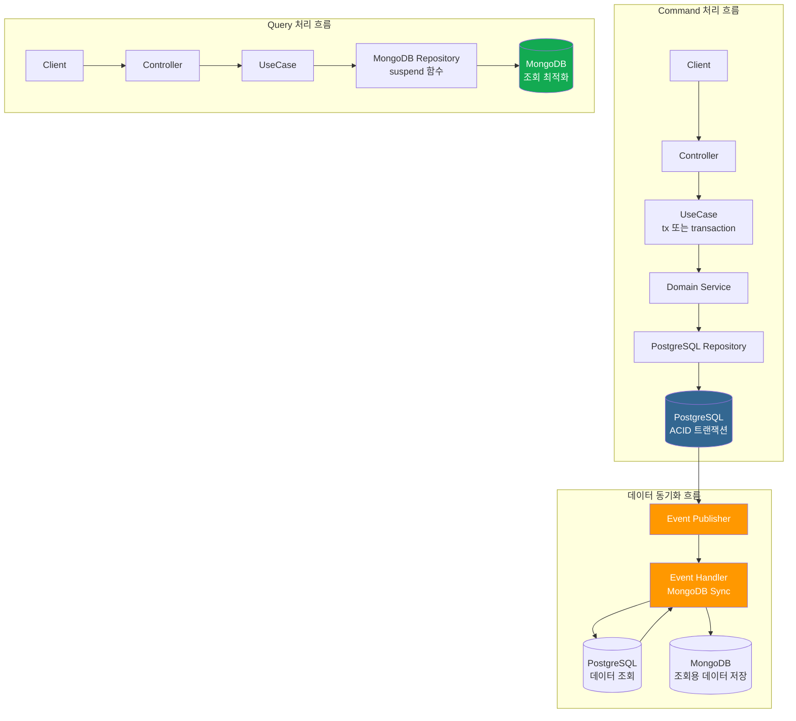

# 🏛️ AMS 시스템 아키텍처

---

## 1. 시스템 개요

### 1.1 시스템 목적 및 범위

**AMS(Academy Management Service)**는 학원 운영과 수강 관리를 효율적으로 지원하기 위한 RESTful 기반의 백엔드 서비스입니다.

#### 시스템 목적

AMS는 학원 운영에 필요한 핵심 기능들을 제공하여 학원의 업무 효율성을 향상시키고, 학원 구성원(학생, 학부모, 강사, 관리자)들이 학원의 수업 정보와 일정을 효과적으로 관리할 수 있도록 지원합니다.

#### 시스템 범위

AMS는 다음과 같은 범위를 제공합니다:

- **학원 정보 관리**: 학원의 기본 정보 등록, 조회, 수정
- **회원 관리**: 학원 서비스 이용자(학생, 학부모, 강사, 관리자)의 회원 정보 통합 관리
- **수업 관리**: 수업 정보, 일정, 출석, 평가 관리
- **운영 관리**: 수납, 영수증, 통계 등 운영 관련 기능 제공

#### 제공 범위

- RESTful API 기반의 백엔드 서비스
- 멀티 테넌트 지원 (여러 학원이 동일한 시스템을 사용)
- 역할 기반 접근 제어 (RBAC)
- 실시간 알림 발송 인터페이스 (향후 카카오 알림톡, SMS, PUSH 지원 예정)

---

### 1.2 주요 비즈니스 도메인

AMS는 다음과 같은 4개의 핵심 비즈니스 도메인으로 구성됩니다:

#### 1.2.1 학원 정보 관리 (Academy Management)

학원의 기본 정보를 등록하고 관리하는 도메인입니다.

- **학원 정보 항목**:
  - 학원 명칭
  - 학원 연락처
  - 학원 주소
  - 운영 시간
  - 대상 범위
  - 교육청 등록번호

#### 1.2.2 회원 관리 (Member Management)

학원 서비스 이용자들의 회원 정보를 통합적으로 관리하는 도메인입니다.

- **회원 유형**:
  - **학생(Student)**: 학원 수업을 수강하는 회원
  - **학부모(Parent)**: 학생의 수강 현황을 조회 및 관리하는 회원
  - **강사(Teacher)**: 학원 수업을 담당하는 회원
  - **운영 관리자(Manager)**: 학원의 전반적인 운영을 담당하는 회원
  - **슈퍼 관리자(Super Admin)**: 전체 학원 시스템을 총괄 관리하는 회원

- **주요 기능**:
  - 회원 가입 및 인증 (휴대폰 인증 기반)
  - 로그인 (로그인ID + 비밀번호, 휴대폰 인증 + 비밀번호)
  - 역할 기반 권한 관리
  - 회원 승인 프로세스 (강사 가입 시 운영 관리자 승인 필요)

#### 1.2.3 수업 관리 (Class Management)

수업 정보와 일정, 출석, 평가 등을 관리하는 도메인입니다.

- **수업 정보 관리**:
  - 수강 과목, 수강 대상, 수강 기간, 수강 목표
  - 교육 과정, 강사 소개, 수강료

- **수업 일정 관리**:
  - 수업 명칭, 수업 과목, 수업 강사
  - 수업 요일, 수업 기간, 수업 정원
  - 강의실 정보 (강의실 명칭, 위치)

- **출석 관리**:
  - 학생 출석 확인 요청
  - 강사 출석 확인 처리
  - 학부모 알림 발송

- **수업 평가 관리**:
  - 학생/학부모의 수업 및 강사 평가 게시글 작성
  - 평가 게시글 관리

#### 1.2.4 운영 관리 (Operation Management)

학원의 수납, 영수증, 통계 등 운영과 관련된 기능을 제공하는 도메인입니다.

- **주요 기능**:
  - 수납 관리
  - 영수증 발급
  - 통계 제공 (기간별, 수업별, 강사별 통계)

---

### 1.3 시스템 경계 및 외부 시스템과의 관계

#### 1.3.1 현재 연동 외부 시스템

AMS는 다음과 같은 외부 시스템과 연동합니다:

1. **휴대폰 인증 서비스**
   - 회원 가입 시 6자리 인증 코드 발급 및 검증
   - 로그인 시 휴대폰 인증 기능 제공
   - 비동기(Async) + Non-Blocking 방식으로 연동

2. **알림 발송 서비스** (인터페이스만 구현)
   - 출석 확인 시 학부모에게 알림 발송
   - 출석 미확인 시 자동 알림 발송
   - 향후 지원 예정: 카카오 알림톡, SMS, PUSH
   - 비동기(Async) + Non-Blocking 방식으로 연동

#### 1.3.2 향후 연동 예정 시스템

AMS는 향후 다음과 같은 외부 시스템과의 연동을 계획하고 있습니다:

1. **OAuth 2.0 소셜 로그인**
   - 소셜 미디어 계정을 통한 로그인 기능

2. **온라인 결제 시스템**
   - 비대면 수강료 결제 시스템

3. **위치 기반 서비스**
   - 학생의 위치가 학원 좌표 반경 50m 이내일 경우 자동 출석 처리

#### 1.3.3 시스템 경계

AMS의 시스템 경계는 다음과 같이 정의됩니다:

- **AMS 내부 영역**: 
  - 비즈니스 로직 처리
  - 데이터 저장 및 관리 (PostgreSQL, MongoDB)
  - 내부 API 제공

- **AMS 외부 영역**:
  - 클라이언트 애플리케이션 (웹, 모바일 앱)
  - 외부 인증 서비스 (휴대폰 인증)
  - 외부 알림 서비스 (SMS, 카카오 알림톡, PUSH)
  - 향후 연동 예정 시스템 (결제, 위치 기반 서비스)

AMS는 RESTful API를 통해 클라이언트와 통신하며, 비동기 방식으로 외부 시스템과 연동하여 높은 성능과 확장성을 보장합니다.

---

## 2. 아키텍처 다이어그램

### 2.1 고수준 아키텍처 다이어그램 (시스템 전체 구성도)

AMS 시스템의 전체 구성은 다음과 같습니다:



#### 주요 구성 요소

- **클라이언트 레이어**: 웹 애플리케이션 및 모바일 앱
- **로드 밸런서**: 다중 인스턴스 간 트래픽 분산
- **AMS 애플리케이션**: 멀티 서버 및 멀티 인스턴스로 구성되어 수평 확장을 지원합니다. 로드 밸런서를 통해 트래픽이 분산되며, 각 인스턴스는 독립적으로 운영됩니다.
- **데이터베이스 레이어**:
  - **PostgreSQL**: Command 처리용 (데이터 쓰기 작업)
  - **MongoDB**: Query 처리용 (데이터 조회 작업)
  - 모든 AMS 인스턴스는 동일한 데이터베이스에 접근합니다.
- **외부 서비스**: 비동기(Async) + Non-Blocking 방식으로 연동
  - 휴대폰 인증 서비스
  - 알림 발송 서비스
  - 각 AMS 인스턴스는 독립적으로 외부 서비스와 비동기 연동합니다.

---

### 2.2 레이어 아키텍처 다이어그램 (Hexagonal Architecture 기반)

AMS는 Hexagonal Architecture(포트/어댑터 패턴)를 기반으로 구성되며, CQRS 패턴을 적용합니다:



#### 레이어 구조 설명

1. **Presentation Layer (Inbound Adapter)**
   - REST API Controller
   - HTTP 요청/응답 처리
   - DTO 변환

2. **Application Layer**
   - UseCase / Application Service
   - 트랜잭션 경계 관리
   - 도메인 서비스 조율

3. **Domain Layer (Core - 비즈니스 로직의 핵심)**
   - **Domain Model**: Entity, Value Object
   - **Inbound Port**: 도메인이 제공하는 인터페이스
   - **Outbound Port**: 도메인이 필요로 하는 인터페이스
   - **Domain Service**: 핵심 비즈니스 로직

4. **Infrastructure Layer (Outbound Adapter)**
   - **PostgreSQL Repository**: Command 처리 (데이터 쓰기)
   - **MongoDB Repository**: Query 처리 (데이터 조회)
   - **외부 시스템 연동 어댑터**: 휴대폰 인증, 알림 발송 등

#### CQRS 패턴 적용

- **Command 처리 경로**: Controller → UseCase → Domain Service → PostgreSQL Repository → PostgreSQL
- **Query 처리 경로**: Controller → UseCase → MongoDB Repository → MongoDB
- **데이터 동기화**: Command 처리 완료 후 이벤트를 통해 MongoDB에 조회용 데이터 저장

#### 의존성 규칙

- 모든 의존성은 **Domain Layer(핵심)** 를 향합니다
- 외부 레이어는 내부 레이어를 의존하지 않습니다
- 포트(Interface)를 통해 어댑터와 도메인이 분리됩니다

---

### 2.3 컴포넌트 간 상호작용 다이어그램

#### 2.3.1 Command 처리 흐름 (데이터 생성 예시: 회원 생성)



#### 2.3.2 Query 처리 흐름 (데이터 조회 예시: 회원 조회)



#### 2.3.3 Event-Driven 처리 흐름 (출석 확인 및 알림 발송)



#### 상호작용 패턴 요약

1. **Command 처리**:
   - 동기적으로 PostgreSQL에 데이터 저장
   - 이벤트 발행을 통해 비동기로 MongoDB 동기화

2. **Query 처리**:
   - MongoDB에서 조회용 데이터를 직접 조회
   - 빠른 응답 시간 보장

3. **Event-Driven 처리**:
   - 도메인 이벤트를 통한 느슨한 결합
   - 비동기(Async) + Non-Blocking 방식으로 외부 시스템 연동
   - 시스템 확장성 및 성능 향상

---

## 3. 기술 스택 상세

### 3.1 기술 스택 개요

AMS는 현대적이고 확장 가능한 백엔드 서비스를 구축하기 위해 다음 기술 스택을 선택했습니다:

- **언어**: Kotlin
- **프레임워크**: Spring Boot
- **ORM**: Kotlin Exposed
- **빌드 도구**: Gradle
- **테스트 프레임워크**: Kotest
- **데이터베이스**: PostgreSQL (RDBMS), MongoDB (NoSQL)
- **비동기 처리**: Kotlin Coroutine, Async + Non-Blocking

#### 기술 스택 선택 기준

1. **생산성**: 개발 효율성과 코드 품질 향상
2. **성능**: 높은 처리량과 낮은 지연 시간
3. **확장성**: 수평 확장 지원 및 멀티 인스턴스 운영
4. **안정성**: 엔터프라이즈급 안정성과 안전성
5. **유지보수성**: 코드 가독성 및 유지보수 용이성

---

### 3.2 언어 및 런타임

#### Kotlin 2.1.10

**선택 이유:**
- JVM 기반 언어로 Java와의 상호 운용성이 뛰어남
- Null 안전성을 통한 안정적인 코드 작성
- 간결한 문법으로 개발 생산성 향상
- 타입 추론을 통한 코드 간결성
- Coroutine을 통한 효율적인 비동기 처리

**역할:**
- AMS 애플리케이션의 주요 개발 언어
- 비즈니스 로직 및 도메인 모델 구현

**주요 특징:**
- **Null 안전성**: 컴파일 타임에 null 참조 오류 방지
- **Coroutine 지원**: 경량 스레드 기반의 Non-Blocking 비동기 처리
- **함수형 프로그래밍**: 불변성 및 고차 함수 지원
- **Java 상호 운용성**: 기존 Java 라이브러리 및 프레임워크와 완벽한 통합
- **확장 함수**: 기존 클래스에 기능을 추가할 수 있는 확장성

---

### 3.3 프레임워크 및 라이브러리

#### Spring Boot 3.4.3

**선택 이유:**
- 엔터프라이즈급 애플리케이션 개발을 위한 풍부한 기능 제공
- 자동 설정(Auto Configuration)을 통한 빠른 개발
- 활발한 커뮤니티와 광범위한 생태계
- 프로덕션 레벨의 보안 및 모니터링 지원

**역할:**
- AMS 애플리케이션의 핵심 프레임워크
- 의존성 주입(DI), AOP, 트랜잭션 관리 제공

**주요 기능:**
- **의존성 주입(Dependency Injection)**: 느슨한 결합을 통한 유연한 구조
- **AOP(Aspect-Oriented Programming)**: 횡단 관심사 처리 (로깅, 트랜잭션 등)
- **트랜잭션 관리**: 선언적 트랜잭션 관리 지원
- **웹 MVC**: RESTful API 구현을 위한 웹 프레임워크
- **자동 설정**: 프로젝트 설정 최소화

#### Kotlin Exposed 0.60.0

**선택 이유:**
- Kotlin 네이티브 ORM으로 타입 안전성 제공
- DSL을 통한 직관적인 쿼리 작성
- 컴파일 타임에 쿼리 오류 검출 가능
- 가벼운 프레임워크로 학습 곡선이 낮음

**역할:**
- PostgreSQL 데이터베이스 접근 프레임워크
- 타입 안전한 쿼리 작성 및 데이터 매핑

**주요 기능:**
- **타입 안전한 쿼리**: 컴파일 타임에 쿼리 검증
- **DSL 지원**: 직관적인 쿼리 작성 문법
- **마이그레이션 지원**: 데이터베이스 스키마 버전 관리
- **트랜잭션 관리**: Exposed의 `transaction` 블록 또는 `newSuspendedTransaction`을 통한 트랜잭션 처리
- **Coroutine 지원**: 비동기 데이터베이스 접근

#### MongoDB Kotlin Driver (공식)

**선택 이유:**
- MongoDB 공식 Kotlin 드라이버로 장기적인 지원 및 유지보수 보장
- Kotlin 네이티브 드라이버로 Exposed와 일관된 Kotlin 네이티브 기술 스택 유지
- Coroutine 기반 비동기 프로그래밍 완벽 지원
- 최신 MongoDB 기능을 신속하게 반영
- `kotlinx.serialization`과의 통합 지원

**역할:**
- MongoDB 데이터베이스 접근 드라이버
- Query 처리용 데이터베이스 접근 (CQRS 패턴)
- 비동기 데이터 조회 및 저장

**주요 기능:**
- **Coroutine 지원**: `suspend` 함수를 통한 Non-Blocking 비동기 처리
- **Kotlin 네이티브**: Kotlin 언어에 최적화된 API 제공
- **kotlinx.serialization 통합**: Kotlin 데이터 클래스와의 직렬화/역직렬화 지원
- **타입 안전성**: Kotlin의 타입 시스템을 활용한 안전한 코드 작성
- **공식 지원**: MongoDB 공식 문서 및 지속적인 업데이트 제공
- **Spring Boot 통합**: `MongoClient`를 Bean으로 등록하여 Spring 환경에서 사용 가능

**참고 문서:**
- [MongoDB Kotlin Driver 공식 문서](https://www.mongodb.com/ko-kr/docs/drivers/kotlin/coroutine/current/)

---

### 3.4 빌드 도구

#### Gradle 8.13

**선택 이유:**
- 유연한 빌드 시스템으로 다양한 프로젝트 구조 지원
- 증분 빌드를 통한 빠른 빌드 속도
- Kotlin DSL 지원으로 타입 안전한 빌드 스크립트 작성
- 강력한 의존성 관리 및 캐싱 기능

**역할:**
- 프로젝트 빌드 및 의존성 관리
- 테스트 실행 및 패키징

**주요 특징:**
- **증분 빌드**: 변경된 부분만 재빌드하여 빌드 시간 단축
- **Kotlin DSL**: 타입 안전한 빌드 스크립트 작성
- **의존성 관리**: 효율적인 의존성 해결 및 캐싱
- **멀티 프로젝트 지원**: 모듈화된 프로젝트 구조 지원

---

### 3.5 테스트 프레임워크

#### Kotest

**선택 이유:**
- Kotlin 네이티브 테스트 프레임워크로 Kotlin 특성을 최대한 활용
- 다양한 테스트 스타일 지원 (Behavior-Driven, Property-Based 등)
- 직관적인 어설션 문법
- MockK와의 통합을 통한 Mocking 지원

**역할:**
- 단위 테스트 및 통합 테스트 작성
- 테스트 커버리지 측정 및 리포팅

**주요 특징:**
- **다양한 테스트 스타일**: BDD, Property-Based 등 다양한 스타일 지원
- **직관적인 어설션**: 읽기 쉬운 테스트 코드 작성
- **Coroutine 테스트**: 비동기 코드 테스트 지원
- **통합 테스트**: Spring Boot 테스트 통합 지원

---

### 3.6 데이터베이스

#### PostgreSQL

**선택 이유:**
- ACID 트랜잭션을 완벽히 지원하는 강력한 관계형 데이터베이스
- 오픈소스이면서 엔터프라이즈급 성능 및 안정성
- 다양한 데이터 타입 및 고급 기능 지원
- CQRS 패턴의 Command 처리에 최적화

**역할:**
- Command 처리용 데이터베이스 (CQRS 패턴)
- 트랜잭션이 중요한 데이터 쓰기 작업 처리

**사용 목적:**
- 데이터 생성(CREATE), 수정(UPDATE), 삭제(DELETE) 작업
- 트랜잭션 무결성이 중요한 비즈니스 로직 처리
- 복잡한 관계형 데이터 모델링

**주요 특징:**
- **ACID 트랜잭션**: 데이터 무결성 보장
- **관계형 데이터 모델**: 정규화된 데이터 구조
- **뛰어난 성능**: 대용량 데이터 처리 최적화
- **확장성**: 수평 확장 및 복제 지원

#### MongoDB

**선택 이유:**
- 문서 기반 NoSQL 데이터베이스로 유연한 스키마 지원
- 높은 조회 성능으로 빠른 응답 시간 제공
- 수평 확장이 용이한 구조
- CQRS 패턴의 Query 처리에 최적화

**역할:**
- Query 처리용 데이터베이스 (CQRS 패턴)
- 조회 전용 데이터 저장 및 빠른 조회 성능 제공

**사용 목적:**
- 데이터 조회(READ) 작업
- 빠른 응답 시간이 필요한 조회 쿼리
- 조회 최적화된 데이터 구조 저장

**주요 특징:**
- **문서 기반 저장**: 유연한 스키마 구조
- **높은 조회 성능**: 읽기 성능 최적화
- **수평 확장**: 샤딩을 통한 확장 용이성
- **집계 쿼리**: 복잡한 조회 및 집계 쿼리 지원

---

### 3.7 비동기 처리 기술

#### Kotlin Coroutine

**선택 이유:**
- 경량 스레드 기반의 효율적인 동시성 처리
- Non-Blocking I/O를 통한 높은 처리량
- Thread 오버헤드 감소로 리소스 효율성 향상
- 직관적인 비동기 코드 작성

**역할:**
- Application 내부 Thread 처리 (Non-Blocking 방식)
- 비즈니스 로직 및 데이터베이스 접근의 비동기 처리

**사용 영역:**
- 비즈니스 로직 처리
- 데이터베이스 접근 (PostgreSQL, MongoDB)
- 내부 컴포넌트 간 통신

**주요 특징:**
- **경량 스레드**: 기존 스레드보다 훨씬 가벼운 동시성 처리
- **Non-Blocking I/O**: I/O 대기 중에도 다른 작업 처리 가능
- **Suspend 함수**: 비동기 코드를 동기 코드처럼 작성
- **Structured Concurrency**: 안전한 동시성 처리 보장

#### Async + Non-Blocking

**선택 이유:**
- 외부 시스템 연동 시 높은 성능과 확장성 제공
- Non-Blocking I/O를 통한 동시 처리 능력 향상
- 시스템 리소스 효율적 활용

**역할:**
- Application 외부 연동 처리
- 외부 서비스와의 비동기 통신

**사용 영역:**
- 휴대폰 인증 서비스 연동
- 알림 발송 서비스 연동
- 향후 추가될 외부 시스템 연동

**주요 특징:**
- **비동기 통신**: 응답을 기다리지 않고 다른 작업 처리 가능
- **Non-Blocking**: I/O 대기 중에도 스레드가 차단되지 않음
- **높은 동시성**: 많은 외부 요청을 동시에 처리 가능
- **확장성**: 시스템 부하 증가에 유연하게 대응

---

### 3.8 기술 간 통합 방식

#### Spring Boot와 Kotlin 통합

- Spring Boot의 자동 설정은 Kotlin 코드와 완벽하게 통합됩니다.
- Kotlin의 null 안전성이 Spring의 의존성 주입과 조합되어 안전한 코드 작성이 가능합니다.
- Spring의 어노테이션(@Service, @Repository 등)을 Kotlin 클래스에 적용 가능합니다.

#### Spring Boot와 Kotlin Exposed 통합

- Exposed의 `transaction` 블록을 직접 사용하여 트랜잭션을 관리합니다.
- Coroutine 기반 비동기 처리를 위해 `newSuspendedTransaction` 또는 커스텀 `tx` 함수를 사용합니다.
- Spring Data JPA를 사용하지 않고 Exposed의 네이티브 트랜잭션 관리 기능을 활용합니다.
- 트랜잭션 격리 수준 및 타임아웃 설정을 Exposed 트랜잭션 블록에서 직접 설정할 수 있습니다.

#### Spring Boot와 MongoDB Kotlin Driver 통합

- MongoDB Kotlin Driver의 `MongoClient`를 Spring Bean으로 등록하여 사용합니다.
- Infrastructure Layer의 Repository 구현체에서 MongoDB Kotlin Driver를 직접 사용합니다.
- Coroutine의 `suspend` 함수를 활용하여 Non-Blocking 비동기 데이터 접근을 구현합니다.
- Hexagonal Architecture의 Outbound Adapter 패턴에 맞게 MongoDB 접근을 추상화합니다.

#### Coroutine과 Spring Boot 통합

- Spring WebFlux 또는 Spring MVC와 Coroutine을 통합하여 Non-Blocking 웹 요청 처리를 구현합니다.
- suspend 함수를 사용한 컨트롤러 메서드로 비동기 요청 처리를 구현합니다.
- 데이터베이스 접근 시 Coroutine을 활용하여 Non-Blocking I/O를 구현합니다.

#### CQRS 패턴 구현을 위한 PostgreSQL과 MongoDB 통합

- **Command 처리 경로**:
  - PostgreSQL을 통한 데이터 쓰기 작업
  - Kotlin Exposed를 통한 타입 안전한 쿼리 작성
  - Exposed 트랜잭션 관리를 통한 ACID 보장

- **Query 처리 경로**:
  - MongoDB를 통한 데이터 조회 작업
  - MongoDB Kotlin Driver를 통한 Coroutine 기반 비동기 쿼리 처리
  - `suspend` 함수를 활용한 Non-Blocking 데이터 접근
  - 조회 최적화된 데이터 구조 활용

- **데이터 동기화**:
  - Command 처리 완료 후 도메인 이벤트 발행
  - 이벤트 핸들러를 통한 MongoDB 동기화
  - 비동기 이벤트 처리로 Command 응답 시간에 영향 없음

#### 비동기 처리 패턴 (Coroutine + Async + Non-Blocking)

- **Application 내부 처리**: Coroutine을 통한 Non-Blocking 처리
  - 비즈니스 로직 실행
  - 데이터베이스 접근 (PostgreSQL, MongoDB)
  - 내부 컴포넌트 간 통신

- **Application 외부 연동**: Async + Non-Blocking 처리
  - HTTP 클라이언트를 통한 외부 API 호출
  - 메시지 큐를 통한 비동기 통신
  - 외부 서비스와의 이벤트 기반 통신

- **통합 아키텍처**:
  - Coroutine과 Spring의 비동기 기능을 조합하여 전체적인 Non-Blocking 아키텍처 구현
  - 외부 연동 시 Async 패턴을 적용하여 높은 처리량 확보

---

### 3.9 기술 스택 버전 관리

#### 기술 스택 버전 요약

| 기술 | 버전 | 용도 |
|------|------|------|
| **Kotlin** | 2.1.10 | 개발 언어 |
| **Spring Boot** | 3.4.3 | 애플리케이션 프레임워크 |
| **Kotlin Exposed** | 0.60.0 | ORM 프레임워크 (PostgreSQL) |
| **MongoDB Kotlin Driver** | 최신 버전 | MongoDB 드라이버 (Query 처리) |
| **Gradle** | 8.13 | 빌드 도구 |
| **Kotest** | 최신 버전 | 테스트 프레임워크 |
| **PostgreSQL** | 최신 LTS 버전 | RDBMS (Command 처리) |
| **MongoDB** | 최신 버전 | NoSQL (Query 처리) |

#### 버전 선택 기준

1. **안정성 우선**: 프로덕션 환경에서 검증된 안정적인 버전 선택
2. **보안**: 보안 취약점이 해결된 최신 버전 우선
3. **호환성**: 기술 스택 간 호환성 확인 후 버전 선택
4. **장기 지원(LTS)**: 장기 지원 버전이 있는 경우 우선 선택
5. **커뮤니티**: 활발한 커뮤니티 지원 및 문서화가 잘 된 버전 선택

---

## 4. 아키텍처 패턴 및 원칙

### 4.1 아키텍처 패턴 개요

AMS는 유지보수성, 확장성, 테스트 용이성을 위해 다음과 같은 핵심 아키텍처 패턴을 적용합니다:

- **Hexagonal Architecture (포트/어댑터 패턴)**: 도메인과 외부 세계의 분리를 통한 독립성 확보
- **CQRS (Command Query Responsibility Segregation)**: 명령과 조회의 분리를 통한 성능 및 확장성 향상
- **EDD (Event-Driven Design)**: 이벤트 기반 설계를 통한 느슨한 결합 및 확장성 확보

#### 패턴 선택 이유

1. **유지보수성**: 도메인 로직과 인프라스트럭처의 분리를 통한 코드 품질 향상
2. **확장성**: 각 패턴이 독립적으로 확장 가능한 구조 제공
3. **테스트 용이성**: 포트/어댑터 패턴을 통한 Mock 객체 활용 가능
4. **성능**: CQRS 패턴을 통한 읽기/쓰기 성능 최적화
5. **유연성**: 이벤트 기반 설계를 통한 시스템 구성 요소 간 느슨한 결합

---

### 4.2 Hexagonal Architecture (포트/어댑터 패턴)

#### Hexagonal Architecture 개념

Hexagonal Architecture는 **포트/어댑터 패턴**을 기반으로 한 아키텍처 스타일로, 도메인 로직을 중심에 배치하고 외부 시스템과의 통신을 어댑터를 통해 처리합니다.

**핵심 원칙:**
- 도메인 로직은 외부 시스템에 의존하지 않습니다
- 외부 시스템은 포트(인터페이스)를 통해 도메인과 통신합니다
- 모든 의존성은 도메인을 향합니다 (의존성 역전 원칙)

#### 포트/어댑터 패턴 구성 요소

##### Inbound Port (인바운드 포트)
- **정의**: 도메인이 제공하는 인터페이스
- **역할**: 외부 시스템이 도메인 기능을 사용하기 위한 진입점
- **예시**: `MemberSaveService`, `MemberFindService` 등

##### Outbound Port (아웃바운드 포트)
- **정의**: 도메인이 필요로 하는 인터페이스
- **역할**: 도메인이 외부 시스템과 상호작용하기 위한 인터페이스
- **예시**: `MemberRepository`, `NotificationService` 등

##### Inbound Adapter (인바운드 어댑터)
- **정의**: 외부 요청을 도메인으로 변환하는 어댑터
- **역할**: HTTP 요청, 메시지 큐 등 외부 요청을 처리하여 도메인 포트로 전달
- **예시**: REST API Controller

##### Outbound Adapter (아웃바운드 어댑터)
- **정의**: 도메인 요청을 외부 시스템으로 변환하는 어댑터
- **역할**: 데이터베이스 접근, 외부 API 호출 등 도메인 요청을 외부 시스템 형식으로 변환
- **예시**: PostgreSQL Repository, MongoDB Repository, 외부 서비스 연동 어댑터

#### AMS에서의 적용 방안

##### 레이어 구성

```
┌─────────────────────────────────────────────────────────┐
│  Presentation Layer (Inbound Adapter)                   │
│  - REST API Controller                                  │
│  - HTTP 요청/응답 처리                                      │
└─────────────────────────────────────────────────────────┘
                        ↓
┌─────────────────────────────────────────────────────────┐
│  Application Layer                                      │
│  - UseCase / Application Service                        │
│  - 트랜잭션 경계 관리                                        │
└─────────────────────────────────────────────────────────┘
                        ↓
┌─────────────────────────────────────────────────────────┐
│  Domain Layer (Core)                                    │
│  - Inbound Port (Interface)                             │
│  - Outbound Port (Interface)                            │
│  - Domain Service (비즈니스 로직)                           │
│  - Entity, Value Object                                 │
└─────────────────────────────────────────────────────────┘
                        ↑
┌─────────────────────────────────────────────────────────┐
│  Infrastructure Layer (Outbound Adapter)                │
│  - PostgreSQL Repository                                │
│  - MongoDB Repository                                   │
│  - 외부 시스템 연동 어댑터                                    │
└─────────────────────────────────────────────────────────┘
```

##### 의존성 방향 규칙

1. **모든 의존성은 Domain Layer를 향합니다**
   - Presentation Layer → Domain Layer
   - Application Layer → Domain Layer
   - Infrastructure Layer → Domain Layer

2. **외부 레이어는 내부 레이어를 의존하지 않습니다**
   - Infrastructure Layer는 Presentation Layer를 알지 못합니다
   - Application Layer는 Infrastructure Layer의 구현 세부사항을 알지 못합니다

3. **포트(Interface)를 통해 어댑터와 도메인이 분리됩니다**
   - Inbound Port: 도메인이 제공하는 기능을 정의
   - Outbound Port: 도메인이 필요로 하는 기능을 정의

##### 도메인과 외부 세계의 분리

- **도메인 독립성**: 도메인 로직은 데이터베이스, 웹 프레임워크 등 외부 기술에 의존하지 않습니다
- **테스트 용이성**: 포트를 통해 Mock 객체를 주입하여 도메인 로직을 독립적으로 테스트할 수 있습니다
- **유연성**: 데이터베이스나 외부 시스템을 교체하더라도 도메인 로직은 변경되지 않습니다

---

### 4.3 CQRS (Command Query Responsibility Segregation)

#### CQRS 패턴 개념

CQRS는 **Command(명령)**와 **Query(조회)**의 책임을 분리하는 패턴입니다. 데이터 쓰기와 읽기 작업을 분리하여 각각 최적화된 구조로 구현합니다.

**핵심 원칙:**
- Command: 데이터 상태를 변경하는 작업 (CREATE, UPDATE, DELETE)
- Query: 데이터를 조회하는 작업 (READ)
- Command와 Query를 별도의 모델과 저장소로 분리

#### Command/Query 분리 전략

##### Command 처리 (데이터 쓰기)

- **데이터 소스**: PostgreSQL (RDBMS)
- **처리 작업**: 
  - CREATE: 데이터 생성
  - UPDATE: 데이터 수정
  - DELETE: 데이터 삭제
- **특징**:
  - ACID 트랜잭션 보장
  - 데이터 무결성 유지
  - 복잡한 관계형 데이터 모델링

##### Query 처리 (데이터 조회)

- **데이터 소스**: MongoDB (NoSQL)
- **처리 작업**: 
  - READ: 데이터 조회
  - 검색 및 집계 쿼리
- **특징**:
  - 빠른 조회 성능
  - 조회 최적화된 데이터 구조
  - 수평 확장 용이

##### 데이터 소스 분리 이유

| 항목 | PostgreSQL (Command) | MongoDB (Query) |
|------|---------------------|-----------------|
| **용도** | 데이터 쓰기 작업 | 데이터 조회 작업 |
| **최적화** | ACID 트랜잭션, 데이터 무결성 | 빠른 조회 성능, 수평 확장 |
| **스키마** | 정규화된 관계형 스키마 | 조회 최적화된 문서 스키마 |
| **장점** | 데이터 일관성 보장 | 높은 조회 성능 |

#### CQRS 구현 방식

##### Command 처리 경로

```
Client → Controller → UseCase → Domain Service → PostgreSQL Repository → PostgreSQL
```

**처리 단계:**
1. **Controller**: HTTP 요청을 받아 DTO로 변환
2. **UseCase**: 트랜잭션 경계 관리 및 도메인 서비스 조율
3. **Domain Service**: 비즈니스 로직 검증 및 처리
4. **PostgreSQL Repository**: Kotlin Exposed를 통한 타입 안전한 쿼리 작성
5. **PostgreSQL**: 트랜잭션 보장된 데이터 저장

##### Query 처리 경로

```
Client → Controller → UseCase → MongoDB Repository → MongoDB
```

**처리 단계:**
1. **Controller**: HTTP 요청을 받아 DTO로 변환
2. **UseCase**: 조회 요청 처리 로직
3. **MongoDB Repository**: MongoDB Kotlin Driver를 통한 Coroutine 기반 비동기 쿼리
4. **MongoDB**: 조회 최적화된 데이터 구조에서 빠른 조회

##### 데이터 동기화 전략

Command 처리 완료 후 이벤트를 발행하여 MongoDB에 조회용 데이터를 비동기로 동기화합니다:

```
PostgreSQL 저장 완료 
  → 도메인 이벤트 발행 (MemberCreated, MemberUpdated 등)
  → 이벤트 핸들러가 비동기로 MongoDB에 조회용 데이터 저장
```

**동기화 특징:**
- **비동기 처리**: Command 응답 시간에 영향 없음
- **이벤트 기반**: 느슨한 결합 유지
- **최종 일관성**: Eventual Consistency 모델

#### Event Sourcing 적용 여부

**Event Sourcing 미적용**

AMS는 **단순 CQRS 패턴**만 적용하며, Event Sourcing은 사용하지 않습니다.

**이유:**
1. **복잡도 관리**: Event Sourcing은 시스템 복잡도를 높일 수 있습니다
2. **요구사항**: 현재 비즈니스 요구사항에 Event Sourcing이 필수적이지 않습니다
3. **충분한 이점**: CQRS 패턴만으로도 읽기/쓰기 성능 최적화가 가능합니다

**대안:**
- **도메인 이벤트**: Command 처리 완료 후 도메인 이벤트를 발행하여 데이터 동기화
- **이벤트 기반 동기화**: Event-Driven Design을 통해 비동기 데이터 동기화

**결론:**
- Event Sourcing은 적용하지 않음
- 도메인 이벤트를 통한 데이터 동기화만 사용
- 필요 시 향후 Event Sourcing 도입 가능한 구조로 설계

---

### 4.4 EDD (Event-Driven Design)

#### EDD 개념 및 목적

EDD(Event-Driven Design)는 도메인 이벤트를 중심으로 시스템을 설계하는 아키텍처 스타일입니다.

**핵심 원칙:**
- 도메인 이벤트를 통한 시스템 구성 요소 간 통신
- 이벤트 발행자와 수신자의 느슨한 결합
- 비동기 이벤트 처리로 시스템 확장성 향상

**적용 목적:**
- 시스템 구성 요소 간 느슨한 결합 확보
- 비동기 처리를 통한 성능 향상
- 이벤트 기반 확장 가능한 구조 제공

#### 도메인 이벤트 설계

##### 이벤트 종류

AMS에서 발행하는 주요 도메인 이벤트:

| 이벤트 이름 | 설명 | 발행 시점 |
|-----------|------|----------|
| `MemberCreated` | 회원 정보 생성 완료 | 회원 생성 Command 처리 완료 후 |
| `MemberUpdated` | 회원 정보 수정 완료 | 회원 수정 Command 처리 완료 후 |
| `AttendanceConfirmed` | 출석 확인 완료 | 출석 확인 Command 처리 완료 후 |
| `ClassCreated` | 수업 생성 완료 | 수업 생성 Command 처리 완료 후 |
| `ClassUpdated` | 수업 정보 수정 완료 | 수업 수정 Command 처리 완료 후 |

##### 이벤트 발행 시점

- **Command 처리 완료 후**: 데이터가 성공적으로 저장된 후 이벤트 발행
- **트랜잭션 커밋 전**: 트랜잭션이 커밋되기 직전에 이벤트 발행하여 데이터 일관성 보장
- **비동기 발행**: 이벤트 발행이 Command 응답 시간에 영향을 주지 않도록 비동기 처리

##### 이벤트 핸들러

이벤트 핸들러는 발행된 이벤트를 수신하여 후속 작업을 처리합니다:

| 이벤트 핸들러 | 처리 작업 | 목적 |
|------------|---------|------|
| `MongoDBSyncHandler` | MongoDB에 조회용 데이터 저장 | CQRS 데이터 동기화 |
| `NotificationHandler` | 학부모에게 알림 발송 | 출석 확인 알림 등 |
| `StatisticsHandler` | 통계 데이터 업데이트 | 운영 통계 계산 |

#### 이벤트 처리 방식

##### 비동기 이벤트 처리 (Non-Blocking)

- **이벤트 발행**: Command 처리 완료 후 이벤트를 발행하고 즉시 응답 반환
- **비동기 처리**: 이벤트 핸들러가 별도의 스레드에서 비동기로 처리
- **Non-Blocking**: 이벤트 처리가 Command 응답 시간에 영향을 주지 않음

##### 이벤트 기반 느슨한 결합

- **이벤트 발행자와 수신자 분리**: 이벤트 발행자는 수신자의 존재를 알 필요 없음
- **독립적인 확장**: 이벤트 핸들러는 독립적으로 추가/제거 가능
- **유연한 통신**: 이벤트를 통해 시스템 구성 요소 간 통신

##### 시스템 확장성 향상

- **수평 확장**: 이벤트 핸들러를 여러 인스턴스로 확장 가능
- **부하 분산**: 이벤트 기반 메시지 큐를 통한 부하 분산
- **결합도 감소**: 직접적인 의존성 없이 이벤트를 통한 통신

---

### 4.5 도메인 모델 설계

#### 도메인 중심 설계 (Domain-Driven Design) 원칙

AMS는 Domain-Driven Design(DDD) 원칙을 따라 도메인 모델을 설계합니다.

**핵심 원칙:**
1. **도메인 모델 중심**: 비즈니스 로직을 도메인 모델에 집중
2. **유비쿼터스 언어**: 비즈니스 도메인의 용어를 코드에서도 사용
3. **경계 컨텍스트**: 도메인별로 명확한 경계 설정
4. **도메인 서비스**: 여러 엔티티에 걸친 비즈니스 로직 처리

#### 도메인 모델 구성

##### Entity (엔티티)

- **정의**: 식별자를 가진 도메인 객체
- **특징**: 
  - 고유한 식별자(ID)를 가짐
  - 생명주기를 가짐
  - 상태 변경 가능
- **예시**: `Student`, `Academy`, `Class`, `Teacher` 등

##### Value Object (값 객체)

- **정의**: 값으로 정의되는 불변 객체
- **특징**:
  - 식별자 없음
  - 값이 같으면 동일한 객체
  - 불변성(Immutable)
- **예시**: `Address`, `Money`, `Email` 등

##### Domain Service (도메인 서비스)

- **정의**: 여러 엔티티에 걸친 비즈니스 로직을 처리하는 서비스
- **특징**:
  - 엔티티나 값 객체에 속하지 않는 로직 처리
  - 상태 없이 순수한 비즈니스 로직만 포함
- **예시**: `MemberSaveService`, `MemberFindService` 등

##### Repository Interface (리포지토리 인터페이스)

- **정의**: 도메인이 필요로 하는 데이터 접근 인터페이스
- **특징**:
  - 도메인 레이어에 정의 (Outbound Port)
  - 구현은 Infrastructure Layer에서 담당
- **예시**: `MemberRepository`, `AcademyRepository` 등

#### 도메인 모델 예시

##### Student (학생 엔티티)

```kotlin
// 도메인 모델 예시 (의사 코드)
class Student(
    val id: StudentId,              // 식별자
    val name: String,                // 이름
    val mobileNumber: PhoneNumber,   // Value Object
    val dateOfBirth: DateOfBirth,    // Value Object
    val address: Address,            // Value Object
    val school: School,              // Value Object
    val grade: Grade,               // Value Object
    val status: ActivationStatus     // 상태
) {
    // 도메인 로직
    fun isActive(): Boolean {
        return status == ActivationStatus.ACTIVE
    }
}
```

##### 주요 도메인 모델

AMS의 주요 도메인 모델:

- **학원 정보 관리 도메인**: `Academy`, `AcademyInfo`
- **회원 관리 도메인**: `Student`, `Parent`, `Teacher`, `Manager`
- **수업 관리 도메인**: `Class`, `ClassSchedule`, `Attendance`, `Evaluation`
- **운영 관리 도메인**: `Payment`, `Receipt`, `Statistics`

---

### 4.6 아키텍처 패턴 통합

#### Hexagonal Architecture + CQRS + EDD 통합

AMS는 세 가지 아키텍처 패턴을 통합하여 강력하고 확장 가능한 시스템을 구축합니다:

```
┌─────────────────────────────────────────────────────────────┐
│ Hexagonal Architecture                                      │
│  - 도메인 중심 설계                                             │
│  - 포트/어댑터 패턴                                             │
│  - 의존성 역전 원칙                                             │
└─────────────────────────────────────────────────────────────┘
                        ↓
┌─────────────────────────────────────────────────────────────┐
│ CQRS                                                        │
│  - Command: PostgreSQL (쓰기)                                │
│  - Query: MongoDB (조회)                                     │
│  - 데이터 소스 분리                                             │
└─────────────────────────────────────────────────────────────┘
                        ↓
┌─────────────────────────────────────────────────────────────┐
│ EDD                                                         │
│  - 도메인 이벤트 발행                                            │
│  - 비동기 이벤트 처리                                            │
│  - 데이터 동기화                                                │
└─────────────────────────────────────────────────────────────┘
```

#### 각 패턴 간 상호작용

1. **Hexagonal Architecture + CQRS**
   - Hexagonal Architecture의 Outbound Adapter가 CQRS의 데이터 소스를 분리
   - PostgreSQL Repository와 MongoDB Repository를 별도의 어댑터로 구현
   - 도메인은 포트(인터페이스)를 통해 각 Repository에 접근

2. **CQRS + EDD**
   - Command 처리 완료 후 도메인 이벤트 발행
   - 이벤트 핸들러가 MongoDB에 조회용 데이터 동기화
   - 비동기 이벤트 처리를 통한 데이터 동기화

3. **Hexagonal Architecture + EDD**
   - 이벤트 발행 및 처리를 Outbound Adapter에서 담당
   - 도메인은 이벤트 인터페이스(포트)만 정의
   - Infrastructure Layer에서 실제 이벤트 처리 구현

#### 전체 아키텍처 구조 요약

AMS의 아키텍처는 다음과 같이 구성됩니다:

1. **레이어 구조**: Hexagonal Architecture 기반의 4계층 구조
   - Presentation Layer (Inbound Adapter)
   - Application Layer
   - Domain Layer (Core)
   - Infrastructure Layer (Outbound Adapter)

2. **데이터 분리**: CQRS 패턴을 통한 Command/Query 분리
   - Command: PostgreSQL (트랜잭션 보장)
   - Query: MongoDB (조회 성능 최적화)

3. **이벤트 처리**: EDD를 통한 비동기 이벤트 처리
   - 도메인 이벤트 발행
   - 비동기 데이터 동기화
   - 느슨한 결합 구조

4. **통합 효과**:
   - **유지보수성**: 명확한 레이어 분리로 코드 품질 향상
   - **확장성**: 독립적으로 확장 가능한 구조
   - **성능**: 읽기/쓰기 성능 최적화
   - **유연성**: 각 구성 요소 간 느슨한 결합

---

## 5. 데이터 아키텍처

### 5.1 데이터 아키텍처 개요

AMS는 **CQRS(Command Query Responsibility Segregation)** 패턴을 기반으로 데이터 아키텍처를 설계합니다.

**핵심 원칙:**
- **Command 처리**: PostgreSQL을 통한 데이터 쓰기 작업 (CREATE, UPDATE, DELETE)
- **Query 처리**: MongoDB를 통한 데이터 조회 작업 (READ)
- **데이터 소스 분리**: 읽기와 쓰기를 별도의 데이터베이스로 분리하여 각각 최적화

**데이터 아키텍처 목표:**
1. **성능 최적화**: 읽기와 쓰기 작업을 독립적으로 최적화
2. **확장성**: 각 데이터베이스를 독립적으로 확장 가능
3. **일관성**: 트랜잭션 보장 및 최종 일관성 모델 적용
4. **유연성**: 각 데이터베이스의 특성에 맞는 데이터 구조 활용

---

### 5.2 PostgreSQL과 MongoDB의 역할 및 책임 구분

#### PostgreSQL 역할 및 책임

PostgreSQL은 **Command 처리**를 담당하는 **Source of Truth**입니다.

**주요 역할:**
- **데이터 쓰기 작업**: CREATE, UPDATE, DELETE 작업 처리
- **트랜잭션 보장**: ACID 트랜잭션을 통한 데이터 무결성 보장
- **데이터 일관성**: 즉시 일관성(Immediate Consistency) 보장
- **관계형 데이터 모델링**: 정규화된 관계형 스키마 관리
- **데이터 무결성**: 외래키, 제약조건 등을 통한 데이터 무결성 유지

**책임 범위:**
- 회원 정보 생성/수정/삭제
- 수업 정보 생성/수정/삭제
- 출석 정보 생성/수정
- 모든 비즈니스 데이터의 원본 저장

**특징:**
- **ACID 트랜잭션**: Atomicity, Consistency, Isolation, Durability 보장
- **관계형 데이터 모델**: 정규화된 스키마로 데이터 중복 최소화
- **데이터 무결성**: 외래키 제약조건을 통한 참조 무결성 보장
- **트랜잭션 격리 수준**: 필요에 따라 다양한 격리 수준 설정 가능

#### MongoDB 역할 및 책임

MongoDB는 **Query 처리**를 담당하는 **Read Model**입니다.

**주요 역할:**
- **데이터 조회 작업**: READ 작업 처리
- **조회 성능 최적화**: 빠른 조회 응답 시간 제공
- **조회 최적화된 데이터 구조**: 비정규화된 문서 구조 저장
- **수평 확장**: 샤딩을 통한 대용량 데이터 처리
- **집계 쿼리**: 복잡한 조회 및 집계 쿼리 처리

**책임 범위:**
- 회원 정보 조회
- 수업 정보 조회
- 출석 정보 조회
- 통계 데이터 조회
- 검색 및 필터링 쿼리

**특징:**
- **문서 기반 저장**: 유연한 스키마 구조로 조회 최적화
- **높은 조회 성능**: 읽기 성능 최적화
- **수평 확장**: 샤딩을 통한 확장 용이성
- **집계 파이프라인**: 복잡한 집계 쿼리 지원

#### 역할 구분 이유 및 장점

**역할 구분 이유:**

| 구분 | 이유 |
|------|------|
| **성능 최적화** | 각 데이터베이스의 특성에 맞게 최적화 가능 |
| **확장성** | 읽기와 쓰기를 독립적으로 확장 가능 |
| **유연성** | 각 데이터베이스에 최적화된 데이터 구조 활용 |
| **부하 분산** | 읽기/쓰기 부하를 분리하여 처리 |

**역할 구분의 장점:**

1. **성능 향상**
   - PostgreSQL: 트랜잭션 보장에 최적화된 쓰기 성능
   - MongoDB: 조회 최적화된 읽기 성능

2. **확장성 향상**
   - PostgreSQL: 수직 확장 또는 복제를 통한 확장
   - MongoDB: 샤딩을 통한 수평 확장

3. **유연성 향상**
   - PostgreSQL: 정규화된 관계형 스키마로 데이터 무결성 보장
   - MongoDB: 비정규화된 문서 스키마로 조회 성능 최적화

4. **독립적 운영**
   - 각 데이터베이스를 독립적으로 유지보수 및 업그레이드 가능
   - 데이터베이스별 특성에 맞는 최적화 수행

---

### 5.3 CQRS 데이터 흐름 상세 설명

#### 5.3.1 Command 처리 (PostgreSQL)

##### 처리 경로

```
Client 
  → Controller (HTTP 요청 수신)
  → UseCase (트랜잭션 경계 관리)
  → Domain Service (비즈니스 로직 검증)
  → PostgreSQL Repository (데이터 저장)
  → PostgreSQL (트랜잭션 커밋)
  → Event Handler (이벤트 발행)
```

##### 처리 단계 상세

1. **Controller (HTTP 요청 수신)**
   - REST API 엔드포인트를 통해 HTTP 요청 수신
   - Request DTO를 Domain Entity로 변환
   - UseCase 호출

2. **UseCase (트랜잭션 경계 관리)**
   - Exposed의 `transaction` 블록 또는 `newSuspendedTransaction`을 통한 트랜잭션 경계 설정
   - Coroutine 기반의 경우 커스텀 `tx` 함수를 통해 트랜잭션 관리
   - 트랜잭션 시작
   - Domain Service 호출하여 비즈니스 로직 실행
   - 트랜잭션 커밋 또는 롤백 처리

3. **Domain Service (비즈니스 로직 검증)**
   - 비즈니스 규칙 검증
   - 데이터 무결성 검증
   - 도메인 로직 실행

4. **PostgreSQL Repository (데이터 저장)**
   - Kotlin Exposed를 통한 타입 안전한 쿼리 작성
   - INSERT, UPDATE, DELETE 쿼리 실행
   - PostgreSQL 트랜잭션 내에서 실행

5. **PostgreSQL (트랜잭션 커밋)**
   - ACID 트랜잭션 보장
   - 데이터 영구 저장
   - 트랜잭션 커밋 완료

6. **Event Handler (이벤트 발행)**
   - 트랜잭션 커밋 직전 또는 직후 이벤트 발행
   - 도메인 이벤트 발행 (예: MemberCreated, MemberUpdated)
   - 비동기로 이벤트 핸들러에게 전달

##### 트랜잭션 처리 방식

- **Exposed 트랜잭션 관리**: Exposed의 `transaction` 블록을 통한 트랜잭션 관리
- **Coroutine 트랜잭션**: Coroutine 기반 비동기 처리를 위한 `newSuspendedTransaction` 사용
- **커스텀 tx 함수**: `newSuspendedTransaction`을 래핑한 커스텀 `tx` 함수 활용
- **ACID 보장**: PostgreSQL의 ACID 트랜잭션 특성을 활용
- **트랜잭션 격리 수준**: 필요에 따라 격리 수준 설정 (기본: READ_COMMITTED)

##### 이벤트 발행 시점

- **트랜잭션 커밋 전**: 트랜잭션이 커밋되기 직전에 이벤트 발행하여 데이터 일관성 보장
- **트랜잭션 커밋 후**: 트랜잭션 커밋이 완료된 후 이벤트 발행하여 안전성 확보
- **비동기 발행**: 이벤트 발행이 Command 응답 시간에 영향을 주지 않도록 비동기 처리

#### 5.3.2 Query 처리 (MongoDB)

##### 처리 경로

```
Client 
  → Controller (HTTP 요청 수신)
  → UseCase (조회 로직 처리)
  → MongoDB Repository (데이터 조회)
  → MongoDB (쿼리 실행)
  → Controller (응답 반환)
```

##### 처리 단계 상세

1. **Controller (HTTP 요청 수신)**
   - REST API 엔드포인트를 통해 HTTP 요청 수신
   - Query Parameter 또는 Request Body 파싱
   - UseCase 호출

2. **UseCase (조회 로직 처리)**
   - 조회 요청 처리 로직
   - Predicate 생성 (조회 조건)
   - MongoDB Repository 호출

3. **MongoDB Repository (데이터 조회)**
   - MongoDB Kotlin Driver를 통한 Coroutine 기반 비동기 쿼리
   - `suspend` 함수를 활용한 Non-Blocking 데이터 접근
   - 조회 최적화된 쿼리 작성

4. **MongoDB (쿼리 실행)**
   - 조회 최적화된 문서 스키마에서 데이터 조회
   - 인덱스를 활용한 빠른 조회 성능
   - 집계 파이프라인을 통한 복잡한 조회 처리

5. **Controller (응답 반환)**
   - 조회된 데이터를 Response DTO로 변환
   - HTTP 응답 반환

##### 비동기 쿼리 처리

- **Coroutine 기반**: `suspend` 함수를 통한 Non-Blocking 비동기 처리
- **Non-Blocking I/O**: I/O 대기 중에도 다른 요청 처리 가능
- **높은 동시성**: 많은 조회 요청을 동시에 처리 가능

##### 조회 최적화 전략

- **비정규화된 데이터 구조**: 조회 시 JOIN 없이 빠른 조회
- **인덱스 활용**: 자주 사용되는 조회 조건에 인덱스 생성
- **캐싱 전략**: 자주 조회되는 데이터는 캐시 활용 (향후 Redis 도입 고려)
- **조회 전용 데이터 구조**: PostgreSQL 스키마와 다른 구조로 저장하여 조회 성능 최적화

#### 5.3.3 CQRS 데이터 흐름 다이어그램



---

### 5.4 데이터 동기화 전략

#### 5.4.1 이벤트 기반 동기화 방식

AMS는 **도메인 이벤트를 통한 비동기 데이터 동기화**를 사용합니다.

**동기화 원칙:**
- **이벤트 발행**: Command 처리 완료 후 도메인 이벤트 발행
- **비동기 처리**: 이벤트 처리가 Command 응답 시간에 영향을 주지 않음
- **최종 일관성**: PostgreSQL과 MongoDB 간 최종 일관성(Eventual Consistency) 모델

##### 도메인 이벤트 발행 시점

- **트랜잭션 커밋 직전**: 트랜잭션이 커밋되기 직전에 이벤트를 발행하여 데이터 일관성 보장
- **트랜잭션 커밋 후**: 트랜잭션 커밋이 완료된 후 이벤트를 발행하여 안전성 확보
- **비동기 발행**: 이벤트 발행 자체도 비동기로 처리하여 Command 응답 시간에 영향 없음

##### 이벤트 핸들러 역할

이벤트 핸들러는 발행된 도메인 이벤트를 수신하여 다음과 같은 작업을 수행합니다:

1. **MongoDB 동기화 핸들러**
   - PostgreSQL에 저장된 데이터를 MongoDB에 조회용 데이터로 저장
   - 조회 최적화된 데이터 구조로 변환
   - 비동기로 MongoDB에 데이터 저장

2. **알림 발송 핸들러**
   - 출석 확인 등의 이벤트 발생 시 알림 발송
   - 비동기로 외부 알림 서비스 호출

3. **통계 업데이트 핸들러**
   - 데이터 변경 시 통계 데이터 업데이트
   - 비동기로 통계 데이터 계산 및 저장

##### 비동기 처리 방식

- **이벤트 발행**: Command 처리 완료 후 이벤트를 발행하고 즉시 응답 반환
- **이벤트 큐**: 이벤트를 메시지 큐에 발행 (향후 Kafka, RabbitMQ 등 도입 고려)
- **이벤트 핸들러**: 별도의 스레드에서 비동기로 이벤트 처리
- **Non-Blocking**: 이벤트 처리가 Command 응답에 영향을 주지 않음

#### 5.4.2 동기화 프로세스

##### 데이터 동기화 단계

```
1. PostgreSQL 저장 완료
   ↓
2. 도메인 이벤트 발행 (MemberCreated, MemberUpdated 등)
   ↓
3. 이벤트 핸들러가 이벤트 수신
   ↓
4. PostgreSQL 데이터 조회 (필요 시)
   ↓
5. 조회 최적화된 데이터 구조로 변환
   ↓
6. MongoDB에 비동기로 저장
   ↓
7. 동기화 완료
```

##### 동기화 프로세스 상세

1. **PostgreSQL 저장 완료**
   - Command 처리가 완료되어 PostgreSQL에 데이터가 저장됨
   - 트랜잭션이 커밋되어 데이터가 영구 저장됨

2. **도메인 이벤트 발행**
   - 이벤트 발행 (예: `MemberCreated`, `MemberUpdated`)
   - 이벤트에는 변경된 데이터 정보 포함

3. **이벤트 핸들러가 이벤트 수신**
   - `MongoDBSyncHandler`가 이벤트 수신
   - 이벤트 타입에 따라 적절한 동기화 로직 실행

4. **조회 최적화된 데이터 구조로 변환**
   - PostgreSQL의 정규화된 스키마를 MongoDB의 비정규화된 스키마로 변환
   - 조회 시 JOIN 없이 빠르게 조회할 수 있도록 데이터 구조 최적화
   - 관련 데이터를 포함하여 단일 문서로 저장

5. **MongoDB에 비동기로 저장**
   - MongoDB Kotlin Driver를 통한 비동기 데이터 저장
   - Coroutine의 `suspend` 함수를 활용한 Non-Blocking 저장

6. **동기화 완료**
   - MongoDB에 조회용 데이터가 저장되어 이후 조회 요청에 사용 가능

##### 조회용 데이터 구조 변환 예시

**PostgreSQL 구조 (정규화):**
```
STUDENTS 테이블
- id, name, mobile_number, school, grade, status

SCHOOLS 테이블  
- id, name, address

관계: STUDENTS.school_id → SCHOOLS.id
```

**MongoDB 구조 (비정규화):**
```json
{
  "_id": "student_1",
  "name": "홍길동",
  "mobileNumber": "010-1234-5678",
  "school": {
    "id": 1,
    "name": "서울초등학교",
    "address": "서울시..."
  },
  "grade": "3",
  "status": "ACTIVE"
}
```

**변환 이유:**
- 조회 시 JOIN 없이 빠른 조회
- 관련 데이터를 함께 조회하여 네트워크 왕복 최소화
- 조회 성능 최적화

#### 5.4.3 동기화 특징

##### 비동기 처리 (Non-Blocking)

- **Command 응답 시간에 영향 없음**: 이벤트 처리가 비동기로 진행되어 Command 응답이 지연되지 않음
- **높은 처리량**: 여러 이벤트를 동시에 처리 가능
- **리소스 효율성**: 이벤트 처리가 메인 스레드를 블로킹하지 않음

##### 최종 일관성 (Eventual Consistency)

- **일시적 불일치 허용**: PostgreSQL과 MongoDB 간 짧은 시간 동안 데이터 불일치가 발생할 수 있음
- **최종적으로 일관됨**: 이벤트 처리가 완료되면 최종적으로 데이터가 일치함
- **비즈니스 요구사항 반영**: 조회 작업에서 약간의 지연이 허용되는 경우 최종 일관성 모델 채택

**일관성 보장 시점:**
- **PostgreSQL**: 즉시 일관성 (트랜잭션 커밋 즉시)
- **PostgreSQL → MongoDB**: 최종 일관성 (이벤트 처리 완료 후, 보통 수백 밀리초 이내)

##### 오류 처리 및 재시도 전략

- **오류 처리**: 이벤트 처리 중 오류 발생 시 재시도 또는 Dead Letter Queue에 저장
- **재시도 메커니즘**: 일시적 오류의 경우 지수 백오프(Exponential Backoff) 방식으로 재시도
- **최종 실패 처리**: 재시도 후에도 실패하는 경우 별도의 오류 처리 프로세스 실행

#### 5.4.4 데이터 동기화 다이어그램



---

### 5.5 트랜잭션 관리 방식

#### 5.5.1 PostgreSQL 트랜잭션 관리

##### Exposed 트랜잭션 관리

AMS는 **Kotlin Exposed의 트랜잭션 관리**를 사용합니다.

**트랜잭션 설정:**
- **트랜잭션 경계**: Exposed의 `transaction` 블록을 통한 트랜잭션 관리
- **Coroutine 트랜잭션**: `newSuspendedTransaction`을 통한 Coroutine 기반 비동기 트랜잭션 처리
- **커스텀 tx 함수**: `newSuspendedTransaction`을 래핑한 커스텀 `tx` 함수 활용
- **격리 수준**: 필요에 따라 격리 수준 설정 가능
- **롤백 정책**: 예외 발생 시 자동 롤백

**트랜잭션 적용 범위:**
- **UseCase 레이어**: UseCase 메서드 내에서 `tx` 함수 또는 `transaction` 블록 사용
- **트랜잭션 경계**: 트랜잭션 블록 시작부터 완료까지 하나의 트랜잭션으로 관리
- **도메인 서비스**: 트랜잭션 블록 내에서 실행

##### ACID 트랜잭션 보장

PostgreSQL은 ACID 트랜잭션을 완벽히 지원합니다:

- **Atomicity (원자성)**: 트랜잭션 내 모든 작업이 성공하거나 모두 롤백됨
- **Consistency (일관성)**: 트랜잭션 전후 데이터베이스가 항상 일관된 상태 유지
- **Isolation (격리성)**: 동시 실행되는 트랜잭션 간 간섭 방지
- **Durability (지속성)**: 커밋된 트랜잭션은 영구 저장됨

##### 트랜잭션 경계 관리

**트랜잭션 경계:**
- **시작**: UseCase 메서드 진입 시 트랜잭션 시작
- **종료**: UseCase 메서드 종료 시 트랜잭션 커밋 또는 롤백
- **예외 처리**: 런타임 예외 발생 시 자동 롤백

**트랜잭션 경계 관리 예시:**

```kotlin
// Exposed transaction 블록 사용 (동기)
fun createMember(dto: MemberDTO): Member {
    return transaction {
        // 트랜잭션 시작
        val member = domainService.validateAndCreate(dto)
        repository.save(member)
        // 트랜잭션 커밋 (정상 종료 시)
        // 또는 트랜잭션 롤백 (예외 발생 시)
        member
    }
}

// Exposed newSuspendedTransaction 사용 (비동기 - Coroutine)
suspend fun createMember(dto: MemberDTO): Member {
    return newSuspendedTransaction(Dispatchers.IO) {
        // 트랜잭션 시작
        val member = domainService.validateAndCreate(dto)
        repository.save(member)
        // 트랜잭션 커밋 (정상 종료 시)
        // 또는 트랜잭션 롤백 (예외 발생 시)
        member
    }
}

// 커스텀 tx 함수 사용 (비동기 - Coroutine)
suspend fun createMember(dto: MemberDTO): Member {
    return tx {
        // 트랜잭션 시작
        val member = domainService.validateAndCreate(dto)
        repository.save(member)
        // 트랜잭션 커밋 (정상 종료 시)
        // 또는 트랜잭션 롤백 (예외 발생 시)
        member
    }
}
```

##### Coroutine 기반 트랜잭션 처리

- **newSuspendedTransaction**: Exposed의 `newSuspendedTransaction`을 통한 Coroutine 기반 비동기 트랜잭션 처리
- **커스텀 tx 함수**: `newSuspendedTransaction`을 래핑한 `tx` 함수를 통한 간편한 트랜잭션 관리
- **Suspend 함수**: `suspend` 함수를 통한 Non-Blocking 비동기 트랜잭션 처리
- **Non-Blocking**: 트랜잭션 처리가 Non-Blocking 방식으로 동작
- **Dispatcher 설정**: `Dispatchers.IO`를 사용하여 I/O 작업에 최적화된 스레드 풀 활용

#### 5.5.2 분산 트랜잭션 처리 전략

##### 분산 트랜잭션 미사용 (단순 CQRS)

AMS는 **전통적인 분산 트랜잭션(2PC, 3PC)**을 사용하지 않습니다.

**이유:**
1. **성능 저하**: 분산 트랜잭션은 성능 저하 및 지연 시간 증가를 야기할 수 있습니다
2. **복잡도 증가**: 분산 트랜잭션 구현은 시스템 복잡도를 크게 증가시킵니다
3. **가용성 문제**: 분산 트랜잭션은 시스템 가용성에 부정적 영향을 줄 수 있습니다
4. **CQRS 패턴**: CQRS 패턴 자체가 최종 일관성 모델을 전제로 합니다

##### 최종 일관성 모델 채택

AMS는 **최종 일관성(Eventual Consistency)** 모델을 채택합니다.

**최종 일관성 모델:**
- **PostgreSQL**: 즉시 일관성 (Immediate Consistency) - ACID 트랜잭션 보장
- **PostgreSQL → MongoDB**: 최종 일관성 (Eventual Consistency) - 이벤트 기반 비동기 동기화

**일관성 보장 시점:**
- **Command 처리**: PostgreSQL 저장 즉시 일관성 보장
- **Query 처리**: MongoDB 동기화 완료 후 일관성 보장 (보통 수백 밀리초 이내)

##### 이벤트 기반 보상 트랜잭션 (Saga 패턴 고려)

필요한 경우 **Saga 패턴**을 고려할 수 있습니다.

**Saga 패턴:**
- **정의**: 분산 트랜잭션을 여러 로컬 트랜잭션으로 나누어 처리하는 패턴
- **보상 트랜잭션**: 각 단계별로 보상 트랜잭션을 정의하여 오류 시 이전 상태로 복구
- **이벤트 기반**: 도메인 이벤트를 통한 Saga 오케스트레이션

**현재 적용 상태:**
- **단순 CQRS**: 현재는 단순 CQRS 패턴만 적용
- **향후 고려**: 복잡한 비즈니스 시나리오가 필요한 경우 Saga 패턴 도입 검토

#### 5.5.3 트랜잭션 일관성 보장

##### PostgreSQL: 즉시 일관성 (ACID)

- **트랜잭션 커밋**: 트랜잭션 커밋 즉시 데이터 일관성 보장
- **ACID 보장**: Atomicity, Consistency, Isolation, Durability 모두 보장
- **동시성 제어**: 트랜잭션 격리 수준을 통한 동시성 제어

##### PostgreSQL → MongoDB: 최종 일관성 (Eventual Consistency)

- **비동기 동기화**: 이벤트 기반 비동기 동기화로 인한 일시적 불일치 허용
- **동기화 완료 시점**: 이벤트 처리 완료 후 최종 일관성 보장
- **일관성 지연**: 보통 수백 밀리초 이내에 일관성 보장

##### 동기화 지연 처리 방안

**동기화 지연 대응 전략:**

1. **최신 데이터 조회 요청 시**
   - 필요 시 PostgreSQL에서 직접 조회
   - 읽기 부하 분산을 위해 최소한의 경우만 적용

2. **이벤트 처리 모니터링**
   - 이벤트 처리 지연 모니터링
   - 지연 발생 시 알림 및 대응

3. **재시도 메커니즘**
   - 이벤트 처리 실패 시 자동 재시도
   - 재시도 후에도 실패 시 수동 처리 프로세스 실행

#### 5.5.4 트랜잭션 처리 다이어그램



---

### 5.6 데이터 모델 설계

#### 5.6.1 PostgreSQL 데이터 모델

##### 정규화된 관계형 스키마

PostgreSQL은 **정규화된 관계형 스키마**를 사용합니다.

**스키마 특징:**
- **정규화**: 데이터 중복 최소화를 위한 정규화 적용
- **관계형 구조**: 테이블 간 외래키를 통한 관계 정의
- **제약조건**: 데이터 무결성을 위한 제약조건 설정

**주요 테이블 구조:**
- **STUDENTS**: 학생 정보 테이블
- **TEACHERS**: 강사 정보 테이블
- **CLASSES**: 수업 정보 테이블
- **CLASS_SCHEDULES**: 수업 일정 테이블
- **ATTENDANCE**: 출석 정보 테이블

**관계 구조:**
```
TEACHERS (1) ←→ (N) CLASSES
CLASSES (1) ←→ (N) CLASS_SCHEDULES
CLASSES (1) ←→ (N) ATTENDANCE
STUDENTS (1) ←→ (N) ATTENDANCE
```

##### 트랜잭션 보장을 위한 구조

- **ACID 트랜잭션**: 복잡한 비즈니스 로직을 트랜잭션으로 묶어 처리
- **데이터 무결성**: 외래키 제약조건을 통한 참조 무결성 보장
- **일관성**: 트랜잭션을 통한 즉시 일관성 보장

##### 데이터 무결성 제약 조건

- **기본키(Primary Key)**: 각 테이블의 고유 식별자
- **외래키(Foreign Key)**: 테이블 간 관계 및 참조 무결성 보장
- **UNIQUE 제약조건**: 중복 방지를 위한 제약조건
- **CHECK 제약조건**: 데이터 값 유효성 검증
- **NOT NULL 제약조건**: 필수 데이터 보장

#### 5.6.2 MongoDB 데이터 모델

##### 조회 최적화된 문서 스키마

MongoDB는 **조회 최적화된 문서 스키마**를 사용합니다.

**스키마 특징:**
- **비정규화**: 조회 시 JOIN 없이 빠른 조회를 위한 비정규화 구조
- **문서 기반**: 관련 데이터를 하나의 문서에 포함
- **유연한 스키마**: 조회 요구사항에 맞게 유연하게 스키마 변경 가능

**주요 컬렉션 구조:**
- **members**: 회원 정보 (Student, Teacher 등 포함)
- **classes**: 수업 정보 (강사 정보 포함)
- **attendances**: 출석 정보 (학생, 수업 정보 포함)
- **statistics**: 통계 데이터 (집계된 데이터)

**비정규화 구조 예시:**
```json
{
  "_id": "class_1",
  "name": "독서 토론 수업",
  "teacher": {
    "id": 1,
    "name": "김선생",
    "mobileNumber": "010-1111-2222"
  },
  "schedules": [
    {"dayOfWeek": "MON", "time": "14:00"},
    {"dayOfWeek": "TUE", "time": "15:00"}
  ],
  "students": [
    {"id": 1, "name": "홍길동"},
    {"id": 2, "name": "김철수"}
  ]
}
```

##### 비정규화된 구조

- **관련 데이터 포함**: 조회 시 자주 함께 조회되는 데이터를 하나의 문서에 포함
- **JOIN 최소화**: JOIN 없이 단일 쿼리로 필요한 데이터 조회
- **조회 성능 향상**: 네트워크 왕복 최소화 및 빠른 조회 성능

##### 읽기 성능 최적화

- **인덱스 활용**: 자주 사용되는 조회 조건에 인덱스 생성
- **집계 파이프라인**: 복잡한 집계 쿼리를 파이프라인으로 최적화
- **조회 최적화된 구조**: 조회 패턴에 맞게 데이터 구조 설계

#### 5.6.3 데이터 모델 차이점 및 변환

##### PostgreSQL 스키마 → MongoDB 스키마 변환

**변환 원칙:**
- **정규화 → 비정규화**: 정규화된 관계형 스키마를 비정규화된 문서 스키마로 변환
- **관계 포함**: 외래키 관계를 중첩 문서로 변환
- **조회 최적화**: 조회 패턴에 맞게 데이터 구조 최적화

**변환 예시:**

**PostgreSQL 구조 (정규화):**
```sql
STUDENTS 테이블
- id, name, mobile_number, school_id, grade, status

SCHOOLS 테이블
- id, name, address
```

**MongoDB 구조 (비정규화):**
```json
{
  "_id": "student_1",
  "name": "홍길동",
  "mobileNumber": "010-1234-5678",
  "school": {
    "id": 1,
    "name": "서울초등학교",
    "address": "서울시 강남구..."
  },
  "grade": "3",
  "status": "ACTIVE"
}
```

##### 조회 최적화를 위한 데이터 구조 변경

**최적화 전략:**
- **자주 함께 조회되는 데이터 결합**: 하나의 문서에 포함하여 JOIN 없이 조회
- **집계 데이터 사전 계산**: 통계 등 집계 데이터를 사전에 계산하여 저장
- **조회 패턴 반영**: 실제 조회 패턴에 맞게 데이터 구조 설계

##### 동기화 시 데이터 변환 로직

**변환 프로세스:**

```
PostgreSQL 데이터 조회
  ↓
도메인 모델로 변환
  ↓
조회 최적화된 구조로 변환
  ↓
MongoDB 문서 구조로 변환
  ↓
MongoDB 저장
```

**변환 로직 위치:**
- **이벤트 핸들러**: `MongoDBSyncHandler`에서 데이터 변환 로직 실행
- **Mapper 클래스**: 데이터 변환을 위한 Mapper 클래스 활용
- **도메인 모델 활용**: 도메인 모델을 통한 안전한 변환

---

### 5.7 데이터 아키텍처 다이어그램

#### 전체 데이터 흐름 다이어그램



#### 데이터 아키텍처 요약

AMS의 데이터 아키텍처는 다음과 같이 구성됩니다:

1. **Command 처리**: PostgreSQL을 통한 트랜잭션 보장된 데이터 쓰기
2. **Query 처리**: MongoDB를 통한 빠른 조회 성능 제공
3. **데이터 동기화**: 이벤트 기반 비동기 동기화로 최종 일관성 보장
4. **트랜잭션 관리**: Exposed 트랜잭션 관리를 통한 ACID 보장
5. **데이터 모델**: 각 데이터베이스 특성에 맞는 최적화된 스키마 설계

---
