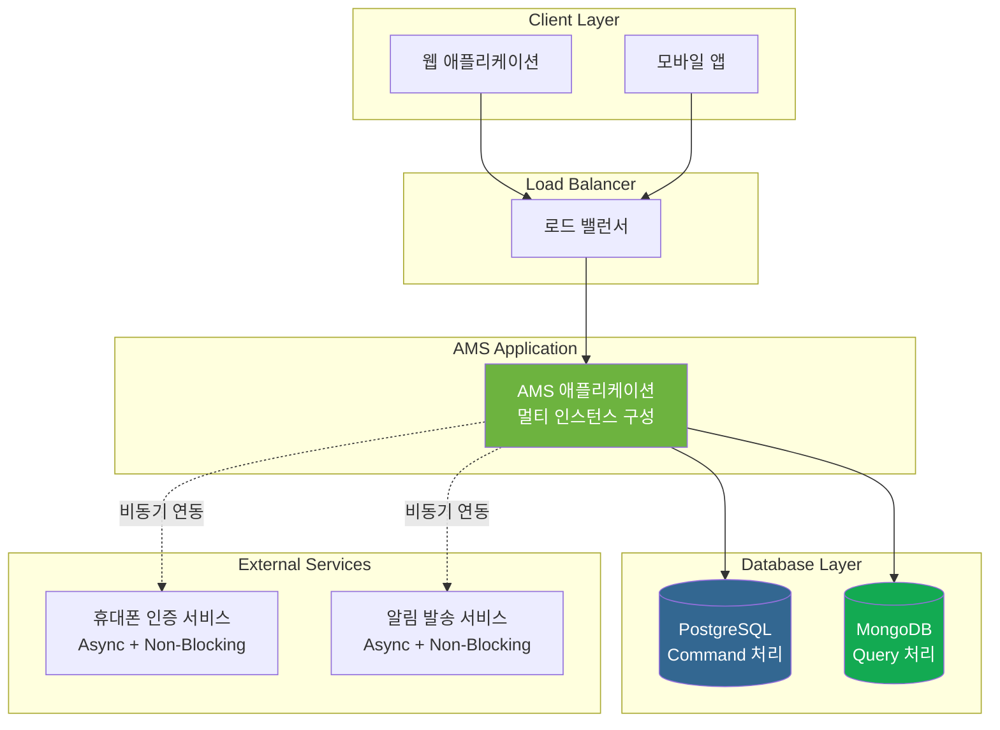
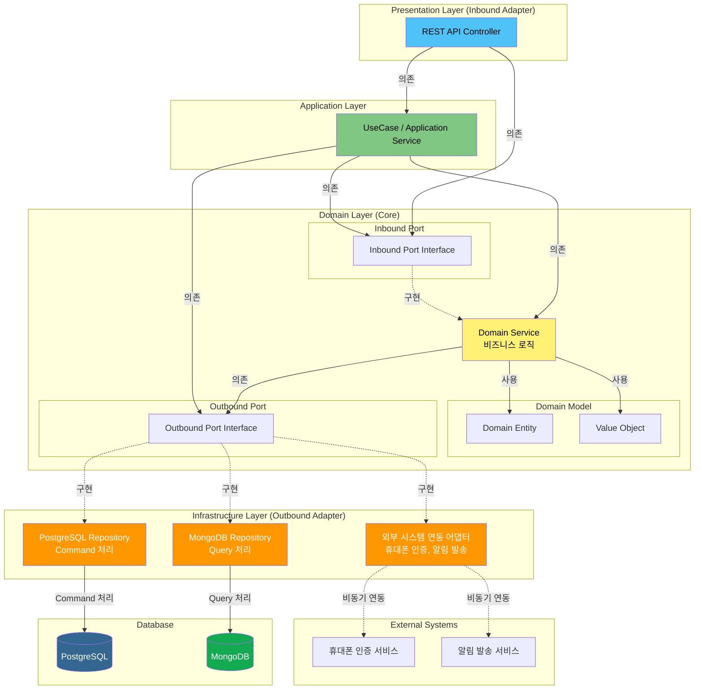
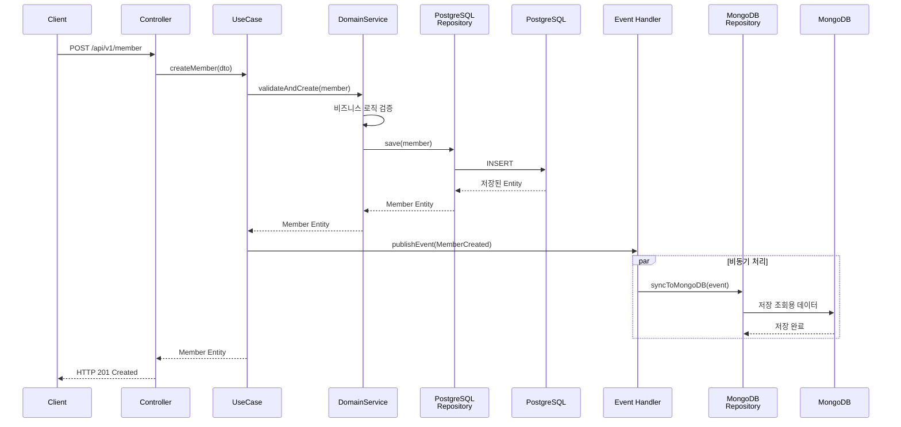
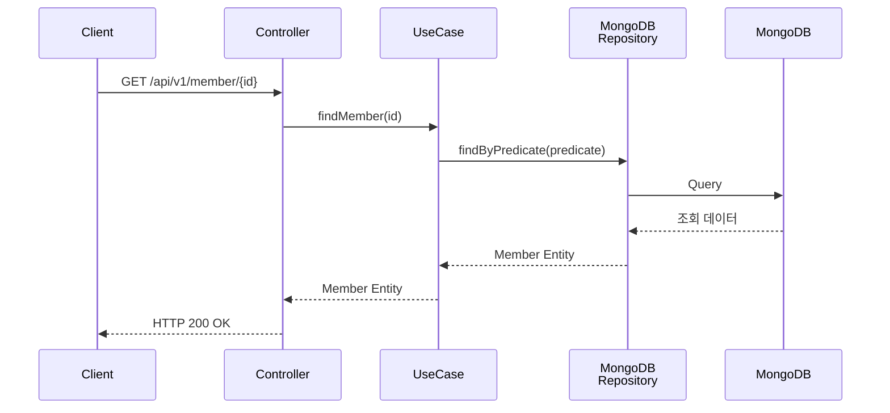
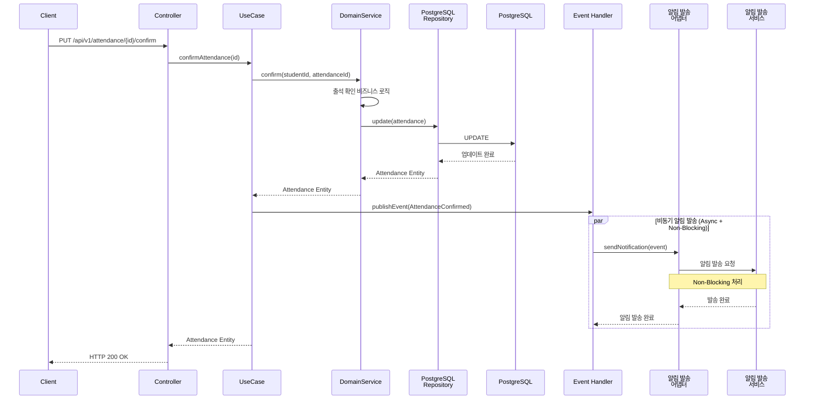

# 2. 아키텍처 다이어그램

[← 메인 문서로 돌아가기](../01_ams_system_architecture.md)

---

### 2.1 고수준 아키텍처 다이어그램 (시스템 전체 구성도)

AMS 시스템의 전체 구성은 다음과 같습니다:

#### 주요 구성 요소

- **클라이언트 레이어**: 웹 애플리케이션 및 모바일 앱
- **로드 밸런서**: 다중 인스턴스 간 트래픽 분산
- **AMS 애플리케이션**: 멀티 서버 및 멀티 인스턴스로 구성되어 수평 확장을 지원합니다. 로드 밸런서를 통해 트래픽이 분산되며, 각 인스턴스는 독립적으로 운영됩니다.
- **데이터베이스 레이어**:
  - **PostgreSQL**: Command 처리용 (데이터 쓰기 작업)
  - **MongoDB**: Query 처리용 (데이터 조회 작업)
  - 모든 AMS 인스턴스는 동일한 데이터베이스에 접근합니다.
- **외부 서비스**: 비동기(Async) + Non-Blocking 방식으로 연동
  - 휴대폰 인증 서비스
  - 알림 발송 서비스
  - 각 AMS 인스턴스는 독립적으로 외부 서비스와 비동기 연동합니다.

---

### 2.2 레이어 아키텍처 다이어그램 (Hexagonal Architecture 기반)

AMS는 Hexagonal Architecture(포트/어댑터 패턴)를 기반으로 구성되며, CQRS 패턴을 적용합니다:

#### 레이어 구조 설명

1. **Presentation Layer (Inbound Adapter)**
   - REST API Controller
   - HTTP 요청/응답 처리
   - DTO 변환

2. **Application Layer**
   - UseCase / Application Service
   - 트랜잭션 경계 관리
   - 도메인 서비스 조율

3. **Domain Layer (Core - 비즈니스 로직의 핵심)**
   - **Domain Model**: Entity, Value Object
   - **Inbound Port**: 도메인이 제공하는 인터페이스
   - **Outbound Port**: 도메인이 필요로 하는 인터페이스
   - **Domain Service**: 핵심 비즈니스 로직

4. **Infrastructure Layer (Outbound Adapter)**
   - **PostgreSQL Repository**: Command 처리 (데이터 쓰기)
   - **MongoDB Repository**: Query 처리 (데이터 조회)
   - **외부 시스템 연동 어댑터**: 휴대폰 인증, 알림 발송 등

#### CQRS 패턴 적용

- **Command 처리 경로**: Controller → UseCase → Domain Service → PostgreSQL Repository → PostgreSQL
- **Query 처리 경로**: Controller → UseCase → MongoDB Repository → MongoDB
- **데이터 동기화**: Command 처리 완료 후 이벤트를 통해 MongoDB에 조회용 데이터 저장

#### 의존성 규칙

- 모든 의존성은 **Domain Layer(핵심)** 를 향합니다
- 외부 레이어는 내부 레이어를 의존하지 않습니다
- 포트(Interface)를 통해 어댑터와 도메인이 분리됩니다

---

### 2.3 컴포넌트 간 상호작용 다이어그램

#### 2.3.1 Command 처리 흐름 (데이터 생성 예시: 회원 생성)

#### 2.3.2 Query 처리 흐름 (데이터 조회 예시: 회원 조회)

#### 2.3.3 Event-Driven 처리 흐름 (출석 확인 및 알림 발송)

#### 상호작용 패턴 요약

1. **Command 처리**:
   - 동기적으로 PostgreSQL에 데이터 저장
   - 이벤트 발행을 통해 비동기로 MongoDB 동기화

2. **Query 처리**:
   - MongoDB에서 조회용 데이터를 직접 조회
   - 빠른 응답 시간 보장

3. **Event-Driven 처리**:
   - 도메인 이벤트를 통한 느슨한 결합
   - 비동기(Async) + Non-Blocking 방식으로 외부 시스템 연동
   - 시스템 확장성 및 성능 향상

---

