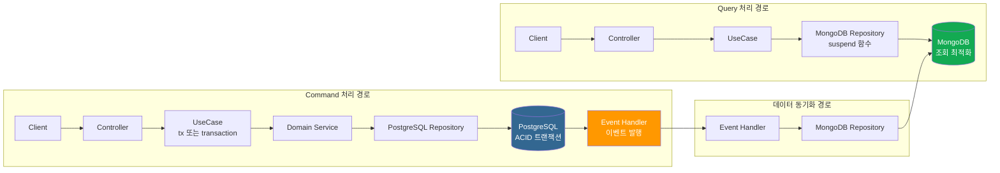
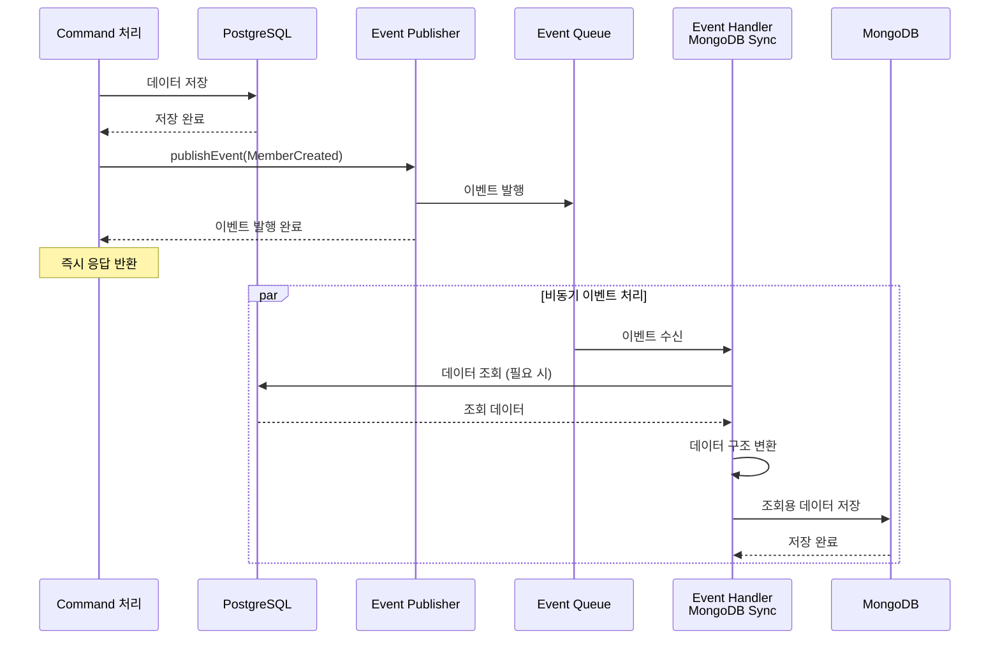
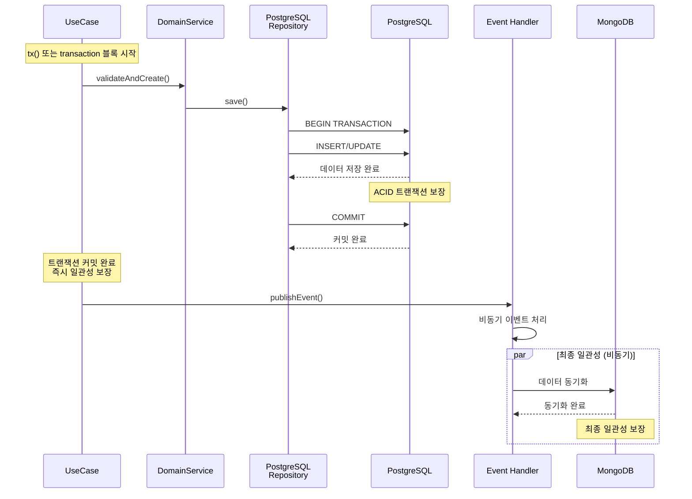
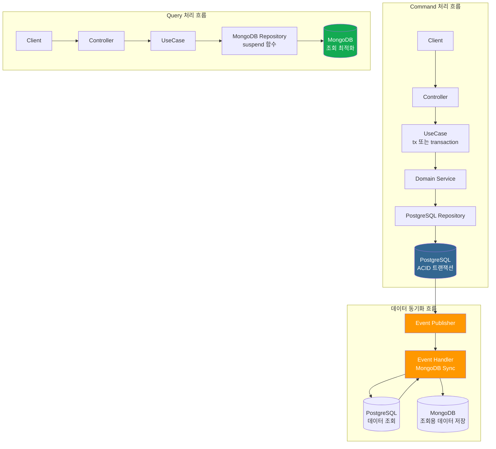

# 5. 데이터 아키텍처

[← 메인 문서로 돌아가기](../01_ams_system_architecture.md)

---

### 5.1 데이터 아키텍처 개요

AMS는 **CQRS(Command Query Responsibility Segregation)** 패턴을 기반으로 데이터 아키텍처를 설계합니다.

**핵심 원칙:**
- **Command 처리**: PostgreSQL을 통한 데이터 쓰기 작업 (CREATE, UPDATE, DELETE)
- **Query 처리**: MongoDB를 통한 데이터 조회 작업 (READ)
- **데이터 소스 분리**: 읽기와 쓰기를 별도의 데이터베이스로 분리하여 각각 최적화

**데이터 아키텍처 목표:**
1. **성능 최적화**: 읽기와 쓰기 작업을 독립적으로 최적화
2. **확장성**: 각 데이터베이스를 독립적으로 확장 가능
3. **일관성**: 트랜잭션 보장 및 최종 일관성 모델 적용
4. **유연성**: 각 데이터베이스의 특성에 맞는 데이터 구조 활용

---

### 5.2 PostgreSQL과 MongoDB의 역할 및 책임 구분

#### PostgreSQL 역할 및 책임

PostgreSQL은 **Command 처리**를 담당하는 **Source of Truth**입니다.

**주요 역할:**
- **데이터 쓰기 작업**: CREATE, UPDATE, DELETE 작업 처리
- **트랜잭션 보장**: ACID 트랜잭션을 통한 데이터 무결성 보장
- **데이터 일관성**: 즉시 일관성(Immediate Consistency) 보장
- **관계형 데이터 모델링**: 정규화된 관계형 스키마 관리
- **데이터 무결성**: 외래키, 제약조건 등을 통한 데이터 무결성 유지

**책임 범위:**
- 회원 정보 생성/수정/삭제
- 수업 정보 생성/수정/삭제
- 출석 정보 생성/수정
- 모든 비즈니스 데이터의 원본 저장

**특징:**
- **ACID 트랜잭션**: Atomicity, Consistency, Isolation, Durability 보장
- **관계형 데이터 모델**: 정규화된 스키마로 데이터 중복 최소화
- **데이터 무결성**: 외래키 제약조건을 통한 참조 무결성 보장
- **트랜잭션 격리 수준**: 필요에 따라 다양한 격리 수준 설정 가능

#### MongoDB 역할 및 책임

MongoDB는 **Query 처리**를 담당하는 **Read Model**입니다.

**주요 역할:**
- **데이터 조회 작업**: READ 작업 처리
- **조회 성능 최적화**: 빠른 조회 응답 시간 제공
- **조회 최적화된 데이터 구조**: 비정규화된 문서 구조 저장
- **수평 확장**: 샤딩을 통한 대용량 데이터 처리
- **집계 쿼리**: 복잡한 조회 및 집계 쿼리 처리

**책임 범위:**
- 회원 정보 조회
- 수업 정보 조회
- 출석 정보 조회
- 통계 데이터 조회
- 검색 및 필터링 쿼리

**특징:**
- **문서 기반 저장**: 유연한 스키마 구조로 조회 최적화
- **높은 조회 성능**: 읽기 성능 최적화
- **수평 확장**: 샤딩을 통한 확장 용이성
- **집계 파이프라인**: 복잡한 집계 쿼리 지원

#### 역할 구분 이유 및 장점

**역할 구분 이유:**

| 구분 | 이유 |
|------|------|
| **성능 최적화** | 각 데이터베이스의 특성에 맞게 최적화 가능 |
| **확장성** | 읽기와 쓰기를 독립적으로 확장 가능 |
| **유연성** | 각 데이터베이스에 최적화된 데이터 구조 활용 |
| **부하 분산** | 읽기/쓰기 부하를 분리하여 처리 |

**역할 구분의 장점:**

1. **성능 향상**
   - PostgreSQL: 트랜잭션 보장에 최적화된 쓰기 성능
   - MongoDB: 조회 최적화된 읽기 성능

2. **확장성 향상**
   - PostgreSQL: 수직 확장 또는 복제를 통한 확장
   - MongoDB: 샤딩을 통한 수평 확장

3. **유연성 향상**
   - PostgreSQL: 정규화된 관계형 스키마로 데이터 무결성 보장
   - MongoDB: 비정규화된 문서 스키마로 조회 성능 최적화

4. **독립적 운영**
   - 각 데이터베이스를 독립적으로 유지보수 및 업그레이드 가능
   - 데이터베이스별 특성에 맞는 최적화 수행

---

### 5.3 CQRS 데이터 흐름 상세 설명

#### 5.3.1 Command 처리 (PostgreSQL)

##### 처리 경로

```
Client 
  → Controller (HTTP 요청 수신)
  → UseCase (트랜잭션 경계 관리)
  → Domain Service (비즈니스 로직 검증)
  → PostgreSQL Repository (데이터 저장)
  → PostgreSQL (트랜잭션 커밋)
  → Event Handler (이벤트 발행)
```

##### 처리 단계 상세

1. **Controller (HTTP 요청 수신)**
   - REST API 엔드포인트를 통해 HTTP 요청 수신
   - Request DTO를 Domain Entity로 변환
   - UseCase 호출

2. **UseCase (트랜잭션 경계 관리)**
   - Exposed의 `transaction` 블록 또는 `newSuspendedTransaction`을 통한 트랜잭션 경계 설정
   - Coroutine 기반의 경우 커스텀 `tx` 함수를 통해 트랜잭션 관리
   - 트랜잭션 시작
   - Domain Service 호출하여 비즈니스 로직 실행
   - 트랜잭션 커밋 또는 롤백 처리

3. **Domain Service (비즈니스 로직 검증)**
   - 비즈니스 규칙 검증
   - 데이터 무결성 검증
   - 도메인 로직 실행

4. **PostgreSQL Repository (데이터 저장)**
   - Kotlin Exposed를 통한 타입 안전한 쿼리 작성
   - INSERT, UPDATE, DELETE 쿼리 실행
   - PostgreSQL 트랜잭션 내에서 실행

5. **PostgreSQL (트랜잭션 커밋)**
   - ACID 트랜잭션 보장
   - 데이터 영구 저장
   - 트랜잭션 커밋 완료

6. **Event Handler (이벤트 발행)**
   - 트랜잭션 커밋 완료 후 이벤트 발행
   - 도메인 이벤트 발행 (예: MemberCreated, MemberUpdated)
   - 비동기로 이벤트 핸들러에게 전달

##### 트랜잭션 처리 방식

- **Exposed 트랜잭션 관리**: Exposed의 `transaction` 블록을 통한 트랜잭션 관리
- **Coroutine 트랜잭션**: Coroutine 기반 비동기 처리를 위한 `newSuspendedTransaction` 사용
- **커스텀 tx 함수**: `newSuspendedTransaction`을 래핑한 커스텀 `tx` 함수 활용
- **ACID 보장**: PostgreSQL의 ACID 트랜잭션 특성을 활용
- **트랜잭션 격리 수준**: 필요에 따라 격리 수준 설정 (기본: READ_COMMITTED)

##### 이벤트 발행 시점

AMS는 **트랜잭션 커밋 완료 후 비동기로 이벤트를 발행**합니다.

**발행 전략:**
- **트랜잭션 커밋 후 발행**: PostgreSQL 트랜잭션이 성공적으로 커밋된 후에 이벤트 발행
- **비동기 처리**: 이벤트 발행과 처리를 비동기로 수행하여 Command 응답 시간에 영향 없음

이 방식은 트랜잭션이 롤백된 경우 이벤트가 발행되지 않아 데이터 일관성을 보장합니다.

#### 5.3.2 Query 처리 (MongoDB)

##### 처리 경로

```
Client 
  → Controller (HTTP 요청 수신)
  → UseCase (조회 로직 처리)
  → MongoDB Repository (데이터 조회)
  → MongoDB (쿼리 실행)
  → Controller (응답 반환)
```

##### 처리 단계 상세

1. **Controller (HTTP 요청 수신)**
   - REST API 엔드포인트를 통해 HTTP 요청 수신
   - Query Parameter 또는 Request Body 파싱
   - UseCase 호출

2. **UseCase (조회 로직 처리)**
   - 조회 요청 처리 로직
   - Predicate 생성 (조회 조건)
   - MongoDB Repository 호출

3. **MongoDB Repository (데이터 조회)**
   - MongoDB Kotlin Driver를 통한 Coroutine 기반 비동기 쿼리
   - `suspend` 함수를 활용한 Non-Blocking 데이터 접근
   - 조회 최적화된 쿼리 작성

4. **MongoDB (쿼리 실행)**
   - 조회 최적화된 문서 스키마에서 데이터 조회
   - 인덱스를 활용한 빠른 조회 성능
   - 집계 파이프라인을 통한 복잡한 조회 처리

5. **Controller (응답 반환)**
   - 조회된 데이터를 Response DTO로 변환
   - HTTP 응답 반환

##### 비동기 쿼리 처리

- **Coroutine 기반**: `suspend` 함수를 통한 Non-Blocking 비동기 처리
- **Non-Blocking I/O**: I/O 대기 중에도 다른 요청 처리 가능
- **높은 동시성**: 많은 조회 요청을 동시에 처리 가능

##### 조회 최적화 전략

- **비정규화된 데이터 구조**: 조회 시 JOIN 없이 빠른 조회
- **인덱스 활용**: 자주 사용되는 조회 조건에 인덱스 생성
- **캐싱 전략**: 자주 조회되는 데이터는 캐시 활용 (향후 Redis 도입 고려)
- **조회 전용 데이터 구조**: PostgreSQL 스키마와 다른 구조로 저장하여 조회 성능 최적화

#### 5.3.3 CQRS 데이터 흐름 다이어그램



---

### 5.4 데이터 동기화 전략

#### 5.4.1 이벤트 기반 동기화 방식

AMS는 **도메인 이벤트를 통한 비동기 데이터 동기화**를 사용합니다.

**동기화 원칙:**
- **이벤트 발행**: Command 처리 완료 후 도메인 이벤트 발행
- **비동기 처리**: 이벤트 처리가 Command 응답 시간에 영향을 주지 않음
- **최종 일관성**: PostgreSQL과 MongoDB 간 최종 일관성(Eventual Consistency) 모델

##### 도메인 이벤트 발행 시점

AMS는 **트랜잭션 커밋 완료 후 비동기로 이벤트를 발행**합니다.

**발행 전략:**
- **트랜잭션 커밋 후 발행**: PostgreSQL 트랜잭션이 성공적으로 커밋된 후에 이벤트 발행
- **비동기 처리**: 이벤트 발행과 처리를 비동기로 수행하여 Command 응답 시간에 영향 없음

이 방식은 트랜잭션이 롤백된 경우 이벤트가 발행되지 않아 데이터 일관성을 보장합니다.

##### 이벤트 핸들러 역할

이벤트 핸들러는 발행된 도메인 이벤트를 수신하여 다음과 같은 작업을 수행합니다:

1. **MongoDB 동기화 핸들러**
   - PostgreSQL에 저장된 데이터를 MongoDB에 조회용 데이터로 저장
   - 조회 최적화된 데이터 구조로 변환
   - 비동기로 MongoDB에 데이터 저장

2. **알림 발송 핸들러**
   - 출석 확인 등의 이벤트 발생 시 알림 발송
   - 비동기로 외부 알림 서비스 호출

3. **통계 업데이트 핸들러**
   - 데이터 변경 시 통계 데이터 업데이트
   - 비동기로 통계 데이터 계산 및 저장

##### 비동기 처리 방식

- **이벤트 발행**: Command 처리 완료 후 내부 Application Event Publisher를 통해 이벤트 발행
- **내부 처리**: 내부 이벤트 퍼블리셔를 사용하여 이벤트 발행 및 핸들러 호출
- **비동기 처리**: 이벤트 핸들러는 별도의 스레드에서 비동기로 처리
- **Non-Blocking**: 이벤트 처리가 Command 응답에 영향을 주지 않음

##### 서드파티 메시지 큐 도입 예정

AMS는 현재 내부 Application Event Publisher를 사용하고 있으며, 향후 확장성을 위해 서드파티 메시지 큐 도입을 예정하고 있습니다.

**도입 예정 이유:**
- **분산 처리**: 여러 인스턴스 간 이벤트 공유 및 처리 분산
- **메시지 영속성**: 메시지 손실 방지 및 재처리 지원
- **확장성**: 이벤트 처리 부하 분산 및 수평 확장 용이
- **모니터링**: 메시지 큐 레벨에서 이벤트 처리 현황 모니터링 가능

**검토 중인 기술:**
- **Kafka**: 대용량 이벤트 스트림 처리 및 고성능 이벤트 브로커
- **RabbitMQ**: 유연한 메시징 패턴 지원 및 관리 도구 제공

#### 5.4.2 동기화 프로세스

##### 데이터 동기화 단계

```
1. PostgreSQL 저장 완료
   ↓
2. 도메인 이벤트 발행 (MemberCreated, MemberUpdated 등)
   ↓
3. 이벤트 핸들러가 이벤트 수신
   ↓
4. PostgreSQL 데이터 조회 (필요 시)
   ↓
5. 조회 최적화된 데이터 구조로 변환
   ↓
6. MongoDB에 비동기로 저장
   ↓
7. 동기화 완료
```

##### 동기화 프로세스 상세

1. **PostgreSQL 저장 완료**
   - Command 처리가 완료되어 PostgreSQL에 데이터가 저장됨
   - 트랜잭션이 커밋되어 데이터가 영구 저장됨

2. **도메인 이벤트 발행**
   - 이벤트 발행 (예: `MemberCreated`, `MemberUpdated`)
   - 이벤트에는 변경된 데이터 정보 포함

3. **이벤트 핸들러가 이벤트 수신**
   - `MongoDBSyncHandler`가 이벤트 수신
   - 이벤트 타입에 따라 적절한 동기화 로직 실행

4. **조회 최적화된 데이터 구조로 변환**
   - PostgreSQL의 정규화된 스키마를 MongoDB의 비정규화된 스키마로 변환
   - 조회 시 JOIN 없이 빠르게 조회할 수 있도록 데이터 구조 최적화
   - 관련 데이터를 포함하여 단일 문서로 저장

5. **MongoDB에 비동기로 저장**
   - MongoDB Kotlin Driver를 통한 비동기 데이터 저장
   - Coroutine의 `suspend` 함수를 활용한 Non-Blocking 저장

6. **동기화 완료**
   - MongoDB에 조회용 데이터가 저장되어 이후 조회 요청에 사용 가능

##### 조회용 데이터 구조 변환 예시

**PostgreSQL 구조 (정규화):**
```
STUDENTS 테이블
- id, name, mobile_number, school, grade, status

SCHOOLS 테이블  
- id, name, address

관계: STUDENTS.school_id → SCHOOLS.id
```

**MongoDB 구조 (비정규화):**
```json
{
  "_id": "student_1",
  "name": "홍길동",
  "mobileNumber": "010-1234-5678",
  "school": {
    "id": 1,
    "name": "서울초등학교",
    "address": "서울시..."
  },
  "grade": "3",
  "status": "ACTIVE"
}
```

**변환 이유:**
- 조회 시 JOIN 없이 빠른 조회
- 관련 데이터를 함께 조회하여 네트워크 왕복 최소화
- 조회 성능 최적화

#### 5.4.3 동기화 특징

##### 비동기 처리 (Non-Blocking)

- **Command 응답 시간에 영향 없음**: 이벤트 처리가 비동기로 진행되어 Command 응답이 지연되지 않음
- **높은 처리량**: 여러 이벤트를 동시에 처리 가능
- **리소스 효율성**: 이벤트 처리가 메인 스레드를 블로킹하지 않음

##### 최종 일관성 (Eventual Consistency)

- **일시적 불일치 허용**: PostgreSQL과 MongoDB 간 짧은 시간 동안 데이터 불일치가 발생할 수 있음
- **최종적으로 일관됨**: 이벤트 처리가 완료되면 최종적으로 데이터가 일치함
- **비즈니스 요구사항 반영**: 조회 작업에서 약간의 지연이 허용되는 경우 최종 일관성 모델 채택

**일관성 보장 시점:**
- **PostgreSQL**: 즉시 일관성 (트랜잭션 커밋 즉시)
- **PostgreSQL → MongoDB**: 최종 일관성 (이벤트 처리 완료 후, 보통 수백 밀리초 이내)

##### 오류 처리 및 재시도 전략

AMS는 이벤트 처리 실패 시 재시도 가능한 구조를 통해 데이터 동기화를 보장합니다.

**실패 이벤트 저장:**
- **Failed Event Store**: 동기화 실패한 이벤트를 별도 저장소에 저장
- **이벤트 정보 저장**: 이벤트 타입, 페이로드, 실패 시간, 실패 사유, 재시도 횟수 등 저장
- **재시도 가능 상태 관리**: 재시도 가능/불가능 상태를 관리

**재시도 메커니즘:**
- **자동 재시도**: 일시적 오류(네트워크 오류, 일시적 DB 접근 불가 등)의 경우 자동 재시도
- **지수 백오프(Exponential Backoff)**: 재시도 간격을 점진적으로 증가시켜 부하 분산
- **최대 재시도 횟수**: 재시도 횟수 제한으로 무한 재시도 방지
- **재시도 스케줄러**: 주기적으로 실패한 이벤트를 재시도

**최종 실패 처리:**
- **수동 처리**: 최대 재시도 횟수를 초과한 경우 수동 처리 프로세스로 전환
- **알림 발송**: 최종 실패 시 운영자에게 알림 발송
- **수동 재시도**: 운영자가 실패 이벤트를 검토하고 수동으로 재시도 가능

#### 5.4.4 데이터 동기화 다이어그램



---

### 5.5 트랜잭션 관리 방식

#### 5.5.1 PostgreSQL 트랜잭션 관리

##### Exposed 트랜잭션 관리

AMS는 **Kotlin Exposed의 트랜잭션 관리**를 사용합니다.

**트랜잭션 설정:**
- **트랜잭션 경계**: Exposed의 `transaction` 블록을 통한 트랜잭션 관리
- **Coroutine 트랜잭션**: `newSuspendedTransaction`을 통한 Coroutine 기반 비동기 트랜잭션 처리
- **커스텀 tx 함수**: `newSuspendedTransaction`을 래핑한 커스텀 `tx` 함수 활용
- **격리 수준**: 필요에 따라 격리 수준 설정 가능
- **롤백 정책**: 예외 발생 시 자동 롤백

**트랜잭션 적용 범위:**
- **UseCase 레이어**: UseCase 메서드 내에서 `tx` 함수 또는 `transaction` 블록 사용
- **트랜잭션 경계**: 트랜잭션 블록 시작부터 완료까지 하나의 트랜잭션으로 관리
- **도메인 서비스**: 트랜잭션 블록 내에서 실행

##### ACID 트랜잭션 보장

PostgreSQL은 ACID 트랜잭션을 완벽히 지원합니다:

- **Atomicity (원자성)**: 트랜잭션 내 모든 작업이 성공하거나 모두 롤백됨
- **Consistency (일관성)**: 트랜잭션 전후 데이터베이스가 항상 일관된 상태 유지
- **Isolation (격리성)**: 동시 실행되는 트랜잭션 간 간섭 방지
- **Durability (지속성)**: 커밋된 트랜잭션은 영구 저장됨

##### 트랜잭션 경계 관리

**트랜잭션 경계:**
- **시작**: UseCase 메서드 진입 시 트랜잭션 시작
- **종료**: UseCase 메서드 종료 시 트랜잭션 커밋 또는 롤백
- **예외 처리**: 런타임 예외 발생 시 자동 롤백

**트랜잭션 경계 관리 예시:**

```kotlin
// Exposed transaction 블록 사용 (동기)
fun createMember(dto: MemberDTO): Member {
    return transaction {
        // 트랜잭션 시작
        val member = domainService.validateAndCreate(dto)
        repository.save(member)
        // 트랜잭션 커밋 (정상 종료 시)
        // 또는 트랜잭션 롤백 (예외 발생 시)
        member
    }
}

// Exposed newSuspendedTransaction 사용 (비동기 - Coroutine)
suspend fun createMember(dto: MemberDTO): Member {
    return newSuspendedTransaction(Dispatchers.IO) {
        // 트랜잭션 시작
        val member = domainService.validateAndCreate(dto)
        repository.save(member)
        // 트랜잭션 커밋 (정상 종료 시)
        // 또는 트랜잭션 롤백 (예외 발생 시)
        member
    }
}

// 커스텀 tx 함수 사용 (비동기 - Coroutine)
suspend fun createMember(dto: MemberDTO): Member {
    return tx {
        // 트랜잭션 시작
        val member = domainService.validateAndCreate(dto)
        repository.save(member)
        // 트랜잭션 커밋 (정상 종료 시)
        // 또는 트랜잭션 롤백 (예외 발생 시)
        member
    }
}
```

##### Coroutine 기반 트랜잭션 처리

- **newSuspendedTransaction**: Exposed의 `newSuspendedTransaction`을 통한 Coroutine 기반 비동기 트랜잭션 처리
- **커스텀 tx 함수**: `newSuspendedTransaction`을 래핑한 `tx` 함수를 통한 간편한 트랜잭션 관리
- **Suspend 함수**: `suspend` 함수를 통한 Non-Blocking 비동기 트랜잭션 처리
- **Non-Blocking**: 트랜잭션 처리가 Non-Blocking 방식으로 동작
- **Dispatcher 설정**: `Dispatchers.IO`를 사용하여 I/O 작업에 최적화된 스레드 풀 활용

#### 5.5.2 분산 트랜잭션 처리 전략

##### 분산 트랜잭션 미사용 (단순 CQRS)

AMS는 **전통적인 분산 트랜잭션(2PC, 3PC)** 을 사용하지 않습니다.

**이유:**
1. **성능 저하**: 분산 트랜잭션은 성능 저하 및 지연 시간 증가를 야기할 수 있습니다
2. **복잡도 증가**: 분산 트랜잭션 구현은 시스템 복잡도를 크게 증가시킵니다
3. **가용성 문제**: 분산 트랜잭션은 시스템 가용성에 부정적 영향을 줄 수 있습니다
4. **CQRS 패턴**: CQRS 패턴 자체가 최종 일관성 모델을 전제로 합니다

##### 최종 일관성 모델 채택

AMS는 **최종 일관성(Eventual Consistency)** 모델을 채택합니다.

**최종 일관성 모델:**
- **PostgreSQL**: 즉시 일관성 (Immediate Consistency) - ACID 트랜잭션 보장
- **PostgreSQL → MongoDB**: 최종 일관성 (Eventual Consistency) - 이벤트 기반 비동기 동기화

**일관성 보장 시점:**
- **Command 처리**: PostgreSQL 저장 즉시 일관성 보장
- **Query 처리**: MongoDB 동기화 완료 후 일관성 보장 (보통 수백 밀리초 이내)

##### 이벤트 기반 보상 트랜잭션 (Saga 패턴 - 오케스트레이션)

AMS는 **Saga 패턴의 오케스트레이션(Orchestration) 패턴**을 적용합니다.

**Saga 패턴 - 오케스트레이션:**
- **정의**: 분산 트랜잭션을 여러 로컬 트랜잭션으로 나누어 처리하는 패턴
- **오케스트레이션 패턴**: 중앙 집중식 오케스트레이터가 트랜잭션 단계를 순차적으로 관리
- **보상 트랜잭션**: 각 단계별로 보상 트랜잭션을 정의하여 오류 시 이전 상태로 복구
- **이벤트 기반**: 도메인 이벤트를 통한 Saga 오케스트레이션

**Saga 오케스트레이터 역할:**
- **트랜잭션 단계 관리**: 분산 트랜잭션의 각 단계를 순차적으로 실행
- **상태 관리**: Saga 실행 상태(진행 중, 완료, 실패)를 추적 및 관리
- **보상 트랜잭션 실행**: 실패 발생 시 이미 실행된 단계의 보상 트랜잭션을 역순으로 실행
- **이벤트 발행**: 각 단계 완료 및 Saga 완료/실패 이벤트 발행

**보상 트랜잭션 처리:**
- **역순 보상**: 실패 발생 시 완료된 단계를 역순으로 보상 트랜잭션 실행
- **멱등성 보장**: 보상 트랜잭션은 멱등성을 보장하여 중복 실행 시 안전하게 처리
- **최종 실패 처리**: 보상 트랜잭션도 실패하는 경우 수동 처리 프로세스로 전환

#### 5.5.3 트랜잭션 일관성 보장

##### PostgreSQL: 즉시 일관성 (ACID)

- **트랜잭션 커밋**: 트랜잭션 커밋 즉시 데이터 일관성 보장
- **ACID 보장**: Atomicity, Consistency, Isolation, Durability 모두 보장
- **동시성 제어**: 트랜잭션 격리 수준을 통한 동시성 제어

##### PostgreSQL → MongoDB: 최종 일관성 (Eventual Consistency)

- **비동기 동기화**: 이벤트 기반 비동기 동기화로 인한 일시적 불일치 허용
- **동기화 완료 시점**: 이벤트 처리 완료 후 최종 일관성 보장
- **일관성 지연**: 보통 수백 밀리초 이내에 일관성 보장

##### 동기화 지연 처리 방안

**동기화 지연 대응 전략:**

1. **최신 데이터 조회 요청 시**
   - 필요 시 PostgreSQL에서 직접 조회
   - 읽기 부하 분산을 위해 최소한의 경우만 적용

2. **이벤트 처리 모니터링**
   - 이벤트 처리 지연 모니터링
   - 지연 발생 시 알림 및 대응

3. **재시도 메커니즘**
   - 이벤트 처리 실패 시 자동 재시도
   - 재시도 후에도 실패 시 수동 처리 프로세스 실행

#### 5.5.4 트랜잭션 처리 다이어그램



---

### 5.6 데이터 모델 설계

#### 5.6.1 PostgreSQL 데이터 모델

##### 정규화된 관계형 스키마

PostgreSQL은 **정규화된 관계형 스키마**를 사용합니다.

**스키마 특징:**
- **정규화**: 데이터 중복 최소화를 위한 정규화 적용
- **관계형 구조**: 테이블 간 외래키를 통한 관계 정의
- **제약조건**: 데이터 무결성을 위한 제약조건 설정

**주요 테이블 구조:**
- **MEMBERS**: 회원 정보 테이블 (모든 회원 유형의 공통 정보 통합)
- **MEMBER_ROLES**: 회원 역할 정보 테이블 (학생, 학부모, 강사, 운영 관리자, 슈퍼 관리자)
- **STUDENT_INFO**: 학생 특화 정보 테이블 (학교, 학년 등)
- **TEACHER_INFO**: 강사 특화 정보 테이블 (전문 분야, 경력, 승인 상태 등)
- **MANAGER_INFO**: 관리자 특화 정보 테이블 (권한 레벨, 담당 학원, 권한 범위 등)
- **CLASSES**: 수업 정보 테이블
- **CLASS_SCHEDULES**: 수업 일정 테이블
- **ATTENDANCE**: 출석 정보 테이블

**관계 구조:**
```
MEMBERS (1) ←→ (N) MEMBER_ROLES
MEMBERS (1) ←→ (0..1) STUDENT_INFO (학생 역할인 경우)
MEMBERS (1) ←→ (0..1) TEACHER_INFO (강사 역할인 경우)
MEMBERS (1) ←→ (0..1) MANAGER_INFO (관리자 역할인 경우)
MEMBERS (1) ←→ (N) CLASSES (강사 역할인 경우)
MEMBERS (1) ←→ (N) ATTENDANCE (학생 역할인 경우)
CLASSES (1) ←→ (N) CLASS_SCHEDULES
CLASSES (1) ←→ (N) ATTENDANCE
```

**회원 도메인 중심 설계의 장점:**
- **데이터 중복 최소화**: 공통 회원 정보를 MEMBERS 테이블에 통합하여 데이터 중복 최소화
- **일관성 보장**: 모든 회원 유형에 대해 동일한 관리 기준 적용
- **확장성**: 새로운 회원 유형 추가 시 유연한 구조 제공
- **역할 기반 접근 제어**: MEMBER_ROLES와 연계하여 RBAC 지원
- **역할별 특화 정보 분리**: 각 역할의 특화 정보를 별도 테이블로 관리하여 구조 명확화

##### 트랜잭션 보장을 위한 구조

- **ACID 트랜잭션**: 복잡한 비즈니스 로직을 트랜잭션으로 묶어 처리
- **데이터 무결성**: 외래키 제약조건을 통한 참조 무결성 보장
- **일관성**: 트랜잭션을 통한 즉시 일관성 보장

##### 데이터 무결성 제약 조건

- **기본키(Primary Key)**: 각 테이블의 고유 식별자
- **외래키(Foreign Key)**: 테이블 간 관계 및 참조 무결성 보장
- **UNIQUE 제약조건**: 중복 방지를 위한 제약조건
- **CHECK 제약조건**: 데이터 값 유효성 검증
- **NOT NULL 제약조건**: 필수 데이터 보장

#### 5.6.2 MongoDB 데이터 모델

##### 조회 최적화된 문서 스키마

MongoDB는 **조회 최적화된 문서 스키마**를 사용합니다.

**스키마 특징:**
- **비정규화**: 조회 시 JOIN 없이 빠른 조회를 위한 비정규화 구조
- **문서 기반**: 관련 데이터를 하나의 문서에 포함
- **유연한 스키마**: 조회 요구사항에 맞게 유연하게 스키마 변경 가능

**주요 컬렉션 구조:**
- **members**: 회원 정보 (Student, Teacher 등 포함)
- **classes**: 수업 정보 (강사 정보 포함)
- **attendances**: 출석 정보 (학생, 수업 정보 포함)
- **statistics**: 통계 데이터 (집계된 데이터)

**비정규화 구조 예시:**
```json
{
  "_id": "class_1",
  "name": "독서 토론 수업",
  "teacher": {
    "id": 1,
    "name": "김선생",
    "mobileNumber": "010-1111-2222"
  },
  "schedules": [
    {"dayOfWeek": "MON", "time": "14:00"},
    {"dayOfWeek": "TUE", "time": "15:00"}
  ],
  "students": [
    {"id": 1, "name": "홍길동"},
    {"id": 2, "name": "김철수"}
  ]
}
```

##### 비정규화된 구조

- **관련 데이터 포함**: 조회 시 자주 함께 조회되는 데이터를 하나의 문서에 포함
- **JOIN 최소화**: JOIN 없이 단일 쿼리로 필요한 데이터 조회
- **조회 성능 향상**: 네트워크 왕복 최소화 및 빠른 조회 성능

##### 읽기 성능 최적화

- **인덱스 활용**: 자주 사용되는 조회 조건에 인덱스 생성
- **집계 파이프라인**: 복잡한 집계 쿼리를 파이프라인으로 최적화
- **조회 최적화된 구조**: 조회 패턴에 맞게 데이터 구조 설계

#### 5.6.3 데이터 모델 차이점 및 변환

##### PostgreSQL 스키마 → MongoDB 스키마 변환

**변환 원칙:**
- **정규화 → 비정규화**: 정규화된 관계형 스키마를 비정규화된 문서 스키마로 변환
- **관계 포함**: 외래키 관계를 중첩 문서로 변환
- **조회 최적화**: 조회 패턴에 맞게 데이터 구조 최적화

**변환 예시:**

**PostgreSQL 구조 (정규화):**
```sql
STUDENTS 테이블
- id, name, mobile_number, school_id, grade, status

SCHOOLS 테이블
- id, name, address
```

**MongoDB 구조 (비정규화):**
```json
{
  "_id": "student_1",
  "name": "홍길동",
  "mobileNumber": "010-1234-5678",
  "school": {
    "id": 1,
    "name": "서울초등학교",
    "address": "서울시 강남구..."
  },
  "grade": "3",
  "status": "ACTIVE"
}
```

##### 조회 최적화를 위한 데이터 구조 변경

**최적화 전략:**
- **자주 함께 조회되는 데이터 결합**: 하나의 문서에 포함하여 JOIN 없이 조회
- **집계 데이터 사전 계산**: 통계 등 집계 데이터를 사전에 계산하여 저장
- **조회 패턴 반영**: 실제 조회 패턴에 맞게 데이터 구조 설계

##### 동기화 시 데이터 변환 로직

**변환 프로세스:**

```
PostgreSQL 데이터 조회
  ↓
도메인 모델로 변환
  ↓
조회 최적화된 구조로 변환
  ↓
MongoDB 문서 구조로 변환
  ↓
MongoDB 저장
```

**변환 로직 위치:**
- **이벤트 핸들러**: `MongoDBSyncHandler`에서 데이터 변환 로직 실행
- **Mapper 클래스**: 데이터 변환을 위한 Mapper 클래스 활용
- **도메인 모델 활용**: 도메인 모델을 통한 안전한 변환

---

### 5.7 데이터 아키텍처 다이어그램

#### 전체 데이터 흐름 다이어그램



#### 데이터 아키텍처 요약

AMS의 데이터 아키텍처는 다음과 같이 구성됩니다:

1. **Command 처리**: PostgreSQL을 통한 트랜잭션 보장된 데이터 쓰기
2. **Query 처리**: MongoDB를 통한 빠른 조회 성능 제공
3. **데이터 동기화**: 이벤트 기반 비동기 동기화로 최종 일관성 보장
4. **트랜잭션 관리**: Exposed 트랜잭션 관리를 통한 ACID 보장
5. **데이터 모델**: 각 데이터베이스 특성에 맞는 최적화된 스키마 설계

---

