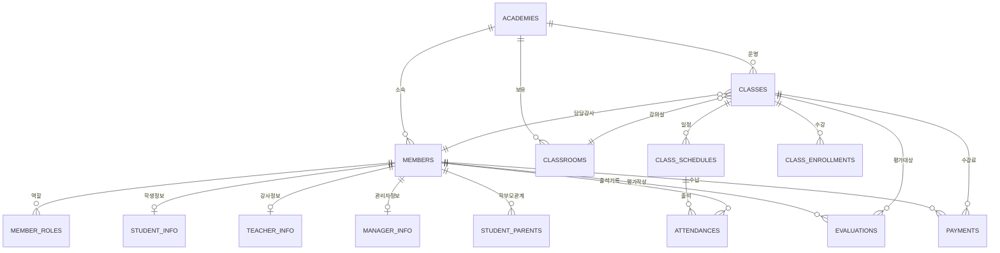

# 6. 데이터베이스 모델링

[← 메인 문서로 돌아가기](../01_ams_system_architecture.md)

---

AMS는 CQRS 패턴에 따라 PostgreSQL(Command)과 MongoDB(Query)를 분리하여 사용합니다. 본 절에서는 [5. 데이터 아키텍처](05_data_architecture.md)에서 정의한 데이터 모델 설계 원칙을 기반으로 실제 스키마를 상세히 정의합니다.

---

### 6.1 ERD (Entity-Relationship Diagram)

#### 전체 ERD 개요



#### 도메인별 관계 요약

| 도메인 | 주요 엔티티 | 관계 |
|--------|------------|------|
| 학원 관리 | ACADEMIES, CLASSROOMS | 1:N (학원 → 강의실) |
| 회원 관리 | MEMBERS, MEMBER_ROLES, STUDENT_INFO, TEACHER_INFO, MANAGER_INFO | 1:N (회원 → 역할), 1:0..1 (역할별 상세정보) |
| 수업 관리 | CLASSES, CLASS_SCHEDULES, CLASS_ENROLLMENTS, ATTENDANCES | 1:N 계층 구조 |
| 평가 관리 | EVALUATIONS | N:1 (회원 → 평가), N:1 (수업 → 평가) |
| 운영 관리 | PAYMENTS, RECEIPTS | N:1 (회원 → 결제) |

---

### 6.2 PostgreSQL 스키마 (Command)

#### 6.2.1 학원 도메인

##### ACADEMIES (학원 정보)

| 컬럼명 | 타입 | 제약조건 | 설명 |
|--------|------|----------|------|
| id | BIGSERIAL | PK | 학원 고유 식별자 |
| created_at | TIMESTAMP | NOT NULL, DEFAULT NOW() | 생성일시 |
| updated_at | TIMESTAMP | NOT NULL, DEFAULT NOW() | 수정일시 |
| name | VARCHAR(100) | NOT NULL | 학원 명칭 |
| phone | VARCHAR(20) | NOT NULL | 학원 연락처 |
| address | VARCHAR(500) | NOT NULL | 학원 주소 |
| detail_address | VARCHAR(200) | | 상세 주소 |
| zip_code | VARCHAR(10) | | 우편번호 |
| business_days | VARCHAR(50) | | 운영 요일 (콤마 구분: 'MON,TUE,WED,THU,FRI' 또는 'WEEKDAY') |
| business_start_time | TIME | | 운영 시작 시간 (HH:MM:SS) |
| business_end_time | TIME | | 운영 종료 시간 (HH:MM:SS) |
| business_hours_note | VARCHAR(200) | | 운영 시간 비고 (요일별 다른 시간 등 상세 정보) |
| target_audience | VARCHAR(200) | | 대상 범위 |
| registration_number | VARCHAR(50) | UNIQUE | 교육청 등록번호 |
| status | VARCHAR(20) | NOT NULL, DEFAULT 'ACTIVE' | 상태 (ACTIVE, INACTIVE, SUSPENDED) |

##### CLASSROOMS (강의실)

| 컬럼명 | 타입 | 제약조건 | 설명 |
|--------|------|----------|------|
| id | BIGSERIAL | PK | 강의실 고유 식별자 |
| created_at | TIMESTAMP | NOT NULL, DEFAULT NOW() | 생성일시 |
| updated_at | TIMESTAMP | NOT NULL, DEFAULT NOW() | 수정일시 |
| academy_id | BIGINT | FK, NOT NULL | 소속 학원 ID |
| name | VARCHAR(50) | NOT NULL | 강의실 명칭 |
| location | VARCHAR(100) | | 강의실 위치 |
| capacity | INTEGER | | 수용 인원 |
| status | VARCHAR(20) | NOT NULL, DEFAULT 'ACTIVE' | 상태 |

#### 6.2.2 회원 도메인

##### MEMBERS (회원 공통 정보)

| 컬럼명 | 타입 | 제약조건 | 설명 |
|--------|------|----------|------|
| id | BIGSERIAL | PK | 회원 고유 식별자 |
| created_at | TIMESTAMP | NOT NULL, DEFAULT NOW() | 생성일시 |
| updated_at | TIMESTAMP | NOT NULL, DEFAULT NOW() | 수정일시 |
| academy_id | BIGINT | FK, NOT NULL | 소속 학원 ID |
| name | VARCHAR(50) | NOT NULL | 이름 |
| mobile_number | VARCHAR(20) | NOT NULL | 휴대폰 번호 |
| birth_date | DATE | | 생년월일 |
| gender | VARCHAR(10) | | 성별 (MALE, FEMALE) |
| address | VARCHAR(500) | | 주소 |
| login_id | VARCHAR(50) | UNIQUE | 로그인 ID |
| password_hash | VARCHAR(255) | | 비밀번호 해시 |
| status | VARCHAR(20) | NOT NULL, DEFAULT 'ACTIVE' | 상태 (ACTIVE, INACTIVE, PENDING) |
| last_login_at | TIMESTAMP | | 마지막 로그인 일시 |

##### MEMBER_ROLES (회원 역할)

| 컬럼명 | 타입 | 제약조건 | 설명 |
|--------|------|----------|------|
| id | BIGSERIAL | PK | 역할 고유 식별자 |
| created_at | TIMESTAMP | NOT NULL, DEFAULT NOW() | 생성일시 |
| updated_at | TIMESTAMP | NOT NULL, DEFAULT NOW() | 수정일시 |
| member_id | BIGINT | FK, NOT NULL | 회원 ID |
| role_type | VARCHAR(20) | NOT NULL | 역할 유형 (STUDENT, PARENT, TEACHER, MANAGER, ADMINISTRATOR) |
| is_primary | BOOLEAN | NOT NULL, DEFAULT FALSE | 주 역할 여부 |

**UNIQUE 제약**: (member_id, role_type)

##### STUDENT_INFO (학생 상세 정보)

| 컬럼명         | 타입           | 제약조건 | 설명                             |
|-------------|--------------|----------|--------------------------------|
| id          | BIGSERIAL    | PK | 학생정보 고유 식별자                    |
| created_at | TIMESTAMP | NOT NULL, DEFAULT NOW() | 생성일시 |
| updated_at | TIMESTAMP | NOT NULL, DEFAULT NOW() | 수정일시 |
| member_id   | BIGINT       | FK, UNIQUE, NOT NULL | 회원 ID                          |
| school_name | VARCHAR(100) | | 학교명                            |
| school_type | VARCHAR(20)   | | 학교구분 (PRIMARY, MIDDLE, HIGH, UNIVERSITY) |
| grade       | VARCHAR(20)  | | 학년                             |

##### TEACHER_INFO (강사 상세 정보)

| 컬럼명 | 타입 | 제약조건 | 설명 |
|--------|------|----------|------|
| id | BIGSERIAL | PK | 강사정보 고유 식별자 |
| created_at | TIMESTAMP | NOT NULL, DEFAULT NOW() | 생성일시 |
| updated_at | TIMESTAMP | NOT NULL, DEFAULT NOW() | 수정일시 |
| member_id | BIGINT | FK, UNIQUE, NOT NULL | 회원 ID |
| specialty | VARCHAR(200) | | 전문 분야 |
| career_years | INTEGER | | 경력 연수 |
| introduction | TEXT | | 강사 소개 |
| approval_status | VARCHAR(20) | NOT NULL, DEFAULT 'PENDING' | 승인 상태 (PENDING, APPROVED, REJECTED) |
| approved_by | BIGINT | FK | 승인자 ID |
| approved_at | TIMESTAMP | | 승인 일시 |

##### MANAGER_INFO (관리자 상세 정보)

| 컬럼명 | 타입 | 제약조건 | 설명 |
|--------|------|----------|------|
| id | BIGSERIAL | PK | 관리자정보 고유 식별자 |
| member_id | BIGINT | FK, UNIQUE, NOT NULL | 회원 ID |
| created_at | TIMESTAMP | NOT NULL, DEFAULT NOW() | 생성일시 |
| updated_at | TIMESTAMP | NOT NULL, DEFAULT NOW() | 수정일시 |
| permission_level | VARCHAR(20) | NOT NULL | 권한 레벨 (MANAGER, ADMINISTRATOR) |
| managed_academy_id | BIGINT | FK | 담당 학원 ID (ADMINISTRATOR은 NULL) |
| permission_scope | VARCHAR(500) | | 권한 범위 (JSON) |

##### STUDENT_PARENTS (학생-학부모 관계)

| 컬럼명 | 타입 | 제약조건 | 설명 |
|--------|------|----------|------|
| id | BIGSERIAL | PK | 관계 고유 식별자 |
| created_at | TIMESTAMP | NOT NULL, DEFAULT NOW() | 생성일시 |
| updated_at | TIMESTAMP | NOT NULL, DEFAULT NOW() | 수정일시 |
| student_id | BIGINT | FK, NOT NULL | 학생 회원 ID |
| parent_id | BIGINT | FK, NOT NULL | 학부모 회원 ID |
| relationship | VARCHAR(20) | | 관계 (FATHER, MOTHER, GUARDIAN) |
| is_primary | BOOLEAN | NOT NULL, DEFAULT FALSE | 주 보호자 여부 |

**UNIQUE 제약**: (student_id, parent_id)

#### 6.2.3 수업 도메인

##### CLASSES (수업 정보)

| 컬럼명 | 타입 | 제약조건 | 설명 |
|--------|------|----------|------|
| id | BIGSERIAL | PK | 수업 고유 식별자 |
| created_at | TIMESTAMP | NOT NULL, DEFAULT NOW() | 생성일시 |
| updated_at | TIMESTAMP | NOT NULL, DEFAULT NOW() | 수정일시 |
| academy_id | BIGINT | FK, NOT NULL | 소속 학원 ID |
| name | VARCHAR(100) | NOT NULL | 수업 명칭 |
| subject | VARCHAR(50) | NOT NULL | 수업 과목 |
| teacher_id | BIGINT | FK, NOT NULL | 담당 강사 ID |
| classroom_id | BIGINT | FK | 강의실 ID |
| target_audience | VARCHAR(100) | | 수강 대상 |
| capacity | INTEGER | NOT NULL | 수업 정원 |
| start_date | DATE | NOT NULL | 수업 시작일 |
| end_date | DATE | NOT NULL | 수업 종료일 |
| description | TEXT | | 수업 설명 |
| curriculum | TEXT | | 교육 과정 |
| fee | DECIMAL(10,2) | | 수강료 |
| status | VARCHAR(20) | NOT NULL, DEFAULT 'ACTIVE' | 상태 (ACTIVE, INACTIVE, COMPLETED) |

##### CLASS_SCHEDULES (수업 일정)

| 컬럼명 | 타입 | 제약조건 | 설명 |
|--------|------|----------|------|
| id | BIGSERIAL | PK | 일정 고유 식별자 |
| created_at | TIMESTAMP | NOT NULL, DEFAULT NOW() | 생성일시 |
| updated_at | TIMESTAMP | NOT NULL, DEFAULT NOW() | 수정일시 |
| class_id | BIGINT | FK, NOT NULL | 수업 ID |
| day_of_week | VARCHAR(10) | NOT NULL | 요일 (MON, TUE, WED, THU, FRI, SAT, SUN) |
| start_time | TIME | NOT NULL | 시작 시간 |
| end_time | TIME | NOT NULL | 종료 시간 |
| status | VARCHAR(20) | NOT NULL, DEFAULT 'ACTIVE' | 상태 |

##### CLASS_ENROLLMENTS (수강 신청)

| 컬럼명 | 타입 | 제약조건 | 설명 |
|--------|------|----------|------|
| id | BIGSERIAL | PK | 수강 고유 식별자 |
| created_at | TIMESTAMP | NOT NULL, DEFAULT NOW() | 생성일시 |
| updated_at | TIMESTAMP | NOT NULL, DEFAULT NOW() | 수정일시 |
| class_id | BIGINT | FK, NOT NULL | 수업 ID |
| student_id | BIGINT | FK, NOT NULL | 학생 회원 ID |
| enrolled_at | TIMESTAMP | NOT NULL, DEFAULT NOW() | 수강 신청일시 |
| status | VARCHAR(20) | NOT NULL, DEFAULT 'ACTIVE' | 상태 (ACTIVE, CANCELLED, COMPLETED) |
| cancelled_at | TIMESTAMP | | 취소 일시 |

**UNIQUE 제약**: (class_id, student_id)

##### ATTENDANCES (출석)

| 컬럼명 | 타입 | 제약조건 | 설명 |
|--------|------|----------|------|
| id | BIGSERIAL | PK | 출석 고유 식별자 |
| created_at | TIMESTAMP | NOT NULL, DEFAULT NOW() | 생성일시 |
| updated_at | TIMESTAMP | NOT NULL, DEFAULT NOW() | 수정일시 |
| schedule_id | BIGINT | FK, NOT NULL | 수업 일정 ID |
| student_id | BIGINT | FK, NOT NULL | 학생 회원 ID |
| attendance_date | DATE | NOT NULL | 출석 일자 |
| status | VARCHAR(20) | NOT NULL, DEFAULT 'PENDING' | 상태 (PENDING, PRESENT, ABSENT, LATE, EXCUSED) |
| requested_at | TIMESTAMP | | 출석 요청 일시 |
| confirmed_at | TIMESTAMP | | 출석 확인 일시 |
| confirmed_by | BIGINT | FK | 확인자 ID (강사) |
| note | VARCHAR(500) | | 비고 |

**UNIQUE 제약**: (schedule_id, student_id, attendance_date)

#### 6.2.4 평가 도메인

##### EVALUATIONS (수업 평가)

| 컬럼명 | 타입 | 제약조건 | 설명 |
|--------|------|----------|------|
| id | BIGSERIAL | PK | 평가 고유 식별자 |
| created_at | TIMESTAMP | NOT NULL, DEFAULT NOW() | 생성일시 |
| updated_at | TIMESTAMP | NOT NULL, DEFAULT NOW() | 수정일시 |
| class_id | BIGINT | FK, NOT NULL | 수업 ID |
| writer_id | BIGINT | FK, NOT NULL | 작성자 회원 ID |
| writer_type | VARCHAR(20) | NOT NULL | 작성자 유형 (STUDENT, PARENT) |
| rating | INTEGER | NOT NULL, CHECK (1-5) | 평점 (1~5) |
| content | TEXT | | 평가 내용 |
| is_visible | BOOLEAN | NOT NULL, DEFAULT TRUE | 공개 여부 |

#### 6.2.5 운영 도메인

##### PAYMENTS (수납)

| 컬럼명 | 타입 | 제약조건 | 설명 |
|--------|------|----------|------|
| id | BIGSERIAL | PK | 수납 고유 식별자 |
| created_at | TIMESTAMP | NOT NULL, DEFAULT NOW() | 생성일시 |
| updated_at | TIMESTAMP | NOT NULL, DEFAULT NOW() | 수정일시 |
| academy_id | BIGINT | FK, NOT NULL | 학원 ID |
| member_id | BIGINT | FK, NOT NULL | 납부자 회원 ID |
| class_id | BIGINT | FK | 수업 ID (수강료인 경우) |
| amount | DECIMAL(10,2) | NOT NULL | 금액 |
| payment_type | VARCHAR(20) | NOT NULL | 결제 유형 (TUITION, MATERIAL, OTHER) |
| payment_method | VARCHAR(20) | NOT NULL | 결제 수단 (CASH, CARD, TRANSFER) |
| status | VARCHAR(20) | NOT NULL, DEFAULT 'COMPLETED' | 상태 (COMPLETED, REFUNDED, PENDING) |
| paid_at | TIMESTAMP | NOT NULL, DEFAULT NOW() | 결제 일시 |
| note | VARCHAR(500) | | 비고 |

##### RECEIPTS (영수증)

| 컬럼명 | 타입 | 제약조건 | 설명 |
|--------|------|----------|------|
| id | BIGSERIAL | PK | 영수증 고유 식별자 |
| created_at | TIMESTAMP | NOT NULL, DEFAULT NOW() | 생성일시 |
| updated_at | TIMESTAMP | NOT NULL, DEFAULT NOW() | 수정일시 |
| payment_id | BIGINT | FK, UNIQUE, NOT NULL | 수납 ID |
| receipt_number | VARCHAR(50) | UNIQUE, NOT NULL | 영수증 번호 |
| issued_at | TIMESTAMP | NOT NULL, DEFAULT NOW() | 발급 일시 |

---

### 6.3 MongoDB 스키마 (Query)

MongoDB는 조회 성능 최적화를 위해 비정규화된 문서 구조를 사용합니다. [5.6 데이터 모델 설계](05_data_architecture.md#56-데이터-모델-설계)의 원칙에 따라 설계됩니다.

#### 6.3.1 members 컬렉션

```json
{
  "_id": "member_123",
  "academyId": "academy_1",
  "name": "홍길동",
  "mobileNumber": "010-1234-5678",
  "birthDate": "2010-05-15",
  "gender": "MALE",
  "address": "서울시 강남구...",
  "loginId": "honggildong",
  "status": "ACTIVE",
  "roles": [
    {
      "type": "STUDENT",
      "isPrimary": true
    }
  ],
  "studentInfo": {
    "schoolName": "서울초등학교",
    "grade": "5학년",
    "className": "3반"
  },
  "parents": [
    {
      "memberId": "member_456",
      "name": "홍아버지",
      "mobileNumber": "010-9876-5432",
      "relationship": "FATHER",
      "isPrimary": true
    }
  ],
  "enrolledClasses": [
    {
      "classId": "class_1",
      "className": "영어 회화 A반",
      "teacherName": "김선생",
      "enrolledAt": "2025-03-01T00:00:00Z"
    }
  ],
  "createdAt": "2025-01-15T10:00:00Z",
  "updatedAt": "2025-03-01T10:00:00Z"
}
```

#### 6.3.2 classes 컬렉션

```json
{
  "_id": "class_1",
  "academyId": "academy_1",
  "name": "영어 회화 A반",
  "subject": "영어",
  "teacher": {
    "memberId": "member_789",
    "name": "김선생",
    "mobileNumber": "010-1111-2222",
    "specialty": "영어 회화"
  },
  "classroom": {
    "id": "classroom_1",
    "name": "201호",
    "location": "2층"
  },
  "targetAudience": "초등학생 3~6학년",
  "capacity": 15,
  "currentEnrollment": 12,
  "startDate": "2025-03-01",
  "endDate": "2025-08-31",
  "fee": 300000,
  "schedules": [
    {
      "dayOfWeek": "MON",
      "startTime": "16:00",
      "endTime": "17:30"
    },
    {
      "dayOfWeek": "WED",
      "startTime": "16:00",
      "endTime": "17:30"
    }
  ],
  "enrolledStudents": [
    {
      "memberId": "member_123",
      "name": "홍길동",
      "enrolledAt": "2025-03-01T00:00:00Z"
    }
  ],
  "status": "ACTIVE",
  "avgRating": 4.5,
  "evaluationCount": 8,
  "createdAt": "2025-02-01T10:00:00Z",
  "updatedAt": "2025-03-15T10:00:00Z"
}
```

#### 6.3.3 attendances 컬렉션

```json
{
  "_id": "attendance_1",
  "scheduleId": "schedule_1",
  "classInfo": {
    "classId": "class_1",
    "className": "영어 회화 A반",
    "subject": "영어"
  },
  "student": {
    "memberId": "member_123",
    "name": "홍길동"
  },
  "attendanceDate": "2025-03-10",
  "status": "PRESENT",
  "requestedAt": "2025-03-10T15:55:00Z",
  "confirmedAt": "2025-03-10T16:05:00Z",
  "confirmedBy": {
    "memberId": "member_789",
    "name": "김선생"
  },
  "parentNotified": true,
  "createdAt": "2025-03-10T15:55:00Z",
  "updatedAt": "2025-03-10T16:05:00Z"
}
```

#### 6.3.4 statistics 컬렉션

```json
{
  "_id": "stat_academy_1_2025_03",
  "academyId": "academy_1",
  "period": {
    "year": 2025,
    "month": 3
  },
  "summary": {
    "totalMembers": 150,
    "newMembers": 12,
    "totalClasses": 25,
    "activeClasses": 20,
    "totalRevenue": 15000000,
    "avgAttendanceRate": 0.92
  },
  "byClass": [
    {
      "classId": "class_1",
      "className": "영어 회화 A반",
      "enrollmentCount": 12,
      "attendanceRate": 0.95,
      "revenue": 3600000
    }
  ],
  "byTeacher": [
    {
      "teacherId": "member_789",
      "teacherName": "김선생",
      "classCount": 3,
      "studentCount": 35,
      "avgRating": 4.7
    }
  ],
  "createdAt": "2025-04-01T00:00:00Z",
  "updatedAt": "2025-04-01T00:00:00Z"
}
```

---

### 6.4 인덱스 전략

#### 6.4.1 PostgreSQL 인덱스

| 테이블 | 인덱스명 | 컬럼 | 유형 | 목적 |
|--------|----------|------|------|------|
| ACADEMIES | idx_academies_business_time | (business_start_time, business_end_time) | B-Tree | 운영 시간대별 학원 검색 |
| MEMBERS | idx_members_academy_id | academy_id | B-Tree | 학원별 회원 조회 |
| MEMBERS | idx_members_mobile | mobile_number | B-Tree | 휴대폰 번호 검색 |
| MEMBERS | idx_members_login_id | login_id | Unique | 로그인 ID 조회 |
| MEMBER_ROLES | idx_member_roles_member | member_id | B-Tree | 회원별 역할 조회 |
| CLASSES | idx_classes_academy | academy_id | B-Tree | 학원별 수업 조회 |
| CLASSES | idx_classes_teacher | teacher_id | B-Tree | 강사별 수업 조회 |
| CLASSES | idx_classes_status_date | (status, start_date) | B-Tree | 활성 수업 조회 |
| CLASS_ENROLLMENTS | idx_enrollments_class | class_id | B-Tree | 수업별 수강생 조회 |
| CLASS_ENROLLMENTS | idx_enrollments_student | student_id | B-Tree | 학생별 수강 조회 |
| ATTENDANCES | idx_attendances_schedule_date | (schedule_id, attendance_date) | B-Tree | 일정별 출석 조회 |
| ATTENDANCES | idx_attendances_student | student_id | B-Tree | 학생별 출석 조회 |
| ATTENDANCES | idx_attendances_status | status | B-Tree | 상태별 출석 조회 |
| PAYMENTS | idx_payments_academy_date | (academy_id, paid_at) | B-Tree | 학원별 기간 결제 조회 |

#### 6.4.2 MongoDB 인덱스

| 컬렉션 | 인덱스 필드 | 유형 | 목적 |
|--------|-------------|------|------|
| members | academyId | Single | 학원별 회원 조회 |
| members | loginId | Unique | 로그인 ID 검색 |
| members | mobileNumber | Single | 휴대폰 번호 검색 |
| members | roles.type | Single | 역할별 회원 조회 |
| classes | academyId | Single | 학원별 수업 조회 |
| classes | teacher.memberId | Single | 강사별 수업 조회 |
| classes | (status, startDate) | Compound | 활성 수업 조회 |
| attendances | (classInfo.classId, attendanceDate) | Compound | 수업별 일자 출석 조회 |
| attendances | student.memberId | Single | 학생별 출석 조회 |
| statistics | (academyId, period.year, period.month) | Compound | 학원별 기간 통계 조회 |

---

### 6.5 데이터 마이그레이션 전략

#### 6.5.1 스키마 마이그레이션 도구

| 데이터베이스 | 도구 | 설명 |
|--------------|------|------|
| PostgreSQL | Liquibase / Flyway | SQL 기반 버전 관리, 롤백 지원 |
| MongoDB | Mongock | Spring 기반 MongoDB 마이그레이션 |

#### 6.5.2 마이그레이션 원칙

1. **버전 관리**: 모든 스키마 변경은 버전화하여 추적
2. **롤백 가능**: 각 마이그레이션에 롤백 스크립트 포함
3. **무중단 배포**: [12. 배포 및 운영](12_deployment_operations.md)의 무중단 배포 전략과 연계
4. **테스트 환경 검증**: Staging 환경에서 먼저 적용 후 Production 반영

#### 6.5.3 마이그레이션 파일 구조

```
src/main/resources/
├── db/
│   ├── changelog/
│   │   ├── db.changelog-master.yaml
│   │   ├── changes/
│   │   │   ├── 001-create-academies.sql
│   │   │   ├── 002-create-members.sql
│   │   │   ├── 003-create-classes.sql
│   │   │   └── ...
│   └── mongock/
│       ├── V001__init_members_collection.kt
│       ├── V002__init_classes_collection.kt
│       └── ...
```

---

## 다음 문서

→ [7. 비동기 처리 전략](07_async_processing.md)

