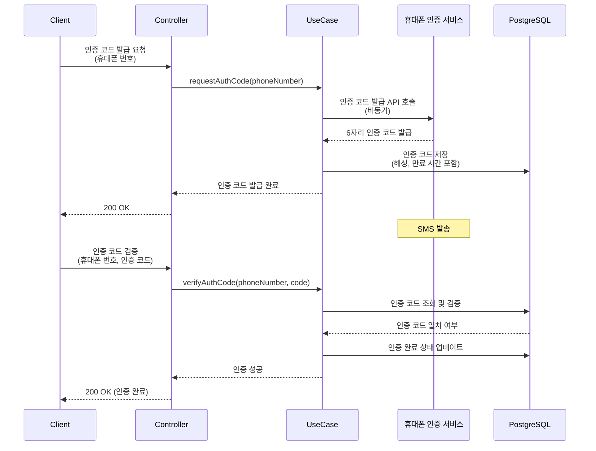
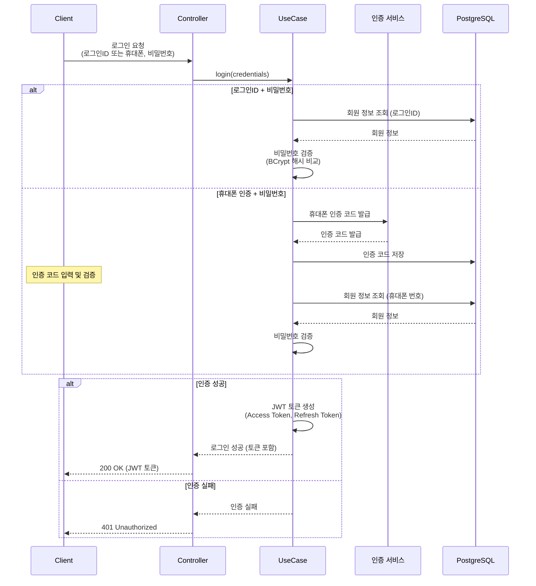
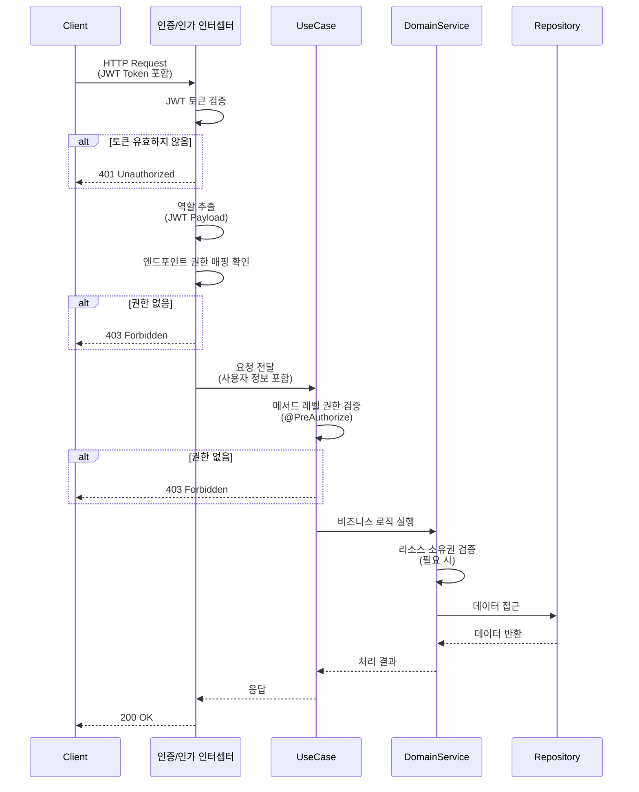
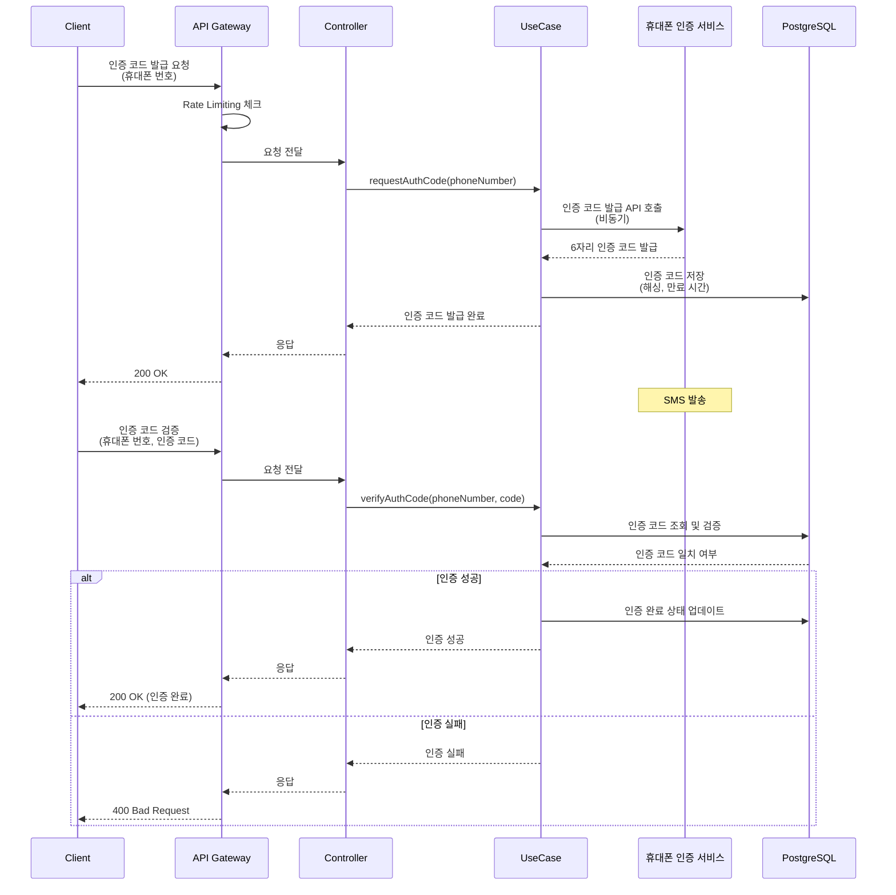
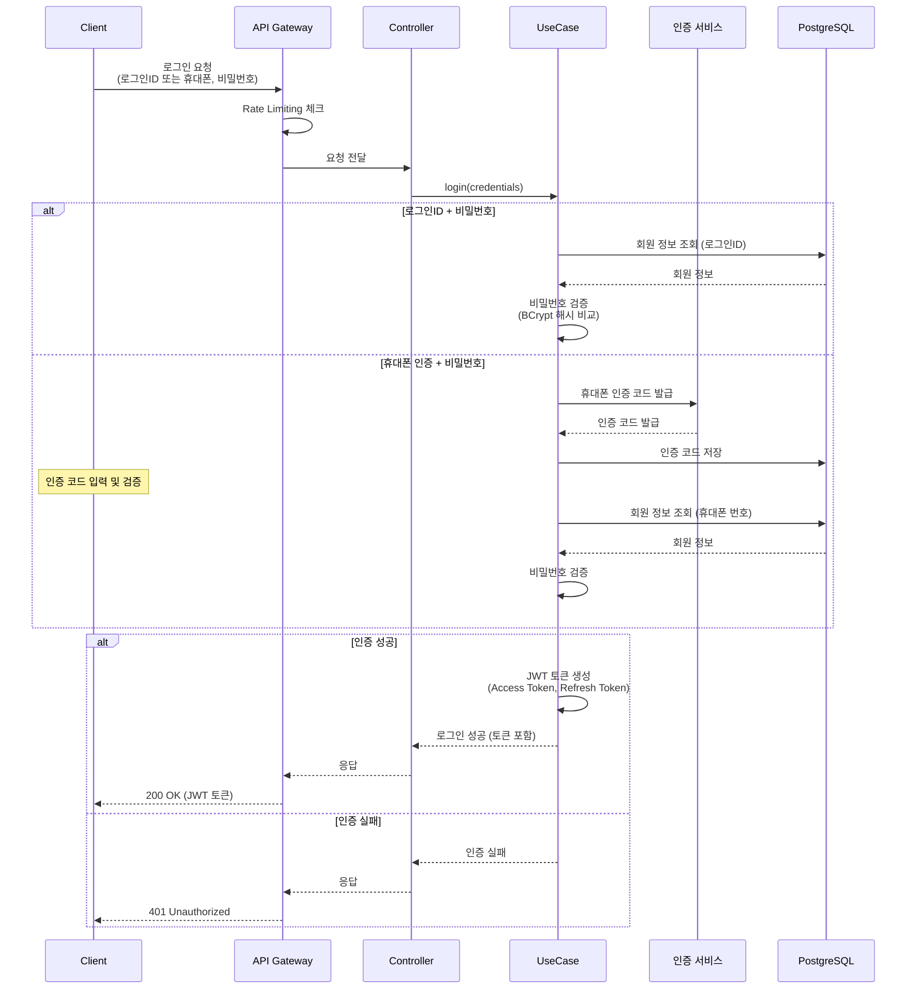
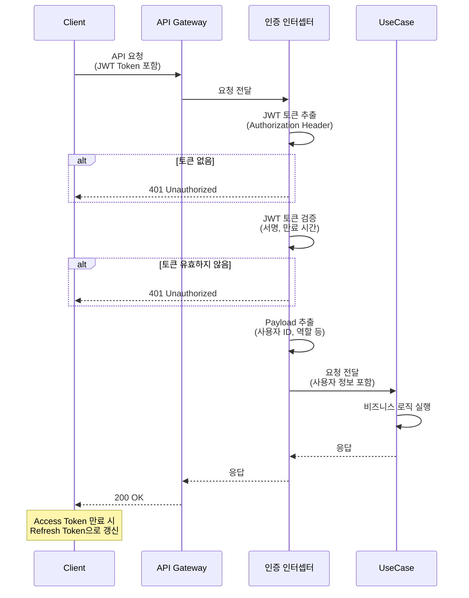
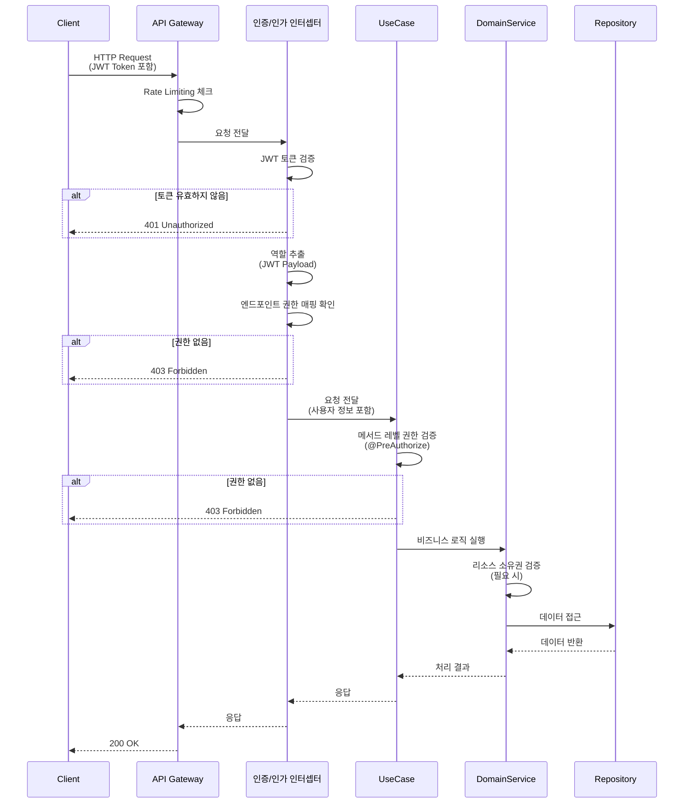
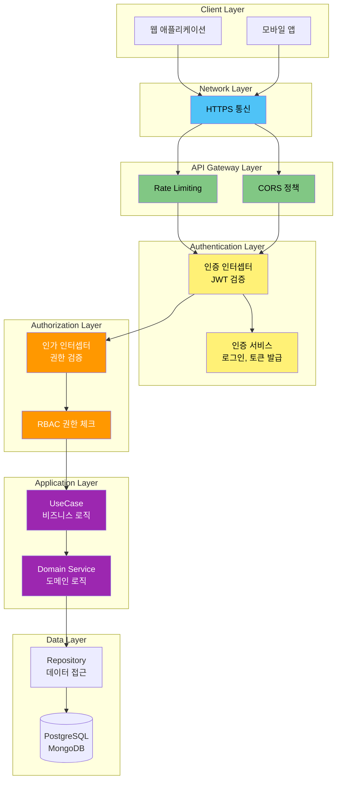

# 7. 보안 아키텍처

[← 메인 문서로 돌아가기](../01_ams_system_architecture.md)

---

### 7.1 보안 아키텍처 개요

#### 보안 아키텍처 목표 및 원칙

AMS는 **다층 보안 아키텍처**를 통해 시스템과 사용자 데이터를 보호합니다.

**보안 아키텍처 목표:**
- **인증(Authentication)**: 사용자 신원 확인
- **인가(Authorization)**: 사용자 권한 기반 접근 제어
- **데이터 보호**: 민감 정보 암호화 및 안전한 전송
- **API 보안**: RESTful API에 대한 보안 정책 적용
- **공격 방어**: 일반적인 보안 위협에 대한 대응 방안

**보안 아키텍처 원칙:**
- **최소 권한 원칙**: 사용자는 필요한 최소한의 권한만 부여
- **방어적 프로그래밍**: 입력 검증 및 출력 필터링
- **보안 기본값**: 안전한 기본 설정 적용
- **심층 방어**: 여러 계층에서 보안 적용
- **명확한 책임 분리**: 인증과 인가의 명확한 분리

#### 보안 계층 구조

AMS의 보안은 다음과 같은 계층 구조로 구성됩니다:

**1. 네트워크 계층**
- HTTPS 통신을 통한 데이터 암호화
- CORS 정책을 통한 Origin 제한

**2. API Gateway 계층**
- Rate Limiting을 통한 DDoS 공격 방어
- 요청 검증 및 필터링

**3. 인증/인가 계층**
- 사용자 인증 (휴대폰 인증, 로그인)
- 토큰 기반 인증 (JWT)
- 역할 기반 접근 제어 (RBAC)

**4. 애플리케이션 계층**
- 입력 데이터 검증 및 Sanitization
- 비즈니스 로직 레벨 권한 검증
- 에러 응답 표준화

**5. 데이터 계층**
- 비밀번호 해싱 및 암호화
- 데이터베이스 접근 제어
- 민감 정보 마스킹

#### 보안 위협 및 대응 방안 개요

**주요 보안 위협:**

1. **인증 우회**
   - 위협: 잘못된 인증 정보로 시스템 접근 시도
   - 대응: 강력한 비밀번호 정책, 휴대폰 인증, JWT 토큰 검증

2. **권한 상승**
   - 위협: 낮은 권한 사용자가 높은 권한 기능 접근 시도
   - 대응: RBAC 기반 엄격한 권한 검증, 역할별 접근 제어

3. **SQL Injection**
   - 위협: 악의적인 SQL 쿼리 삽입
   - 대응: Exposed ORM 사용, 파라미터화된 쿼리, 입력 검증

4. **XSS (Cross-Site Scripting)**
   - 위협: 악의적인 스크립트 삽입
   - 대응: 입력 데이터 검증 및 Sanitization, 출력 인코딩

5. **CSRF (Cross-Site Request Forgery)**
   - 위협: 인증된 사용자 권한으로 악의적인 요청 실행
   - 대응: CORS 정책, CSRF 토큰 검증

6. **DDoS 공격**
   - 위협: 과도한 요청으로 서비스 중단
   - 대응: Rate Limiting, IP 기반 제한

7. **민감 정보 노출**
   - 위협: 비밀번호, 개인정보 등 민감 정보 유출
   - 대응: 비밀번호 해싱, 응답에서 민감 정보 제거, HTTPS 통신

---

### 7.2 인증/인가 전략

#### 7.2.1 인증 방식

##### 휴대폰 인증 (6자리 코드 발급 및 검증)

AMS는 회원 가입 및 로그인 시 **휴대폰 인증**을 통해 사용자 신원을 확인합니다.

**회원 가입 시 휴대폰 인증 프로세스:**

1. **인증 코드 발급 요청**
   - 사용자가 휴대폰 번호 입력
   - 외부 휴대폰 인증 서비스에 인증 코드 발급 요청
   - 6자리 랜덤 인증 코드 생성 및 SMS 발송

2. **인증 코드 검증**
   - 사용자가 받은 인증 코드 입력
   - 발급된 인증 코드와 입력된 코드 비교
   - 인증 성공 시 회원 가입 진행 가능 상태로 변경

**인증 코드 유효성 관리:**

- **만료 시간**: 인증 코드 발급 후 5분 이내 입력 필요
- **재시도 제한**: 동일 휴대폰 번호에 대해 1분당 최대 3회 발급 제한
- **일회성**: 인증 코드는 1회만 사용 가능
- **보안**: 인증 코드는 단방향 해싱하여 저장 (검증 시 비교)

**외부 휴대폰 인증 서비스 연동 방식:**

- **비동기 연동**: HTTP 클라이언트를 통한 비동기 API 호출
- **Non-Blocking 처리**: Coroutine 기반 Non-Blocking I/O
- **타임아웃 및 재시도**: 네트워크 오류 시 재시도 메커니즘 적용
- **에러 처리**: 인증 서비스 오류 시 사용자에게 명확한 에러 메시지 제공

**휴대폰 인증 프로세스 다이어그램:**



##### 로그인 방식

AMS는 두 가지 로그인 방식을 지원합니다:

**1. 로그인ID + 비밀번호 방식**

- 사용자가 가입 시 설정한 로그인ID와 비밀번호로 로그인
- 일반적인 로그인 방식으로 가장 널리 사용

**2. 휴대폰 인증 + 비밀번호 방식**

- 휴대폰 인증 코드 검증 후 비밀번호 입력
- 로그인ID를 기억하지 못한 사용자를 위한 대안
- 휴대폰 인증 완료 후 비밀번호 검증 진행

**비밀번호 저장 및 검증 전략:**

- **해싱 알고리즘**: BCrypt 또는 Argon2 사용
- **솔트(Salt)**: 각 비밀번호마다 고유한 솔트 생성
- **비밀번호 정책**: 
  - 최소 8자 이상
  - 영문, 숫자, 특수문자 조합 권장
  - 이전 비밀번호 재사용 제한
- **검증 방식**: 평문 비밀번호를 해싱하여 저장된 해시와 비교

**로그인 프로세스 다이어그램:**



#### 7.2.2 인증 토큰 관리

##### JWT (JSON Web Token) 기반 인증 (권장)

AMS는 **JWT 기반 인증**을 권장합니다.

**JWT 선택 이유:**

- **Stateless**: 서버에 세션 저장 불필요, 확장성 우수
- **확장성**: 로드 밸런서 없이도 여러 서버 인스턴스에서 동일한 토큰 검증 가능
- **표준화**: RFC 7519 표준을 따르는 널리 사용되는 인증 방식
- **정보 포함**: 토큰 자체에 사용자 정보 및 역할 포함 가능
- **모바일 친화적**: 모바일 앱에서도 쉽게 사용 가능

**JWT 구조:**

JWT는 다음과 같은 구조로 구성됩니다:

- **Header**: 토큰 타입(JWT) 및 서명 알고리즘(HS256, RS256 등)
- **Payload**: 사용자 정보, 역할, 만료 시간 등 클레임(Claims)
- **Signature**: Header와 Payload를 기반으로 생성한 서명

**JWT Payload 설계:**

```kotlin
// JWT Payload 예시 구조
{
    "sub": "member_id",           // Subject (사용자 ID)
    "loginId": "user123",         // 로그인ID
    "roles": ["STUDENT"],         // 역할 목록
    "academyId": 123,             // 학원 ID (멀티 테넌트)
    "iat": 1234567890,            // Issued At (발급 시간)
    "exp": 1234571490,            // Expiration Time (만료 시간)
    "type": "ACCESS"              // 토큰 타입 (ACCESS 또는 REFRESH)
}
```

**Access Token 및 Refresh Token 전략:**

- **Access Token**: 
  - 짧은 만료 시간 (예: 15분 ~ 1시간)
  - API 요청 시 사용
  - HTTP Header에 포함하여 전송
  
- **Refresh Token**:
  - 긴 만료 시간 (예: 7일 ~ 30일)
  - Access Token 갱신 시 사용
  - 안전한 저장소에 저장 (예: HttpOnly Cookie)

**토큰 만료 및 갱신 처리:**

- **Access Token 만료**: 
  - API 요청 시 401 Unauthorized 응답
  - 클라이언트가 Refresh Token으로 새 Access Token 발급 요청

- **Refresh Token 만료**:
  - 재로그인 필요
  - Refresh Token 무효화 처리

- **토큰 갱신 프로세스**:
  - Refresh Token 검증
  - 새 Access Token 및 Refresh Token 발급
  - 기존 Refresh Token 무효화 (선택적)

**토큰 저장 및 전송 방식:**

- **Access Token**: 
  - HTTP Authorization Header에 포함: `Authorization: Bearer {token}`
  - 클라이언트 메모리 또는 안전한 저장소에 저장

- **Refresh Token**:
  - HttpOnly Cookie에 저장 (XSS 공격 방지)
  - 또는 안전한 클라이언트 저장소에 저장

##### 대안: 세션 기반 인증

**세션 기반 인증의 장단점:**

**장점:**
- **서버 제어**: 서버에서 세션을 즉시 무효화 가능
- **안전성**: 토큰 탈취 시에도 서버에서 즉시 차단 가능
- **단순성**: 구현이 상대적으로 단순

**단점:**
- **확장성 제한**: 서버 간 세션 공유 필요 (Redis 등 필요)
- **상태 유지**: 서버에 세션 상태 저장 필요
- **로드 밸런싱**: Sticky Session 또는 세션 공유 필요

**JWT vs 세션 기반 인증 비교:**

| 항목 | JWT | 세션 기반 |
|------|-----|----------|
| 상태 관리 | Stateless | Stateful |
| 확장성 | 높음 | 제한적 |
| 서버 리소스 | 낮음 | 높음 |
| 토큰 무효화 | 어려움 | 쉬움 |
| 모바일 지원 | 우수 | 양호 |

AMS는 **멀티 서버 & 멀티 인스턴스** 환경을 고려하여 **JWT 기반 인증**을 권장합니다.

#### 7.2.3 인가 전략

**인가(Authorization) 개념 및 역할:**

- **인증(Authentication)**: 사용자가 누구인지 확인 (로그인)
- **인가(Authorization)**: 사용자가 특정 기능에 접근할 권한이 있는지 확인

**인증과 인가의 분리:**

- **인증 레이어**: 사용자 신원 확인 (로그인, JWT 토큰 검증)
- **인가 레이어**: 사용자 권한 확인 (역할 기반 접근 제어)
- **명확한 분리**: 인증과 인가는 별도의 레이어에서 처리

**역할 기반 접근 제어(RBAC) 개요:**

- **역할(Role)**: 사용자의 권한을 그룹화한 개념
- **권한(Permission)**: 특정 기능에 대한 접근 권한
- **역할-권한 매핑**: 역할에 권한을 할당하여 관리
- **사용자-역할 매핑**: 사용자에게 역할을 할당

AMS는 **5가지 회원 역할**을 기반으로 RBAC를 구현합니다.

---

### 7.3 역할 기반 접근 제어 (RBAC)

#### 7.3.1 역할 정의

AMS는 다음과 같은 **5가지 회원 역할**을 정의합니다:

**1. 학생(Student)**
- 학원 수업을 수강하는 회원
- 기본적인 수업 정보 조회 및 출석 확인 요청 가능

**2. 학부모(Parent)**
- 학생의 수강 현황을 조회 및 관리하는 회원
- 학생과 1:N 관계로 연결
- 자녀의 수업 정보 및 출석 현황 조회 가능

**3. 강사(Teacher)**
- 학원 수업을 담당하는 회원
- 수업 정보 조회, 출석 확인 처리, 수업 평가 조회 가능
- 가입 시 운영 관리자 승인 필요

**4. 운영 관리자(Manager)**
- 학원의 전반적인 운영을 담당하는 회원
- 학생, 학부모, 강사 회원 생성 및 정보 수정/삭제 가능
- 강사 승인, 수업 생성 및 삭제 가능

**5. 슈퍼 관리자(Super Admin)**
- 전체 학원 시스템을 총괄 관리하는 회원
- 모든 기능 이용 가능
- 운영 관리자 회원 생성 가능

#### 7.3.2 역할별 권한 정의

##### 권한 매트릭스 테이블

| 기능 영역 | 기능 | 학생 | 학부모 | 강사 | 운영 관리자 | 슈퍼 관리자 |
|----------|------|:----:|:------:|:----:|:-----------:|:-----------:|
| **회원 관리** | | | | | | |
| | 회원 정보 조회 (본인) | ✓ | ✓ | ✓ | ✓ | ✓ |
| | 회원 정보 수정 (본인) | ✓ | ✓ | ✓ | ✓ | ✓ |
| | 회원 정보 삭제 (본인) | ✓ | ✓ | ✓ | ✓ | ✓ |
| | 학생 회원 생성 | | | | ✓ | ✓ |
| | 학부모 회원 생성 | | | | ✓ | ✓ |
| | 강사 회원 생성 | | | | ✓ | ✓ |
| | 운영 관리자 회원 생성 | | | | | ✓ |
| | 학생 정보 수정/삭제 | | | | ✓ | ✓ |
| | 학부모 정보 수정/삭제 | | | | ✓ | ✓ |
| | 강사 정보 수정/삭제 | | | | ✓ | ✓ |
| | 강사 승인 | | | | ✓ | ✓ |
| **수업 관리** | | | | | | |
| | 수업 정보 조회 | ✓ | ✓ | ✓ | ✓ | ✓ |
| | 수업 생성 | | | | ✓ | ✓ |
| | 수업 수정 | | | | ✓ | ✓ |
| | 수업 삭제 | | | | ✓ | ✓ |
| | 수업 일정 조회 | ✓ | ✓ | ✓ | ✓ | ✓ |
| | 수업 일정 생성 | | | | ✓ | ✓ |
| | 수업 일정 수정 | | | | ✓ | ✓ |
| | 수업 일정 삭제 | | | | ✓ | ✓ |
| **출석 관리** | | | | | | |
| | 출석 확인 요청 | ✓ | | | | |
| | 출석 확인 처리 | | | ✓ | ✓ | ✓ |
| | 출석 현황 조회 (본인) | ✓ | ✓ | ✓ | ✓ | ✓ |
| | 출석 현황 조회 (전체) | | | | ✓ | ✓ |
| **수업 평가** | | | | | | |
| | 평가 게시글 작성 | ✓ | ✓ | | | |
| | 평가 게시글 조회 | ✓ | ✓ | ✓ | ✓ | ✓ |
| | 평가 게시글 수정/삭제 | ✓ | ✓ | | ✓ | ✓ |
| **운영 관리** | | | | | | |
| | 수납 관리 | | | | ✓ | ✓ |
| | 영수증 발급 | | | | ✓ | ✓ |
| | 통계 조회 | | | | ✓ | ✓ |
| **시스템 관리** | | | | | | |
| | 학원 정보 관리 | | | | ✓ | ✓ |
| | 시스템 설정 관리 | | | | | ✓ |

**권한 표기:**
- ✓: 권한 있음
- (빈칸): 권한 없음

##### 세부 권한 설명

**학생(Student) 권한:**
- 수업 정보 조회: 자신이 수강하는 수업 정보 조회 가능
- 출석 확인 요청: 수업 출석 시 출석 확인 요청 가능
- 수업 평가 작성: 수강한 수업 및 강사에 대한 평가 게시글 작성 가능
- 본인 정보 관리: 자신의 회원 정보 조회, 수정, 삭제 가능
- 제한 사항: 수업 정보 관리 기능 제한

**학부모(Parent) 권한:**
- 자녀 수강 현황 조회: 연결된 학생의 수강 현황 및 출석 현황 조회 가능
- 수업 평가 작성: 자녀가 수강한 수업 및 강사에 대한 평가 게시글 작성 가능
- 본인 정보 관리: 자신의 회원 정보 조회, 수정, 삭제 가능
- 제한 사항: 수업 정보 관리 기능 제한

**강사(Teacher) 권한:**
- 수업 정보 조회: 자신이 담당하는 수업 정보 조회 가능
- 출석 확인 처리: 학생의 출석 확인 요청을 처리 가능
- 수업 평가 조회: 자신이 담당하는 수업에 대한 평가 게시글 조회 가능
- 본인 정보 관리: 자신의 회원 정보 조회, 수정, 삭제 가능
- 제한 사항: 수업 생성 및 삭제 기능 제한
- 특이 사항: 가입 시 운영 관리자 승인 필요

**운영 관리자(Manager) 권한:**
- 회원 관리: 학생, 학부모, 강사 회원 생성, 수정, 삭제 가능
- 강사 승인: 강사 가입 요청 승인 가능
- 수업 관리: 수업 생성, 수정, 삭제 가능
- 출석 관리: 출석 현황 전체 조회 가능
- 운영 관리: 수납 관리, 영수증 발급, 통계 조회 가능
- 학원 정보 관리: 학원 정보 조회, 수정 가능

**슈퍼 관리자(Super Admin) 권한:**
- 모든 기능 이용 가능: 모든 역할의 권한을 포함
- 운영 관리자 생성: 운영 관리자 회원 생성 가능
- 시스템 설정 관리: 시스템 전반의 설정 관리 가능

#### 7.3.3 권한 체크 구현 방식

##### 인터셉터/필터 기반 권한 체크

**HTTP 요청 인터셉터를 통한 권한 검증:**

- **인증 검증**: JWT 토큰 유효성 검증
- **역할 추출**: JWT Payload에서 사용자 역할 추출
- **엔드포인트 매핑**: 요청 엔드포인트와 필요한 권한 매핑
- **권한 검증**: 사용자 역할이 요청한 기능에 대한 권한이 있는지 확인

**JWT 토큰에서 역할 추출:**

```kotlin
// JWT Payload에서 역할 추출 예시
val payload = jwtTokenDecoder.decode(token)
val roles: List<String> = payload.claims["roles"] as List<String>
val memberId = payload.subject
```

**엔드포인트별 권한 매핑:**

```kotlin
// 엔드포인트 권한 매핑 예시
val endpointPermissions = mapOf(
    "POST /api/v1/member/student" to setOf("MANAGER", "SUPER_ADMIN"),
    "PUT /api/v1/member/student/{id}" to setOf("MANAGER", "SUPER_ADMIN"),
    "DELETE /api/v1/member/student/{id}" to setOf("MANAGER", "SUPER_ADMIN"),
    "POST /api/v1/class" to setOf("MANAGER", "SUPER_ADMIN"),
    "POST /api/v1/attendance/request" to setOf("STUDENT"),
    "PUT /api/v1/attendance/confirm/{id}" to setOf("TEACHER", "MANAGER", "SUPER_ADMIN")
)
```

##### 메서드 레벨 권한 체크

**어노테이션 기반 권한 체크:**

Spring Security의 `@PreAuthorize` 어노테이션을 활용한 메서드 레벨 권한 체크:

```kotlin
// UseCase 레이어에서의 권한 검증 예시
@Service
class StudentManagementUseCase(
    private val studentSaveService: StudentSaveService,
    private val currentUserService: CurrentUserService
) {
    @PreAuthorize("hasRole('MANAGER') or hasRole('SUPER_ADMIN')")
    suspend fun createStudent(dto: StudentDTO): StudentDTO {
        // 운영 관리자 또는 슈퍼 관리자만 접근 가능
    }
    
    @PreAuthorize("hasRole('STUDENT')")
    suspend fun requestAttendance(classId: Long): AttendanceRequestDTO {
        // 학생만 접근 가능
    }
}
```

**UseCase 레이어에서의 권한 검증:**

- **현재 사용자 정보**: JWT 토큰에서 추출한 사용자 정보 활용
- **역할 기반 검증**: 사용자 역할에 따른 접근 제어
- **리소스 소유권 검증**: 요청한 리소스가 사용자 소유인지 확인

##### 권한 체크 흐름 다이어그램

**권한 체크 프로세스:**



---

### 7.4 API 보안 정책

#### 7.4.1 API 엔드포인트 보안

##### 인증 필수 API vs 공개 API

**인증 필수 API:**
- 대부분의 비즈니스 로직 API는 인증 필수
- JWT 토큰이 HTTP Authorization Header에 포함되어야 함
- 예: 회원 정보 조회/수정, 수업 관리, 출석 관리, 운영 관리 등

**공개 API (인증 불필요):**
- 휴대폰 인증 코드 발급: `/api/v1/auth/phone/send-code`
- 휴대폰 인증 코드 검증: `/api/v1/auth/phone/verify-code`
- 회원 가입: `/api/v1/auth/signup`
- 로그인: `/api/v1/auth/login`
- 로그인ID 찾기: `/api/v1/auth/find-login-id`
- 비밀번호 재설정 요청: `/api/v1/auth/reset-password/request`

##### API 엔드포인트 보안 분류

**1. Public API (인증 불필요)**
- 인증 및 회원 가입 관련 API
- 공개 정보 조회 API (학원 정보 등)

**2. Authenticated API (인증 필수)**
- 인증된 사용자만 접근 가능
- JWT 토큰 검증 필요
- 예: 본인 정보 조회, 수업 정보 조회

**3. Authorized API (인증 + 특정 역할 필수)**
- 인증 및 특정 역할 권한 필요
- JWT 토큰 검증 + 역할 기반 권한 검증
- 예: 학생 회원 생성 (운영 관리자 또는 슈퍼 관리자만), 수업 생성 (운영 관리자 또는 슈퍼 관리자만)

#### 7.4.2 API 요청 보안

##### HTTPS 사용

- **모든 API 통신은 HTTPS로 암호화**
- HTTP는 보안상의 이유로 사용 금지
- 인증 토큰 전송 시 암호화 보장

**HTTPS 적용:**
- TLS 1.2 이상 사용
- 인증서 유효성 검증
- 강력한 암호화 알고리즘 사용

##### Rate Limiting

**API 호출 빈도 제한:**

- **DDoS 공격 방지**: 과도한 요청으로 인한 서비스 중단 방지
- **리소스 보호**: 서버 리소스 과다 사용 방지
- **공정한 사용**: 모든 사용자가 공정하게 서비스 이용 가능

**Rate Limiting 전략:**

- **IP 기반 제한**: 동일 IP에서 일정 시간 동안 최대 요청 수 제한
- **사용자 기반 제한**: 동일 사용자(로그인ID)에서 일정 시간 동안 최대 요청 수 제한
- **엔드포인트별 제한**: 중요도가 높은 엔드포인트에 더 엄격한 제한 적용

**Rate Limiting 예시:**

- 일반 API: 분당 100회
- 인증 API: 분당 5회 (브루트 포스 공격 방지)
- 휴대폰 인증 코드 발급: 분당 3회

**Rate Limiting 초과 시:**

- HTTP 429 Too Many Requests 응답
- Retry-After 헤더에 재시도 가능 시간 포함

##### Request Validation

**입력 데이터 검증 및 Sanitization:**

- **입력 검증**: 모든 입력 데이터의 유효성 검증
- **타입 검증**: 데이터 타입 검증 (문자열, 숫자, 이메일 등)
- **범위 검증**: 데이터 범위 검증 (길이, 최소/최대값 등)
- **형식 검증**: 정규 표현식을 통한 형식 검증

**공격 방지:**

- **SQL Injection 방지**: 
  - Exposed ORM 사용으로 파라미터화된 쿼리 자동 적용
  - 직접 SQL 쿼리 작성을 지양
  
- **XSS (Cross-Site Scripting) 방지**:
  - 입력 데이터의 HTML 태그 이스케이프 처리
  - 출력 시 인코딩 적용
  
- **Command Injection 방지**:
  - 시스템 명령어 실행 금지
  - 파일 경로 검증

**Request Validation 예시:**

```kotlin
// 입력 검증 예시
data class CreateStudentDTO(
    @field:NotBlank(message = "이름은 필수입니다")
    @field:Size(min = 2, max = 20, message = "이름은 2자 이상 20자 이하입니다")
    val name: String,
    
    @field:Pattern(regexp = "^01[0-9]-[0-9]{4}-[0-9]{4}$", message = "휴대폰 번호 형식이 올바르지 않습니다")
    val phoneNumber: String,
    
    @field:Email(message = "이메일 형식이 올바르지 않습니다")
    val email: String?
)
```

#### 7.4.3 API 응답 보안

##### 민감 정보 제거

**응답에서 민감 정보 제외:**

- **비밀번호**: 응답에 비밀번호 포함 금지
- **개인정보**: 필요한 경우에만 최소한의 정보 제공
- **시스템 정보**: 서버 내부 정보 노출 방지

**민감 정보 마스킹:**

- 휴대폰 번호: 일부 숫자 마스킹 (예: 010-****-1234)
- 이메일: 일부 문자 마스킹 (예: u***@example.com)
- 주소: 상세 주소 일부 마스킹

##### 에러 응답 표준화

**보안 관련 에러는 일반적인 에러 메시지로 응답:**

- **인증 실패**: "인증 정보가 올바르지 않습니다" (상세 사유는 노출하지 않음)
- **권한 없음**: "해당 기능에 대한 권한이 없습니다"
- **계정 잠금**: "계정이 일시적으로 잠겼습니다. 잠시 후 다시 시도해주세요"

**상세 에러는 서버 로그에만 기록:**

- 에러 원인, 스택 트레이스 등 상세 정보는 서버 로그에만 기록
- 클라이언트에는 일반적인 에러 메시지만 제공

**에러 응답 형식:**

```kotlin
// 에러 응답 형식 예시
{
    "error": {
        "code": "UNAUTHORIZED",
        "message": "인증 정보가 올바르지 않습니다",
        "timestamp": "2025-01-02T10:00:00Z"
    }
}
```

#### 7.4.4 CORS 정책

**CORS (Cross-Origin Resource Sharing) 설정:**

- **허용된 Origin만 API 접근 가능**: 설정된 Origin에서만 API 요청 허용
- **자격 증명 포함 요청 처리**: `Access-Control-Allow-Credentials: true` 설정

**CORS 설정 예시:**

```kotlin
// CORS 설정 예시
@Configuration
class CorsConfig {
    @Bean
    fun corsConfigurationSource(): CorsConfigurationSource {
        val configuration = CorsConfiguration()
        configuration.allowedOrigins = listOf(
            "https://ams-web.example.com",
            "https://ams-admin.example.com"
        )
        configuration.allowedMethods = listOf("GET", "POST", "PUT", "DELETE", "OPTIONS")
        configuration.allowedHeaders = listOf("*")
        configuration.allowCredentials = true
        configuration.maxAge = 3600L
        
        val source = UrlBasedCorsConfigurationSource()
        source.registerCorsConfiguration("/api/**", configuration)
        return source
    }
}
```

**CORS 정책 적용:**

- **개발 환경**: 모든 Origin 허용 가능 (개발 편의성)
- **프로덕션 환경**: 허용된 Origin만 엄격하게 제한
- **자격 증명 포함 요청**: JWT 토큰 등 자격 증명이 포함된 요청 처리

---

### 7.5 보안 아키텍처 다이어그램

#### 7.5.1 인증 프로세스 다이어그램

**휴대폰 인증 플로우:**



**로그인 프로세스 플로우:**



**JWT 토큰 발급 및 검증 프로세스:**



#### 7.5.2 권한 체크 프로세스 다이어그램

**권한 체크 프로세스:**



#### 7.5.3 보안 계층 구조 다이어그램

**보안 계층 구조:**



---

### 7.6 보안 아키텍처 요약

#### 보안 아키텍처 핵심 요약

AMS의 보안 아키텍처는 다음과 같은 핵심 요소로 구성됩니다:

**1. 인증 (Authentication)**
- 휴대폰 인증 (6자리 코드 발급 및 검증)
- 로그인 방식 (로그인ID + 비밀번호, 휴대폰 인증 + 비밀번호)
- JWT 기반 토큰 인증 (Access Token, Refresh Token)
- 비밀번호 해싱 (BCrypt 또는 Argon2)

**2. 인가 (Authorization)**
- 역할 기반 접근 제어 (RBAC)
- 5가지 회원 역할 (학생, 학부모, 강사, 운영 관리자, 슈퍼 관리자)
- 인터셉터/필터 기반 권한 체크
- 메서드 레벨 권한 체크 (@PreAuthorize)

**3. API 보안**
- HTTPS 통신 암호화
- Rate Limiting (DDoS 공격 방지)
- Request Validation (SQL Injection, XSS 방지)
- 민감 정보 제거 및 에러 응답 표준화
- CORS 정책 적용

**4. 보안 계층 구조**
- 네트워크 계층: HTTPS 통신
- API Gateway 계층: Rate Limiting, CORS
- 인증/인가 계층: JWT 검증, RBAC 권한 체크
- 애플리케이션 계층: 입력 검증, 비즈니스 로직 레벨 권한 검증
- 데이터 계층: 비밀번호 해싱, 데이터베이스 접근 제어

#### 보안 계층별 역할 및 책임

**네트워크 계층:**
- HTTPS 통신을 통한 데이터 암호화
- TLS 1.2 이상 사용

**API Gateway 계층:**
- Rate Limiting을 통한 DDoS 공격 방어
- CORS 정책을 통한 Origin 제한

**인증 계층:**
- 사용자 인증 (휴대폰 인증, 로그인)
- JWT 토큰 발급 및 검증
- 토큰 만료 및 갱신 처리

**인가 계층:**
- 역할 기반 접근 제어 (RBAC)
- 엔드포인트별 권한 매핑
- 메서드 레벨 권한 검증

**애플리케이션 계층:**
- 입력 데이터 검증 및 Sanitization
- 비즈니스 로직 레벨 권한 검증
- 리소스 소유권 검증

**데이터 계층:**
- 비밀번호 해싱 및 암호화
- 데이터베이스 접근 제어
- 민감 정보 마스킹

---

