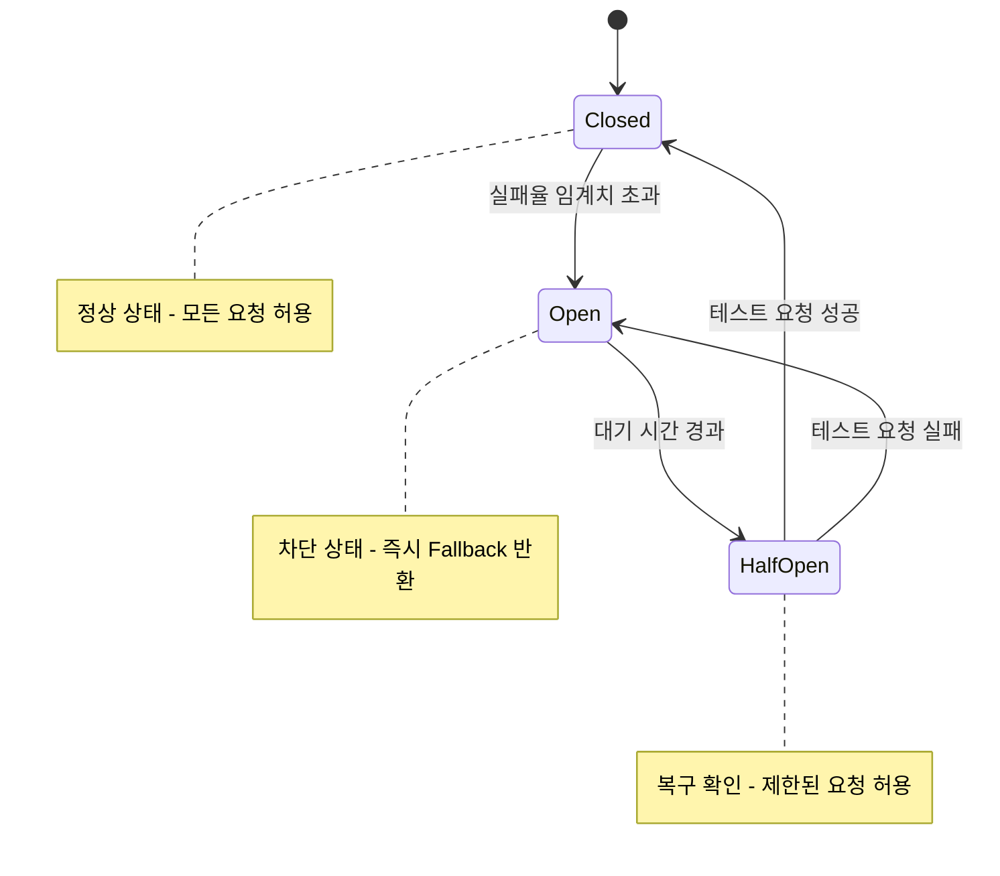

# 12. 에러 처리

[← 메인 문서로 돌아가기](../01_ams_system_architecture.md)

---

AMS는 안정적인 사용자 경험과 운영 효율성을 위해 체계적인 에러 처리 전략을 적용합니다. 본 절은 [6. 비동기 처리 전략](06_async_processing.md)의 재시도 흐름, [8. 통신 및 연동](08_communication.md)의 외부 연동 정책, [10. 모니터링 및 로깅](10_monitoring_logging.md)의 에러 추적 시스템과 긴밀히 연계됩니다.

### 12.1 글로벌 예외 처리 전략

#### 예외 계층 구조

AMS는 예외를 **도메인 예외**, **인프라 예외**, **시스템 예외**로 분리하여 관리합니다.

| 예외 분류 | 설명 | 예시 |
|-----------|------|------|
| **도메인 예외** | 비즈니스 규칙 위반, 유효성 검증 실패 | 중복 회원 등록, 잘못된 출석 상태 전이 |
| **인프라 예외** | 외부 시스템·저장소 연동 실패 | DB 연결 오류, 외부 API 타임아웃 |
| **시스템 예외** | 인증/인가, 시스템 보호 관련 | 토큰 만료, 권한 부족, Rate Limit 초과 |

**주요 예외 클래스:**
- **도메인**: `ValidationException`, `BusinessRuleException`, `ResourceNotFoundException`, `DuplicateResourceException`
- **인프라**: `DatabaseException`, `ExternalServiceException`, `CacheException`, `MessageQueueException`
- **시스템**: `AuthenticationException`, `AuthorizationException`, `RateLimitException`

#### 글로벌 예외 핸들러

- Spring `@RestControllerAdvice`를 통해 모든 예외를 중앙에서 처리합니다.
- 인프라 예외는 내부 상세를 숨기고 일반화된 메시지를 반환합니다.
- 모든 에러 응답에 `traceId`를 포함하여 [10. 모니터링 및 로깅](10_monitoring_logging.md)과 연계합니다.

#### Coroutine 예외 처리

- `CoroutineExceptionHandler`로 비동기 영역의 예외를 캡처합니다.
- `SupervisorScope`를 활용하여 개별 이벤트 처리 실패가 다른 이벤트에 영향을 주지 않도록 격리합니다.

#### 예외-HTTP 상태 코드 매핑

| 예외 타입 | HTTP Status | 설명 |
|-----------|-------------|------|
| `ValidationException` | 400 Bad Request | 입력 데이터 유효성 검증 실패 |
| `AuthenticationException` | 401 Unauthorized | 인증 실패, 토큰 만료 |
| `AuthorizationException` | 403 Forbidden | 권한 부족 (RBAC 위반) |
| `ResourceNotFoundException` | 404 Not Found | 리소스 미존재 |
| `DuplicateResourceException` | 409 Conflict | 중복 리소스, 상태 충돌 |
| `RateLimitException` | 429 Too Many Requests | 요청 제한 초과 |
| `InfrastructureException` | 503 Service Unavailable | 외부 의존성 장애 |
| `Exception` (기타) | 500 Internal Server Error | 예상치 못한 서버 오류 |

### 12.2 에러 응답 형식 표준화

#### RFC 7807 Problem Details 채택

AMS는 **RFC 7807 Problem Details for HTTP APIs** 표준을 채택하여 일관된 에러 응답 형식을 제공합니다.

```json
{
  "type": "https://api.ams.com/errors/MEMBER_DUPLICATE",
  "title": "Duplicate Member",
  "status": 409,
  "detail": "동일한 휴대폰 번호로 등록된 회원이 이미 존재합니다.",
  "instance": "/api/v1/members",
  "traceId": "abc123def456",
  "timestamp": "2025-01-15T10:30:00Z",
  "errorCode": "MEMBER_DUPLICATE"
}
```

| 필드 | 설명 |
|------|------|
| `type` | 에러 유형을 식별하는 URI (문서 링크) |
| `title` | 에러 유형의 짧은 요약 |
| `status` | HTTP 상태 코드 |
| `detail` | 해당 발생 건에 대한 상세 설명 |
| `instance` | 문제가 발생한 리소스 경로 |
| `traceId` | 분산 추적 ID (10장 로깅 연계) |
| `timestamp` | 에러 발생 시각 (ISO-8601) |
| `errorCode` | AMS 내부 에러 코드 |

#### 도메인별 확장 필드

- **유효성 검증 오류**: `errors` 배열에 필드별 오류 코드와 메시지 포함
- **비즈니스 규칙 위반**: `currentState`, `requestedState` 등 컨텍스트 정보 포함

#### 에러 코드 체계

에러 코드는 `{도메인}_{상세코드}` 형식으로 정의합니다.

| 도메인 | 예시 |
|--------|------|
| `COMMON` | `COMMON_VALIDATION_FAILED`, `COMMON_UNAUTHORIZED` |
| `MEMBER` | `MEMBER_NOT_FOUND`, `MEMBER_DUPLICATE` |
| `ACADEMY` | `ACADEMY_LIMIT_EXCEEDED`, `ACADEMY_INACTIVE` |
| `CLASS` | `CLASS_FULL`, `CLASS_SCHEDULE_CONFLICT` |
| `ATTENDANCE` | `ATTENDANCE_INVALID_TRANSITION` |
| `EXTERNAL` | `EXTERNAL_SMS_FAILED`, `EXTERNAL_TIMEOUT` |

#### 국제화(i18n) 전략

- 에러 메시지는 `Accept-Language` 헤더를 기반으로 다국어를 지원합니다.
- Spring `MessageSource`를 통해 메시지 번들(`messages_ko.properties`, `messages_en.properties`)을 관리합니다.

### 12.3 재시도 메커니즘

#### 재시도 대상 판별 기준

| 오류 유형 | 재시도 여부 | 설명 |
|-----------|-------------|------|
| **일시적 오류 (Transient)** | O | 네트워크 타임아웃, 일시적 DB 연결 실패, 5xx 응답 |
| **영구적 오류 (Permanent)** | X | 인증 실패(401), 권한 부족(403), 리소스 미존재(404) |
| **클라이언트 오류** | X | 유효성 검증 실패(400), 비즈니스 규칙 위반(422) |
| **Rate Limit** | 조건부 | 429 응답 시 `Retry-After` 헤더 기반 대기 후 재시도 |

#### 지수 백오프 정책

- **기본 전략**: 초기 지연 → 배수 증가 → 최대 지연 제한
- **지터(Jitter)**: ±10% 랜덤 변동으로 Thundering Herd 방지
- **연동별 정책** ([8.2 외부 시스템 연동](08_communication.md#82-외부-시스템-연동-방식-async--non-blocking) 연계):

| 연동 대상 | 최대 재시도 | 초기 지연 | 최대 지연 | 비고 |
|-----------|-------------|-----------|-----------|------|
| 휴대폰 인증 API | 2회 | 200ms | 800ms | 사용자 대기 시간 고려 |
| 알림 발송 API | 3회 | 500ms | 3s | 실패 시 DLQ 적재 |
| 결제 API | 1회 | 1s | 1s | 멱등 키 필수 |
| MongoDB 동기화 | 5회 | 100ms | 5s | 최종 일관성 보장 |

#### 멱등성 보장 전략

- 재시도 시 중복 처리 방지를 위해 **Idempotency Key**를 활용합니다.
- Redis에 요청 결과를 TTL과 함께 캐싱하여 동일 키 요청 시 캐시된 결과를 반환합니다.

#### Dead Letter Queue (DLQ) 연계

- 최대 재시도 횟수 초과 시 [6. 비동기 처리 전략](06_async_processing.md)에서 정의한 Failed Event Store로 이관합니다.
- DLQ 적재 시 [10.3 에러 추적 및 알림 시스템](10_monitoring_logging.md#103-에러-추적-및-알림-시스템)을 통해 운영자에게 알림을 발송합니다.
- 운영자는 수동으로 재처리하거나 폐기할 수 있습니다.

### 12.4 Circuit Breaker 패턴 적용

#### Circuit Breaker 상태 머신

외부 서비스 장애 시 연쇄 실패를 방지하기 위해 Circuit Breaker 패턴을 적용합니다.



| 상태 | 설명 | 동작 |
|------|------|------|
| **Closed** | 정상 상태 | 모든 요청을 외부 서비스로 전달 |
| **Open** | 차단 상태 | 요청을 즉시 실패 처리(Fallback 반환) |
| **Half-Open** | 복구 확인 | 제한된 수의 테스트 요청만 허용 |

#### 구현 전략

- **Resilience4j** 라이브러리를 활용하여 구현합니다.
- 슬라이딩 윈도우 기반으로 실패율과 슬로우콜 비율을 측정합니다.

#### 서비스별 임계치 설정

| 서비스 | 실패율 임계치 | 슬로우콜 기준 | Open 대기 | 비고 |
|--------|---------------|---------------|-----------|------|
| SMS 인증 | 50% | 2초 | 30초 | 사용자 경험 우선 |
| 알림 발송 | 60% | 3초 | 60초 | 비동기 처리로 여유 |
| 결제 API | 30% | 5초 | 120초 | 보수적 설정 |
| MongoDB | 40% | 1초 | 30초 | 조회 성능 우선 |

#### Fallback 전략

| 서비스 | Fallback 전략 | 설명 |
|--------|---------------|------|
| **조회 API** | 캐시 응답 반환 | Redis 캐시에서 이전 데이터 제공 |
| **알림 발송** | 대기열 전환 | 메시지 큐에 적재 후 복구 시 재발송 |
| **SMS 인증** | 사용자 안내 | "잠시 후 다시 시도해주세요" 메시지 |
| **결제 API** | 트랜잭션 보류 | 결제 대기 상태로 전환 후 수동 처리 |

#### 모니터링 및 알림 연계

- Circuit Breaker 상태 변화(특히 Open 전환)를 [10. 모니터링 및 로깅](10_monitoring_logging.md) 시스템과 연계하여 알림을 발송합니다.
- 상태 변화와 에러 발생을 메트릭으로 수집하여 대시보드에서 모니터링합니다.
- 헬스체크 엔드포인트에 Circuit Breaker 상태를 반영하여 [9.3 로드 밸런싱](09_scalability_performance.md#93-로드-밸런싱-전략)과 연동합니다.

---

