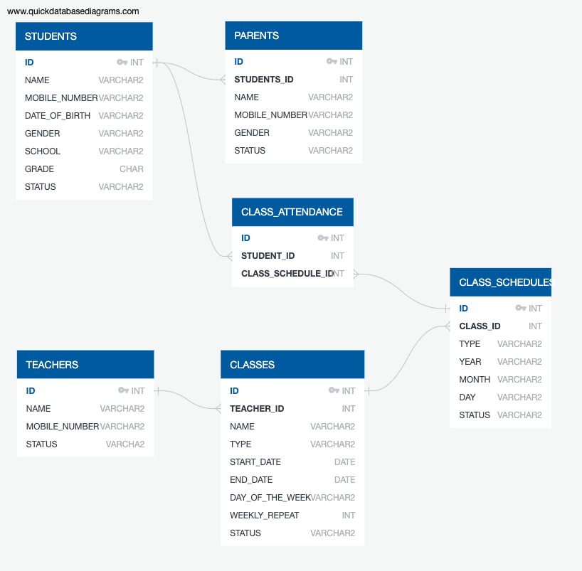

# AMS Database Modeling

***모든 Table 에는 아래와 같은 `Column` 필수로 추가***

| Column | Name | Type | 비고 |
| --- | --- | --- | --- |
| CREATED | 생성 일자 | DATETIME |
| UPDATED | 수정 일자 | DATETIME |

## 학생 관련 Table 목록
### `STUDENTS` 학생 정보 Table
| Column | Name | Type | 비고 |
| --- | --- | --- | --- |
| ID | 학생 ID | INT | `PK` - Auto increment sequence |
| NAME | 성명 | VARCHAR |
| MOBILE_NUMBER | 휴대폰 번호 | VARCHAR |
| DATE_OF_BIRTH | 생년월일 | VARCHAR | format : `YYYYMMDD` |
| GENDER | 성별 | CHAR | `M`: 남성, `F`: 여성 |
| SCHOOL | 학교 | VARCHAR |
| GRADE | 학년 | CHAR |
| STATUS | 상태 | VARCHAR | `ACTIVE`: 정상, `DELETED`: 탈퇴 |

### `PARENTS` 학생 부모 정보 Table
| Column | Name | Type | 비고 |
| --- | --- | --- | --- |
| ID | 학생 부모 ID | INT | `PK` - Auto increment sequence |
| STUDENT_ID | 학생 ID | INT | `FK` - `STUDENTS`.`ID` |
| NAME | 성명 | VARCHAR |
| MOBILE_NUMBER | 휴대폰 번호 | VARCHAR |
| GENDER | 성별 | CHAR | `M`: 남성, `F`: 여성 |
| STATUS | 상태 | VARCHAR | `ACTIVE`: 정상, `DELETED`: 탈퇴 |

---

## 수업 관련 Table 목록
### `TEACHERS` 강사 정보 Table
| Column | Name | Type | 비고 |
| --- | --- | --- | --- |
| ID | 강사 ID | INT | `PK` - Auto increment sequence |
| NAME | 성명 | VARCHAR |
| MOBILE_NUMBER | 휴대폰 번호 | VARCHAR |
| STATUS | 상태 | VARCHAR | `ACTIVE`: 정상, `DELETED`: 탈퇴 |

### `CLASSES` 수업 기본 정보 Table
| Column | Name | Type | 비고 |
| --- | --- | --- | --- |
| ID | 수업 ID | INT | `PK` - Auto increment sequence |
| TEACHER_ID | 강사 ID | INT | `FK` - `TEACHERS`.`ID` |
| NAME | 수업명 | VARCHAR |
| TYPE | 수업 구분 | VARCHAR | 독서 토론, 논술, 역사 수업 등.. `CODE` 관리 |
| START_DATE | 시작 일자 | DATE |
| END_DATE | 종료 일자 | DATE |
| DAY_OF_WEEK | 수업 요일 (with 시간) | VARCHAR | 수업 요일 목록 (eg. `MON:14:00,TUE:15:00,WEN:13:00`) |
| WEEKLY_REPEAT | 주별 반복 주기 | INT | 수업 시작 주차 기준 반복 기간 설정 (`default: 1`) | 
| TIME_DURATION | 수업 시간 | VARCHAR | `mm` 단위 수업 시간 |
| STATUS | 상태 | VARCHAR | `READY`: 준비(`default`), `ACTIVE`: 정상, `DELETED`: 삭제, `FINISHED`: 종강 |

### `CLASS_SCHEDULES` 수업 일정 정보 Table
| Column | Name | Type | 비고 |
| --- | --- | --- | --- |
| ID | 수업 일정 ID | INT | `PK` - Auto increment sequence |
| CLASS_ID | 수업 ID | INT | `FK` - `CLASSES`.`ID` |
| TYPE | 수업 구분 | VARCHAR | `REGULAR`: 정규, `SUPPLEMENT`: 보강, `SPECIAL`: 특강 |
| YEAR | 연도 | VARCHAR | `YYYY` |
| MONTH | 월 | VARCHAR | `MM` |
| DAY | 일 | VARCHAR | `DD` |
| HOUR | 시 | VARCHAR | `HH` |
| MINUTE | 분 | VARCHAR | `mm` |
| TIME_DURATION | 수업 시간 | VARCHAR | `mm` 단위 수업 시간 |
| STATUS | 상태 | VARCHAR | `READY`: 준비(`default`), `FINISHED`: 완료, `CANCELED`: 취소 |

---

## 출석 관련 Table 목록
### `CLASS_ATTENDANCE` 학생 출석 목록 Table
| Column | Name | Type | 비고 |
| --- | --- | --- | --- |
| ID | 출석 ID | INT | `PK` - Auto increment sequence |
| STUDENT_ID | 학생 ID | INT | `FK` - `STUDENTS`.`ID` |
| CLASS_SCHEDULE_ID | 수업 일정 ID | INT | `FK` - `CLASS_SCHEDULES`.`ID` |

---

## 시험 관련 Table 목록
### `EXAMS` 시험 정보 Table
| Column | Name | Type | 비고 |
| --- | --- | --- | --- |
| ID | 시험 ID | INT | `PK` - Auto increment sequence |
| NAME | 시험 명 | VARCHAR |
| SERIAL_NUMBER | 시험 일련번호 | VARCHAR |

### `EXAM_SCHEDULE` 시험 일정 Table
| Column | Name | Type | 비고 |
| --- | --- | --- | --- |
| ID | 시험 일정 ID | INT | `PK` - Auto increment sequence |
| EXAM_ID | 시험 ID | INT | `FK` - `EXAMS`.`ID` |
| TYPE | 시험 일정 구분 | VARCHAR | `RECEIPT`: 접수기간 `RECEIPT_DONE`: 접수마감 `PROCEED`: 시험진행 `PROCEED_DONE`: 시험종료 |
| START_DATE | 시작 일자 | DATE |
| END_DATE | 종료 일자 | DATE |

### `EXAM_MANAGEMENT` 시험 관리 기관 정보 Table
| Column | Name | Type | 비고 |
| --- | --- | --- | --- |
| ID | 시험 관리 기관 ID | INT | `PK` - Auto increment sequence |
| EXAM_ID | 시험 ID | INT | `FK` - `EXAMS`.`ID` |
| NAME | 시험 관리 기관 명 | VARCHAR |
| PHONE_NUMBER | 시험 관리 기관 전화번호 | VARCHAR |
| SITE_URL | 시험 관리 기관 사이트 URL | VARCHAR |

### `EXAM_CONTENTS` 시험 기타 정보 Table (시험 접수 방법 등 컨텐츠 관리)
| Column | Name | Type | 비고 |
| --- | --- | --- | --- |
| ID | 시험 기타 정보 ID | INT | `PK` - Auto increment sequence |
| EXAM_ID | 시험 ID | INT | `FK` - `EXAMS`.`ID` |
| CONTENTS | 기타 정보 | VARCHAR | 시험 접수 방법 등 `TEXT` 관리 |

---

## Mapping 관련 Table 목록
### `EXAM_PARTICIPATION` 학생 시험 참가 목록 Table
| Column | Name | Type | 비고 |
| --- | --- | --- | --- |
| ID | 학생 시험 참가 ID | INT | `PK` - Auto increment sequence |
| STUDENT_ID | 학생 ID | INT | `FK` - `STUDENTS`.`ID` |
| EXAM_ID | 시험 ID | INT | `FK` - `EXAM`.`ID` |
| STATUS | 상태 | VARCHAR | `READY`: 준비 `RECEIPT_DONE`: 접수완료 `RECEIPT_CANCEL`: 접수취소 `PARTICIPATE_DONE`: 참가완료 `FINAL_DONE`: 최종완료 `NO_RECEIPT`: 미접수 `NO_PARTICIPATE`: 미참가 |

### `EXAM_RESULT`학생 시험 결과 목록 Table
| Column | Name | Type | 비고 |
| --- | --- | --- | --- |
| ID | 학생 시험 결과 ID | INT | `PK` - Auto increment sequence |
| STUDENT_ID | 학생 ID | INT | `FK` - `STUDENTS`.`ID` |
| EXAM_ID | 시험 ID | INT | `FK` - `EXAM`.`ID` |
| RESULT | 결과 | VARCHAR |
| SCORE | 점수 | VARCHAR |

---

## 이력 관련 Table 목록
### `EXAM_STATUS_HISTORY` 학생 시험 상태 변경 이력 Table
| Column | Name | Type | 비고 |
| --- | --- | --- | --- |
| ID | 학생 시험 상태 변경 ID | INT | `PK` - Auto increment sequence |
| STUDENT_ID | 학생 ID | INT | `FK` - `STUDENTS`.`ID` |
| EXAM_ID | 시험 ID | INT | `FK` - `EXAM`.`ID` |
| STATUS | 상태 | VARCHAR | `READY`: 준비 `RECEIPT_DONE`: 접수완료 `RECEIPT_CANCEL`: 접수취소 `PARTICIPATE_DONE`: 참가완료 `FINAL_DONE`: 최종완료 `NO_RECEIPT`: 미접수 `NO_PARTICIPATE`: 미참가 |

### `NOTICE_HISTORY` 학생 시험 상태 알림 이력 Table
| Column | Name | Type | 비고 |
| --- | --- | --- | --- |
| ID | 학생 시험 상태 알림 ID | INT | `PK` - Auto increment sequence |
| STUDENT_ID | 학생 ID | INT | `FK` - `STUDENTS`.`ID` |
| EXAM_ID | 시험 ID | INT | `FK` - `EXAM`.`ID` |
| TYPE | 알림 구분 | VARCHAR | `RECEIPT`: 접수안내알림 `PARTICIPATION`: 시험진행안내알림 `RESULT`: 시험결과안내알림 |
| SUCCESS_YN | 알림 성공 여부 | VARCHAR |
